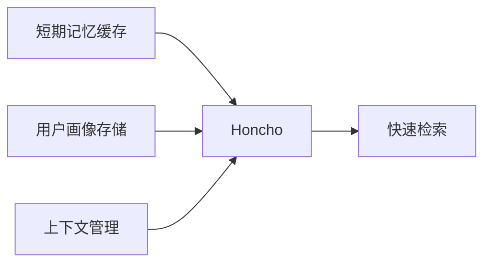
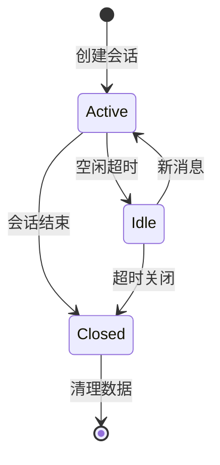
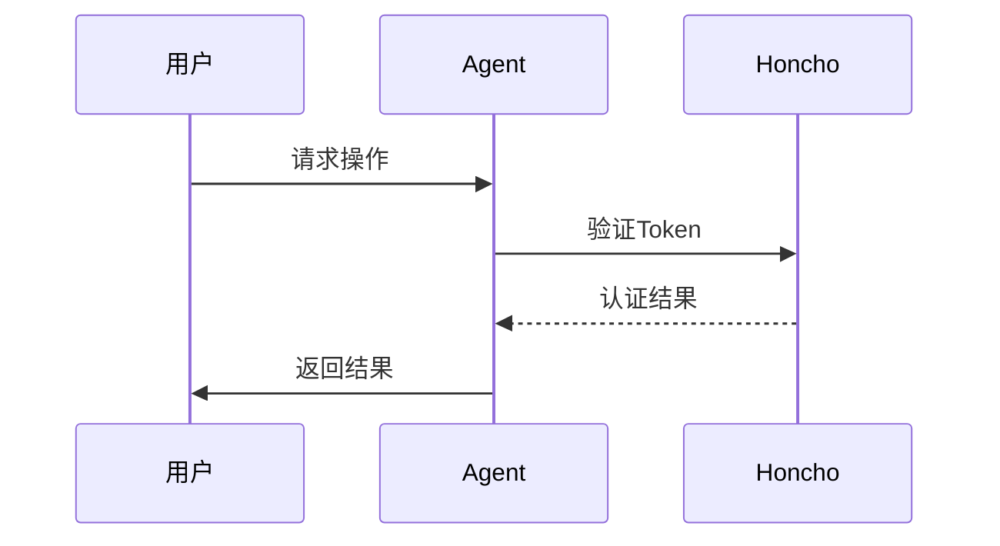

# Honcho存储后端

<cite>
**本文引用的文件**
- [plugins/memory/honcho/__init__.py](file://plugins/memory/honcho/__init__.py)
- [plugins/memory/honcho/client.py](file://plugins/memory/honcho/client.py)
- [plugins/memory/honcho/session.py](file://plugins/memory/honcho/session.py)
- [plugins/memory/honcho/config_schema.py](file://plugins/memory/honcho/config_schema.py)
- [plugins/memory/honcho/oauth.py](file://plugins/memory/honcho/oauth.py)
</cite>

## 目录
1. [简介](#简介)
2. [Honcho特点](#Honcho特点)
3. [客户端配置](#客户端配置)
4. [数据模型设计](#数据模型设计)
5. [会话管理](#会话管理)
6. [OAuth认证](#OAuth认证)
7. [性能调优](#性能调优)
8. [结论](#结论)

## 简介
Honcho作为分布式内存数据库，为Hermes Agent提供高性能的记忆存储后端。本文档全面介绍Honcho的集成配置和最佳实践。

## Honcho特点

### 核心优势
- **高性能**：内存数据库，微秒级响应
- **低延迟**：适合实时对话场景
- **分布式**：支持水平扩展
- **持久化**：可选的磁盘持久化

### 应用场景


## 客户端配置

### 配置文件
```yaml
memory:
  provider: honcho
  honcho:
    host: "localhost"
    port: 6379
    db: 0
    password: "${HONCHO_PASSWORD}"
    max_connections: 10
    socket_timeout: 5
    retry_on_timeout: true
```

### 连接参数
| 参数 | 说明 | 默认值 |
|------|------|--------|
| host | 服务器地址 | localhost |
| port | 服务器端口 | 6379 |
| db | 数据库编号 | 0 |
| max_connections | 最大连接数 | 10 |
| socket_timeout | 超时时间(秒) | 5 |

## 数据模型设计

### 存储结构
- **键值存储**：简单的字符串键值对
- **哈希表**：结构化数据存储
- **列表**：有序数据集合
- **集合**：无序唯一值集合

### 命名规范
```
memory:{user_id}:{session_id}:{key}
profile:{user_id}:basic
context:{session_id}:current
```

## 会话管理

### 会话生命周期


### 会话操作
- `create_session()`：创建新会话
- `get_session()`：获取会话数据
- `update_session()`：更新会话状态
- `delete_session()`：删除会话

## OAuth认证

### 认证流程


### Token管理
- 支持Bearer Token认证
- Token自动刷新机制
- 过期Token自动清除

## 性能调优

### 连接池优化
- 设置合理的max_connections
- 启用连接复用
- 配置连接超时

### 缓存策略
- 热点数据预加载
- LRU淘汰策略
- 定期缓存刷新

### 基准测试
| 操作 | 延迟(ms) | 吞吐量(QPS) |
|------|----------|-------------|
| GET | 0.1 | 10000 |
| SET | 0.2 | 8000 |
| HGET | 0.15 | 9000 |

## 结论
Honcho作为高性能内存数据库，非常适合AI代理的记忆存储需求。通过合理的配置和优化，可以实现微秒级的数据访问，显著提升对话体验。

