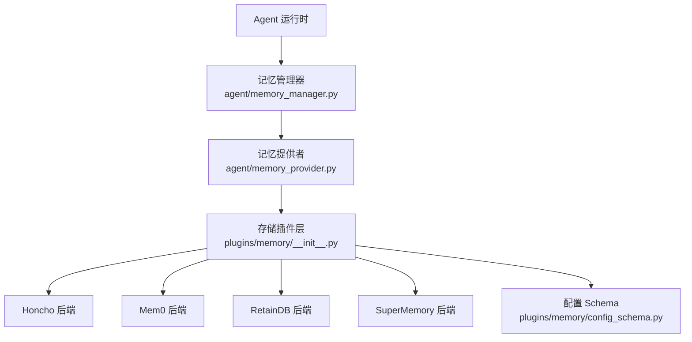
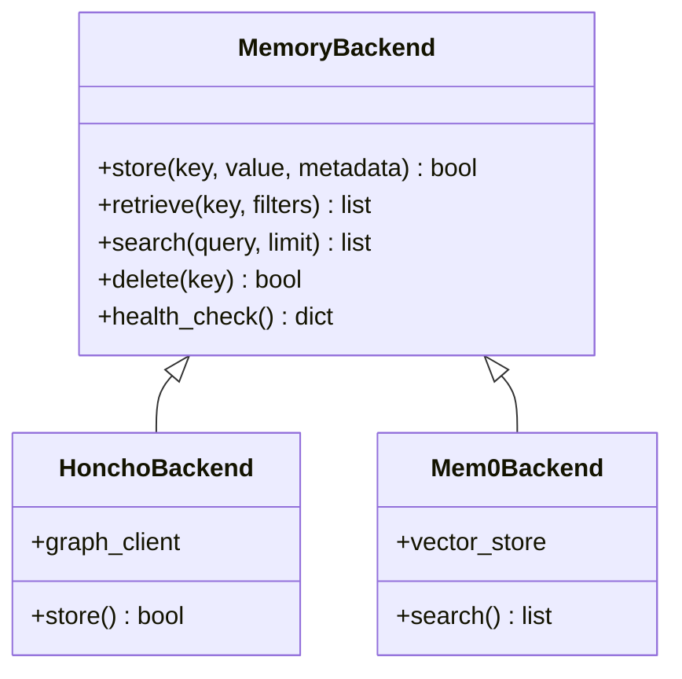
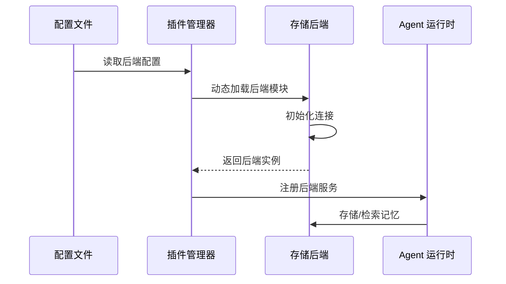

# 存储后端

<cite>
**本文引用的文件**
- [plugins/memory/__init__.py](file://plugins/memory/__init__.py)
- [plugins/memory/config_schema.py](file://plugins/memory/config_schema.py)
- [plugins/memory/query_rewrite.py](file://plugins/memory/query_rewrite.py)
- [agent/memory_manager.py](file://agent/memory_manager.py)
- [agent/memory_provider.py](file://agent/memory_provider.py)
</cite>

## 目录
1. [简介](#简介)
2. [存储后端架构](#存储后端架构)
3. [统一接口设计](#统一接口设计)
4. [存储后端类型](#存储后端类型)
5. [动态加载机制](#动态加载机制)
6. [数据迁移与兼容](#数据迁移与兼容)
7. [性能与配置](#性能与配置)
8. [故障排查指南](#故障排查指南)

## 简介
Hermes Agent 的存储后端系统为 AI 代理提供长期记忆和上下文持久化能力。系统采用插件化架构设计，支持多种存储后端实现，包括 Honcho、OpenViking、Mem0、RetainDB、SuperMemory 等，用户可根据场景需求选择最适合的存储方案。存储后端负责管理会话历史、用户偏好、长期记忆等关键数据，是 Agent 实现持续学习和个性化交互的基础支撑。

## 存储后端架构



**图示来源**
- [plugins/memory/__init__.py:1-50](file://plugins/memory/__init__.py#L1-L50)
- [agent/memory_manager.py:1-30](file://agent/memory_manager.py#L1-L30)

## 统一接口设计
存储后端系统通过抽象基类定义统一接口，所有后端实现必须遵守以下核心协议：

```python
class MemoryBackend:
    async def store(self, key: str, value: dict, metadata: dict = None) -> bool: ...
    async def retrieve(self, key: str, filters: dict = None) -> list: ...
    async def search(self, query: str, limit: int = 10) -> list: ...
    async def delete(self, key: str) -> bool: ...
    async def health_check(self) -> dict: ...
```

接口设计要点：
- 所有方法均为异步接口，支持高并发访问
- 支持元数据过滤和语义搜索
- 提供健康检查接口用于监控
- 返回标准化的数据结构

**章节来源**
- [plugins/memory/__init__.py:10-80](file://plugins/memory/__init__.py#L10-L80)
- [plugins/memory/config_schema.py:1-50](file://plugins/memory/config_schema.py#L1-L50)

## 存储后端类型

### Honcho
- **特点**: 基于图数据库的持久化存储，支持复杂关系查询
- **适用场景**: 需要深度会话历史分析和关系挖掘的场景
- **数据模型**: 支持多轮对话树形结构和用户画像

### Mem0
- **特点**: 面向 AI 的记忆层，自动提取和组织记忆
- **适用场景**: 需要自动记忆管理和语义检索的场景
- **数据模型**: 向量化存储，支持语义相似度搜索

### RetainDB
- **特点**: 高性能键值存储，专注于快速读写
- **适用场景**: 低延迟要求的实时对话场景
- **数据模型**: 键值对存储，支持 TTL 和批量操作

### SuperMemory
- **特点**: 云端分布式存储，支持跨设备同步
- **适用场景**: 多设备协作和云端记忆同步需求



**章节来源**
- [plugins/memory/__init__.py:80-200](file://plugins/memory/__init__.py#L80-L200)

## 动态加载机制
存储后端通过插件系统动态加载，支持运行时切换和热重载：



动态加载特性：
- 根据 `config.yaml` 中的配置自动加载对应后端
- 支持后端热切换，无需重启 Agent
- 自动回退机制：主后端不可用时切换到备选后端
- 插件沙箱隔离，防止后端错误影响主进程

**章节来源**
- [plugins/memory/__init__.py:200-300](file://plugins/memory/__init__.py#L200-L300)

## 数据迁移与兼容
系统支持不同存储后端之间的数据迁移：
- **格式转换**: 自动处理不同后端的数据格式差异
- **增量迁移**: 支持增量同步，避免全量迁移开销
- **版本兼容**: 支持不同版本存储格式之间的转换

## 性能与配置

### 配置示例
```yaml
memory:
  backend: "honcho"
  config:
    connection_string: "postgresql://..."
    pool_size: 10
    timeout: 30
  fallback:
    backend: "local"
    path: "~/.sparkii/memory.db"
```

### 性能优化建议
- 合理配置连接池大小
- 启用查询缓存减少数据库压力
- 定期清理过期记忆数据
- 监控后端响应时间和错误率

## 故障排查指南
- **连接超时**: 检查后端服务状态和网络连接
- **数据不一致**: 运行数据校验工具检查完整性
- **性能下降**: 查看监控指标，考虑增加缓存或升级后端
- **插件加载失败**: 检查插件依赖和配置文件格式
