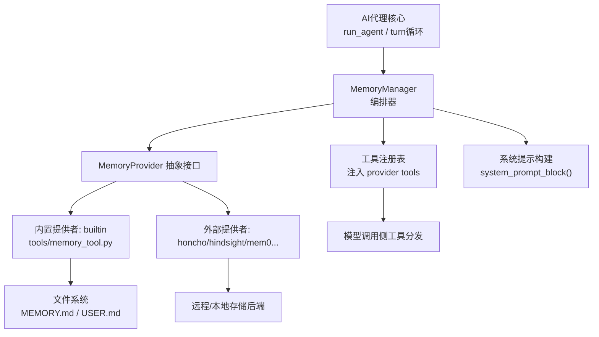
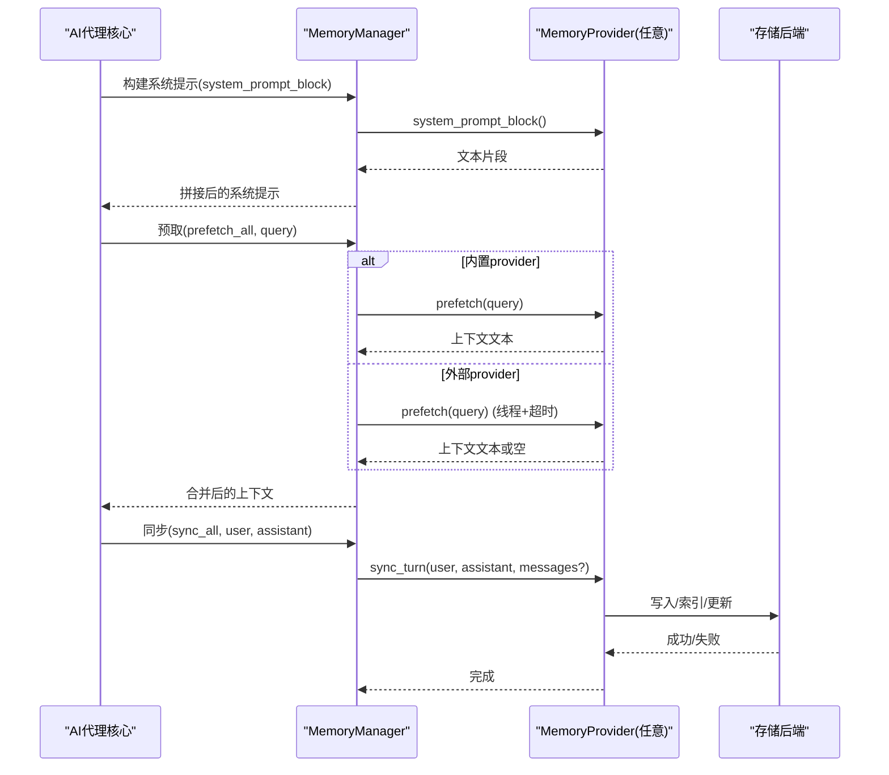
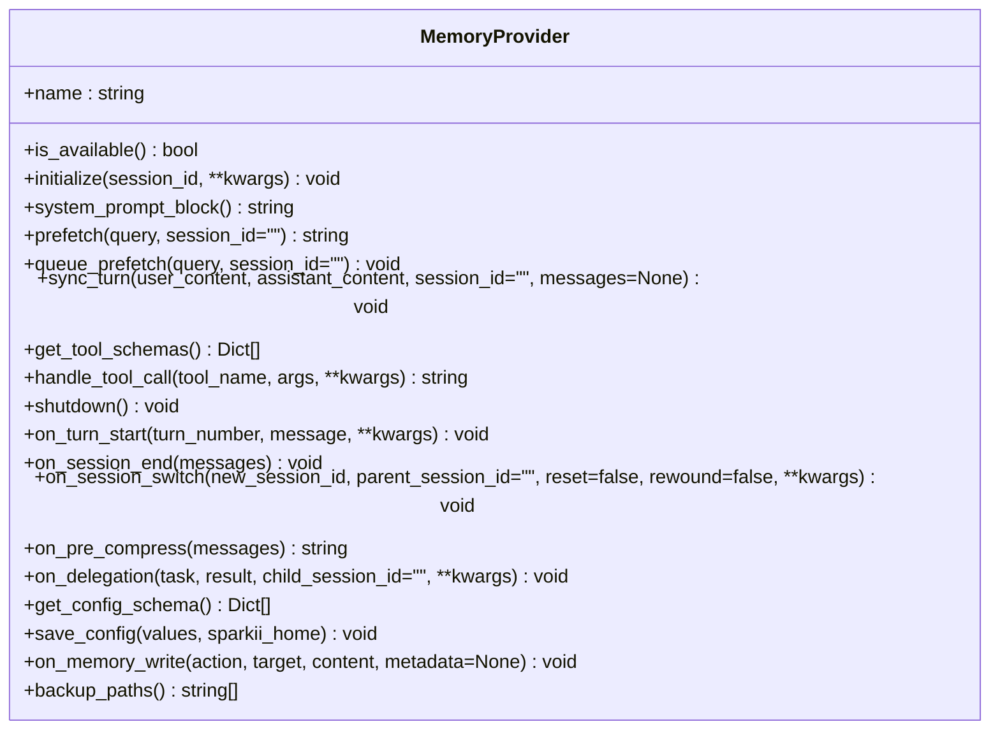
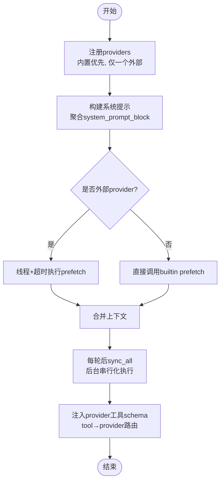
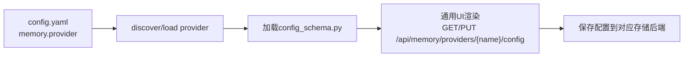
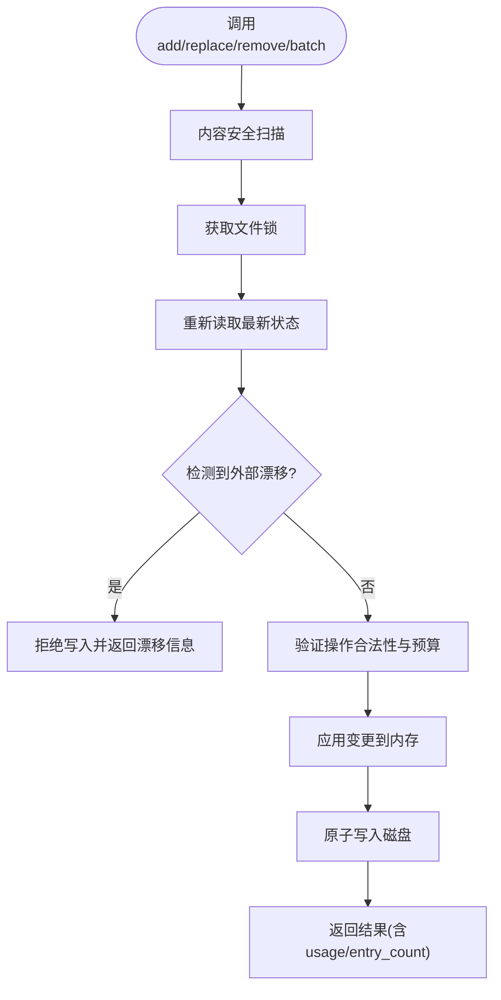
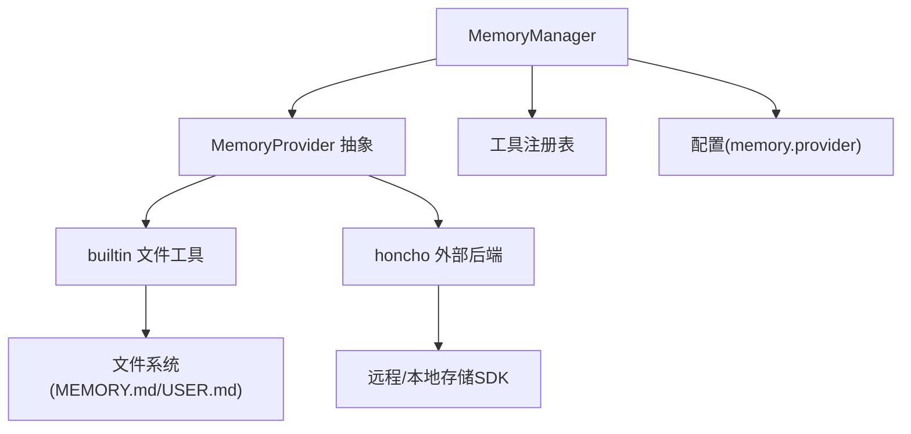

# 存储架构概览

<cite>
**本文引用的文件**
- [agent/memory_manager.py](file://agent/memory_manager.py)
- [agent/memory_provider.py](file://agent/memory_provider.py)
- [plugins/memory/__init__.py](file://plugins/memory/__init__.py)
- [plugins/memory/config_schema.py](file://plugins/memory/config_schema.py)
- [tools/memory_tool.py](file://tools/memory_tool.py)
- [plugins/memory/honcho/__init__.py](file://plugins/memory/honcho/__init__.py)
</cite>

## 目录
1. [简介](#简介)
2. [项目结构](#项目结构)
3. [核心组件](#核心组件)
4. [架构总览](#架构总览)
5. [详细组件分析](#详细组件分析)
6. [依赖关系分析](#依赖关系分析)
7. [性能考量](#性能考量)
8. [故障排查指南](#故障排查指南)
9. [结论](#结论)
10. [附录](#附录)

## 简介
本概览文档面向记忆存储子系统，聚焦以下目标：
- 抽象接口定义与插件化设计
- 数据流处理与生命周期管理（创建、存储、检索、清理）
- 存储层解耦与统一接口
- 通过配置切换不同存储后端
- 与AI代理核心、工具系统、用户界面的集成模式
- 提供架构图与数据流图，帮助开发者理解整体设计思路

## 项目结构
记忆系统由“核心编排 + 抽象接口 + 插件发现 + 内置/外部存储实现 + 工具暴露”构成。关键位置如下：
- 核心编排：MemoryManager（单入口协调多个 MemoryProvider）
- 抽象接口：MemoryProvider（统一生命周期与工具契约）
- 插件发现：plugins/memory/__init__.py（扫描并加载内置/用户插件）
- 配置声明：plugins/memory/config_schema.py（声明式配置字段与存储后端）
- 内置持久化工具：tools/memory_tool.py（文件型记忆，MEMORY.md/USER.md）
- 示例外部后端：plugins/memory/honcho/__init__.py（第三方记忆后端实现）

图表来源
- [agent/memory_manager.py:364-503](file://agent/memory_manager.py#L364-L503)
- [agent/memory_provider.py:81-191](file://agent/memory_provider.py#L81-L191)
- [plugins/memory/__init__.py:146-216](file://plugins/memory/__init__.py#L146-L216)
- [tools/memory_tool.py:148-240](file://tools/memory_tool.py#L148-L240)
- [plugins/memory/honcho/__init__.py:1-200](file://plugins/memory/honcho/__init__.py#L1-L200)

章节来源
- [agent/memory_manager.py:1-158](file://agent/memory_manager.py#L1-L158)
- [agent/memory_provider.py:1-32](file://agent/memory_provider.py#L1-L32)
- [plugins/memory/__init__.py:1-20](file://plugins/memory/__init__.py#L1-L20)

## 核心组件
- MemoryProvider 抽象接口
  - 定义统一的初始化、可用性检查、系统提示块、预取、同步、工具模式、可选钩子等生命周期方法
  - 支持会话切换、压缩前提取、子代理委派观察、备份路径等扩展点
- MemoryManager 编排器
  - 维护已注册的 providers（内置优先，最多一个外部 provider）
  - 负责系统提示组装、每轮预取、每轮后同步、后台任务调度与超时保护
  - 将 provider 的工具 schema 注入到模型可用的工具集中，并路由工具调用
- 插件发现与配置
  - 自动扫描内置与用户安装的 memory 插件目录，按名称解析并实例化
  - 通过 config_schema.py 声明式描述 provider 的配置字段与存储后端类型
- 内置文件记忆工具
  - 以文件为持久化载体，提供 add/replace/remove/batch 操作，带字符预算、冲突检测、漂移保护、安全扫描
- 外部后端示例（Honcho）
  - 实现 MemoryProvider 接口，暴露 profile/search/reasoning/context/conclude 等工具，并通过 prefetch/sync_turn 参与记忆流

章节来源
- [agent/memory_provider.py:81-358](file://agent/memory_provider.py#L81-L358)
- [agent/memory_manager.py:364-800](file://agent/memory_manager.py#L364-L800)
- [plugins/memory/config_schema.py:1-145](file://plugins/memory/config_schema.py#L1-L145)
- [tools/memory_tool.py:148-800](file://tools/memory_tool.py#L148-L800)
- [plugins/memory/honcho/__init__.py:1-200](file://plugins/memory/honcho/__init__.py#L1-L200)

## 架构总览
记忆系统采用“编排器 + 抽象接口 + 插件化后端”的分层架构：
- 上层：AI代理核心在每轮对话前后调用 MemoryManager 的 prefetch_all 与 sync_all
- 中层：MemoryManager 根据 provider 类型决定同步策略（内置直接调用；外部异步线程+超时），并将 provider 的工具 schema 注入到工具集
- 下层：各 MemoryProvider 实现具体存储逻辑（文件、远程服务、向量库等），遵循统一接口

图表来源
- [agent/memory_manager.py:486-694](file://agent/memory_manager.py#L486-L694)
- [agent/memory_provider.py:123-170](file://agent/memory_provider.py#L123-L170)

## 详细组件分析

### MemoryProvider 抽象接口
- 职责
  - 定义 provider 的生命周期与工具契约，确保所有后端一致可插拔
  - 提供可选钩子，用于会话边界、压缩前提取、子代理委派观察等
- 关键点
  - is_available/initialize：启动时检查可用性与资源准备
  - prefetch/queue_prefetch：每轮前的快速召回与后台预取
  - sync_turn：每轮后的持久化写入（建议非阻塞）
  - get_tool_schemas/handle_tool_call：对外暴露工具能力
  - on_session_switch/on_pre_compress/on_delegation：高级场景扩展
  - backup_paths：跨 SPARKII_HOME 的外部状态备份

图表来源
- [agent/memory_provider.py:81-358](file://agent/memory_provider.py#L81-L358)

章节来源
- [agent/memory_provider.py:81-358](file://agent/memory_provider.py#L81-L358)

### MemoryManager 编排器
- 职责
  - 注册 providers（内置优先，仅允许一个外部 provider）
  - 构建系统提示、收集预取上下文、执行每轮后同步
  - 将 provider 的工具 schema 注入到模型工具集，并建立 tool→provider 路由
  - 后台串行化写任务，避免慢/卡住的后端阻塞主流程
- 关键机制
  - 外部 provider 预取使用独立线程与超时保护，防止阻塞
  - 同步任务通过单工作线程顺序执行，保证 turn N 先于 turn N+1 落地
  - 工具 schema 规范化与核心工具名保留，避免冲突
  - 流式上下文清洗（StreamingContextScrubber）保障 UI 输出安全

图表来源
- [agent/memory_manager.py:364-800](file://agent/memory_manager.py#L364-L800)

章节来源
- [agent/memory_manager.py:364-800](file://agent/memory_manager.py#L364-L800)

### 插件发现与配置
- 插件发现
  - 扫描内置 plugins/memory/<name>/ 与用户安装 $SPARKII_HOME/plugins/<name>/
  - 支持 register(ctx) 模式或直接继承 MemoryProvider 的类
  - 仅启用 memory.provider 配置指向的 active provider
- 配置声明
  - 每个 provider 可通过 config_schema.py 声明字段类型、默认值、是否密钥、选择项等
  - 通用渲染器驱动桌面UI与Web API，无需为每个 provider 定制界面
  - 支持 flat_json 与 honcho_host_block 等存储后端映射

图表来源
- [plugins/memory/__init__.py:146-216](file://plugins/memory/__init__.py#L146-L216)
- [plugins/memory/config_schema.py:1-145](file://plugins/memory/config_schema.py#L1-L145)

章节来源
- [plugins/memory/__init__.py:146-216](file://plugins/memory/__init__.py#L146-L216)
- [plugins/memory/config_schema.py:1-145](file://plugins/memory/config_schema.py#L1-L145)

### 内置文件记忆工具（MemoryStore）
- 职责
  - 维护 MEMORY.md 与 USER.md 两个目标，提供 add/replace/remove/batch 操作
  - 会话开始时冻结系统提示快照，保持前缀缓存稳定
  - 严格的安全扫描与漂移保护，防止注入/泄露与并发覆盖
- 关键特性
  - 字符预算限制与合并指导，避免无限增长
  - 文件锁与原子写入，保证多进程/多会话安全
  - 批量操作原子性，最终状态校验后再提交

图表来源
- [tools/memory_tool.py:148-800](file://tools/memory_tool.py#L148-L800)

章节来源
- [tools/memory_tool.py:148-800](file://tools/memory_tool.py#L148-L800)

### 外部后端示例（Honcho）
- 职责
  - 实现 MemoryProvider，暴露 profile/search/reasoning/context/conclude 工具
  - 通过 prefetch/sync_turn 参与记忆流，支持语义搜索与推理合成
- 特点
  - 工具 schema 丰富，覆盖读/写/推理/上下文快照
  - 与 MemoryManager 的工具注入机制无缝集成

章节来源
- [plugins/memory/honcho/__init__.py:1-200](file://plugins/memory/honcho/__init__.py#L1-L200)

## 依赖关系分析
- 耦合与内聚
  - MemoryManager 与 MemoryProvider 松耦合，通过抽象接口交互
  - 插件发现与配置模块解耦运行时，仅在需要时动态加载
  - 内置文件工具与外部 provider 并行存在，互不干扰
- 外部依赖
  - 工具注册表与工具集（注入 provider 工具 schema）
  - 平台配置（memory.provider 指定激活的 provider）
  - 文件系统（内置工具）与网络/SDK（外部 provider）

图表来源
- [agent/memory_manager.py:364-800](file://agent/memory_manager.py#L364-L800)
- [plugins/memory/__init__.py:146-216](file://plugins/memory/__init__.py#L146-L216)
- [tools/memory_tool.py:148-240](file://tools/memory_tool.py#L148-L240)
- [plugins/memory/honcho/__init__.py:1-200](file://plugins/memory/honcho/__init__.py#L1-L200)

章节来源
- [agent/memory_manager.py:364-800](file://agent/memory_manager.py#L364-L800)
- [plugins/memory/__init__.py:146-216](file://plugins/memory/__init__.py#L146-L216)

## 性能考量
- 预取与同步的异步化
  - 外部 provider 预取使用独立线程与超时，避免阻塞主流程
  - 同步任务通过单工作线程串行化，保证写入顺序且不影响响应时间
- 系统提示稳定性
  - 内置工具在会话开始时冻结快照，减少上下文抖动与前缀缓存失效
- 工具 schema 规范化
  - 避免重复包装导致的请求格式错误，提升兼容性
- 流式输出清洗
  - StreamingContextScrubber 确保内部记忆上下文不会泄漏到 UI

[本节为通用性能讨论，不直接分析具体文件]

## 故障排查指南
- 外部 provider 预取超时
  - 现象：某轮预取被跳过并记录警告
  - 原因：线程运行超过外部预取超时阈值
  - 处理：检查后端健康度与网络状况，必要时调整超时或禁用该 provider
- 工具 schema 冲突
  - 现象：provider 工具名与核心工具名冲突被忽略
  - 原因：命名冲突保护机制
  - 处理：重命名 provider 工具以避免冲突
- 文件读写异常
  - 现象：内置工具拒绝写入并返回漂移/读取失败信息
  - 原因：并发修改、编码错误或权限问题
  - 处理：根据提示信息修复文件或使用 .bak 恢复，再重试
- 会话切换状态不一致
  - 现象：provider 缓存未随 session_id 切换而更新
  - 原因：未实现 on_session_switch 钩子
  - 处理：在 provider 中实现会话切换逻辑，重置或迁移缓存

章节来源
- [agent/memory_manager.py:547-595](file://agent/memory_manager.py#L547-L595)
- [agent/memory_manager.py:437-465](file://agent/memory_manager.py#L437-L465)
- [tools/memory_tool.py:91-145](file://tools/memory_tool.py#L91-L145)
- [agent/memory_provider.py:214-256](file://agent/memory_provider.py#L214-L256)

## 结论
记忆存储系统通过清晰的抽象接口与编排器实现了存储层的解耦与插件化。MemoryManager 统一管理生命周期、数据流与工具集成，MemoryProvider 提供统一契约，插件发现与配置机制使切换存储方案变得简单直观。内置文件工具与外部后端并存，既满足轻量场景，又支持复杂语义检索与推理。整体设计兼顾性能、安全与可扩展性，便于在不同部署环境下灵活适配。

[本节为总结性内容，不直接分析具体文件]

## 附录
- 配置切换要点
  - 在配置文件中设置 memory.provider 以激活特定 provider
  - 通过 Web API 或桌面 UI 编辑 provider 配置字段（基于 config_schema.py 声明）
- 生命周期钩子建议
  - 在 on_session_switch 中重置 per-session 缓存
  - 在 on_pre_compress 中提取关键洞察，避免压缩丢失重要信息
  - 在 on_delegation 中记录子代理委派结果，增强父代理记忆

[本节为补充说明，不直接分析具体文件]