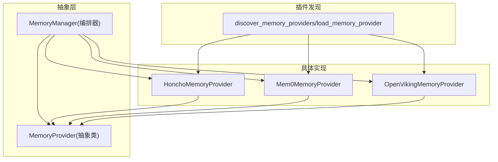
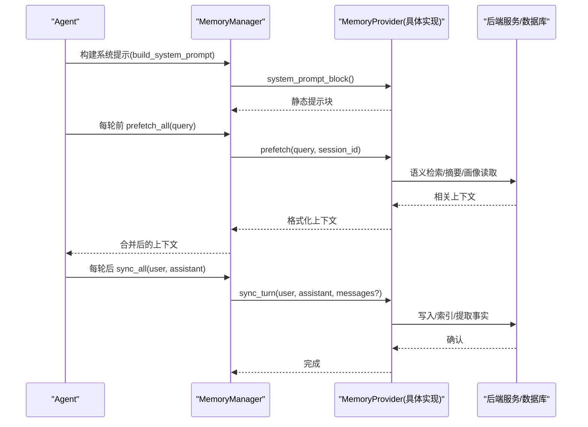
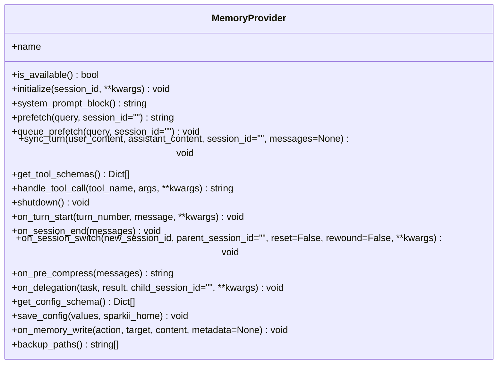
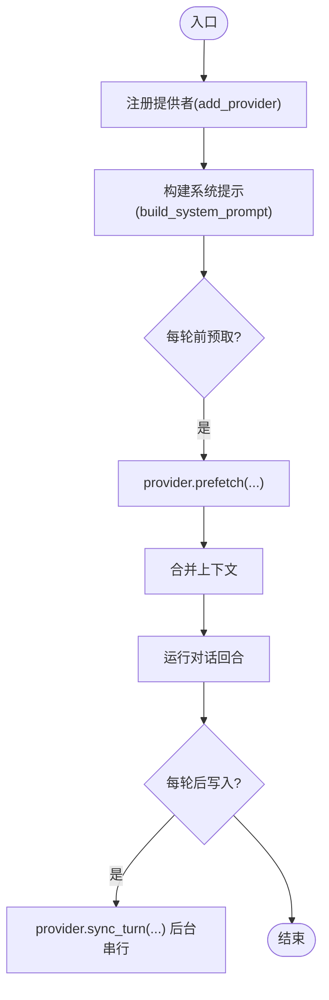
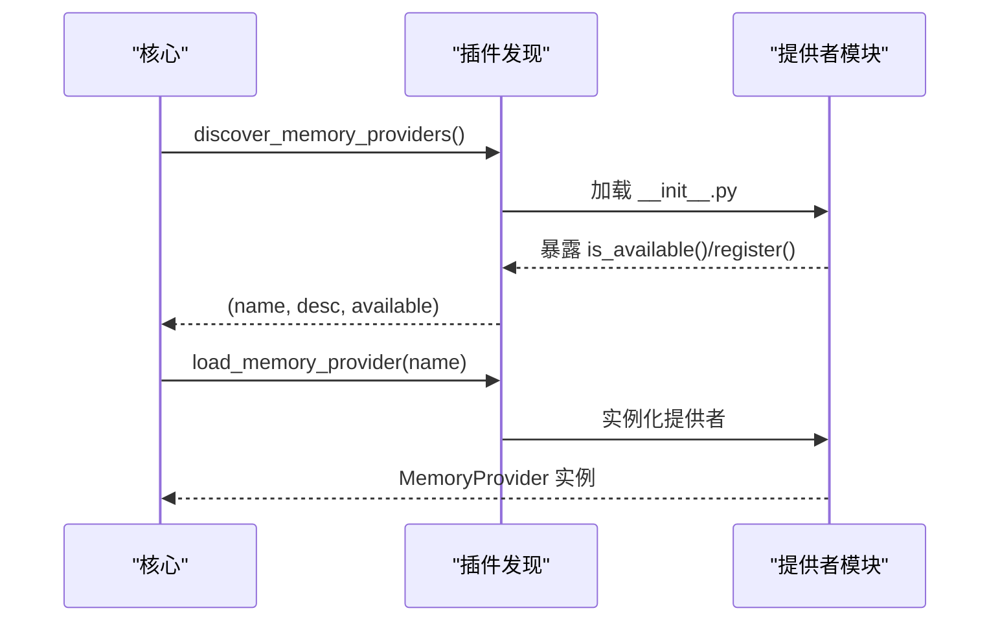
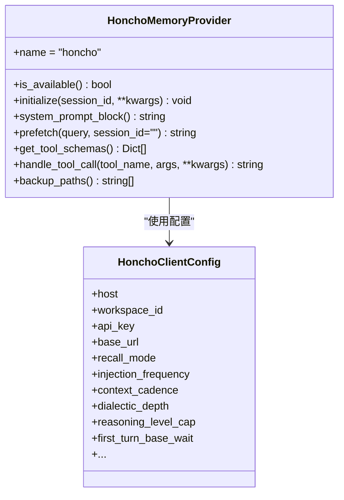
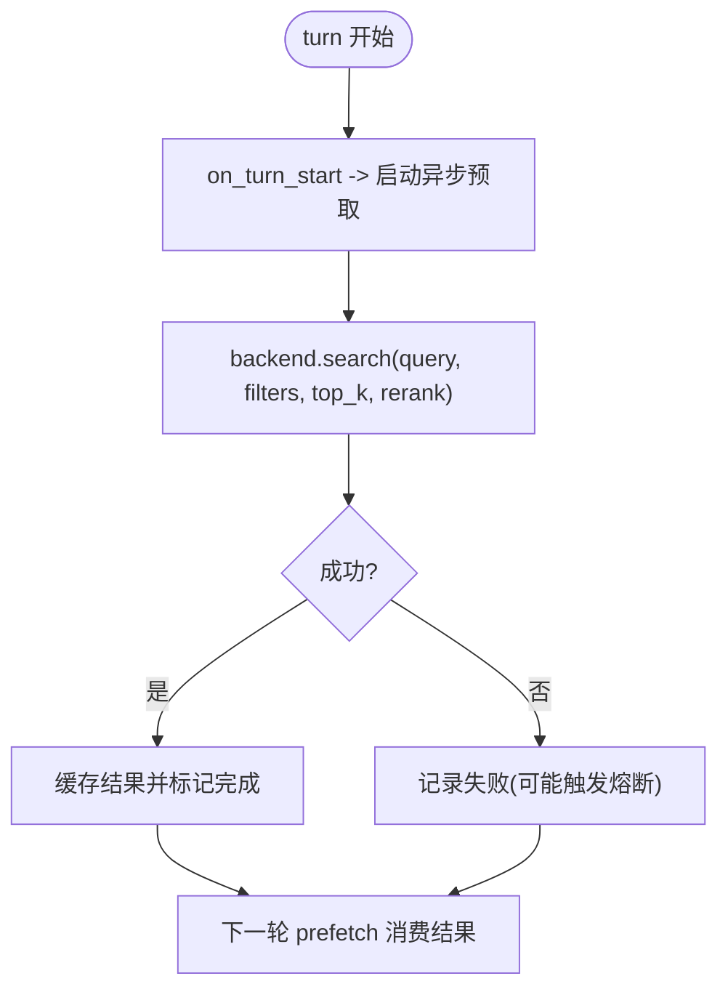
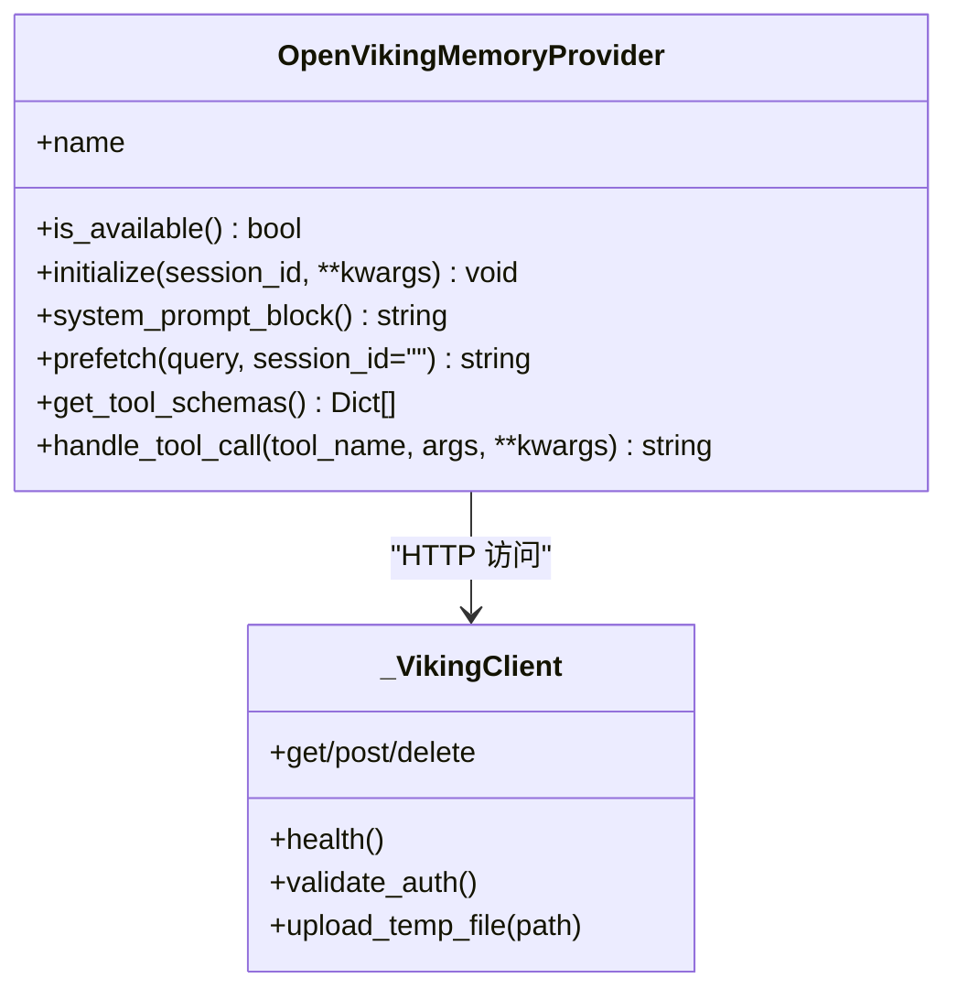
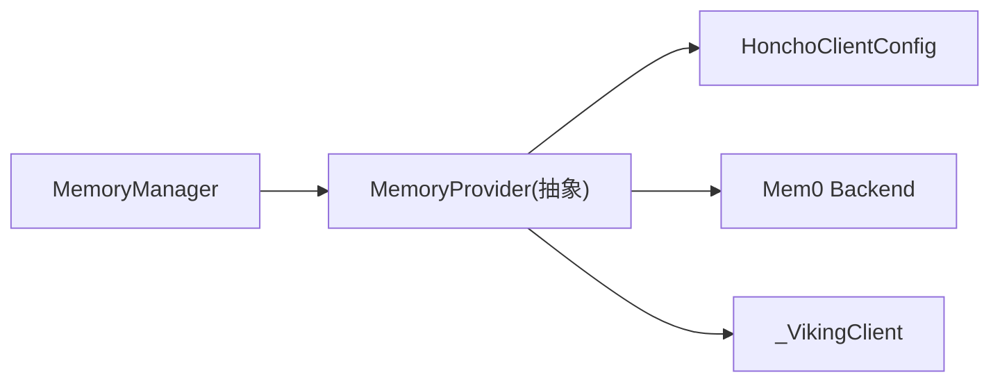

# 记忆存储后端

<cite>
**本文引用的文件**
- [agent/memory_provider.py](file://agent/memory_provider.py)
- [agent/memory_manager.py](file://agent/memory_manager.py)
- [plugins/memory/__init__.py](file://plugins/memory/__init__.py)
- [plugins/memory/honcho/__init__.py](file://plugins/memory/honcho/__init__.py)
- [plugins/memory/honcho/client.py](file://plugins/memory/honcho/client.py)
- [plugins/memory/mem0/__init__.py](file://plugins/memory/mem0/__init__.py)
- [plugins/memory/openviking/__init__.py](file://plugins/memory/openviking/__init__.py)
</cite>

## 目录
1. [简介](#简介)
2. [项目结构](#项目结构)
3. [核心组件](#核心组件)
4. [架构总览](#架构总览)
5. [详细组件分析](#详细组件分析)
6. [依赖关系分析](#依赖关系分析)
7. [性能与优化](#性能与优化)
8. [故障排查指南](#故障排查指南)
9. [结论](#结论)
10. [附录：配置示例与迁移/备份恢复](#附录：配置示例与迁移备份恢复)

## 简介
本文件面向“记忆存储后端”的扩展文档，目标是系统化说明记忆系统的抽象接口、不同存储后端的实现方式（如 Honcho、Mem0、OpenViking 等），以及记忆数据的组织结构（短期/长期记忆、语义索引、用户画像）、压缩与优化策略（去重、过期清理、性能调优），并提供自定义存储后端的开发指南（接口实现、数据迁移、备份恢复）和配置示例与性能对比建议。

## 项目结构
记忆系统采用“插件化 + 统一抽象”的设计：
- 抽象层：MemoryProvider 定义统一的存储、检索、索引、查询、工具暴露、生命周期钩子等接口；MemoryManager 负责编排多个提供者（内置 + 最多一个外部提供者），并处理并发、超时、后台同步与工具注入。
- 插件发现：plugins/memory 下按名称组织各提供者的实现，支持内置与用户安装两种来源，通过配置 memory.provider 选择激活的提供者。
- 具体实现：Honcho、Mem0、OpenViking 等各自实现 MemoryProvider，并通过各自的客户端/会话管理完成与后端服务的交互。

**图表来源**
- [agent/memory_provider.py:81-358](file://agent/memory_provider.py#L81-L358)
- [agent/memory_manager.py:364-800](file://agent/memory_manager.py#L364-L800)
- [plugins/memory/__init__.py:146-216](file://plugins/memory/__init__.py#L146-L216)
- [plugins/memory/honcho/__init__.py:237-314](file://plugins/memory/honcho/__init__.py#L237-L314)
- [plugins/memory/mem0/__init__.py:194-235](file://plugins/memory/mem0/__init__.py#L194-L235)
- [plugins/memory/openviking/__init__.py:1-24](file://plugins/memory/openviking/__init__.py#L1-L24)

**章节来源**
- [agent/memory_provider.py:81-358](file://agent/memory_provider.py#L81-L358)
- [agent/memory_manager.py:364-800](file://agent/memory_manager.py#L364-L800)
- [plugins/memory/__init__.py:146-216](file://plugins/memory/__init__.py#L146-L216)

## 核心组件
- MemoryProvider（抽象类）
  - 核心生命周期：initialize、system_prompt_block、prefetch、queue_prefetch、sync_turn、get_tool_schemas、handle_tool_call、shutdown
  - 可选钩子：on_turn_start、on_session_end、on_session_switch、on_pre_compress、on_delegation、backup_paths、get_config_schema/save_config
  - 作用：定义存储、检索、索引、查询的统一契约，屏蔽后端差异。
- MemoryManager（编排器）
  - 注册与管理：add_provider、get_provider、providers
  - 上下文注入：build_system_prompt、prefetch_all、queue_prefetch_all
  - 写入同步：sync_all（后台串行执行，保证顺序）
  - 工具注入：inject_memory_provider_tools、get_all_tool_schemas
  - 并发与超时：外部提供者 prefetch 线程+超时、后台执行器、关闭时等待任务排空
- 插件发现与加载
  - 扫描内置与用户安装的 plugins/memory/<name>/，解析 plugin.yaml 描述，调用 is_available() 检查可用性，load_memory_provider(name) 实例化提供者。

**章节来源**
- [agent/memory_provider.py:81-358](file://agent/memory_provider.py#L81-L358)
- [agent/memory_manager.py:364-800](file://agent/memory_manager.py#L364-L800)
- [plugins/memory/__init__.py:146-216](file://plugins/memory/__init__.py#L146-L216)

## 架构总览
记忆系统在运行时由 MemoryManager 驱动，每个 turn 前后分别进行“预取上下文”和“写入持久化”，同时暴露工具供模型主动检索或更新记忆。

**图表来源**
- [agent/memory_manager.py:486-694](file://agent/memory_manager.py#L486-L694)
- [agent/memory_provider.py:123-188](file://agent/memory_provider.py#L123-L188)

## 详细组件分析

### 抽象接口：MemoryProvider
- 存储/写入：sync_turn（可带 messages），on_memory_write（镜像内置记忆写入）
- 检索/召回：prefetch（返回注入文本），queue_prefetch（为下一轮预热）
- 索引/查询：通过 get_tool_schemas 暴露工具（如搜索、推理、上下文快照、结论管理等）
- 生命周期：initialize（连接/资源准备）、shutdown（清理）
- 配置：get_config_schema/save_config（引导式配置与持久化）
- 备份：backup_paths（声明额外磁盘路径参与备份）

**图表来源**
- [agent/memory_provider.py:81-358](file://agent/memory_provider.py#L81-L358)

**章节来源**
- [agent/memory_provider.py:81-358](file://agent/memory_provider.py#L81-L358)

### 编排器：MemoryManager
- 只允许一个外部提供者，避免工具名冲突与重复后端。
- 将外部提供者的 prefetch 放入独立线程并设置超时，防止阻塞主流程。
- 将 sync_turn 放入单工作线程的后台执行器，确保写入顺序与进程退出安全。
- 自动注入工具 schema，过滤保留的核心工具名，避免覆盖。

**图表来源**
- [agent/memory_manager.py:404-694](file://agent/memory_manager.py#L404-L694)

**章节来源**
- [agent/memory_manager.py:404-694](file://agent/memory_manager.py#L404-L694)

### 插件发现与加载
- 扫描内置与用户安装目录，读取 plugin.yaml 描述，调用 is_available() 判断可用。
- 支持 register(ctx) 模式或直接继承 MemoryProvider 的类，统一实例化。
- CLI 命令仅对当前激活的提供者生效，轻量导入 cli.py。

**图表来源**
- [plugins/memory/__init__.py:157-216](file://plugins/memory/__init__.py#L157-L216)
- [plugins/memory/__init__.py:365-461](file://plugins/memory/__init__.py#L365-L461)

**章节来源**
- [plugins/memory/__init__.py:157-216](file://plugins/memory/__init__.py#L157-L216)
- [plugins/memory/__init__.py:365-461](file://plugins/memory/__init__.py#L365-L461)

### 具体实现：Honcho
- 能力：跨会话用户建模、语义检索、同行卡片、结论持久化、对话式推理。
- 模式：context/tools/hybrid，支持首轮等待、注入频率、上下文预算、推理深度控制。
- 配置：从 $SPARKII_HOME/honcho.json、~/.honcho/config.json、环境变量解析；支持本地/自托管 base_url。
- 工具：profile/search/reasoning/context/conclude。

**图表来源**
- [plugins/memory/honcho/__init__.py:237-314](file://plugins/memory/honcho/__init__.py#L237-L314)
- [plugins/memory/honcho/client.py:360-464](file://plugins/memory/honcho/client.py#L360-L464)

**章节来源**
- [plugins/memory/honcho/__init__.py:237-314](file://plugins/memory/honcho/__init__.py#L237-L314)
- [plugins/memory/honcho/client.py:360-464](file://plugins/memory/honcho/client.py#L360-L464)

### 具体实现：Mem0
- 能力：服务端 LLM 事实抽取、语义搜索、自动去重；支持平台 API 与自托管 OSS。
- 模式：platform/oss/self-hosted HTTP；用户 ID 聚合跨网关记忆。
- 工具：search/add/update/delete；支持 rerank（平台模式）。
- 容错：熔断器（连续失败冷却）、错误分类（客户端错误不触发熔断）。

**图表来源**
- [plugins/memory/mem0/__init__.py:414-477](file://plugins/memory/mem0/__init__.py#L414-L477)
- [plugins/memory/mem0/__init__.py:294-335](file://plugins/memory/mem0/__init__.py#L294-L335)

**章节来源**
- [plugins/memory/mem0/__init__.py:194-235](file://plugins/memory/mem0/__init__.py#L194-L235)
- [plugins/memory/mem0/__init__.py:414-477](file://plugins/memory/mem0/__init__.py#L414-L477)

### 具体实现：OpenViking
- 能力：文件系统式知识基（viking:// URIs）、分层上下文（L0/L1/L2）、自动记忆抽取、语义检索、资源摄取。
- 工具：search/read/browse/remember/forget/add_resource。
- 配置：环境变量（端点、密钥、账户/用户/代理）或链接 OpenViking CLI 配置；支持本地/云端。
- 健壮性：健康检查、身份探测、重试可信身份头、进程级 atexit 提交。

**图表来源**
- [plugins/memory/openviking/__init__.py:1-24](file://plugins/memory/openviking/__init__.py#L1-L24)
- [plugins/memory/openviking/__init__.py:287-467](file://plugins/memory/openviking/__init__.py#L287-L467)

**章节来源**
- [plugins/memory/openviking/__init__.py:1-24](file://plugins/memory/openviking/__init__.py#L1-L24)
- [plugins/memory/openviking/__init__.py:287-467](file://plugins/memory/openviking/__init__.py#L287-L467)

## 依赖关系分析
- 耦合度
  - MemoryManager 与 MemoryProvider 松耦合，通过标准接口通信；具体实现仅依赖自身客户端/SDK。
  - 插件发现模块与具体实现解耦，通过约定目录结构与命名规范加载。
- 直接/间接依赖
  - MemoryManager 依赖 agent.memory_provider 抽象；具体实现依赖各自 client/session/backend。
  - 插件发现依赖 sparkii_cli.config 读取 memory.provider。
- 循环依赖
  - 未发现循环依赖；插件加载通过动态 import 与命名空间隔离避免冲突。
- 外部集成点
  - Honcho：远程服务/自托管 base_url；Mem0：平台 API 或 OSS 向量库；OpenViking：REST API。

**图表来源**
- [agent/memory_manager.py:364-800](file://agent/memory_manager.py#L364-L800)
- [plugins/memory/honcho/client.py:360-464](file://plugins/memory/honcho/client.py#L360-L464)
- [plugins/memory/mem0/__init__.py:267-292](file://plugins/memory/mem0/__init__.py#L267-L292)
- [plugins/memory/openviking/__init__.py:287-467](file://plugins/memory/openviking/__init__.py#L287-L467)

**章节来源**
- [agent/memory_manager.py:364-800](file://agent/memory_manager.py#L364-L800)
- [plugins/memory/honcho/client.py:360-464](file://plugins/memory/honcho/client.py#L360-L464)
- [plugins/memory/mem0/__init__.py:267-292](file://plugins/memory/mem0/__init__.py#L267-L292)
- [plugins/memory/openviking/__init__.py:287-467](file://plugins/memory/openviking/__init__.py#L287-L467)

## 性能与优化
- 预取与注入
  - Honcho：支持首轮等待、注入频率（every-turn/first-turn）、上下文预算（context_tokens）、推理深度与启发式级别上限。
  - Mem0：短等待热路径消费预取结果，失败走熔断冷却，避免雪崩。
  - OpenViking：分层上下文（abstract/overview/full）减少不必要的全量读取。
- 写入与顺序
  - MemoryManager 使用单工作线程后台执行器串行化 provider 写入，保证 turn N 先于 N+1 落地。
- 超时与保护
  - 外部提供者 prefetch 线程超时；Honcho 支持请求超时；OpenViking 健康探测与重试。
- 去重与过期
  - Mem0 服务端自动去重；Honcho 结论自我修复矛盾；OpenViking 支持删除特定记忆文件。
- 工具与开销
  - 工具 schema 标准化与核心工具名保护，避免污染请求；按需启用 memory 工具集。

[本节为通用指导，无需特定文件引用]

## 故障排查指南
- 常见问题
  - 外部提供者无响应：检查网络/鉴权/超时配置；观察 MemoryManager 的外部预取超时日志。
  - 工具名冲突：若提供者工具名与核心工具冲突会被拒绝；需重命名。
  - 熔断触发：Mem0 连续失败会进入冷却期；检查后端可达性与向量库状态。
  - 认证失败：Honcho 背景初始化失败会记录一次性通知；检查 api_key/base_url。
- 定位方法
  - 查看 MemoryManager 的警告/调试日志（provider 名称、错误信息）。
  - 检查各提供者的 is_available() 与配置解析路径。
  - 对于 OpenViking，使用 health/validate_auth 探测端点与身份。

**章节来源**
- [agent/memory_manager.py:486-694](file://agent/memory_manager.py#L486-L694)
- [plugins/memory/mem0/__init__.py:294-335](file://plugins/memory/mem0/__init__.py#L294-L335)
- [plugins/memory/honcho/__init__.py:343-410](file://plugins/memory/honcho/__init__.py#L343-L410)
- [plugins/memory/openviking/__init__.py:440-467](file://plugins/memory/openviking/__init__.py#L440-L467)

## 结论
记忆系统通过清晰的抽象接口与灵活的插件机制，实现了多后端统一接入与编排。MemoryManager 保证了稳定性与一致性，各提供者在语义检索、用户画像、工具暴露等方面各有侧重。结合配置化的注入策略、后台写入与容错机制，可在不同部署场景下取得良好的性能与可靠性。

[本节为总结，无需特定文件引用]

## 附录：配置示例与迁移/备份恢复

### 配置要点（按提供者）
- Honcho
  - 配置文件优先级：$SPARKII_HOME/honcho.json > ~/.honcho/config.json > 环境变量
  - 关键字段：apiKey/base_url、recallMode、injectionFrequency、contextTokens、dialecticDepth、reasoningLevelCap、firstTurnBaseWait
  - 参考：[plugins/memory/honcho/client.py:360-464](file://plugins/memory/honcho/client.py#L360-L464)
- Mem0
  - 环境变量：MEM0_API_KEY、MEM0_HOST、MEM0_MODE、MEM0_USER_ID、MEM0_AGENT_ID
  - 非密配置：$SPARKII_HOME/mem0.json（mode/host/user_id/agent_id/rerank）
  - 参考：[plugins/memory/mem0/__init__.py:78-110](file://plugins/memory/mem0/__init__.py#L78-L110)、[plugins/memory/mem0/__init__.py:251-261](file://plugins/memory/mem0/__init__.py#L251-L261)
- OpenViking
  - 环境变量：OPENVIKING_ENDPOINT、OPENVIKING_API_KEY、OPENVIKING_ACCOUNT、OPENVIKING_USER、OPENVIKING_AGENT
  - 也可链接 OpenViking CLI 配置
  - 参考：[plugins/memory/openviking/__init__.py:10-24](file://plugins/memory/openviking/__init__.py#L10-L24)

### 数据迁移
- Honcho：在新会话创建时尝试迁移 memories 目录下的文件到远端会话（受 session_strategy 影响）
  - 参考：[plugins/memory/honcho/__init__.py:507-520](file://plugins/memory/honcho/__init__.py#L507-L520)
- Mem0：通过 user_id 聚合跨网关记忆；OSS/自托管/平台三种后端均可迁移数据至新环境
  - 参考：[plugins/memory/mem0/__init__.py:337-367](file://plugins/memory/mem0/__init__.py#L337-L367)
- OpenViking：支持 viking:// URI 的文件级操作与资源摄取，便于结构化迁移
  - 参考：[plugins/memory/openviking/__init__.py:593-632](file://plugins/memory/openviking/__init__.py#L593-L632)

### 备份与恢复
- 提供者可通过 backup_paths() 声明额外磁盘路径，纳入 sparkii backup/import 流程
  - 参考：[agent/memory_provider.py:341-357](file://agent/memory_provider.py#L341-L357)
  - Honcho 会将 ~/.honcho 目录纳入备份范围
    - 参考：[plugins/memory/honcho/__init__.py:240-251](file://plugins/memory/honcho/__init__.py#L240-L251)

### 自定义存储后端开发指南
- 步骤
  1. 在 plugins/memory/<your_provider>/__init__.py 中实现 MemoryProvider（或提供 register(ctx)）
  2. 实现 is_available/initialize/sync_turn/prefetch/get_tool_schemas/handle_tool_call/shutdown
  3. 如需配置向导，实现 get_config_schema/save_config/post_setup
  4. 如需备份外部路径，实现 backup_paths
  5. 在 config.yaml 中设置 memory.provider 为 <your_provider>
- 注意事项
  - 工具名不得与核心工具冲突（会被拒绝）
  - 外部提供者 prefetch 有超时限制，避免阻塞主流程
  - 使用 on_session_switch/on_session_end 维护会话边界状态
  - 合理设置 context_tokens/injection_frequency/dialectic_depth 等参数以平衡质量与开销

[本节为实践指导，无需特定文件引用]