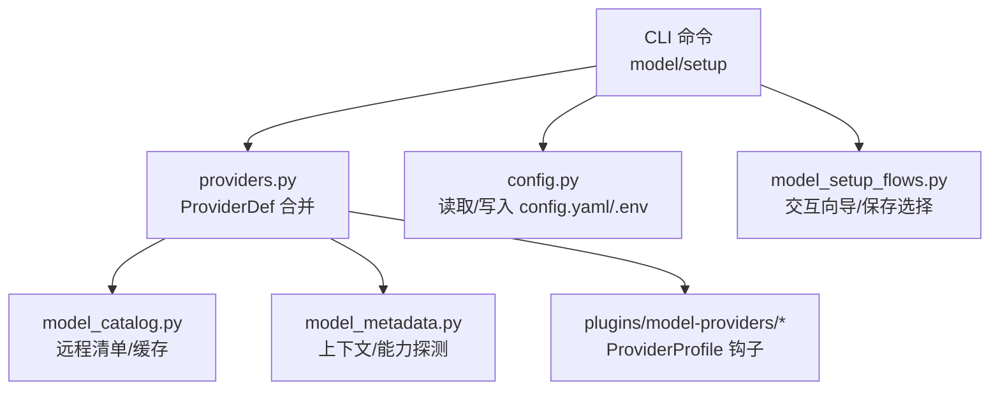
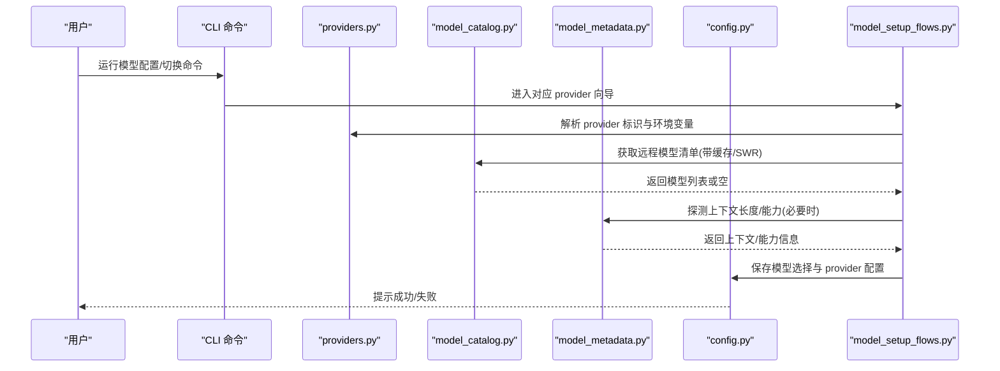
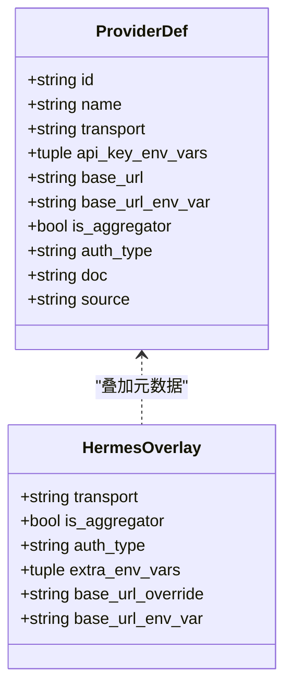
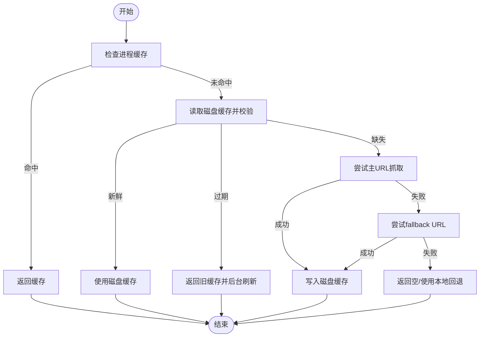
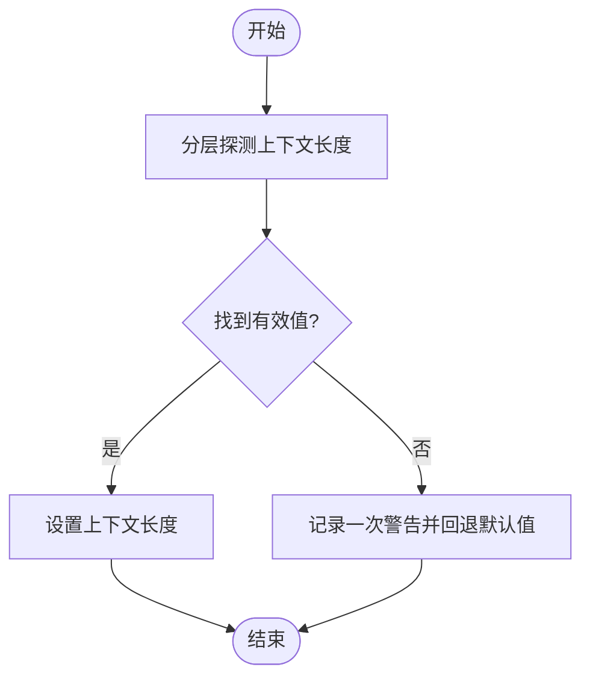
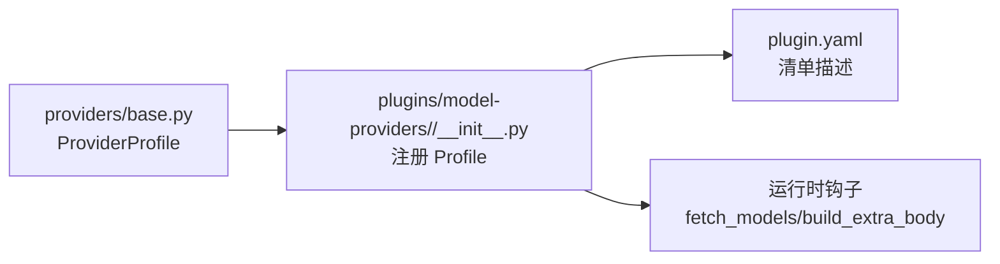
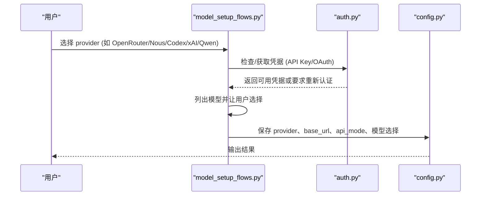
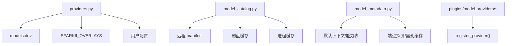

# 模型配置管理

<cite>
**本文引用的文件**
- [sparkii_cli/providers.py](file://sparkii_cli/providers.py)
- [sparkii_cli/model_catalog.py](file://sparkii_cli/model_catalog.py)
- [agent/model_metadata.py](file://agent/model_metadata.py)
- [plugins/model-providers/README.md](file://plugins/model-providers/README.md)
- [plugins/model-providers/anthropic/__init__.py](file://plugins/model-providers/anthropic/__init__.py)
- [plugins/model-providers/gemini/__init__.py](file://plugins/model-providers/gemini/__init__.py)
- [sparkii_cli/config.py](file://sparkii_cli/config.py)
- [sparkii_cli/model_setup_flows.py](file://sparkii_cli/model_setup_flows.py)
</cite>

## 目录
1. [简介](#简介)
2. [项目结构](#项目结构)
3. [核心组件](#核心组件)
4. [架构总览](#架构总览)
5. [详细组件分析](#详细组件分析)
6. [依赖关系分析](#依赖关系分析)
7. [性能考虑](#性能考虑)
8. [故障排查指南](#故障排查指南)
9. [结论](#结论)
10. [附录](#附录)

## 简介
本文件面向“模型配置管理”主题，系统性说明：
- 模型注册机制与配置文件结构规范（含 provider 目录组织与 manifest 定义）
- 环境变量配置、API 密钥管理与认证流程
- 模型能力检测机制（上下文长度限制、工具调用支持、多模态能力声明）
- CLI 中配置新模型的交互式设置向导与配置文件生成
- 不同模型提供商的配置示例（OpenAI、Anthropic、Google Gemini 等）
- 配置验证、错误处理与配置迁移策略

## 项目结构
围绕模型配置的关键目录与模块：
- sparkii_cli/providers.py：统一提供程序身份与元数据合并（models.dev + Hermes overlay + 用户配置）
- sparkii_cli/model_catalog.py：远程模型清单获取、校验与缓存（含 fallback 与 SWR）
- agent/model_metadata.py：模型元数据、上下文长度探测与默认值回退
- plugins/model-providers/*：按 provider 划分的插件式 Profile（manifest 与行为钩子）
- sparkii_cli/config.py：配置加载、写入、备份与迁移（含 .env 安全策略）
- sparkii_cli/model_setup_flows.py：各 provider 的交互式模型选择与配置保存流程

图表来源
- [sparkii_cli/providers.py:455-528](file://sparkii_cli/providers.py#L455-L528)
- [sparkii_cli/model_catalog.py:268-330](file://sparkii_cli/model_catalog.py#L268-L330)
- [agent/model_metadata.py:350-390](file://agent/model_metadata.py#L350-L390)
- [plugins/model-providers/README.md:17-62](file://plugins/model-providers/README.md#L17-L62)
- [sparkii_cli/config.py:45-156](file://sparkii_cli/config.py#L45-L156)
- [sparkii_cli/model_setup_flows.py:178-247](file://sparkii_cli/model_setup_flows.py#L178-L247)

章节来源
- [sparkii_cli/providers.py:1-18](file://sparkii_cli/providers.py#L1-L18)
- [sparkii_cli/model_catalog.py:1-43](file://sparkii_cli/model_catalog.py#L1-L43)
- [plugins/model-providers/README.md:1-71](file://plugins/model-providers/README.md#L1-L71)

## 核心组件
- Provider 定义与合并：通过 providers.py 将 models.dev 目录、Hermes overlay 与用户自定义配置合并为统一的 ProviderDef。
- 模型清单与缓存：model_catalog.py 负责拉取远程 manifest、校验 schema、落盘缓存与后台刷新。
- 模型能力探测：model_metadata.py 提供上下文长度探测、默认回退、端点黑孔缓存等。
- Provider 插件：每个 provider 在 plugins/model-providers/<name>/__init__.py 中注册 ProviderProfile，可覆盖请求体构建、模型列表获取等行为。
- 配置读写：config.py 提供安全的 .env 写入、损坏配置备份、受管模式提示等。
- 交互向导：model_setup_flows.py 实现各 provider 的登录、模型选择、配置更新与持久化。

章节来源
- [sparkii_cli/providers.py:254-528](file://sparkii_cli/providers.py#L254-L528)
- [sparkii_cli/model_catalog.py:95-113](file://sparkii_cli/model_catalog.py#L95-L113)
- [agent/model_metadata.py:350-390](file://agent/model_metadata.py#L350-L390)
- [plugins/model-providers/README.md:28-62](file://plugins/model-providers/README.md#L28-L62)
- [sparkii_cli/config.py:45-156](file://sparkii_cli/config.py#L45-L156)
- [sparkii_cli/model_setup_flows.py:178-247](file://sparkii_cli/model_setup_flows.py#L178-L247)

## 架构总览
下图展示了从 CLI 到模型选择的整体流程，包括认证、模型清单获取、能力探测与配置保存。

图表来源
- [sparkii_cli/model_setup_flows.py:178-247](file://sparkii_cli/model_setup_flows.py#L178-L247)
- [sparkii_cli/model_catalog.py:268-330](file://sparkii_cli/model_catalog.py#L268-L330)
- [agent/model_metadata.py:350-390](file://agent/model_metadata.py#L350-L390)
- [sparkii_cli/config.py:45-156](file://sparkii_cli/config.py#L45-L156)

## 详细组件分析

### Provider 注册与合并机制
- 统一入口：get_provider() 优先从 models.dev 获取基础信息，再叠加 SPARKII_OVERLAYS（transport、auth_type、base_url_env_var 等），最后由 resolve_user_provider()/resolve_custom_provider() 合并用户配置。
- 别名与标签：ALIASES 将常见别名映射到标准 provider id；_LABEL_OVERRIDES 提供显示名称。
- API 模式推断：determine_api_mode() 根据 host 强制模式、provider transport 映射、特殊 provider（如 bedrock）决定最终 wire protocol。

图表来源
- [sparkii_cli/providers.py:34-44](file://sparkii_cli/providers.py#L34-L44)
- [sparkii_cli/providers.py:254-268](file://sparkii_cli/providers.py#L254-L268)
- [sparkii_cli/providers.py:455-528](file://sparkii_cli/providers.py#L455-L528)

章节来源
- [sparkii_cli/providers.py:455-528](file://sparkii_cli/providers.py#L455-L528)
- [sparkii_cli/providers.py:549-704](file://sparkii_cli/providers.py#L549-L704)

### 模型清单与缓存（manifest）
- 清单格式：包含 version、updated_at、metadata、providers 块，每 provider 下有 models 列表（id、description、metadata）。
- 获取流程：优先进程内缓存 → 磁盘缓存（TTL）→ 网络抓取（主 URL + fallback URLs）→ 失败时回退本地硬编码。
- SWR 刷新：过期时仍立即返回旧缓存，并在后台异步刷新写入磁盘，下次读取生效。
- 提供者覆盖：可通过 model_catalog.providers.<name>.url 指定自定义清单源。

图表来源
- [sparkii_cli/model_catalog.py:95-113](file://sparkii_cli/model_catalog.py#L95-L113)
- [sparkii_cli/model_catalog.py:126-174](file://sparkii_cli/model_catalog.py#L126-L174)
- [sparkii_cli/model_catalog.py:203-231](file://sparkii_cli/model_catalog.py#L203-L231)
- [sparkii_cli/model_catalog.py:268-330](file://sparkii_cli/model_catalog.py#L268-L330)

章节来源
- [sparkii_cli/model_catalog.py:1-43](file://sparkii_cli/model_catalog.py#L1-L43)
- [sparkii_cli/model_catalog.py:268-330](file://sparkii_cli/model_catalog.py#L268-L330)

### 模型能力检测（上下文长度、工具调用、多模态）
- 上下文长度探测：按层级降级探测（256K→128K→…），未知时记录警告并使用默认值；对特定端点（如 Kimi Coding、NVIDIA NIM）有端点级覆盖。
- 默认上下文长度：维护了多家厂商的家族级默认值（Claude、GPT、Gemini、DeepSeek、Qwen、GLM、xAI Grok、Kimi、Upstage、Tencent、NVIDIA、Arcee、OpenRouter、HuggingFace 等）。
- 工具调用与多模态：通过 provider 的 api_mode 与传输层（openai_chat、anthropic_messages、codex_responses、bedrock_converse）决定能力边界；某些 provider 通过 build_extra_body/thinking_config 钩子注入能力参数。

图表来源
- [agent/model_metadata.py:350-390](file://agent/model_metadata.py#L350-L390)
- [agent/model_metadata.py:401-564](file://agent/model_metadata.py#L401-L564)
- [agent/model_metadata.py:748-791](file://agent/model_metadata.py#L748-L791)

章节来源
- [agent/model_metadata.py:350-390](file://agent/model_metadata.py#L350-L390)
- [agent/model_metadata.py:401-564](file://agent/model_metadata.py#L401-L564)
- [agent/model_metadata.py:748-791](file://agent/model_metadata.py#L748-L791)

### Provider 插件与 Manifest
- 目录组织：plugins/model-providers/<provider>/__init__.py 注册 ProviderProfile；可选 plugin.yaml 描述清单（name、kind、version、description）。
- 发现机制：首次调用 get_provider_profile()/list_providers() 时扫描内置与用户目录（$HERMES_HOME/plugins/model-providers/），后者覆盖同名内置插件。
- 钩子扩展：可在子类中覆写 fetch_models、build_extra_body、thinking_config 翻译等方法以适配特定 provider 的行为差异。

图表来源
- [plugins/model-providers/README.md:17-62](file://plugins/model-providers/README.md#L17-L62)
- [plugins/model-providers/anthropic/__init__.py:14-55](file://plugins/model-providers/anthropic/__init__.py#L14-L55)
- [plugins/model-providers/gemini/__init__.py:18-62](file://plugins/model-providers/gemini/__init__.py#L18-L62)

章节来源
- [plugins/model-providers/README.md:1-71](file://plugins/model-providers/README.md#L1-L71)
- [plugins/model-providers/anthropic/__init__.py:14-55](file://plugins/model-providers/anthropic/__init__.py#L14-L55)
- [plugins/model-providers/gemini/__init__.py:18-62](file://plugins/model-providers/gemini/__init__.py#L18-L62)

### 环境变量、API 密钥与认证流程
- 环境变量：
  - 各 provider 的 key/env 由 providers.py 的 overlay 与 models.dev 信息共同决定（如 ANTHROPIC_API_KEY、GOOGLE_API_KEY、OPENROUTER_BASE_URL 等）。
  - config.py 维护额外允许写入 .env 的键白名单，并对危险键进行拒绝（如 LD_PRELOAD、PATH、SPARKII_HOME 等）。
- 认证流程：
  - OpenRouter：提示获取 API Key，保存到 .env，随后选择模型并更新配置。
  - Nous Portal：OAuth 设备码登录，校验会话有效性，选择模型后更新 provider 与 base_url。
  - OpenAI Codex：OAuth 登录，选择模型并更新配置。
  - xAI OAuth：浏览器登录，选择模型并更新配置。
  - Qwen OAuth：复用本地 Qwen CLI 登录状态，选择模型并更新配置。

图表来源
- [sparkii_cli/model_setup_flows.py:178-247](file://sparkii_cli/model_setup_flows.py#L178-L247)
- [sparkii_cli/model_setup_flows.py:398-622](file://sparkii_cli/model_setup_flows.py#L398-L622)
- [sparkii_cli/model_setup_flows.py:623-791](file://sparkii_cli/model_setup_flows.py#L623-L791)
- [sparkii_cli/config.py:198-233](file://sparkii_cli/config.py#L198-L233)

章节来源
- [sparkii_cli/model_setup_flows.py:178-247](file://sparkii_cli/model_setup_flows.py#L178-L247)
- [sparkii_cli/model_setup_flows.py:398-622](file://sparkii_cli/model_setup_flows.py#L398-L622)
- [sparkii_cli/model_setup_flows.py:623-791](file://sparkii_cli/model_setup_flows.py#L623-L791)
- [sparkii_cli/config.py:198-233](file://sparkii_cli/config.py#L198-L233)

### CLI 中配置新模型（交互式向导）
- 向导入口：model_setup_flows.py 中的 _model_flow_* 函数分别处理不同 provider 的交互流程。
- 典型步骤：
  - 检查/提示 API Key 或登录状态
  - 拉取模型列表（可能结合远程清单与本地缓存）
  - 展示定价/免费额度信息（部分 provider）
  - 用户选择模型后，更新 config.yaml 的 model.provider、model.base_url、model.api_mode 等字段
  - 清理冲突的旧凭据或环境变量，确保一致性

章节来源
- [sparkii_cli/model_setup_flows.py:178-247](file://sparkii_cli/model_setup_flows.py#L178-L247)
- [sparkii_cli/model_setup_flows.py:398-622](file://sparkii_cli/model_setup_flows.py#L398-L622)
- [sparkii_cli/model_setup_flows.py:623-791](file://sparkii_cli/model_setup_flows.py#L623-L791)

### 不同提供商配置示例
- OpenRouter：
  - 环境变量：OPENROUTER_API_KEY、OPENROUTER_BASE_URL（可选）
  - 向导：提示获取 Key，选择模型，自动设置 provider=“openrouter”，base_url 指向 OpenRouter，api_mode=“chat_completions”
  - 参考：[sparkii_cli/model_setup_flows.py:178-247](file://sparkii_cli/model_setup_flows.py#L178-L247)
- Anthropic：
  - 环境变量：ANTHROPIC_API_KEY、ANTHROPIC_TOKEN、CLAUDE_CODE_OAUTH_TOKEN
  - 传输：anthropic_messages（x-api-key 头）
  - 参考：[plugins/model-providers/anthropic/__init__.py:14-55](file://plugins/model-providers/anthropic/__init__.py#L14-L55)
- Google Gemini：
  - 环境变量：GOOGLE_API_KEY、GEMINI_API_KEY
  - 传输：chat_completions（但使用原生客户端，extra_body.thinking_config 转换）
  - 参考：[plugins/model-providers/gemini/__init__.py:18-62](file://plugins/model-providers/gemini/__init__.py#L18-L62)

章节来源
- [sparkii_cli/model_setup_flows.py:178-247](file://sparkii_cli/model_setup_flows.py#L178-L247)
- [plugins/model-providers/anthropic/__init__.py:14-55](file://plugins/model-providers/anthropic/__init__.py#L14-L55)
- [plugins/model-providers/gemini/__init__.py:18-62](file://plugins/model-providers/gemini/__init__.py#L18-L62)

## 依赖关系分析
- providers.py 依赖：
  - models.dev（远程/离线）获取基础 provider 信息
  - SPARKII_OVERLAYS 注入 Hermes 特有元数据
  - 用户配置（config.yaml 的 providers/custom_providers）
- model_catalog.py 依赖：
  - 远程 manifest（主 URL + fallback）
  - 磁盘缓存（~/.sparkii/cache/model_catalog.json）
  - 进程内缓存（避免重复 I/O）
- model_metadata.py 依赖：
  - 分层探测与默认值表
  - 端点黑孔缓存与本地探针磁盘缓存
- 插件体系：
  - 通过 register_provider() 注册 ProviderProfile，运行时由传输层与认证模块自动装配

图表来源
- [sparkii_cli/providers.py:455-528](file://sparkii_cli/providers.py#L455-L528)
- [sparkii_cli/model_catalog.py:268-330](file://sparkii_cli/model_catalog.py#L268-L330)
- [agent/model_metadata.py:350-390](file://agent/model_metadata.py#L350-L390)
- [plugins/model-providers/README.md:17-62](file://plugins/model-providers/README.md#L17-L62)

章节来源
- [sparkii_cli/providers.py:455-528](file://sparkii_cli/providers.py#L455-L528)
- [sparkii_cli/model_catalog.py:268-330](file://sparkii_cli/model_catalog.py#L268-L330)
- [agent/model_metadata.py:350-390](file://agent/model_metadata.py#L350-L390)
- [plugins/model-providers/README.md:17-62](file://plugins/model-providers/README.md#L17-L62)

## 性能考虑
- 清单获取：采用进程内缓存 + 磁盘 TTL + 后台 SWR 刷新，减少冷启动阻塞与网络抖动影响。
- 上下文探测：分层降级与端点黑孔缓存，避免对不可达端点的重复探测；本地探针结果短期落盘加速连续 CLI 调用。
- 配置加载：对 config.yaml 的解析与合并结果进行缓存，避免重复 I/O；并发读写加锁保证线程安全。
- 传输模式：根据 host 强制模式与 provider transport 快速确定 api_mode，减少不必要的协议协商失败。

## 故障排查指南
- 配置解析失败：
  - 现象：YAML 解析异常导致回退默认配置
  - 处理：自动备份损坏文件至 .bak，stderr 与日志输出警告；修复 YAML 后重启
  - 参考：[sparkii_cli/config.py:45-156](file://sparkii_cli/config.py#L45-L156)
- 清单获取失败：
  - 现象：远程 manifest 无法访问或校验失败
  - 处理：回退到磁盘缓存或本地硬编码；支持自定义 provider 清单 URL
  - 参考：[sparkii_cli/model_catalog.py:126-174](file://sparkii_cli/model_catalog.py#L126-L174)
- 上下文探测失败：
  - 现象：无法确定模型上下文长度
  - 处理：记录警告并回退默认值；可通过配置覆盖
  - 参考：[agent/model_metadata.py:372-390](file://agent/model_metadata.py#L372-L390)
- 认证失败：
  - 现象：API Key 无效或 OAuth 会话过期
  - 处理：向导提示重新认证或更换 Key；Nous/Codex/xAI 等支持在线重登
  - 参考：[sparkii_cli/model_setup_flows.py:398-622](file://sparkii_cli/model_setup_flows.py#L398-L622)

章节来源
- [sparkii_cli/config.py:45-156](file://sparkii_cli/config.py#L45-L156)
- [sparkii_cli/model_catalog.py:126-174](file://sparkii_cli/model_catalog.py#L126-L174)
- [agent/model_metadata.py:372-390](file://agent/model_metadata.py#L372-L390)
- [sparkii_cli/model_setup_flows.py:398-622](file://sparkii_cli/model_setup_flows.py#L398-L622)

## 结论
本系统通过“统一 Provider 定义 + 远程清单 + 插件化 Profile + 安全配置读写 + 交互向导”的组合，实现了跨多家模型提供商的可插拔配置与管理。其关键优势在于：
- 高内聚的 provider 元数据合并与传输模式推断
- 健壮的清单获取与缓存策略（SWR、fallback、schema 校验）
- 完善的上下文探测与默认回退，保障未知模型可用性
- 安全的 .env 写入与损坏配置恢复
- 友好的交互向导，降低配置门槛

## 附录
- 常用环境变量（示例）
  - OpenRouter：OPENROUTER_API_KEY、OPENROUTER_BASE_URL
  - Anthropic：ANTHROPIC_API_KEY、ANTHROPIC_TOKEN、CLAUDE_CODE_OAUTH_TOKEN
  - Gemini：GOOGLE_API_KEY、GEMINI_API_KEY
  - 其他 provider 的环境变量由 providers.py 的 overlay 与 models.dev 信息决定
- 配置位置
  - ~/.sparkii/config.yaml：主配置
  - ~/.sparkii/.env：API 密钥与敏感信息
  - ~/.sparkii/cache/model_catalog.json：模型清单缓存
  - ~/.sparkii/cache/local_endpoint_probes.json：本地端点探测缓存
- 迁移策略
  - 受管模式（NixOS/Docker）下提供更新指引与受限写入
  - 损坏配置自动备份，避免丢失用户覆盖
  - 清单版本控制（version 字段）用于兼容未来破坏性变更