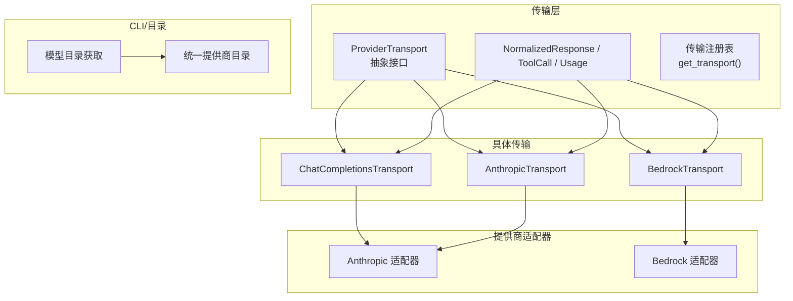
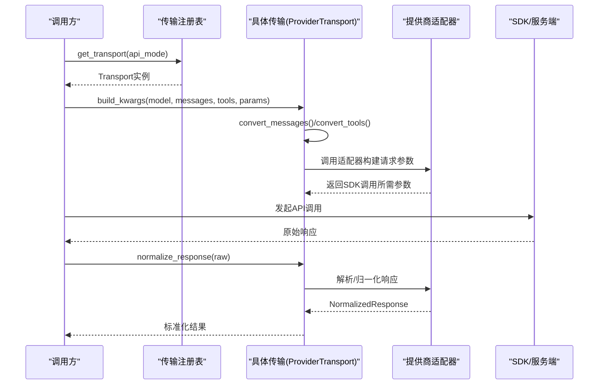
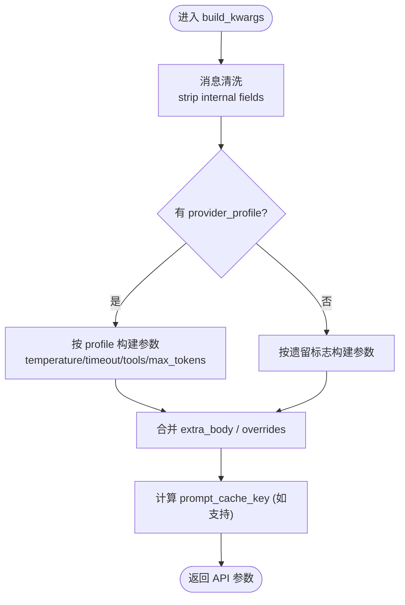
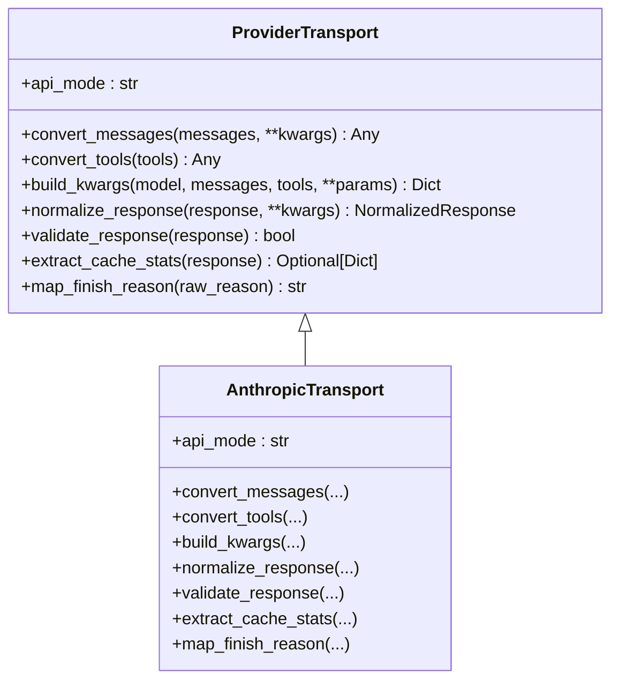
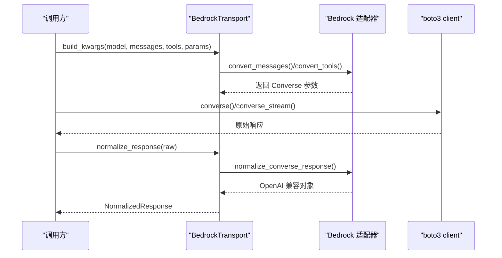
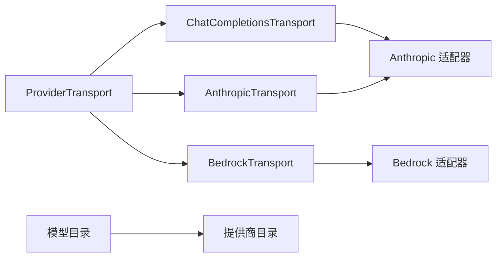

# 自定义模型集成

<cite>
**本文引用的文件**
- [agent/transports/base.py](file://agent/transports/base.py)
- [agent/transports/types.py](file://agent/transports/types.py)
- [agent/transports/__init__.py](file://agent/transports/__init__.py)
- [agent/transports/chat_completions.py](file://agent/transports/chat_completions.py)
- [agent/transports/anthropic.py](file://agent/transports/anthropic.py)
- [agent/transports/bedrock.py](file://agent/transports/bedrock.py)
- [agent/anthropic_adapter.py](file://agent/anthropic_adapter.py)
- [agent/bedrock_adapter.py](file://agent/bedrock_adapter.py)
- [sparkii_cli/model_catalog.py](file://sparkii_cli/model_catalog.py)
- [sparkii_cli/provider_catalog.py](file://sparkii_cli/provider_catalog.py)
</cite>

## 目录
1. [简介](#简介)
2. [项目结构](#项目结构)
3. [核心组件](#核心组件)
4. [架构总览](#架构总览)
5. [详细组件分析](#详细组件分析)
6. [依赖关系分析](#依赖关系分析)
7. [性能考虑](#性能考虑)
8. [故障排查指南](#故障排查指南)
9. [结论](#结论)
10. [附录](#附录)

## 简介
本文件面向希望为系统新增 AI 模型适配器的开发者，提供从接口规范、消息与工具格式转换、流式响应处理、错误处理到不同提供商（OpenAI 兼容、Anthropic、AWS Bedrock）的特定配置与注册流程的完整指南。文档基于仓库中的传输层抽象与具体实现，给出可操作的步骤与图示，帮助快速完成新模型的接入与在 CLI/Web 界面中配置使用。

## 项目结构
围绕“自定义模型集成”的关键代码集中在 agent/transports 目录下的传输抽象与具体实现，以及各提供商适配器与 CLI 目录中的目录发现与注册机制：
- 传输抽象与类型：定义统一的 ProviderTransport 接口与标准化响应 NormalizedResponse。
- 具体传输：chat_completions（OpenAI 兼容）、anthropic（Anthropic Messages）、bedrock（AWS Bedrock Converse）。
- 提供商适配器：封装各提供商 SDK 调用、认证、参数映射与响应解析。
- 目录与注册：CLI 侧提供模型目录获取与统一提供商目录，用于 UI 展示与配置入口。

图表来源
- [agent/transports/base.py:16-90](file://agent/transports/base.py#L16-L90)
- [agent/transports/types.py:18-175](file://agent/transports/types.py#L18-L175)
- [agent/transports/__init__.py:21-69](file://agent/transports/__init__.py#L21-L69)
- [agent/transports/chat_completions.py:207-747](file://agent/transports/chat_completions.py#L207-L747)
- [agent/transports/anthropic.py:13-252](file://agent/transports/anthropic.py#L13-L252)
- [agent/transports/bedrock.py:15-155](file://agent/transports/bedrock.py#L15-L155)
- [sparkii_cli/model_catalog.py:1-200](file://sparkii_cli/model_catalog.py#L1-L200)
- [sparkii_cli/provider_catalog.py:1-182](file://sparkii_cli/provider_catalog.py#L1-L182)

章节来源
- [agent/transports/base.py:16-90](file://agent/transports/base.py#L16-L90)
- [agent/transports/types.py:18-175](file://agent/transports/types.py#L18-L175)
- [agent/transports/__init__.py:21-69](file://agent/transports/__init__.py#L21-L69)
- [agent/transports/chat_completions.py:207-747](file://agent/transports/chat_completions.py#L207-L747)
- [agent/transports/anthropic.py:13-252](file://agent/transports/anthropic.py#L13-L252)
- [agent/transports/bedrock.py:15-155](file://agent/transports/bedrock.py#L15-L155)
- [sparkii_cli/model_catalog.py:1-200](file://sparkii_cli/model_catalog.py#L1-L200)
- [sparkii_cli/provider_catalog.py:1-182](file://sparkii_cli/provider_catalog.py#L1-L182)

## 核心组件
- ProviderTransport 抽象：定义 api_mode、convert_messages、convert_tools、build_kwargs、normalize_response、validate_response、extract_cache_stats、map_finish_reason 等统一方法，屏蔽各提供商差异。
- 标准化响应类型：ToolCall、Usage、NormalizedResponse 提供跨提供商一致的数据结构，并通过 provider_data 保留协议相关元数据。
- 传输注册表：通过 register_transport 自动发现并缓存传输类，get_transport 按 api_mode 获取实例。

章节来源
- [agent/transports/base.py:16-90](file://agent/transports/base.py#L16-L90)
- [agent/transports/types.py:18-175](file://agent/transports/types.py#L18-L175)
- [agent/transports/__init__.py:21-69](file://agent/transports/__init__.py#L21-L69)

## 架构总览
下图展示了从上层调用到具体传输与适配器的整体流程，包括消息预处理、参数构建、响应归一化与结束原因映射。

图表来源
- [agent/transports/__init__.py:21-69](file://agent/transports/__init__.py#L21-L69)
- [agent/transports/chat_completions.py:356-747](file://agent/transports/chat_completions.py#L356-L747)
- [agent/transports/anthropic.py:41-192](file://agent/transports/anthropic.py#L41-L192)
- [agent/transports/bedrock.py:32-116](file://agent/transports/bedrock.py#L32-L116)

## 详细组件分析

### OpenAI 兼容传输（ChatCompletionsTransport）
- 职责：处理默认 api_mode='chat_completions'，负责消息清洗、工具定义透传、参数构建（含 reasoning/thinking、provider preferences、extra_body、prompt cache key 等），并将 OpenAI 格式响应归一化。
- 关键逻辑：
  - 消息清洗：移除内部字段与严格提供商不接受的键，处理 Gemini thought_signature 的 extra_content 保留策略。
  - 参数构建：支持 provider_profile 路径与遗留标志路径；合并 temperature、timeout、tools、max_tokens、reasoning_config、thinking_config、extra_body、request_overrides 等。
  - 响应归一化：提取 finish_reason、tool_calls、usage，保留 reasoning_details 与 provider_data。
- 能力检测与上下文长度：通过 profile.get_max_tokens 与 supports_prompt_cache_key 控制输出上限与提示缓存路由。

图表来源
- [agent/transports/chat_completions.py:356-747](file://agent/transports/chat_completions.py#L356-L747)

章节来源
- [agent/transports/chat_completions.py:207-747](file://agent/transports/chat_completions.py#L207-L747)

### Anthropic 传输（AnthropicTransport）
- 职责：将 OpenAI 消息与工具转换为 Anthropic Messages API 格式，构建 messages.create 参数，并将响应归一化为 NormalizedResponse。
- 关键逻辑：
  - 消息/工具转换：委托至 anthropic_adapter。
  - 参数构建：支持 max_tokens、reasoning_config、tool_choice、context_length、base_url、fast_mode 等。
  - 响应归一化：解析 content blocks（text、thinking/redacted_thinking、tool_use），维护有序块以正确重放签名；映射 stop_reason 到 finish_reason；收集 reasoning_details 与 ordered blocks。
  - 校验与缓存统计：validate_response 允许空 content 的 end_turn/refusal；extract_cache_stats 读取 cache_read_input_tokens 与 cache_creation_input_tokens。

图表来源
- [agent/transports/base.py:16-90](file://agent/transports/base.py#L16-L90)
- [agent/transports/anthropic.py:13-252](file://agent/transports/anthropic.py#L13-L252)

章节来源
- [agent/transports/anthropic.py:13-252](file://agent/transports/anthropic.py#L13-L252)
- [agent/anthropic_adapter.py:1-200](file://agent/anthropic_adapter.py#L1-L200)

### AWS Bedrock 传输（BedrockTransport）
- 职责：使用 boto3 直接调用 Bedrock Converse API，进行消息与工具转换、参数构建与响应归一化。
- 关键逻辑：
  - 消息/工具转换：委托至 bedrock_adapter。
  - 参数构建：支持 region、guardrail_config、max_tokens、temperature；注入 __bedrock_converse__ 与 __bedrock_region__ 标记供调度层识别。
  - 响应归一化：兼容原始 boto3 dict 与已归一化的 SimpleNamespace；提取 tool_calls、usage、finish_reason、reasoning。
  - 校验与结束原因映射：validate_response 检查 output 或 choices；map_finish_reason 映射 guardrail/content_filtered 等。

图表来源
- [agent/transports/bedrock.py:32-116](file://agent/transports/bedrock.py#L32-L116)
- [agent/bedrock_adapter.py:1-200](file://agent/bedrock_adapter.py#L1-L200)

章节来源
- [agent/transports/bedrock.py:15-155](file://agent/transports/bedrock.py#L15-L155)
- [agent/bedrock_adapter.py:1-200](file://agent/bedrock_adapter.py#L1-L200)

### 标准化响应类型与工具调用
- ToolCall：统一工具调用标识、名称、参数 JSON 字符串与 provider_data（如 Codex call_id/response_item_id、Gemini extra_content）。
- Usage：记录 prompt/completion/total/cached tokens。
- NormalizedResponse：统一 content、tool_calls、finish_reason、reasoning、usage、provider_data，并提供 reasoning_content/reasoning_details/anthropic_content_blocks 等便捷属性。

章节来源
- [agent/transports/types.py:18-175](file://agent/transports/types.py#L18-L175)

## 依赖关系分析
- 传输层与适配器解耦：传输仅负责格式转换与归一化，客户端生命周期、流式处理、重试等由上层管理。
- 自动注册机制：各传输模块在导入时调用 register_transport 自注册，get_transport 按需发现与缓存。
- CLI 目录与提供商目录：model_catalog 提供远程/本地模型清单；provider_catalog 统一生成提供商描述符，驱动 CLI/TUI 与 Web 设置页。

图表来源
- [agent/transports/base.py:16-90](file://agent/transports/base.py#L16-L90)
- [agent/transports/chat_completions.py:207-747](file://agent/transports/chat_completions.py#L207-L747)
- [agent/transports/anthropic.py:13-252](file://agent/transports/anthropic.py#L13-L252)
- [agent/transports/bedrock.py:15-155](file://agent/transports/bedrock.py#L15-L155)
- [sparkii_cli/model_catalog.py:1-200](file://sparkii_cli/model_catalog.py#L1-L200)
- [sparkii_cli/provider_catalog.py:1-182](file://sparkii_cli/provider_catalog.py#L1-L182)

章节来源
- [agent/transports/__init__.py:21-69](file://agent/transports/__init__.py#L21-L69)
- [sparkii_cli/model_catalog.py:1-200](file://sparkii_cli/model_catalog.py#L1-L200)
- [sparkii_cli/provider_catalog.py:1-182](file://sparkii_cli/provider_catalog.py#L1-L182)

## 性能考虑
- 提示缓存键：ChatCompletionsTransport 对支持 prompt_cache_key 的端点添加内容地址化键，提升缓存命中率与路由稳定性。
- 思考模式优化：针对 Gemini/OpenRouter/LM Studio/Kimi 等模型，合理映射 reasoning/thinking 配置，避免无效字段导致 400。
- 上下文长度限制：通过 profile.get_max_tokens 与提供商适配器内置上限（如 Anthropic 输出限制表）防止越界。
- 连接池与重试：Bedrock 适配器具备连接失效检测与客户端缓存失效机制，减少网络抖动影响。

章节来源
- [agent/transports/chat_completions.py:44-77](file://agent/transports/chat_completions.py#L44-L77)
- [agent/transports/chat_completions.py:512-597](file://agent/transports/chat_completions.py#L512-L597)
- [agent/anthropic_adapter.py:135-176](file://agent/anthropic_adapter.py#L135-L176)
- [agent/bedrock_adapter.py:136-200](file://agent/bedrock_adapter.py#L136-L200)

## 故障排查指南
- 响应为空但终止原因合法：Anthropic 的 end_turn/refusal 可能无文本内容，validate_response 允许此类情况，避免误重试。
- 严格提供商拒绝额外字段：ChatCompletionsTransport 会清理内部字段与不被接受的键，避免 400/422。
- Bedrock 连接异常：is_stale_connection_error 识别底层连接问题并触发客户端失效，建议重试或切换区域。
- 停止原因映射：各传输提供 map_finish_reason 将提供商特有终止原因映射为标准 finish_reason，便于上层统一处理。

章节来源
- [agent/transports/anthropic.py:194-245](file://agent/transports/anthropic.py#L194-L245)
- [agent/transports/chat_completions.py:217-350](file://agent/transports/chat_completions.py#L217-L350)
- [agent/transports/bedrock.py:118-148](file://agent/transports/bedrock.py#L118-L148)
- [agent/bedrock_adapter.py:172-200](file://agent/bedrock_adapter.py#L172-L200)

## 结论
通过 ProviderTransport 抽象与标准化响应类型，系统实现了多提供商的统一接入与扩展。新增模型适配器只需继承基础传输类，实现消息/工具转换、参数构建与响应归一化，并在导入时自注册。结合 CLI/Web 的目录与提供商描述，可快速完成配置与使用。

## 附录

### 如何开发新的 AI 模型适配器
- 步骤概览：
  1. 新建传输类：继承 ProviderTransport，实现 api_mode、convert_messages、convert_tools、build_kwargs、normalize_response。
  2. 可选：实现 validate_response、extract_cache_stats、map_finish_reason。
  3. 在模块末尾调用 register_transport 自注册。
  4. 如需提供商专属逻辑，创建适配器模块并委托调用。
  5. 在 CLI/Web 中通过 provider_catalog 暴露配置项。

- 参考实现路径：
  - 基础抽象与类型：[agent/transports/base.py:16-90](file://agent/transports/base.py#L16-L90)、[agent/transports/types.py:18-175](file://agent/transports/types.py#L18-L175)
  - 注册机制：[agent/transports/__init__.py:21-69](file://agent/transports/__init__.py#L21-L69)
  - 示例传输：
    - OpenAI 兼容：[agent/transports/chat_completions.py:207-747](file://agent/transports/chat_completions.py#L207-L747)
    - Anthropic：[agent/transports/anthropic.py:13-252](file://agent/transports/anthropic.py#L13-L252)
    - Bedrock：[agent/transports/bedrock.py:15-155](file://agent/transports/bedrock.py#L15-L155)

### 接口规范与消息格式转换
- 输入：messages 列表（OpenAI 风格）、tools 列表（OpenAI 工具定义）。
- 转换：convert_messages 将消息转为提供商原生格式；convert_tools 将工具定义转为提供商 schema。
- 参数构建：build_kwargs 组装 model、messages、tools、timeout、temperature、reasoning/thinking、extra_body、request_overrides 等。
- 输出：normalize_response 返回 NormalizedResponse，包含 content、tool_calls、finish_reason、reasoning、usage、provider_data。

章节来源
- [agent/transports/base.py:16-90](file://agent/transports/base.py#L16-L90)
- [agent/transports/chat_completions.py:356-747](file://agent/transports/chat_completions.py#L356-L747)
- [agent/transports/anthropic.py:41-192](file://agent/transports/anthropic.py#L41-L192)
- [agent/transports/bedrock.py:32-116](file://agent/transports/bedrock.py#L32-L116)

### 流式响应处理
- 传输层不持有流式生命周期，流式消费由上层管理；传输仅负责单次响应的归一化。
- 对于需要流式的提供商（如 Bedrock converse_stream），适配器负责流式解析并聚合为标准化对象后再交由传输归一化。

章节来源
- [agent/transports/bedrock.py:32-116](file://agent/transports/bedrock.py#L32-L116)
- [agent/bedrock_adapter.py:1-200](file://agent/bedrock_adapter.py#L1-L200)

### 错误处理机制
- validate_response：校验响应结构合法性，允许某些提供商的特殊终止场景。
- map_finish_reason：将提供商终止原因映射为标准 finish_reason。
- 连接失效检测：Bedrock 适配器识别底层连接异常并触发客户端失效。

章节来源
- [agent/transports/anthropic.py:194-245](file://agent/transports/anthropic.py#L194-L245)
- [agent/transports/bedrock.py:118-148](file://agent/transports/bedrock.py#L118-L148)
- [agent/bedrock_adapter.py:172-200](file://agent/bedrock_adapter.py#L172-L200)

### 不同提供商的特定配置选项
- OpenAI 兼容：
  - 支持 provider_preferences、openrouter_min_coding_score、reasoning/thinking 配置、prompt_cache_key。
  - 参考路径：[agent/transports/chat_completions.py:512-597](file://agent/transports/chat_completions.py#L512-L597)
- Anthropic：
  - 支持 adaptive thinking effort、max_tokens 上限、cache 统计、OAuth/API Key 认证。
  - 参考路径：[agent/anthropic_adapter.py:135-176](file://agent/anthropic_adapter.py#L135-L176)、[agent/transports/anthropic.py:41-192](file://agent/transports/anthropic.py#L41-L192)
- AWS Bedrock：
  - 支持 region、guardrail_config、IAM/SSO/环境变量认证链、inference profiles。
  - 参考路径：[agent/transports/bedrock.py:32-116](file://agent/transports/bedrock.py#L32-L116)、[agent/bedrock_adapter.py:1-200](file://agent/bedrock_adapter.py#L1-L200)

### 模型能力检测、上下文长度限制与性能优化
- 能力检测：通过 provider_profile 与模型名匹配决定 reasoning/thinking 配置与是否启用 prompt_cache_key。
- 上下文长度限制：profile.get_max_tokens 与提供商适配器内置上限共同约束输出 token。
- 性能优化：提示缓存键、思考模式映射、连接池失效检测与重试。

章节来源
- [agent/transports/chat_completions.py:44-77](file://agent/transports/chat_completions.py#L44-L77)
- [agent/transports/chat_completions.py:648-666](file://agent/transports/chat_completions.py#L648-L666)
- [agent/anthropic_adapter.py:135-176](file://agent/anthropic_adapter.py#L135-L176)
- [agent/bedrock_adapter.py:136-200](file://agent/bedrock_adapter.py#L136-L200)

### 注册新模型到系统目录与在 CLI/Web 中配置使用
- 模型目录：model_catalog 提供远程/本地模型清单，支持 TTL 与回退 URL。
- 提供商目录：provider_catalog 统一生成提供商描述符，驱动 CLI/TUI 与 Web 设置页的账户/密钥标签页。
- 使用方式：
  - CLI：通过 sparkii model 查看可用模型与提供商。
  - Web：在 Settings → Providers 中根据 auth_type 选择“Keys”或“Accounts”配置。

章节来源
- [sparkii_cli/model_catalog.py:1-200](file://sparkii_cli/model_catalog.py#L1-L200)
- [sparkii_cli/provider_catalog.py:1-182](file://sparkii_cli/provider_catalog.py#L1-L182)