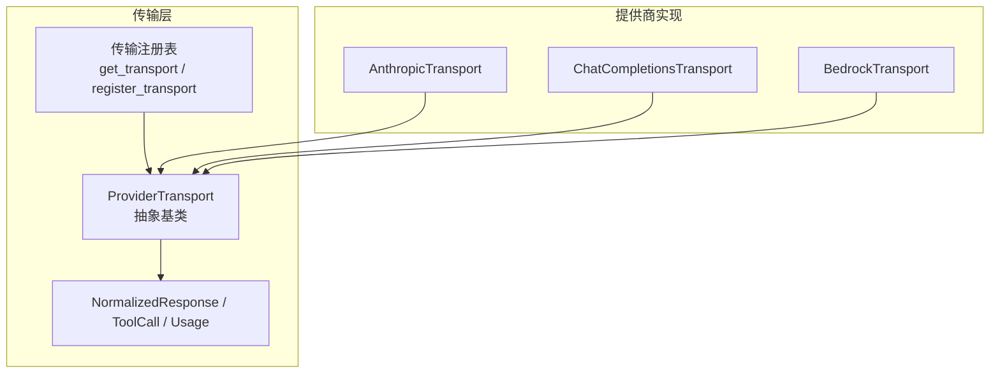
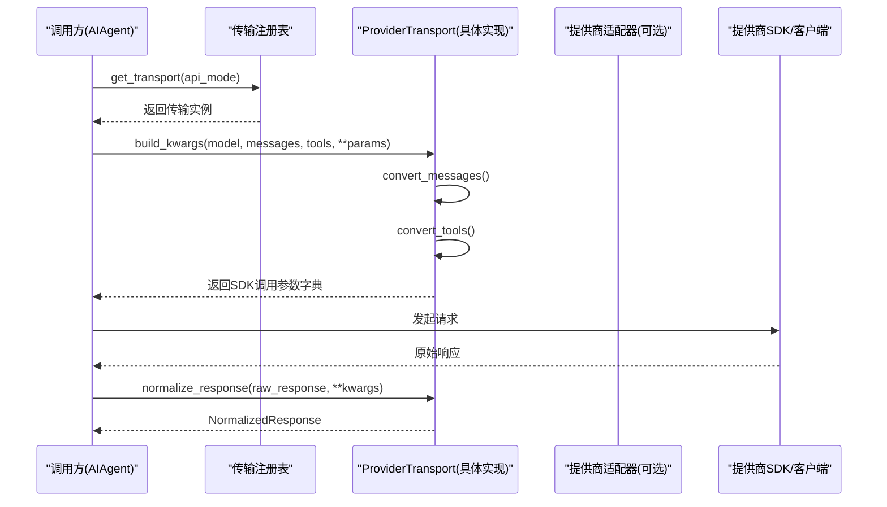
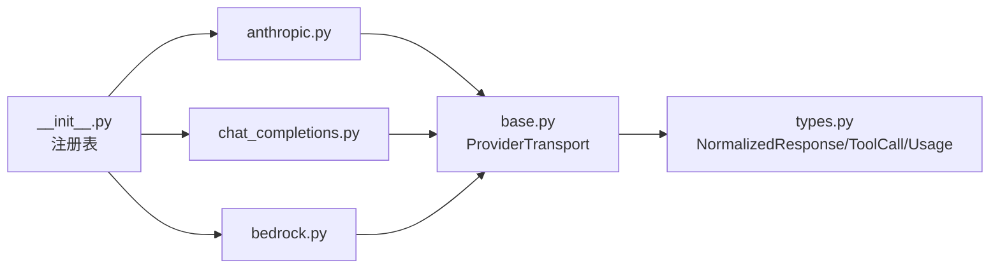

# 基础传输类实现

<cite>
**本文引用的文件**
- [agent/transports/base.py](file://agent/transports/base.py)
- [agent/transports/types.py](file://agent/transports/types.py)
- [agent/transports/__init__.py](file://agent/transports/__init__.py)
- [agent/transports/anthropic.py](file://agent/transports/anthropic.py)
- [agent/transports/chat_completions.py](file://agent/transports/chat_completions.py)
- [agent/transports/bedrock.py](file://agent/transports/bedrock.py)
</cite>

## 目录
1. [简介](#简介)
2. [项目结构](#项目结构)
3. [核心组件](#核心组件)
4. [架构总览](#架构总览)
5. [详细组件分析](#详细组件分析)
6. [依赖关系分析](#依赖关系分析)
7. [性能考量](#性能考量)
8. [故障排查指南](#故障排查指南)
9. [结论](#结论)
10. [附录：最佳实践与示例路径](#附录：最佳实践与示例路径)

## 简介
本指南围绕 ProviderTransport 抽象基类，系统阐述其 API 模式识别机制与四个核心方法的设计原理与实现规范：convert_messages、convert_tools、build_kwargs、normalize_response。同时说明可选方法 validate_response、extract_cache_stats、map_finish_reason 的职责与扩展点。文档面向希望为新的模型提供商或协议添加传输适配器的开发者，提供输入输出规范、参数校验规则、错误处理策略以及继承最佳实践，并给出具体代码片段的路径引用以便快速定位实现细节。

## 项目结构
ProviderTransport 位于 agent/transports/base.py，定义了统一的传输接口；类型定义集中在 types.py；各提供商的具体实现以独立模块形式存在（如 anthropic、chat_completions、bedrock），并在导入时通过注册表机制自动注册到全局传输管理器中。

图表来源
- [agent/transports/base.py:16-89](file://agent/transports/base.py#L16-L89)
- [agent/transports/types.py:18-175](file://agent/transports/types.py#L18-L175)
- [agent/transports/__init__.py:21-69](file://agent/transports/__init__.py#L21-L69)

章节来源
- [agent/transports/base.py:1-89](file://agent/transports/base.py#L1-L89)
- [agent/transports/types.py:1-175](file://agent/transports/types.py#L1-L175)
- [agent/transports/__init__.py:1-69](file://agent/transports/__init__.py#L1-L69)

## 核心组件
- ProviderTransport：定义 api_mode 属性与四个必须实现的转换/构建/标准化方法，以及三个可选的增强方法。
- NormalizedResponse / ToolCall / Usage：跨提供商的统一响应数据结构，屏蔽底层差异。
- 传输注册表：集中管理不同 api_mode 对应的传输类实例，支持按需发现与获取。

章节来源
- [agent/transports/base.py:16-89](file://agent/transports/base.py#L16-L89)
- [agent/transports/types.py:18-175](file://agent/transports/types.py#L18-L175)
- [agent/transports/__init__.py:21-69](file://agent/transports/__init__.py#L21-L69)

## 架构总览
ProviderTransport 将“数据路径”与“客户端生命周期”解耦：传输负责消息格式转换、工具定义映射、API 调用参数构建和响应标准化；而客户端构造、流式处理、凭据刷新、重试等由上层 AIAgent 负责。

图表来源
- [agent/transports/__init__.py:21-69](file://agent/transports/__init__.py#L21-L69)
- [agent/transports/base.py:25-65](file://agent/transports/base.py#L25-L65)
- [agent/transports/anthropic.py:24-78](file://agent/transports/anthropic.py#L24-L78)
- [agent/transports/bedrock.py:22-65](file://agent/transports/bedrock.py#L22-L65)

## 详细组件分析

### ProviderTransport 抽象基类设计
- api_mode：标识该传输处理的 API 模式字符串，用于注册表路由。
- convert_messages：将 OpenAI 格式的消息转换为提供商原生格式。
- convert_tools：将 OpenAI 工具定义转换为提供商原生工具定义。
- build_kwargs：组装完整的 SDK 调用参数字典，通常内部调用 convert_messages 与 convert_tools，并注入模型特定配置。
- normalize_response：将原始响应统一为 NormalizedResponse。
- 可选方法：
  - validate_response：对原始响应进行结构有效性检查。
  - extract_cache_stats：提取缓存命中/创建 token 统计。
  - map_finish_reason：将提供商停止原因映射为标准 finish_reason。

章节来源
- [agent/transports/base.py:16-89](file://agent/transports/base.py#L16-L89)

### 统一响应类型 NormalizedResponse
- content：文本内容（可为空）。
- tool_calls：工具调用列表（ToolCall）。
- finish_reason：标准化结束原因。
- reasoning：推理内容（可选）。
- usage：用量统计（Usage）。
- provider_data：协议相关元数据（字典），供协议感知逻辑使用。

章节来源
- [agent/transports/types.py:18-175](file://agent/transports/types.py#L18-L175)

### 传输注册表与发现机制
- register_transport：按 api_mode 注册传输类。
- get_transport：根据 api_mode 获取传输实例，支持延迟发现与容错导入。
- _discover_transports：在首次访问或未找到时尝试导入所有传输模块，触发各自模块内的自动注册。

章节来源
- [agent/transports/__init__.py:21-69](file://agent/transports/__init__.py#L21-L69)

### 具体实现示例

#### AnthropicTransport
- api_mode：'anthropic_messages'
- convert_messages：委托给适配器，将消息转为 (system, messages) 元组。
- convert_tools：将工具定义转为 Anthropic input_schema 格式。
- build_kwargs：组装 Anthropic messages.create 所需参数，包含 max_tokens、reasoning_config、tool_choice、base_url 等。
- normalize_response：解析 content blocks（text、thinking、tool_use），维护有序块以保留签名顺序，映射 stop_reason 到 finish_reason，填充 provider_data。
- validate_response：允许空 content 但具备终止性 stop_reason（end_turn/refusal）的情况。
- extract_cache_stats：从 usage 中提取缓存 token 计数。
- map_finish_reason：将 Anthropic 停止原因映射为标准值。

章节来源
- [agent/transports/anthropic.py:13-252](file://agent/transports/anthropic.py#L13-L252)

#### ChatCompletionsTransport
- api_mode：'chat_completions'
- convert_messages / convert_tools：接近恒等变换（OpenAI 兼容格式）。
- build_kwargs：处理模型特定的默认值、reasoning 配置、temperature、extra_body 组装，以及针对 Gemini/OpenAI 的特殊逻辑（如 thinkingConfig、prompt_cache_key）。
- normalize_response：将 OpenAI 兼容响应标准化为 NormalizedResponse，处理 tool_calls、usage、finish_reason。

章节来源
- [agent/transports/chat_completions.py:1-200](file://agent/transports/chat_completions.py#L1-L200)

#### BedrockTransport
- api_mode：'bedrock_converse'
- convert_messages / convert_tools：委托适配器转换为 Converse 格式。
- build_kwargs：组装 converse 参数，注入 region 与哨兵键以区分调用路径。
- normalize_response：兼容 boto3 原始 dict 与已标准化的 SimpleNamespace，提取 tool_calls、usage、finish_reason。
- validate_response：检查 output 或 choices 是否存在。
- map_finish_reason：将 Bedrock 停止原因映射为标准值。

章节来源
- [agent/transports/bedrock.py:15-155](file://agent/transports/bedrock.py#L15-L155)

### 方法输入输出规范与参数验证

- convert_messages
  - 输入：messages（OpenAI 格式消息列表），**kwargs（可含 base_url 等上下文）
  - 输出：提供商原生消息结构（例如 Anthropic 的 (system, messages)）
  - 验证：确保消息非空且角色字段合法；必要时剥离不兼容字段
  - 错误处理：对非法消息抛出明确异常或返回空结构并交由上层重试

- convert_tools
  - 输入：tools（OpenAI 工具定义列表）
  - 输出：提供商原生工具定义（如 Anthropic input_schema）
  - 验证：工具名称唯一、schema 有效、必填字段齐全
  - 错误处理：对无效 schema 返回空列表或抛出结构化错误

- build_kwargs
  - 输入：model、messages、tools（可选）、**params（max_tokens、temperature、reasoning_config、base_url、region 等）
  - 输出：可直接传入提供商 SDK 的参数字典
  - 验证：合并默认值与用户参数，避免覆盖关键键；对冲突参数做安全降级
  - 错误处理：记录不可用参数并忽略，保证最小可用请求

- normalize_response
  - 输入：raw_response（提供商原始响应）
  - 输出：NormalizedResponse
  - 验证：确保至少包含 content/tool_calls/finish_reason 之一；缺失则置 None 或默认值
  - 错误处理：对畸形响应返回最小可用对象，并记录诊断信息

- validate_response（可选）
  - 输入：raw_response
  - 输出：bool（True 表示结构有效）
  - 用途：在重试前快速判断是否应视为无效响应

- extract_cache_stats（可选）
  - 输入：raw_response
  - 输出：{'cached_tokens': int, 'creation_tokens': int} 或 None
  - 用途：上报缓存命中/创建 token 数

- map_finish_reason（可选）
  - 输入：raw_reason（提供商停止原因）
  - 输出：标准 finish_reason（stop、length、tool_calls、content_filter）
  - 用途：统一下游消费逻辑

章节来源
- [agent/transports/base.py:25-89](file://agent/transports/base.py#L25-L89)
- [agent/transports/types.py:18-175](file://agent/transports/types.py#L18-L175)
- [agent/transports/anthropic.py:24-245](file://agent/transports/anthropic.py#L24-L245)
- [agent/transports/bedrock.py:22-148](file://agent/transports/bedrock.py#L22-L148)

### 错误处理策略
- 结构化校验优先：validate_response 尽早拒绝明显无效的响应，避免无意义重试。
- 最小可用原则：normalize_response 在部分字段缺失时返回最小可用对象，保证上层流程继续。
- 可观测性：在转换与标准化过程中记录诊断信息（如跳过字段、默认值应用），便于问题定位。
- 幂等性：convert_* 与 build_kwargs 应避免副作用，保证可重试。

章节来源
- [agent/transports/anthropic.py:194-245](file://agent/transports/anthropic.py#L194-L245)
- [agent/transports/bedrock.py:118-148](file://agent/transports/bedrock.py#L118-L148)

## 依赖关系分析
- 传输基类依赖统一类型定义（NormalizedResponse、ToolCall、Usage）。
- 各传输模块依赖各自的适配器函数进行格式转换（如 anthropic_adapter、bedrock_adapter）。
- 传输模块在导入时通过 register_transport 向注册表登记自身。
- 注册表在首次访问时执行延迟导入，降低启动开销与耦合度。

图表来源
- [agent/transports/base.py:16-89](file://agent/transports/base.py#L16-L89)
- [agent/transports/types.py:18-175](file://agent/transports/types.py#L18-L175)
- [agent/transports/__init__.py:21-69](file://agent/transports/__init__.py#L21-L69)
- [agent/transports/anthropic.py:248-252](file://agent/transports/anthropic.py#L248-L252)
- [agent/transports/bedrock.py:151-155](file://agent/transports/bedrock.py#L151-L155)

章节来源
- [agent/transports/__init__.py:21-69](file://agent/transports/__init__.py#L21-L69)
- [agent/transports/anthropic.py:248-252](file://agent/transports/anthropic.py#L248-L252)
- [agent/transports/bedrock.py:151-155](file://agent/transports/bedrock.py#L151-L155)

## 性能考量
- 延迟导入：注册表在首次使用时才导入各传输模块，减少冷启动成本。
- 就近转换：convert_* 尽量复用已有适配器函数，避免重复实现。
- 最小化拷贝：normalize_response 仅聚合必要字段，避免深拷贝大对象。
- 条件分支优化：针对高频模型族（如 Gemini）的特判逻辑前置，减少不必要计算。

[本节为通用指导，无需具体文件引用]

## 故障排查指南
- 响应为空但非终止：检查 validate_response 是否正确放行 end_turn/refusal 等终止场景。
- 工具调用丢失：确认 convert_tools 与 normalize_response 中的 tool_calls 构建逻辑是否完整。
- 停止原因不一致：核对 map_finish_reason 映射表是否覆盖提供商全部原因。
- 缓存统计缺失：确认 extract_cache_stats 是否正确读取 usage 字段。
- 传输未生效：检查 __init__.py 的 _discover_transports 是否成功导入对应模块。

章节来源
- [agent/transports/anthropic.py:194-245](file://agent/transports/anthropic.py#L194-L245)
- [agent/transports/bedrock.py:118-148](file://agent/transports/bedrock.py#L118-L148)
- [agent/transports/__init__.py:49-69](file://agent/transports/__init__.py#L49-L69)

## 结论
ProviderTransport 通过清晰的职责划分与统一的数据契约，使多提供商接入变得一致且可扩展。遵循本文的方法规范、错误处理策略与最佳实践，可以快速为新提供商实现高质量传输适配器，并确保与现有 Agent 循环无缝集成。

[本节为总结性内容，无需具体文件引用]

## 附录：最佳实践与示例路径

- 继承基类的步骤
  - 定义 api_mode 属性，确保唯一且具描述性。
  - 实现 convert_messages：将 OpenAI 消息转换为提供商格式，注意角色与内容结构的兼容性。
  - 实现 convert_tools：生成提供商工具定义，确保 schema 合法。
  - 实现 build_kwargs：合并默认值与用户参数，注入模型特定配置，避免覆盖关键键。
  - 实现 normalize_response：产出 NormalizedResponse，妥善处理 content/tool_calls/finish_reason/reasoning/usage/provider_data。
  - 可选：实现 validate_response、extract_cache_stats、map_finish_reason 以增强健壮性与可观测性。

- 参考实现路径
  - Anthropic 完整实现：[agent/transports/anthropic.py:13-252](file://agent/transports/anthropic.py#L13-L252)
  - Chat Completions 实现要点：[agent/transports/chat_completions.py:1-200](file://agent/transports/chat_completions.py#L1-L200)
  - Bedrock 完整实现：[agent/transports/bedrock.py:15-155](file://agent/transports/bedrock.py#L15-L155)
  - 统一类型定义：[agent/transports/types.py:18-175](file://agent/transports/types.py#L18-L175)
  - 传输注册与发现：[agent/transports/__init__.py:21-69](file://agent/transports/__init__.py#L21-L69)

- 常见陷阱
  - 在 convert_* 中引入副作用：应保持纯函数风格，便于重试与测试。
  - 忽略空响应与终止原因：validate_response 需正确放行终止场景。
  - 过度依赖 provider_data：仅在协议感知路径中使用，保持共享类型简洁。
  - 忘记注册传输：确保模块末尾调用 register_transport。

[本节为实践指导，无需具体文件引用]