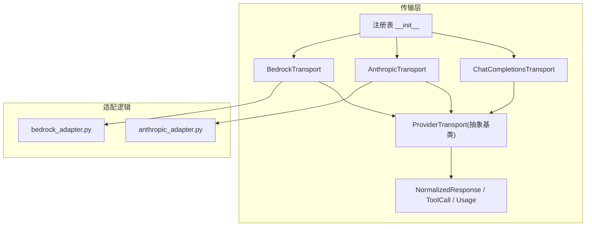
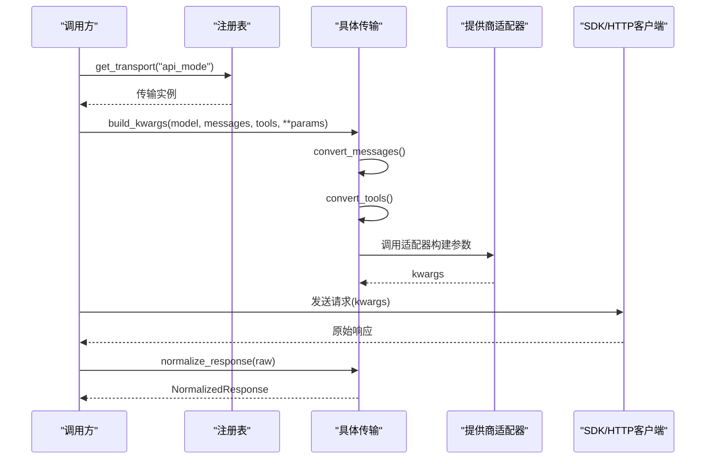
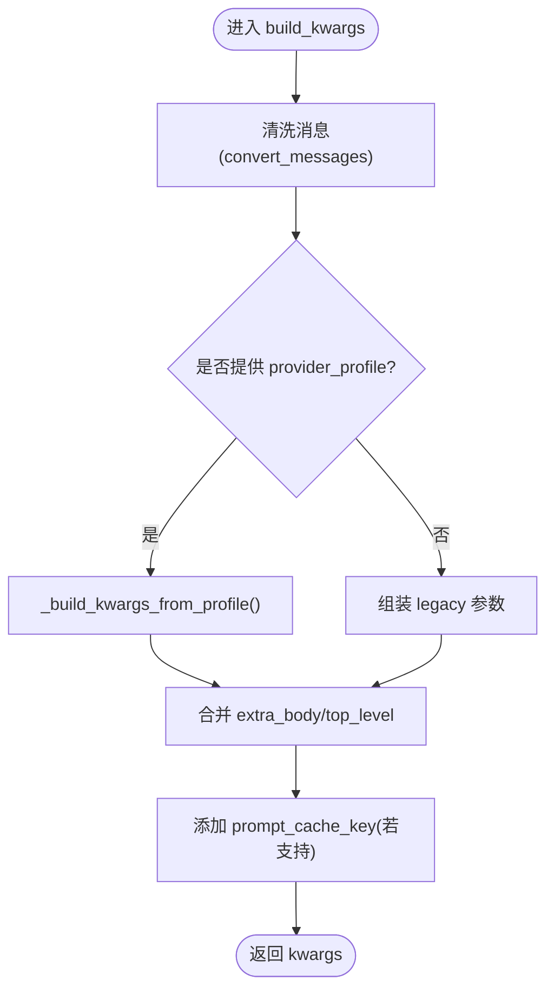
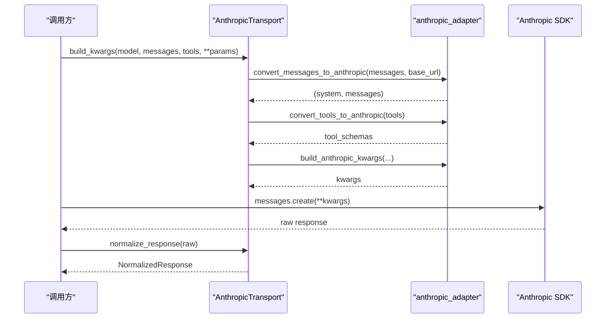
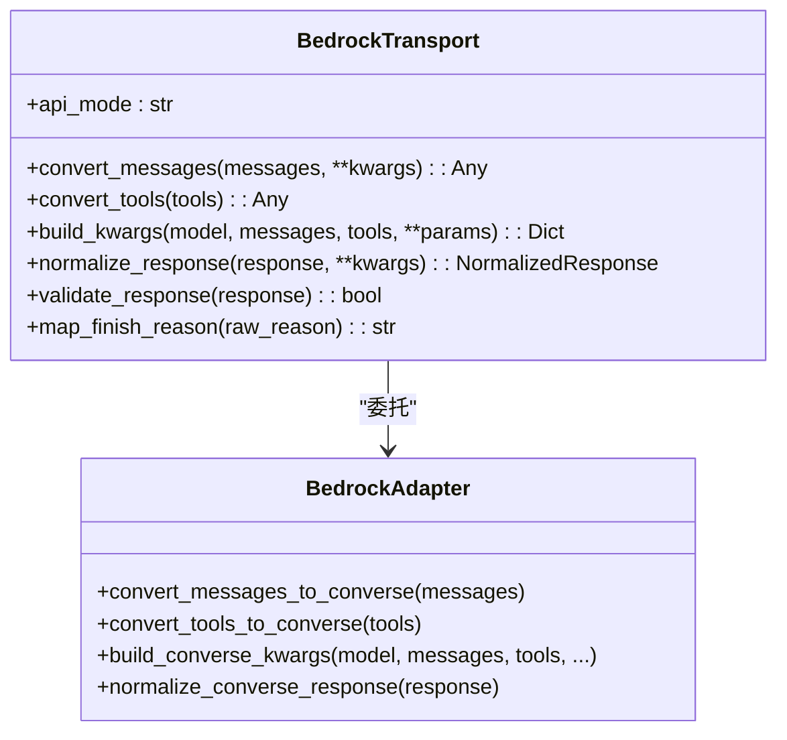
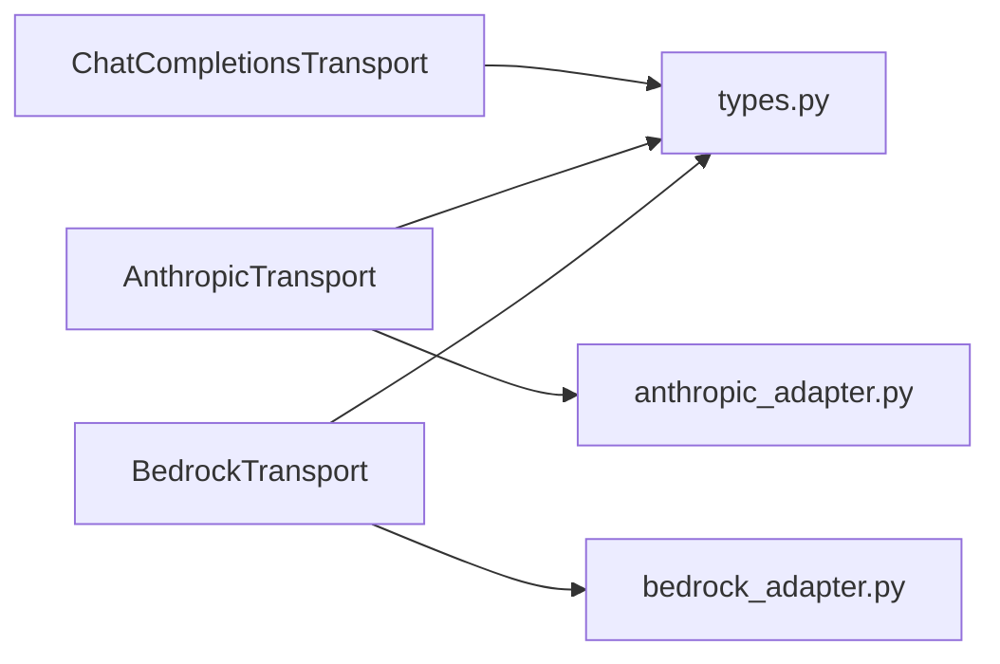

# 适配器开发指南

<cite>
**本文引用的文件**
- [agent/transports/base.py](file://agent/transports/base.py)
- [agent/transports/types.py](file://agent/transports/types.py)
- [agent/transports/__init__.py](file://agent/transports/__init__.py)
- [agent/transports/chat_completions.py](file://agent/transports/chat_completions.py)
- [agent/transports/anthropic.py](file://agent/transports/anthropic.py)
- [agent/transports/bedrock.py](file://agent/transports/bedrock.py)
- [agent/anthropic_adapter.py](file://agent/anthropic_adapter.py)
- [agent/bedrock_adapter.py](file://agent/bedrock_adapter.py)
</cite>

## 目录
1. [简介](#简介)
2. [项目结构](#项目结构)
3. [核心组件](#核心组件)
4. [架构总览](#架构总览)
5. [详细组件分析](#详细组件分析)
6. [依赖关系分析](#依赖关系分析)
7. [性能考虑](#性能考虑)
8. [故障排查指南](#故障排查指南)
9. [结论](#结论)
10. [附录](#附录)

## 简介
本指南面向需要为不同大模型提供商实现“模型适配器”的开发者。文档围绕 ProviderTransport 抽象基类展开，系统阐述其设计模式与实现要求，并深入解释四个核心方法：convert_messages、convert_tools、build_kwargs、normalize_response 的实现规范。同时提供完整的代码示例路径，展示如何继承基础传输类并实现自定义适配器；总结消息格式转换最佳实践、工具定义映射策略与响应标准化处理；解释 API 模式识别机制与不同提供商的特定差异；说明流式响应、错误处理与性能优化要点；并以 OpenAI 兼容接口、Anthropic API 和 AWS Bedrock 的具体实现案例进行对照说明。

## 项目结构
本项目在 agent/transports 目录下实现了统一的“传输层”抽象，将不同提供商（OpenAI 兼容、Anthropic、Bedrock、Codex）的差异封装到各自的 Transport 中，并通过注册表按需发现与加载。

图表来源
- [agent/transports/base.py:16-90](file://agent/transports/base.py#L16-L90)
- [agent/transports/types.py:18-175](file://agent/transports/types.py#L18-L175)
- [agent/transports/__init__.py:21-69](file://agent/transports/__init__.py#L21-L69)
- [agent/transports/chat_completions.py:207-896](file://agent/transports/chat_completions.py#L207-L896)
- [agent/transports/anthropic.py:13-252](file://agent/transports/anthropic.py#L13-L252)
- [agent/transports/bedrock.py:15-155](file://agent/transports/bedrock.py#L15-L155)

章节来源
- [agent/transports/base.py:1-90](file://agent/transports/base.py#L1-L90)
- [agent/transports/__init__.py:1-69](file://agent/transports/__init__.py#L1-L69)

## 核心组件
- ProviderTransport 抽象基类：定义每个传输必须实现的接口，包括 api_mode、convert_messages、convert_tools、build_kwargs、normalize_response，以及可选的 validate_response、extract_cache_stats、map_finish_reason。
- NormalizedResponse/ToolCall/Usage：统一响应类型，屏蔽各提供商差异，使上层调用无需关心具体协议。
- 传输注册表：集中管理各传输类的注册与获取，支持懒加载与自动发现。

章节来源
- [agent/transports/base.py:16-90](file://agent/transports/base.py#L16-L90)
- [agent/transports/types.py:18-175](file://agent/transports/types.py#L18-L175)
- [agent/transports/__init__.py:21-69](file://agent/transports/__init__.py#L21-L69)

## 架构总览
传输层采用“策略+工厂”的组合：
- 策略：每个 ProviderTransport 子类负责一种 API 模式的格式转换与响应标准化。
- 工厂：通过 get_transport(api_mode) 动态获取对应传输实例，避免硬编码分支。

图表来源
- [agent/transports/__init__.py:21-69](file://agent/transports/__init__.py#L21-L69)
- [agent/transports/chat_completions.py:356-597](file://agent/transports/chat_completions.py#L356-L597)
- [agent/transports/anthropic.py:41-78](file://agent/transports/anthropic.py#L41-L78)
- [agent/transports/bedrock.py:32-65](file://agent/transports/bedrock.py#L32-L65)

## 详细组件分析

### ProviderTransport 抽象基类
- 职责边界：仅负责数据路径上的格式转换与标准化；不负责客户端生命周期、流式处理、凭证刷新、重试等。
- 关键方法：
  - api_mode：标识该传输支持的 API 模式字符串。
  - convert_messages：将内部消息格式转换为提供商原生格式。
  - convert_tools：将工具定义从 OpenAI 格式转换为提供商格式。
  - build_kwargs：组装最终调用参数，通常内部调用 convert_messages 与 convert_tools。
  - normalize_response：将原始响应标准化为 NormalizedResponse。
  - 可选方法：validate_response、extract_cache_stats、map_finish_reason。

章节来源
- [agent/transports/base.py:16-90](file://agent/transports/base.py#L16-L90)

### 类型定义：NormalizedResponse、ToolCall、Usage
- ToolCall：统一工具调用表示，包含 id、name、arguments 及 provider_data（用于携带协议相关元数据）。
- Usage：统一 token 用量统计。
- NormalizedResponse：统一响应体，包含 content、tool_calls、finish_reason、reasoning、usage、provider_data。

章节来源
- [agent/transports/types.py:18-175](file://agent/transports/types.py#L18-L175)

### ChatCompletionsTransport（OpenAI 兼容）
- 适用场景：OpenAI 兼容接口（如 OpenRouter、Nous、NVIDIA、Qwen、Ollama、DeepSeek、xAI、Kimi 等）。
- 特点：
  - convert_messages：对消息做严格清洗，移除内部字段与不兼容字段（例如 codex 相关字段、extra_content 在非 Gemini 目标时剥离、Hermes 内部标记等），确保严格提供商不会拒绝请求。
  - convert_tools：基本恒等映射（OpenAI 格式即目标格式）。
  - build_kwargs：复杂参数组装，支持多种提供商特性（reasoning_config、thinking_config、temperature、max_tokens、extra_body、prompt_cache_key 等），并提供 profile 路径与遗留路径两种模式。
  - normalize_response：近恒等映射，保留 provider_data（如 extra_content 用于 Gemini 思考签名回放）。

图表来源
- [agent/transports/chat_completions.py:356-597](file://agent/transports/chat_completions.py#L356-L597)
- [agent/transports/chat_completions.py:599-747](file://agent/transports/chat_completions.py#L599-L747)

章节来源
- [agent/transports/chat_completions.py:207-896](file://agent/transports/chat_completions.py#L207-L896)

### AnthropicTransport（Anthropic Messages API）
- 适用场景：api_mode="anthropic_messages"。
- 特点：
  - convert_messages：委托给 anthropic_adapter.convert_messages_to_anthropic，返回 (system, messages) 元组。
  - convert_tools：委托给 anthropic_adapter.convert_tools_to_anthropic，生成 input_schema 格式。
  - build_kwargs：委托给 anthropic_adapter.build_anthropic_kwargs，填充 max_tokens、reasoning_config、tool_choice、base_url、fast_mode 等。
  - normalize_response：解析 content blocks（text、thinking、tool_use），维护有序块以应对签名问题，映射 stop_reason 到 finish_reason，收集 reasoning_details 与 ordered_blocks。

图表来源
- [agent/transports/anthropic.py:24-78](file://agent/transports/anthropic.py#L24-L78)
- [agent/transports/anthropic.py:80-192](file://agent/transports/anthropic.py#L80-L192)
- [agent/anthropic_adapter.py:1-200](file://agent/anthropic_adapter.py#L1-L200)

章节来源
- [agent/transports/anthropic.py:13-252](file://agent/transports/anthropic.py#L13-L252)
- [agent/anthropic_adapter.py:1-200](file://agent/anthropic_adapter.py#L1-L200)

### BedrockTransport（AWS Bedrock Converse API）
- 适用场景：api_mode="bedrock_converse"。
- 特点：
  - convert_messages：委托给 bedrock_adapter.convert_messages_to_converse。
  - convert_tools：委托给 bedrock_adapter.convert_tools_to_converse。
  - build_kwargs：委托给 bedrock_adapter.build_converse_kwargs，并注入 sentinel keys（__bedrock_converse__、__bedrock_region__）供调度侧识别。
  - normalize_response：兼容 boto3 原始 dict 或已标准化的 SimpleNamespace，提取 tool_calls、usage、reasoning 等，构造 NormalizedResponse。

图表来源
- [agent/transports/bedrock.py:15-155](file://agent/transports/bedrock.py#L15-L155)
- [agent/bedrock_adapter.py:1-200](file://agent/bedrock_adapter.py#L1-L200)

章节来源
- [agent/transports/bedrock.py:15-155](file://agent/transports/bedrock.py#L15-L155)
- [agent/bedrock_adapter.py:1-200](file://agent/bedrock_adapter.py#L1-L200)

### 传输注册与发现
- 注册表位于 agent/transports/__init__.py，提供 register_transport 与 get_transport。
- 各传输模块在导入时自动调用 register_transport 完成自注册（anthropic、bedrock、chat_completions、codex）。
- get_transport 支持懒发现：首次访问时导入所有传输模块，后续直接查表。

章节来源
- [agent/transports/__init__.py:21-69](file://agent/transports/__init__.py#L21-L69)
- [agent/transports/anthropic.py:249-252](file://agent/transports/anthropic.py#L249-L252)
- [agent/transports/bedrock.py:152-155](file://agent/transports/bedrock.py#L152-L155)
- [agent/transports/chat_completions.py:893-896](file://agent/transports/chat_completions.py#L893-L896)

## 依赖关系分析
- 耦合度：
  - 传输层与适配器解耦：传输只负责格式转换与标准化，具体协议细节下沉到 adapter 模块。
  - 类型解耦：NormalizedResponse/ToolCall/Usage 作为共享契约，降低下游分支复杂度。
- 外部依赖：
  - Anthropic：anthropic_sdk（延迟导入）。
  - Bedrock：boto3/botocore（延迟导入与版本检查）。
  - OpenAI 兼容：第三方 SDK 或 HTTP 客户端由上层决定。

图表来源
- [agent/transports/chat_completions.py:207-896](file://agent/transports/chat_completions.py#L207-L896)
- [agent/transports/anthropic.py:13-252](file://agent/transports/anthropic.py#L13-L252)
- [agent/transports/bedrock.py:15-155](file://agent/transports/bedrock.py#L15-L155)
- [agent/transports/types.py:18-175](file://agent/transports/types.py#L18-L175)

章节来源
- [agent/transports/types.py:18-175](file://agent/transports/types.py#L18-L175)
- [agent/transports/anthropic.py:13-252](file://agent/transports/anthropic.py#L13-L252)
- [agent/transports/bedrock.py:15-155](file://agent/transports/bedrock.py#L15-L155)
- [agent/transports/chat_completions.py:207-896](file://agent/transports/chat_completions.py#L207-L896)

## 性能考虑
- 延迟导入：
  - Anthropic SDK 与 boto3 均采用延迟导入，减少冷启动开销。
- 连接池与缓存：
  - Bedrock 使用 per-region 客户端缓存，并在检测到陈旧连接时主动失效，避免重复失败。
- 消息清洗与最小化：
  - ChatCompletionsTransport 在 convert_messages 中进行严格清洗，避免严格提供商因未知字段导致 400/422 错误，减少无效重试。
- 提示缓存键：
  - 对支持 prompt_cache_key 的端点注入内容地址化的 key，提升缓存命中率。
- 推理配置优化：
  - 针对不同提供商（Gemini、LM Studio、Kimi、TokenHub）精确映射 reasoning/thinking 配置，避免多余字段导致校验失败。

章节来源
- [agent/anthropic_adapter.py:40-67](file://agent/anthropic_adapter.py#L40-L67)
- [agent/bedrock_adapter.py:91-133](file://agent/bedrock_adapter.py#L91-L133)
- [agent/transports/chat_completions.py:217-350](file://agent/transports/chat_completions.py#L217-L350)
- [agent/transports/chat_completions.py:44-77](file://agent/transports/chat_completions.py#L44-L77)
- [agent/transports/chat_completions.py:79-161](file://agent/transports/chat_completions.py#L79-L161)

## 故障排查指南
- 响应有效性校验：
  - Anthropic：validate_response 允许空 content 列表但需具备终止原因（end_turn/refusal），避免误判为无效而触发重试循环。
  - Bedrock：validate_response 兼容原始 dict 与已标准化对象，检查 output/choices 存在性。
- 停止原因映射：
  - 各传输提供 map_finish_reason，将提供商特定的 stop_reason 映射为标准 finish_reason，便于上层统一处理。
- 缓存统计提取：
  - extract_cache_stats 可提取提供商特定的缓存命中/创建 token 数，用于计费与观测。
- 常见错误定位：
  - 严格提供商拒绝未知字段：检查 convert_messages 是否清理了内部字段与额外内容。
  - 思考签名回放失败：确认 Gemini 目标的 extra_content 被正确保留与回放。
  - 连接陈旧异常：Bedrock 会检测并失效客户端，必要时重置缓存。

章节来源
- [agent/transports/anthropic.py:194-245](file://agent/transports/anthropic.py#L194-L245)
- [agent/transports/bedrock.py:118-148](file://agent/transports/bedrock.py#L118-L148)
- [agent/transports/base.py:67-90](file://agent/transports/base.py#L67-L90)

## 结论
ProviderTransport 抽象基类为多提供商适配提供了清晰、可扩展的框架。通过 convert_messages、convert_tools、build_kwargs、normalize_response 四个核心方法，将协议差异隔离在传输层内，配合 NormalizedResponse 统一响应类型，使得上层调用简洁稳定。结合注册表机制与适配器解耦，项目能够灵活扩展新的提供商，同时保持性能与可靠性。实际落地中，应重点关注消息清洗、工具映射、推理配置、响应标准化与错误处理，以确保跨提供商的一致性与健壮性。

## 附录

### 实现规范与最佳实践

- convert_messages
  - 目标：将内部消息格式转换为提供商原生格式。
  - 最佳实践：
    - 严格清理内部字段与不兼容字段（参考 ChatCompletionsTransport 的消息清洗逻辑）。
    - 针对提供商特性进行角色/字段转换（如 Anthropic 的 system/messages 分离）。
    - 保留必要上下文（如 Gemini 的 extra_content）仅在目标模型需要时保留。
  - 参考路径
    - [agent/transports/chat_completions.py:217-350](file://agent/transports/chat_completions.py#L217-L350)
    - [agent/transports/anthropic.py:24-33](file://agent/transports/anthropic.py#L24-L33)

- convert_tools
  - 目标：将工具定义从 OpenAI 格式转换为提供商格式。
  - 最佳实践：
    - 对 JSON Schema 进行提供商特化调整（如 Moonshot/Kimi 的工具参数规范化）。
    - 保持工具名称与参数的稳定性，避免破坏上游工具注册。
  - 参考路径
    - [agent/transports/chat_completions.py:352-354](file://agent/transports/chat_completions.py#L352-L354)
    - [agent/transports/anthropic.py:35-39](file://agent/transports/anthropic.py#L35-L39)
    - [agent/transports/bedrock.py:27-30](file://agent/transports/bedrock.py#L27-L30)

- build_kwargs
  - 目标：组装最终调用参数，通常内部调用 convert_messages 与 convert_tools。
  - 最佳实践：
    - 明确优先级：用户配置 > 临时覆盖 > 提供商默认。
    - 合理设置推理配置（reasoning/thinking），避免多余字段导致校验失败。
    - 对支持 prompt_cache_key 的端点注入缓存键。
  - 参考路径
    - [agent/transports/chat_completions.py:356-597](file://agent/transports/chat_completions.py#L356-L597)
    - [agent/transports/chat_completions.py:599-747](file://agent/transports/chat_completions.py#L599-L747)
    - [agent/transports/anthropic.py:41-78](file://agent/transports/anthropic.py#L41-L78)
    - [agent/transports/bedrock.py:32-65](file://agent/transports/bedrock.py#L32-L65)

- normalize_response
  - 目标：将原始响应标准化为 NormalizedResponse。
  - 最佳实践：
    - 统一 finish_reason 映射。
    - 提取 tool_calls、usage、reasoning 等关键信息。
    - 保留 provider_data 以便协议感知路径读取。
  - 参考路径
    - [agent/transports/chat_completions.py:749-800](file://agent/transports/chat_completions.py#L749-L800)
    - [agent/transports/anthropic.py:80-192](file://agent/transports/anthropic.py#L80-L192)
    - [agent/transports/bedrock.py:67-116](file://agent/transports/bedrock.py#L67-L116)

### 自定义适配器示例（步骤）
- 步骤概览：
  1. 新建传输类，继承 ProviderTransport。
  2. 实现 api_mode 属性。
  3. 实现 convert_messages、convert_tools、build_kwargs、normalize_response。
  4. 在模块末尾调用 register_transport 完成自注册。
  5. 在 __init__.py 的 _discover_transports 中添加导入（如需自动发现）。
- 参考路径
  - [agent/transports/base.py:16-90](file://agent/transports/base.py#L16-L90)
  - [agent/transports/__init__.py:21-69](file://agent/transports/__init__.py#L21-L69)
  - [agent/transports/anthropic.py:249-252](file://agent/transports/anthropic.py#L249-L252)
  - [agent/transports/bedrock.py:152-155](file://agent/transports/bedrock.py#L152-L155)
  - [agent/transports/chat_completions.py:893-896](file://agent/transports/chat_completions.py#L893-L896)

### API 模式识别与差异
- 模式识别：
  - 通过 api_mode 字符串区分不同提供商（如 "chat_completions"、"anthropic_messages"、"bedrock_converse"）。
  - 使用 get_transport(api_mode) 获取对应传输实例。
- 差异点：
  - OpenAI 兼容：消息与工具基本不变，重点在参数组装与清洗。
  - Anthropic：消息拆分为 system/messages，工具使用 input_schema，响应包含 content blocks。
  - Bedrock：使用 Converse API，响应结构与 OpenAI 兼容，但需处理 boto3 原始对象。

章节来源
- [agent/transports/__init__.py:21-69](file://agent/transports/__init__.py#L21-L69)
- [agent/transports/chat_completions.py:207-216](file://agent/transports/chat_completions.py#L207-L216)
- [agent/transports/anthropic.py:20-23](file://agent/transports/anthropic.py#L20-L23)
- [agent/transports/bedrock.py:18-21](file://agent/transports/bedrock.py#L18-L21)

### 流式响应、错误处理与性能优化
- 流式响应：
  - 传输层不持有流式处理逻辑，由上层 AIAgent 负责；传输仅关注单次响应的标准化。
- 错误处理：
  - 使用 validate_response 判断响应结构有效性，避免误重试。
  - 使用 map_finish_reason 统一终止原因，便于上层策略处理。
- 性能优化：
  - 延迟导入 SDK，减少冷启动。
  - 连接池管理与陈旧连接失效。
  - 消息清洗与最小化，减少无效请求。
  - 提示缓存键注入，提升缓存命中率。

章节来源
- [agent/transports/base.py:67-90](file://agent/transports/base.py#L67-L90)
- [agent/anthropic_adapter.py:40-67](file://agent/anthropic_adapter.py#L40-L67)
- [agent/bedrock_adapter.py:91-133](file://agent/bedrock_adapter.py#L91-L133)
- [agent/transports/chat_completions.py:44-77](file://agent/transports/chat_completions.py#L44-L77)