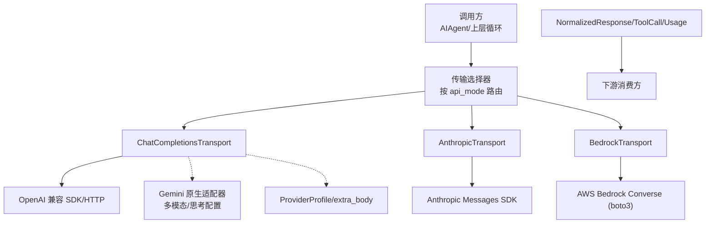
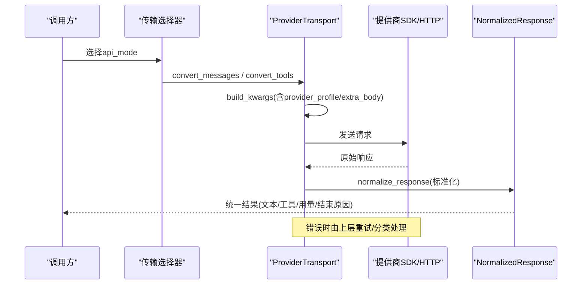
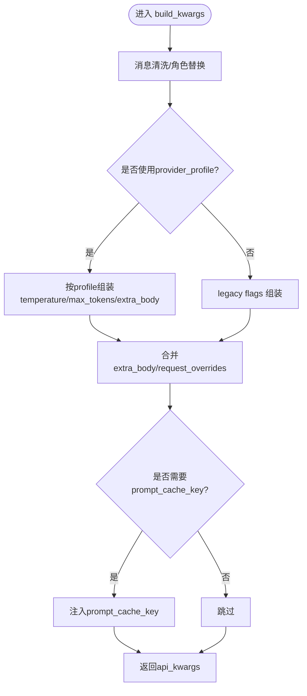
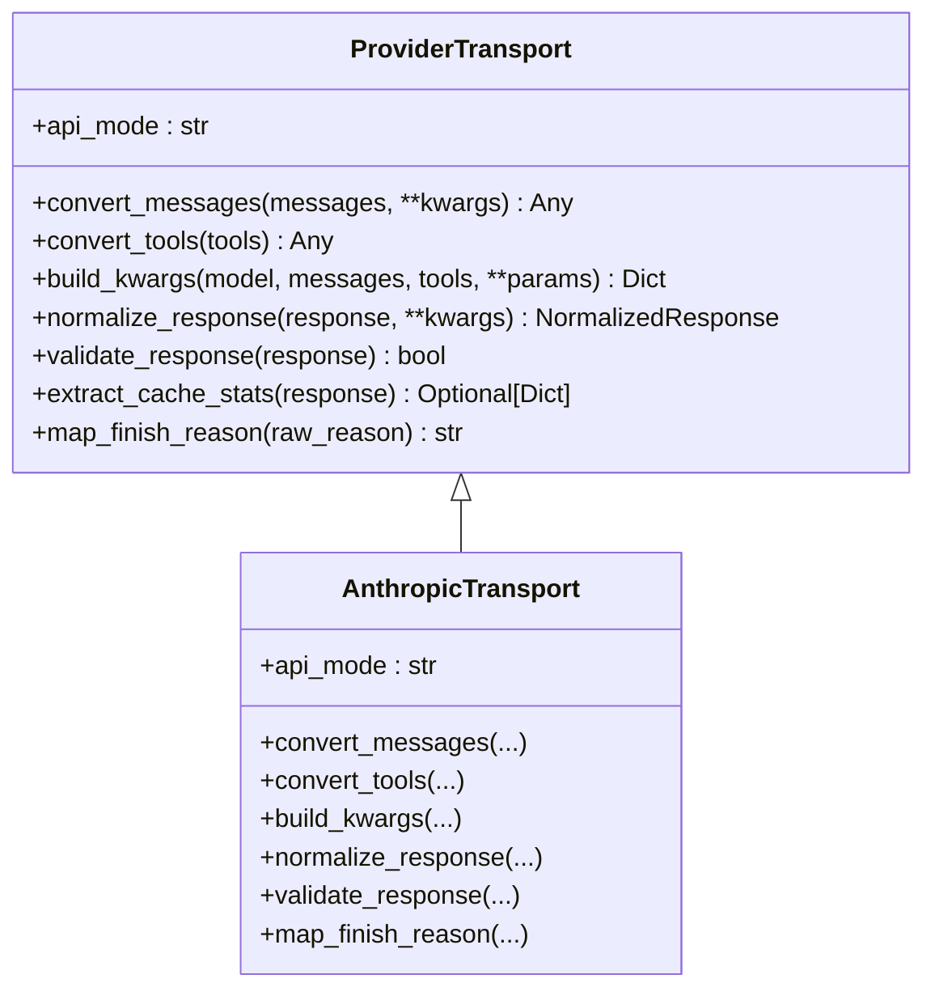
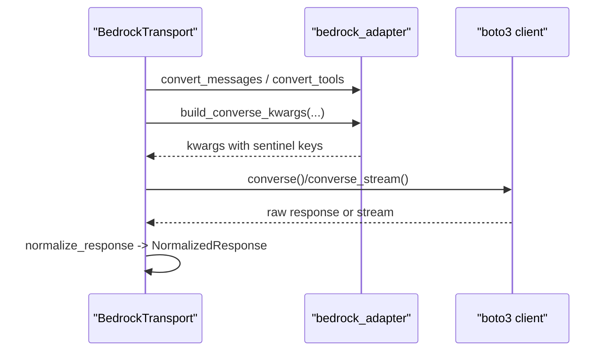
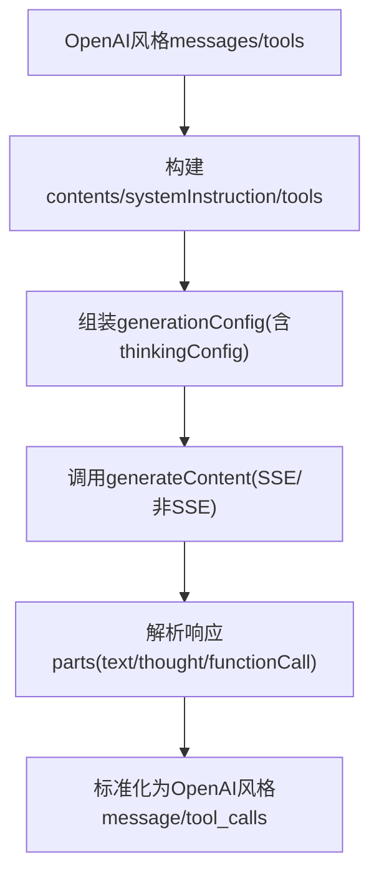
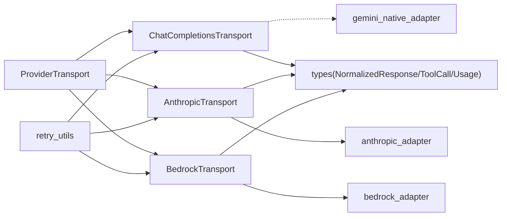

# 集成模式与最佳实践

<cite>
**本文引用的文件**
- [agent/transports/base.py](file://agent/transports/base.py)
- [agent/transports/chat_completions.py](file://agent/transports/chat_completions.py)
- [agent/transports/anthropic.py](file://agent/transports/anthropic.py)
- [agent/transports/bedrock.py](file://agent/transports/bedrock.py)
- [agent/transports/types.py](file://agent/transports/types.py)
- [agent/gemini_native_adapter.py](file://agent/gemini_native_adapter.py)
- [agent/anthropic_adapter.py](file://agent/anthropic_adapter.py)
- [agent/bedrock_adapter.py](file://agent/bedrock_adapter.py)
- [agent/retry_utils.py](file://agent/retry_utils.py)
- [tests/agent/transports/test_transport.py](file://tests/agent/transports/test_transport.py)
- [tests/agent/transports/test_types.py](file://tests/agent/transports/test_types.py)
</cite>

## 目录
1. [简介](#简介)
2. [项目结构](#项目结构)
3. [核心组件](#核心组件)
4. [架构总览](#架构总览)
5. [详细组件分析](#详细组件分析)
6. [依赖关系分析](#依赖关系分析)
7. [性能考虑](#性能考虑)
8. [故障排查指南](#故障排查指南)
9. [结论](#结论)
10. [附录](#附录)

## 简介
本文件面向模型集成的设计模式与最佳实践，聚焦于统一的请求处理管道、响应转换流程与错误处理机制。文档说明如何实现 OpenAI 兼容接口（聊天完成 API、流式响应、工具调用），并给出不同提供商的适配模式：Anthropic 消息格式、Bedrock 区域配置与 Gemini 多模态处理。同时提供性能优化策略（请求缓存、连接池管理、批量处理）与安全考量（输入验证、输出过滤、敏感信息保护），以及自定义适配器的测试与调试方法（单元与集成测试）。

## 项目结构
代码库采用“传输层抽象 + 提供商适配器”的分层设计：
- 传输层抽象：定义统一的 ProviderTransport 接口，负责消息/工具格式转换、构建请求参数、标准化响应。
- 提供商实现：针对 chat_completions、anthropic_messages、bedrock_converse 等 api_mode 的具体实现。
- 类型系统：NormalizedResponse、ToolCall、Usage 等统一数据结构，屏蔽提供商差异。
- 原生适配器：如 Gemini 原生 API 适配器，将 OpenAI 风格请求转换为 Gemini 原生 schema，并处理多模态内容。
- 重试与错误：通用退避与速率限制处理，结合提供商特定错误分类。
- 测试：对传输层 ABC、注册表、类型构造与行为进行覆盖。

图表来源
- [agent/transports/base.py:16-90](file://agent/transports/base.py#L16-L90)
- [agent/transports/chat_completions.py:207-597](file://agent/transports/chat_completions.py#L207-L597)
- [agent/transports/anthropic.py:13-245](file://agent/transports/anthropic.py#L13-L245)
- [agent/transports/bedrock.py:15-155](file://agent/transports/bedrock.py#L15-L155)
- [agent/gemini_native_adapter.py:518-569](file://agent/gemini_native_adapter.py#L518-L569)
- [agent/transports/types.py:18-175](file://agent/transports/types.py#L18-L175)

章节来源
- [agent/transports/base.py:1-90](file://agent/transports/base.py#L1-L90)
- [agent/transports/chat_completions.py:1-800](file://agent/transports/chat_completions.py#L1-L800)
- [agent/transports/anthropic.py:1-252](file://agent/transports/anthropic.py#L1-L252)
- [agent/transports/bedrock.py:1-155](file://agent/transports/bedrock.py#L1-L155)
- [agent/transports/types.py:1-175](file://agent/transports/types.py#L1-L175)
- [agent/gemini_native_adapter.py:1-800](file://agent/gemini_native_adapter.py#L1-L800)

## 核心组件
- ProviderTransport 抽象：统一四个关键阶段
  - convert_messages：将 OpenAI 风格消息转为提供商格式
  - convert_tools：将工具定义转为提供商 schema
  - build_kwargs：组装最终请求参数（含 provider 特有字段）
  - normalize_response：将原始响应标准化为 NormalizedResponse
- 标准化类型：
  - ToolCall：统一工具调用标识、名称、参数及 provider_data
  - Usage：统一 token 用量统计
  - NormalizedResponse：统一文本、工具调用、结束原因、推理内容与用量
- 具体传输：
  - ChatCompletionsTransport：默认 OpenAI 兼容路径，处理 reasoning_config、thinking_config、extra_body、prompt_cache_key 等
  - AnthropicTransport：封装 anthropic_adapter 的消息/工具转换与响应归一化
  - BedrockTransport：封装 bedrock_adapter 的 Converse 调用与响应归一化
- Gemini 原生适配器：将 OpenAI 风格请求映射到 Gemini generateContent，支持多模态、思考配置、工具调用签名回放

章节来源
- [agent/transports/base.py:16-90](file://agent/transports/base.py#L16-L90)
- [agent/transports/types.py:18-175](file://agent/transports/types.py#L18-L175)
- [agent/transports/chat_completions.py:207-597](file://agent/transports/chat_completions.py#L207-L597)
- [agent/transports/anthropic.py:13-245](file://agent/transports/anthropic.py#L13-L245)
- [agent/transports/bedrock.py:15-155](file://agent/transports/bedrock.py#L15-L155)
- [agent/gemini_native_adapter.py:518-569](file://agent/gemini_native_adapter.py#L518-L569)

## 架构总览
下图展示从调用方到提供商的端到端数据流，包括请求构建、响应标准化与错误处理的关键节点。

图表来源
- [agent/transports/base.py:16-90](file://agent/transports/base.py#L16-L90)
- [agent/transports/chat_completions.py:356-597](file://agent/transports/chat_completions.py#L356-L597)
- [agent/transports/anthropic.py:41-192](file://agent/transports/anthropic.py#L41-L192)
- [agent/transports/bedrock.py:32-116](file://agent/transports/bedrock.py#L32-L116)

## 详细组件分析

### ChatCompletionsTransport（OpenAI 兼容聊天完成）
- 消息清洗：移除内部字段（如 codex_reasoning_items、tool_name、_前缀标记）、根据目标模型决定是否保留 extra_content（Gemini 思考签名）
- 工具定义：对 Moonshot/Kimi 等严格 JSON Schema 做参数清洗
- 请求构建：
  - 支持 provider_profile 路径，集中处理 temperature、max_tokens、reasoning/thinking 配置、extra_body、request_overrides
  - 支持 prompt_cache_key 注入（仅当端点能力允许）
  - 针对 Gemini 的 thinking_config 与 snake_case 兼容
- 响应标准化：提取 finish_reason、tool_calls、usage，保留 provider_data（如 reasoning_details、extra_content）

图表来源
- [agent/transports/chat_completions.py:356-597](file://agent/transports/chat_completions.py#L356-L597)
- [agent/transports/chat_completions.py:599-747](file://agent/transports/chat_completions.py#L599-L747)

章节来源
- [agent/transports/chat_completions.py:217-354](file://agent/transports/chat_completions.py#L217-L354)
- [agent/transports/chat_completions.py:356-597](file://agent/transports/chat_completions.py#L356-L597)
- [agent/transports/chat_completions.py:599-747](file://agent/transports/chat_completions.py#L599-L747)
- [agent/transports/chat_completions.py:749-800](file://agent/transports/chat_completions.py#L749-L800)

### AnthropicTransport（Anthropic 消息格式）
- 消息/工具转换：委托 anthropic_adapter，将 OpenAI 消息拆分为 system + messages，工具转 input_schema
- 请求构建：设置 max_tokens、reasoning_config、tool_choice、base_url、fast_mode 等
- 响应标准化：
  - 解析 content blocks（text、thinking/redacted_thinking、tool_use）
  - 维护有序块序列以正确重放带签名的 thinking 与 tool_use 交错场景
  - 映射 stop_reason 到 finish_reason，收集 reasoning_details 到 provider_data
- 响应校验：end_turn/refusal 的空 content 视为有效，避免误重试

图表来源
- [agent/transports/base.py:16-90](file://agent/transports/base.py#L16-L90)
- [agent/transports/anthropic.py:13-245](file://agent/transports/anthropic.py#L13-L245)

章节来源
- [agent/transports/anthropic.py:24-78](file://agent/transports/anthropic.py#L24-L78)
- [agent/transports/anthropic.py:80-192](file://agent/transports/anthropic.py#L80-L192)
- [agent/transports/anthropic.py:194-245](file://agent/transports/anthropic.py#L194-L245)
- [agent/anthropic_adapter.py:1-200](file://agent/anthropic_adapter.py#L1-L200)

### BedrockTransport（AWS Bedrock Converse）
- 消息/工具转换：委托 bedrock_adapter，将 OpenAI 消息/工具转为 Converse 格式
- 请求构建：设置 region、guardrail_config，注入 __bedrock_converse__ 与 __bedrock_region__ 哨兵键供调度侧识别
- 响应标准化：
  - 兼容 boto3 原始 dict 或已标准化的 SimpleNamespace
  - 提取 tool_calls、usage、finish_reason、reasoning
- 响应校验：检查 output 或 choices 存在性

图表来源
- [agent/transports/bedrock.py:22-65](file://agent/transports/bedrock.py#L22-L65)
- [agent/transports/bedrock.py:67-116](file://agent/transports/bedrock.py#L67-L116)
- [agent/bedrock_adapter.py:91-133](file://agent/bedrock_adapter.py#L91-L133)

章节来源
- [agent/transports/bedrock.py:22-65](file://agent/transports/bedrock.py#L22-L65)
- [agent/transports/bedrock.py:67-116](file://agent/transports/bedrock.py#L67-L116)
- [agent/bedrock_adapter.py:91-133](file://agent/bedrock_adapter.py#L91-L133)

### Gemini 原生适配器（多模态与思考配置）
- 请求构建：
  - 将 OpenAI 消息转为 Gemini contents，处理 systemInstruction、tools、toolConfig
  - generationConfig 中设置 temperature、maxOutputTokens、topP、stopSequences、thinkingConfig
  - 多模态内容（文本与图片 data URL）自动编码为 inlineData
- 响应翻译：
  - 将 candidates.parts 中的 text、thought、functionCall 映射为 OpenAI 风格的 message/tool_calls
  - 流式事件解析 SSE，生成 chunk 并维护 tool_call_indices 以聚合函数调用参数
- 安全与兼容性：
  - 对非 Gemini 端点过滤 extra_body 中未知字段，避免 400 错误
  - 处理 thought_signature 的重放，防止后续请求被拒

图表来源
- [agent/gemini_native_adapter.py:518-569](file://agent/gemini_native_adapter.py#L518-L569)
- [agent/gemini_native_adapter.py:616-682](file://agent/gemini_native_adapter.py#L616-L682)
- [agent/gemini_native_adapter.py:735-800](file://agent/gemini_native_adapter.py#L735-L800)

章节来源
- [agent/gemini_native_adapter.py:241-276](file://agent/gemini_native_adapter.py#L241-L276)
- [agent/gemini_native_adapter.py:358-457](file://agent/gemini_native_adapter.py#L358-L457)
- [agent/gemini_native_adapter.py:518-569](file://agent/gemini_native_adapter.py#L518-L569)
- [agent/gemini_native_adapter.py:616-682](file://agent/gemini_native_adapter.py#L616-L682)
- [agent/gemini_native_adapter.py:735-800](file://agent/gemini_native_adapter.py#L735-L800)

## 依赖关系分析
- 传输层解耦：ProviderTransport 作为抽象，各提供商实现通过 register_transport 注册，便于扩展与替换
- 类型契约：NormalizedResponse/ToolCall/Usage 作为跨提供商的统一契约，下游无需分支判断
- 适配器依赖：
  - AnthropicTransport 依赖 anthropic_adapter（消息/工具转换、最大输出限制、自适应思考）
  - BedrockTransport 依赖 bedrock_adapter（boto3 客户端缓存、连接池与过期检测）
  - ChatCompletionsTransport 依赖 gemini_native_adapter（当 base_url 指向 Gemini 原生端点时）
- 重试与错误：retry_utils 提供抖动退避与特定提供商过载处理

图表来源
- [agent/transports/base.py:16-90](file://agent/transports/base.py#L16-L90)
- [agent/transports/chat_completions.py:207-597](file://agent/transports/chat_completions.py#L207-L597)
- [agent/transports/anthropic.py:13-245](file://agent/transports/anthropic.py#L13-L245)
- [agent/transports/bedrock.py:15-155](file://agent/transports/bedrock.py#L15-L155)
- [agent/transports/types.py:18-175](file://agent/transports/types.py#L18-L175)
- [agent/retry_utils.py:1-200](file://agent/retry_utils.py#L1-L200)

章节来源
- [agent/transports/base.py:16-90](file://agent/transports/base.py#L16-L90)
- [agent/transports/chat_completions.py:207-597](file://agent/transports/chat_completions.py#L207-L597)
- [agent/transports/anthropic.py:13-245](file://agent/transports/anthropic.py#L13-L245)
- [agent/transports/bedrock.py:15-155](file://agent/transports/bedrock.py#L15-L155)
- [agent/transports/types.py:18-175](file://agent/transports/types.py#L18-L175)
- [agent/retry_utils.py:1-200](file://agent/retry_utils.py#L1-L200)

## 性能考虑
- 请求缓存
  - ChatCompletionsTransport 支持 prompt_cache_key 注入，基于静态指令与工具的哈希，减少重复计算
  - AnthropicTransport 可提取 cache_read_input_tokens/cache_creation_input_tokens 用于统计
- 连接池管理
  - BedrockTransport 使用 boto3 客户端缓存，按 region 隔离；检测到陈旧连接时主动失效缓存，重建连接池
- 批量处理
  - 通过 ProviderTransport 的标准化响应，可在上层聚合多次调用的结果（如并行工具调用后汇总）
- 流式响应
  - Gemini 原生适配器解析 SSE 事件，增量生成 chunk，降低首字节延迟
- 推理与思考配置
  - ChatCompletionsTransport 与 Gemini 适配器协同，将 Sparkii/OpenRouter 风格的 reasoning_config 映射为提供商特定字段（如 thinkingConfig），避免无效字段导致 400

章节来源
- [agent/transports/chat_completions.py:44-77](file://agent/transports/chat_completions.py#L44-L77)
- [agent/transports/chat_completions.py:562-597](file://agent/transports/chat_completions.py#L562-L597)
- [agent/transports/anthropic.py:222-231](file://agent/transports/anthropic.py#L222-L231)
- [agent/bedrock_adapter.py:91-133](file://agent/bedrock_adapter.py#L91-L133)
- [agent/gemini_native_adapter.py:735-800](file://agent/gemini_native_adapter.py#L735-L800)

## 故障排查指南
- 错误分类与重试
  - retry_utils 提供抖动指数退避，避免并发重试风暴
  - 针对 Z.AI Coding Plan GLM-5.2 的临时过载 429，采用短重试后长退避策略
- 提供商特定错误
  - Anthropic：end_turn/refusal 的空 content 视为有效，不应触发重试
  - Bedrock：检测 botocore/urllib3 异常，判定陈旧连接并失效客户端缓存
  - Gemini：401 可能因密钥类型不被接受，需创建新的 Gemini API Key；免费配额耗尽会返回 429
- 常见症状定位
  - 400 “Unknown name/Extra inputs not permitted”：检查 extra_body 中是否包含提供商不支持的字段（如 Gemini 原生端点拒绝 tags/reasoning）
  - 400 “thought_signature missing”：确保在后续请求中重放 extra_content.thought_signature
  - 429 频繁：确认是否命中 rate limit，调整重试策略或增加退避

章节来源
- [agent/retry_utils.py:38-128](file://agent/retry_utils.py#L38-L128)
- [agent/retry_utils.py:142-200](file://agent/retry_utils.py#L142-L200)
- [agent/transports/anthropic.py:194-220](file://agent/transports/anthropic.py#L194-L220)
- [agent/bedrock_adapter.py:136-200](file://agent/bedrock_adapter.py#L136-L200)
- [agent/gemini_native_adapter.py:149-199](file://agent/gemini_native_adapter.py#L149-L199)

## 结论
通过 ProviderTransport 抽象与标准化类型，系统实现了跨提供商的统一集成模式：请求构建、响应转换与错误处理清晰分离，便于扩展新提供商与特性（如流式、工具调用、思考配置）。针对不同提供商的差异化（Anthropic 消息格式、Bedrock 区域与连接池、Gemini 多模态与思考签名），提供了专门的适配逻辑与健壮的错误处理。配合缓存、连接池管理与重试策略，系统在性能与稳定性上具备良好表现。

## 附录

### 安全考虑
- 输入验证
  - ChatCompletionsTransport 在消息清洗中移除内部字段与不合法键，避免严格提供商拒绝
  - Gemini 适配器对多模态内容做 base64 编码与 MIME 类型推断，防止非法数据注入
- 输出过滤
  - AnthropicTransport 在捕获 content blocks 时进行清理，避免 SDK 内部字段持久化导致回放失败
- 敏感信息保护
  - 所有适配器避免将敏感头/密钥写入日志；重试与错误信息尽量脱敏

章节来源
- [agent/transports/chat_completions.py:217-354](file://agent/transports/chat_completions.py#L217-L354)
- [agent/transports/anthropic.py:109-131](file://agent/transports/anthropic.py#L109-L131)
- [agent/gemini_native_adapter.py:241-276](file://agent/gemini_native_adapter.py#L241-L276)

### 测试与调试策略
- 单元测试
  - 传输层 ABC 约束与最小实现验证
  - 类型构造与向后兼容属性（ToolCall.function.name/arguments、NormalizedResponse.reasoning_content/detials）
  - AnthropicTransport 的工具转换、finish_reason 映射、响应标准化
- 集成测试建议
  - 使用 mock 提供商客户端模拟不同响应形状（空 content、tool_use、streaming chunks）
  - 覆盖错误路径：429 过载、401 密钥类型、陈旧连接异常
  - 验证 prompt_cache_key 注入与 Gemini thinking_config 映射

章节来源
- [tests/agent/transports/test_transport.py:13-77](file://tests/agent/transports/test_transport.py#L13-L77)
- [tests/agent/transports/test_transport.py:89-171](file://tests/agent/transports/test_transport.py#L89-L171)
- [tests/agent/transports/test_types.py:18-173](file://tests/agent/transports/test_types.py#L18-L173)