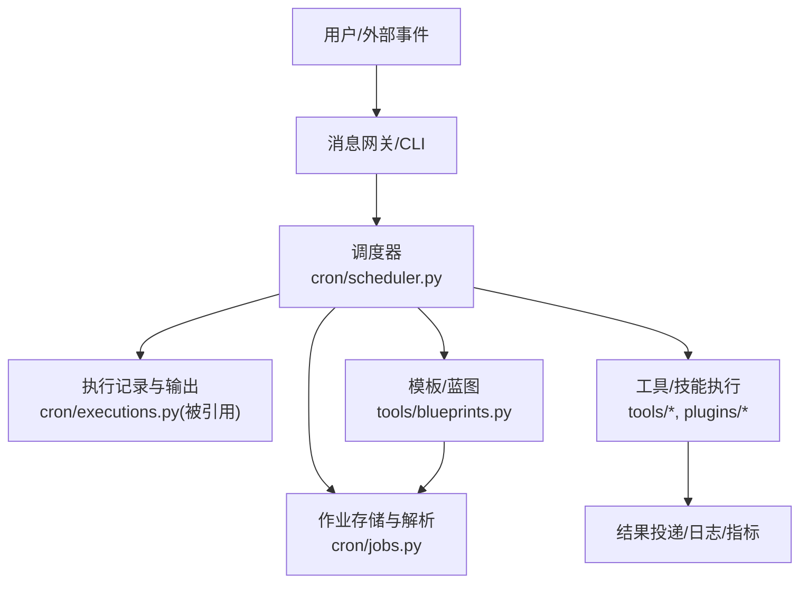
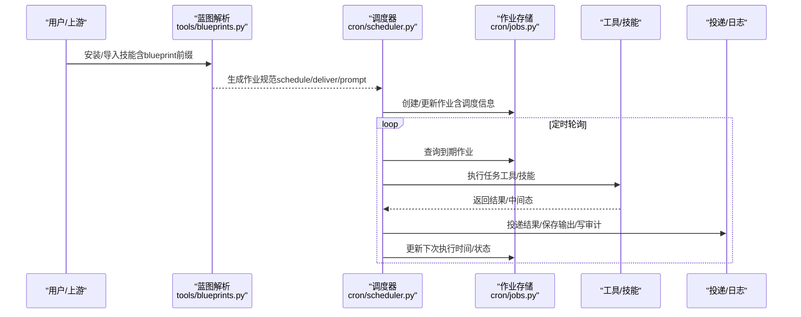
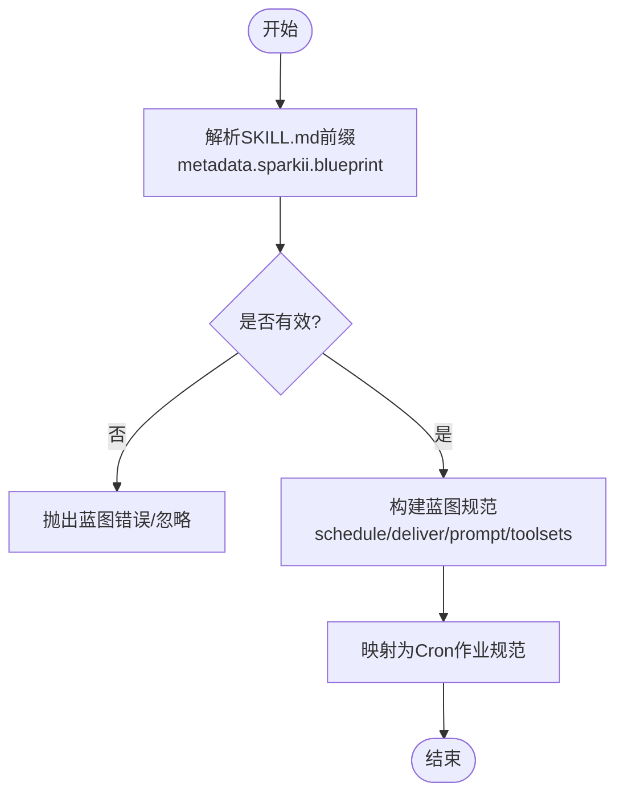
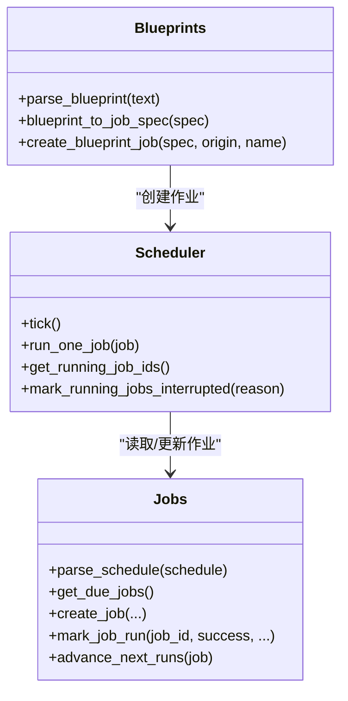
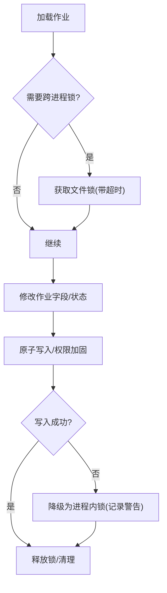
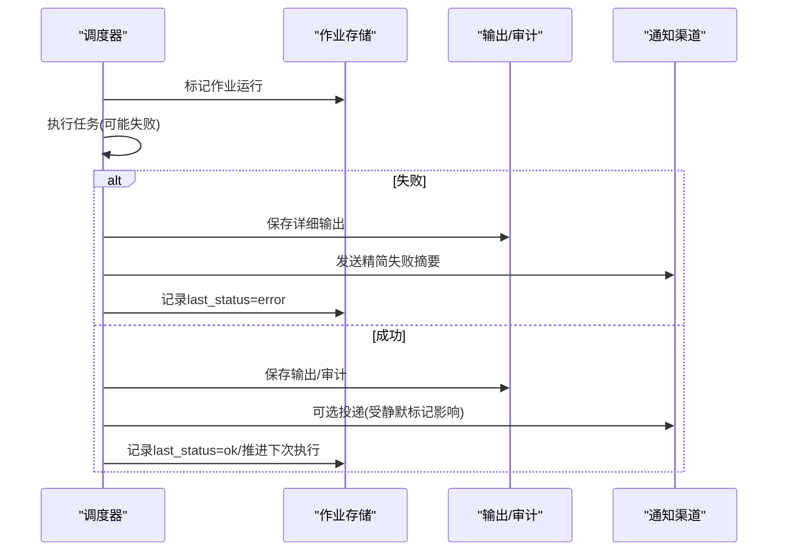
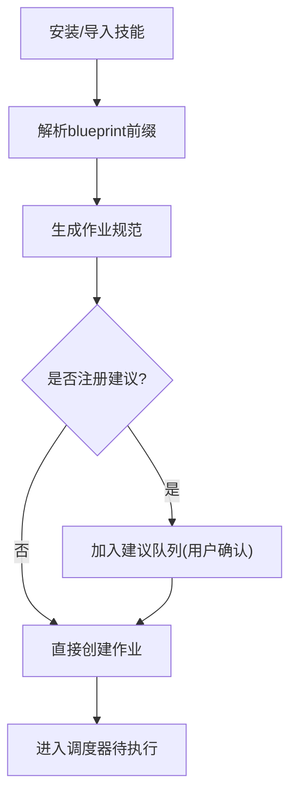
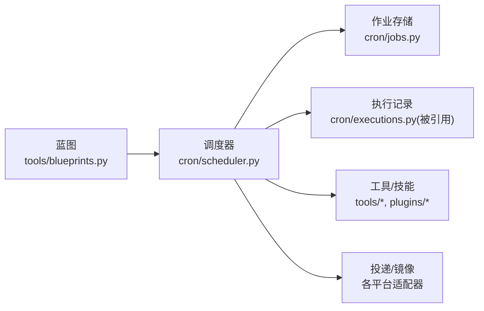

# RPA机器人流程自动化

<cite>
**本文引用的文件**
- [README.md](file://README.md)
- [README.zh-CN.md](file://README.zh-CN.md)
- [cron/scheduler.py](file://cron/scheduler.py)
- [cron/jobs.py](file://cron/jobs.py)
- [tools/blueprints.py](file://tools/blueprints.py)
</cite>

## 目录
1. [简介](#简介)
2. [项目结构](#项目结构)
3. [核心组件](#核心组件)
4. [架构总览](#架构总览)
5. [详细组件分析](#详细组件分析)
6. [依赖关系分析](#依赖关系分析)
7. [性能考量](#性能考量)
8. [故障排查指南](#故障排查指南)
9. [结论](#结论)
10. [附录](#附录)

## 简介
本文件面向RPA机器人流程自动化的设计与实现，围绕工作流设计器、任务调度机制、状态持久化、异常处理、模板与复用组件、审计与监控，以及企业级应用场景进行系统化说明。该仓库提供了内置的定时调度能力（Cron），支持自然语言描述的任务、跨平台投递、可插拔技能与工具集，并通过蓝图（Blueprint）将“技能+调度”封装为可分享、可复用的自动化模板，便于快速构建财务报销、数据迁移、报告生成等自动化解决方案。

## 项目结构
- 顶层入口与文档：README 系列提供安装、使用与功能概览，帮助理解系统定位与能力边界。
- 调度子系统：位于 cron/ 目录，包含调度器、作业存储、执行记录、建议与目录等模块，负责定时触发、并发控制、输出归档与投递。
- 模板与复用：tools/blueprints.py 将“技能+调度”抽象为蓝图，通过 SKILL.md 的前置元数据声明 schedule/deliver/prompt 等，直接映射到 Cron 作业，形成可分享的自动化模板。
- 其他支撑：gateway、agent、tools、plugins 等模块提供消息网关、代理运行、工具调用、插件扩展等能力，与调度子系统协同完成端到端自动化。

**图表来源**
- [cron/scheduler.py:1-120](file://cron/scheduler.py#L1-L120)
- [cron/jobs.py:1-120](file://cron/jobs.py#L1-L120)
- [tools/blueprints.py:1-60](file://tools/blueprints.py#L1-L60)

**章节来源**
- [README.md:19-31](file://README.md#L19-L31)
- [README.zh-CN.md:20-28](file://README.zh-CN.md#L20-L28)

## 核心组件
- 工作流设计器（可视化编排与条件分支）
  - 以“技能+蓝图+Cron”的方式实现：在 SKILL.md 中通过前置元数据声明 schedule/deliver/prompt 等，即可将一段自然语言流程固化为可重复执行的自动化任务；结合技能内部的条件判断与工具调用，可实现复杂分支逻辑。
- 任务调度机制（定时执行、事件触发、依赖管理）
  - 内置 Cron 调度器，支持一次性、间隔、标准 Cron 表达式等多种调度方式；具备并发池、串行池、锁机制与心跳检测，保障高可靠执行。
- 状态持久化（中断恢复与一致性）
  - 作业状态、下次执行时间、运行中标记、输出文件等均持久化；提供跨进程文件锁与原子写入，确保并发安全与一致性。
- 异常处理（重试、补偿、告警）
  - 调度器对失败进行摘要并投递通知；支持静默标记抑制无意义推送；具备中断标记与超时保护，避免错误状态覆盖。
- 模板库与复用组件
  - 蓝图（Blueprint）将“技能+调度”打包为可分享的技能，支持发布、索引、建议与一键创建作业，加速开发效率。
- 审计日志与监控指标
  - 每次执行产出 Markdown 输出与审计记录；调度器维护心跳、成功时间戳、用量审计等，便于分析与优化。

**章节来源**
- [tools/blueprints.py:1-60](file://tools/blueprints.py#L1-L60)
- [cron/scheduler.py:1-120](file://cron/scheduler.py#L1-L120)
- [cron/jobs.py:1-120](file://cron/jobs.py#L1-L120)

## 架构总览
下图展示从“蓝图/作业定义”到“调度执行”再到“结果投递与审计”的整体流程。

**图表来源**
- [tools/blueprints.py:172-215](file://tools/blueprints.py#L172-L215)
- [cron/scheduler.py:1-120](file://cron/scheduler.py#L1-L120)
- [cron/jobs.py:588-710](file://cron/jobs.py#L588-L710)

## 详细组件分析

### 工作流设计器（蓝图驱动的流程编排）
- 蓝图即“技能”，通过 SKILL.md 的 YAML 前置元数据声明 sparkii.blueprint，包含 schedule、deliver、prompt、enabled_toolsets 等字段，从而将自然语言流程固化为可调度任务。
- 蓝图解析后转换为 Cron 作业规范，复用现有技能中心、索引、发布与审计链路，无需新增对象类型或存储。
- 条件分支由技能内部逻辑实现：在技能脚本中根据输入/上下文调用不同工具，形成分支与聚合。

**图表来源**
- [tools/blueprints.py:72-141](file://tools/blueprints.py#L72-L141)
- [tools/blueprints.py:172-215](file://tools/blueprints.py#L172-L215)

**章节来源**
- [tools/blueprints.py:1-60](file://tools/blueprints.py#L1-L60)
- [tools/blueprints.py:72-141](file://tools/blueprints.py#L72-L141)
- [tools/blueprints.py:172-215](file://tools/blueprints.py#L172-L215)

### 任务调度机制（定时、事件、依赖）
- 定时执行：支持一次性（duration/timestamp）、间隔（every X）、标准 Cron 表达式三种模式；解析器统一归一为结构化 schedule，供调度器判定到期。
- 事件触发：通过网关/CLI 或其他入口创建作业，或由蓝图安装时注册建议并创建作业，实现“事件→作业”的触发。
- 依赖管理：通过 enabled_toolsets 限定可用工具集；MCP 服务器按全局启用列表合并入作业工具集，保证最小权限与可控性。
- 并发与隔离：并行线程池执行独立作业；涉及环境变更的作业走单线程串行池；读写 TERMINAL_CWD 采用读写锁，防止工作目录污染。
- 心跳与存活：ticker_heartbeat 与 ticker_last_success 用于健康检查；inactivity 超时与 one-shot 运行声明 TTL 保障异常恢复。

**图表来源**
- [cron/scheduler.py:1-120](file://cron/scheduler.py#L1-L120)
- [cron/jobs.py:588-710](file://cron/jobs.py#L588-L710)
- [tools/blueprints.py:172-215](file://tools/blueprints.py#L172-L215)

**章节来源**
- [cron/scheduler.py:1-120](file://cron/scheduler.py#L1-L120)
- [cron/jobs.py:588-710](file://cron/jobs.py#L588-L710)
- [tools/blueprints.py:172-215](file://tools/blueprints.py#L172-L215)

### 状态持久化（中断恢复与一致性）
- 持久化位置：jobs.json 存储作业定义与调度信息；output/{job_id}/{timestamp}.md 保存执行输出；ticker_heartbeat/ticker_last_success 用于健康探测。
- 并发安全：跨进程文件锁（fcntl/msvcrt）+ 进程内 RLock，保护 load→modify→save 关键段；原子替换与权限加固（0700/0600）。
- 恢复策略：one-shot 运行声明具备 TTL，结合 in-process running set 区分“真正运行中”和“卡死”；中断路径强制标记失败，避免误报成功。
- 一致性保证：标题唯一性冲突时回退 lineage 去重；失败摘要精简投递，完整细节落盘；用量审计 JSONL 追加记录。

**图表来源**
- [cron/jobs.py:270-373](file://cron/jobs.py#L270-L373)
- [cron/jobs.py:578-585](file://cron/jobs.py#L578-L585)

**章节来源**
- [cron/jobs.py:270-373](file://cron/jobs.py#L270-L373)
- [cron/jobs.py:578-585](file://cron/jobs.py#L578-L585)

### 异常处理（重试、补偿、告警）
- 失败摘要：对常见错误（限流、超时、鉴权）进行精简摘要，避免冗长堆栈污染投递通道；完整详情保存在输出目录。
- 静默投递：当最终响应包含特定静默标记时，抑制投递但保留本地审计，减少噪音。
- 中断保护：关闭路径强制标记运行中作业为“已中断”，防止后续正常完成路径覆盖状态；运行中标记集合用于守护与统计。
- 超时与不活动：基于 SPARKII_CRON_TIMEOUT 配置的不活动超时，配合 CWD 锁等待上限，避免长时间阻塞与资源泄露。

**图表来源**
- [cron/scheduler.py:101-152](file://cron/scheduler.py#L101-L152)
- [cron/scheduler.py:313-327](file://cron/scheduler.py#L313-L327)
- [cron/scheduler.py:397-461](file://cron/scheduler.py#L397-L461)

**章节来源**
- [cron/scheduler.py:101-152](file://cron/scheduler.py#L101-L152)
- [cron/scheduler.py:313-327](file://cron/scheduler.py#L313-L327)
- [cron/scheduler.py:397-461](file://cron/scheduler.py#L397-L461)

### 模板库与复用组件（蓝图）
- 蓝图即技能：通过 SKILL.md 的 metadata.sparkii.blueprint 声明 schedule/deliver/prompt 等，复用技能中心的全套生命周期（搜索、审核、发布、索引）。
- 一键创建作业：蓝图解析后直接映射为 Cron 作业规范，支持 origin 路由、模型/提供商选择、工具集限制。
- 建议与审批：安装蓝图会注册“建议作业”，用户确认后创建，避免自动排程带来的风险。

**图表来源**
- [tools/blueprints.py:95-141](file://tools/blueprints.py#L95-L141)
- [tools/blueprints.py:217-243](file://tools/blueprints.py#L217-L243)
- [tools/blueprints.py:172-215](file://tools/blueprints.py#L172-L215)

**章节来源**
- [tools/blueprints.py:95-141](file://tools/blueprints.py#L95-L141)
- [tools/blueprints.py:217-243](file://tools/blueprints.py#L217-L243)
- [tools/blueprints.py:172-215](file://tools/blueprints.py#L172-L215)

### 审计日志与监控指标
- 输出与审计：每次执行输出 Markdown 文件；用量审计 JSONL 记录 token 消耗与执行轨迹，便于成本与性能分析。
- 心跳与健康：ticker_heartbeat 与 ticker_last_success 反映调度器活跃性与最近成功时间；status 命令可据此判断健康度。
- 投递镜像：可选将 cron 结果镜像到原始会话，便于上下文延续与审计追溯。

**章节来源**
- [cron/scheduler.py:651-678](file://cron/scheduler.py#L651-L678)
- [cron/jobs.py:86-99](file://cron/jobs.py#L86-L99)
- [cron/scheduler.py:757-800](file://cron/scheduler.py#L757-L800)

## 依赖关系分析
- 蓝图 → 调度器：蓝图解析产物作为作业规范，交由调度器创建与管理。
- 调度器 → 作业存储：调度器周期性读取到期作业、更新状态与下次执行时间，写入输出与审计。
- 调度器 → 工具/技能：执行阶段调用工具与技能完成具体业务逻辑。
- 调度器 → 通知/镜像：根据 deliver 与 mirror_delivery 配置投递结果或镜像到会话。

**图表来源**
- [tools/blueprints.py:172-215](file://tools/blueprints.py#L172-L215)
- [cron/scheduler.py:1-120](file://cron/scheduler.py#L1-L120)
- [cron/jobs.py:1-120](file://cron/jobs.py#L1-L120)

**章节来源**
- [tools/blueprints.py:172-215](file://tools/blueprints.py#L172-L215)
- [cron/scheduler.py:1-120](file://cron/scheduler.py#L1-L120)
- [cron/jobs.py:1-120](file://cron/jobs.py#L1-L120)

## 性能考量
- 并发模型：并行线程池提高吞吐；涉及环境变更的作业走单线程串行池，避免状态竞争。
- 锁粒度与超时：文件锁带超时，避免跨进程死锁；CWD 读写锁有明确等待上限，防止长期阻塞。
- 资源占用：懒加载 croniter 与工具集解析，降低启动开销；用量审计追加写入，避免频繁 IO 放大。
- 可扩展性：通过 enabled_toolsets 与 MCP 合并策略，按需启用工具，减少不必要调用与上下文膨胀。

[本节为通用性能指导，不直接分析具体文件]

## 故障排查指南
- 作业未触发
  - 检查 schedule 解析是否正确（一次性/间隔/Cron）；确认 enabled 与暂停标记；查看 ticker 心跳与最近成功时间。
- 并发冲突/状态不一致
  - 关注 jobs.json 跨进程锁是否超时降级；核对运行中标记集合与中断标记；检查输出目录权限。
- 投递噪音/误报
  - 检查静默标记是否生效；查看失败摘要与完整输出；必要时调整 deliver 与 mirror_delivery。
- 长时间运行/卡死
  - 依据 SPARKII_CRON_TIMEOUT 与 CWD 锁超时评估；确认 not activity 是否触发回收；核查工具子进程是否被杀。

**章节来源**
- [cron/jobs.py:270-373](file://cron/jobs.py#L270-L373)
- [cron/scheduler.py:397-461](file://cron/scheduler.py#L397-L461)
- [cron/scheduler.py:578-604](file://cron/scheduler.py#L578-L604)

## 结论
本项目通过“蓝图+技能+Cron”的组合，实现了可视化的流程编排与可靠的自动化执行。其调度器具备完善的并发控制、状态持久化与异常处理能力，配合模板库与审计监控，能够高效支撑财务报销、数据迁移、报告生成等企业级场景。建议在复杂流程中优先使用蓝图固化可复用流程，并结合 enabled_toolsets 与 deliver 策略进行精细化治理。

[本节为总结性内容，不直接分析具体文件]

## 附录
- 快速上手
  - 安装与启动：参考 README 中的安装与 CLI/Gateway 命令。
  - 创建蓝图：在 SKILL.md 中添加 metadata.sparkii.blueprint 并声明 schedule/deliver/prompt。
  - 查看状态：使用 cron 相关命令查看作业、输出与健康状态。

**章节来源**
- [README.md:35-118](file://README.md#L35-L118)
- [README.zh-CN.md:32-71](file://README.zh-CN.md#L32-L71)