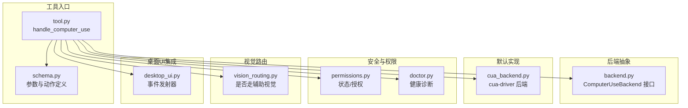
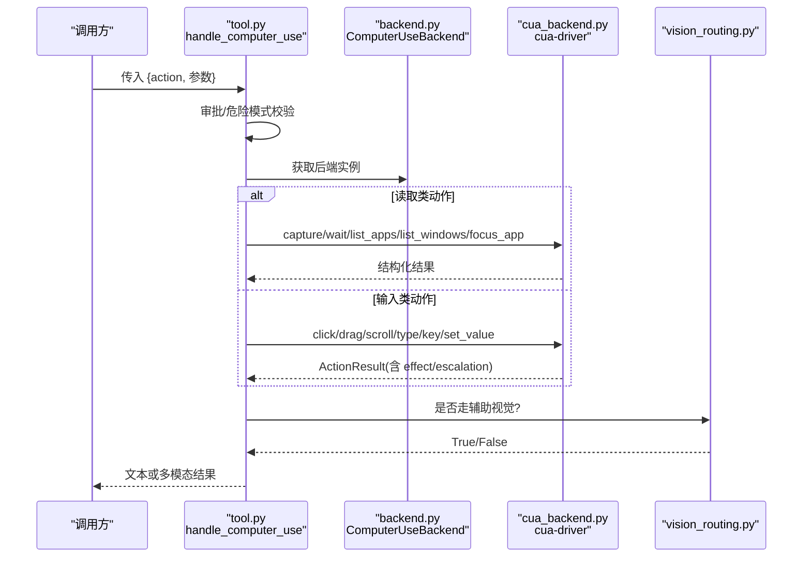
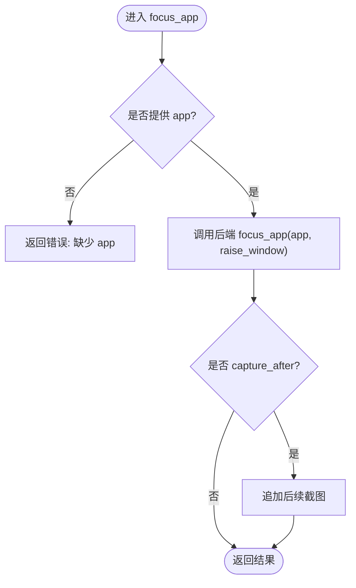
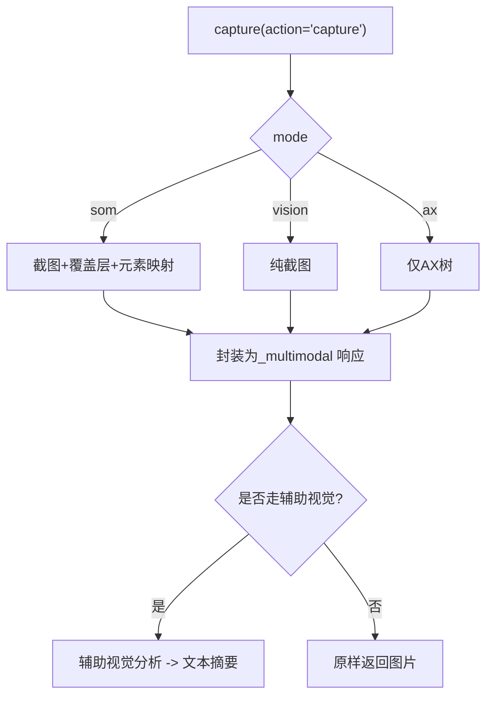
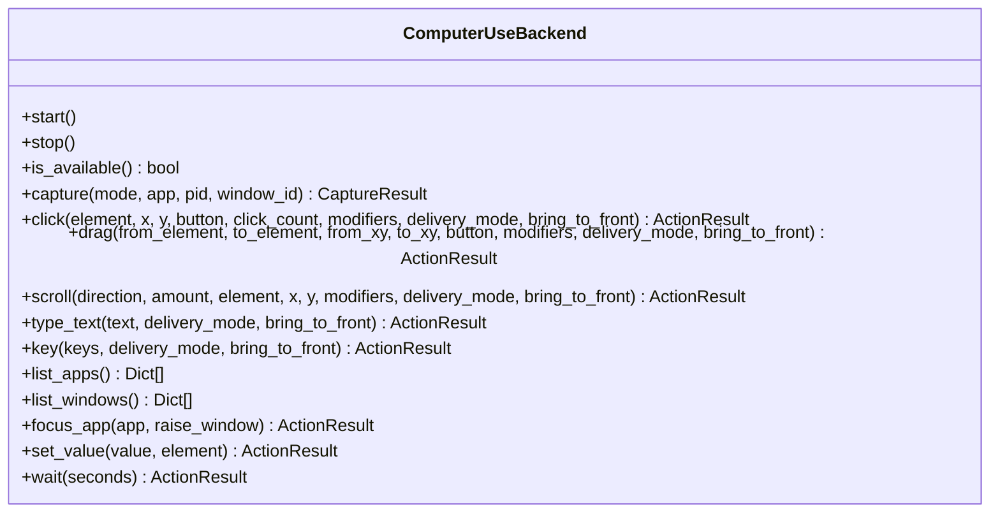
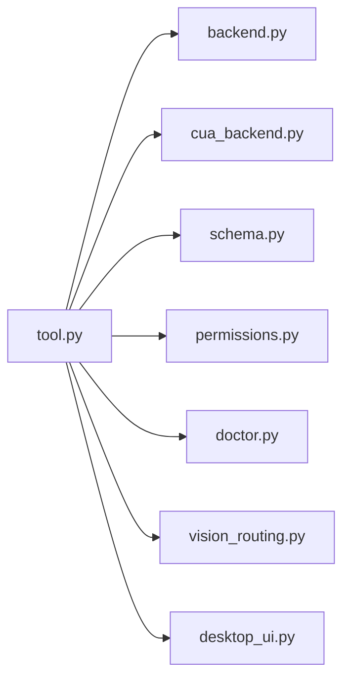

# 桌面控制功能

<cite>
**本文引用的文件**
- [tools/computer_use/__init__.py](file://tools/computer_use/__init__.py)
- [tools/computer_use/tool.py](file://tools/computer_use/tool.py)
- [tools/computer_use/backend.py](file://tools/computer_use/backend.py)
- [tools/computer_use/cua_backend.py](file://tools/computer_use/cua_backend.py)
- [tools/computer_use/schema.py](file://tools/computer_use/schema.py)
- [tools/computer_use/permissions.py](file://tools/computer_use/permissions.py)
- [tools/computer_use/doctor.py](file://tools/computer_use/doctor.py)
- [tools/computer_use/vision_routing.py](file://tools/computer_use/vision_routing.py)
- [tools/desktop_ui.py](file://tools/desktop_ui.py)
</cite>

## 目录
1. [简介](#简介)
2. [项目结构](#项目结构)
3. [核心组件](#核心组件)
4. [架构总览](#架构总览)
5. [详细组件分析](#详细组件分析)
6. [依赖关系分析](#依赖关系分析)
7. [性能考虑](#性能考虑)
8. [故障排查指南](#故障排查指南)
9. [结论](#结论)
10. [附录：使用示例与最佳实践](#附录使用示例与最佳实践)

## 简介
本模块提供跨平台（macOS、Windows、Linux）的桌面自动化能力，通过统一的 computer_use 工具对外暴露窗口管理、屏幕捕获、鼠标键盘输入、拖拽滚动等能力。其核心设计要点包括：
- 统一抽象后端 ComputerUseBackend，默认实现为 cua-driver 后端，屏蔽平台差异。
- 以“后台协作”模式驱动桌面，不抢占用户光标与焦点；必要时可升级为前台交付。
- 安全优先：破坏性操作需审批拦截，危险快捷键与危险文本模式被硬阻断。
- 截图支持多模式：SOM（带编号覆盖层）、纯视觉截图、无障碍树（AX）。
- 权限与健康检查：macOS 需要辅助功能与屏幕录制授权；非 macOS 以驱动健康为准。
- 诊断与恢复：doctor 工具与 fallback 探测保证问题可定位与降级可用。

## 项目结构
- tools/computer_use：桌面控制的工具集与后端抽象、默认实现、权限与健康、视觉路由等。
- tools/desktop_ui：将桌面端工具事件路由到桌面渲染器（仅桌面应用内有效）。

图表来源
- [tools/computer_use/tool.py:440-511](file://tools/computer_use/tool.py#L440-L511)
- [tools/computer_use/backend.py:111-250](file://tools/computer_use/backend.py#L111-L250)
- [tools/computer_use/cua_backend.py:1-800](file://tools/computer_use/cua_backend.py#L1-L800)
- [tools/computer_use/schema.py:16-354](file://tools/computer_use/schema.py#L16-L354)
- [tools/computer_use/permissions.py:121-161](file://tools/computer_use/permissions.py#L121-L161)
- [tools/computer_use/doctor.py:797-865](file://tools/computer_use/doctor.py#L797-L865)
- [tools/computer_use/vision_routing.py:164-199](file://tools/computer_use/vision_routing.py#L164-L199)
- [tools/desktop_ui.py:21-40](file://tools/desktop_ui.py#L21-L40)

章节来源
- [tools/computer_use/__init__.py:1-46](file://tools/computer_use/__init__.py#L1-L46)
- [tools/computer_use/tool.py:440-511](file://tools/computer_use/tool.py#L440-L511)
- [tools/computer_use/backend.py:111-250](file://tools/computer_use/backend.py#L111-L250)
- [tools/computer_use/cua_backend.py:1-800](file://tools/computer_use/cua_backend.py#L1-L800)
- [tools/computer_use/schema.py:16-354](file://tools/computer_use/schema.py#L16-L354)
- [tools/computer_use/permissions.py:121-161](file://tools/computer_use/permissions.py#L121-L161)
- [tools/computer_use/doctor.py:797-865](file://tools/computer_use/doctor.py#L797-L865)
- [tools/computer_use/vision_routing.py:164-199](file://tools/computer_use/vision_routing.py#L164-L199)
- [tools/desktop_ui.py:21-40](file://tools/desktop_ui.py#L21-L40)

## 核心组件
- 工具入口与调度：统一 action 分发，负责审批校验、危险模式拦截、调用后端并封装结果。
- 后端抽象：定义 capture、click/drag/scroll、type/key、list_apps/list_windows、focus_app、set_value、wait 等接口。
- cua-driver 后端：跨平台实现，通过 MCP stdio 与 cua-driver 通信，处理截图、元素识别、输入投递、浏览器态等。
- 权限与健康：统一查询驱动健康与平台权限（macOS 特判），并提供授权引导。
- 视觉路由：根据主模型能力与配置决定截图直接返回还是经辅助视觉转文本。
- 桌面 UI 集成：在桌面应用中向当前会话窗口派发事件（如预览、聚焦等）。

章节来源
- [tools/computer_use/tool.py:440-511](file://tools/computer_use/tool.py#L440-L511)
- [tools/computer_use/backend.py:111-250](file://tools/computer_use/backend.py#L111-L250)
- [tools/computer_use/cua_backend.py:1-800](file://tools/computer_use/cua_backend.py#L1-L800)
- [tools/computer_use/permissions.py:121-161](file://tools/computer_use/permissions.py#L121-L161)
- [tools/computer_use/vision_routing.py:164-199](file://tools/computer_use/vision_routing.py#L164-L199)
- [tools/desktop_ui.py:21-40](file://tools/desktop_ui.py#L21-L40)

## 架构总览
computer_use 工具作为统一入口，按 action 分派到后端；后端通过 cua-driver 完成跨平台桌面交互。截图结果根据视觉路由策略选择直传或转文本。权限与健康检查确保运行环境就绪。

图表来源
- [tools/computer_use/tool.py:440-511](file://tools/computer_use/tool.py#L440-L511)
- [tools/computer_use/backend.py:111-250](file://tools/computer_use/backend.py#L111-L250)
- [tools/computer_use/cua_backend.py:1-800](file://tools/computer_use/cua_backend.py#L1-L800)
- [tools/computer_use/vision_routing.py:164-199](file://tools/computer_use/vision_routing.py#L164-L199)

## 详细组件分析

### 窗口管理能力
- 列出应用与窗口：list_apps 返回进程与应用信息；list_windows 返回可见窗口列表（含 pid/window_id 等标识）。
- 聚焦应用：focus_app 可将输入路由至指定应用，可选择是否提升窗口到前台（会打断用户，需单独审批）。
- 目标选择：当未指定 app/pid/window_id 时，默认作用于最前窗口；对 Linux/X11 有额外策略跳过无意义的桌面背景窗口。

图表来源
- [tools/computer_use/tool.py:619-624](file://tools/computer_use/tool.py#L619-L624)
- [tools/computer_use/backend.py:191-205](file://tools/computer_use/backend.py#L191-L205)
- [tools/computer_use/cua_backend.py:324-356](file://tools/computer_use/cua_backend.py#L324-L356)

章节来源
- [tools/computer_use/tool.py:611-624](file://tools/computer_use/tool.py#L611-L624)
- [tools/computer_use/backend.py:191-205](file://tools/computer_use/backend.py#L191-L205)
- [tools/computer_use/cua_backend.py:324-356](file://tools/computer_use/cua_backend.py#L324-L356)

### 屏幕捕获能力
- 模式：
  - som：截图 + 可交互元素编号覆盖层 + AX 树映射，适合视觉模型点击元素索引。
  - vision：纯截图。
  - ax：仅无障碍树（无图），适合纯文本模型。
- 目标：可按 app、pid、window_id 精确限定；app="screen"/"desktop" 可捕获系统桌面/任务栏等 shell 表面。
- 尺寸与裁剪：支持 max_elements 限制 AX 节点数量，避免上下文爆炸；截图长边上限可配置。
- 视觉路由：若主模型不支持图片或多模态工具结果不被接受，则自动走辅助视觉，返回文本描述。

图表来源
- [tools/computer_use/tool.py:593-604](file://tools/computer_use/tool.py#L593-L604)
- [tools/computer_use/schema.py:67-130](file://tools/computer_use/schema.py#L67-L130)
- [tools/computer_use/vision_routing.py:164-199](file://tools/computer_use/vision_routing.py#L164-L199)
- [tools/computer_use/cua_backend.py:153-184](file://tools/computer_use/cua_backend.py#L153-L184)

章节来源
- [tools/computer_use/tool.py:593-604](file://tools/computer_use/tool.py#L593-L604)
- [tools/computer_use/schema.py:67-130](file://tools/computer_use/schema.py#L67-L130)
- [tools/computer_use/vision_routing.py:164-199](file://tools/computer_use/vision_routing.py#L164-L199)
- [tools/computer_use/cua_backend.py:153-184](file://tools/computer_use/cua_backend.py#L153-L184)

### 用户界面交互机制
- 鼠标：click/double_click/right_click/middle_click，支持 element 索引或坐标；modifiers 修饰键；delivery_mode 支持后台/前台两种投递方式。
- 拖拽：drag 支持 from_element/to_element 或 from_coordinate/to_coordinate。
- 滚动：scroll 支持方向与滚轮刻度，可针对元素或坐标。
- 键盘：type_text 输入文本；key 发送组合键（如 cmd+s、ctrl+alt+t）。
- 值设置：set_value 用于下拉框、滑块等原生控件的值设置，无需打开菜单或抢夺焦点。
- 前台/后台：delivery_mode=foreground 会短暂前置窗口执行后恢复；bring_to_front 持久前置需单独审批。

图表来源
- [tools/computer_use/backend.py:111-250](file://tools/computer_use/backend.py#L111-L250)

章节来源
- [tools/computer_use/tool.py:718-786](file://tools/computer_use/tool.py#L718-L786)
- [tools/computer_use/backend.py:137-205](file://tools/computer_use/backend.py#L137-L205)
- [tools/computer_use/schema.py:131-229](file://tools/computer_use/schema.py#L131-L229)

### 跨平台兼容性处理
- macOS：通过 SkyLight SPI 与 AT-SPI 路径工作；需要 Accessibility 与 Screen Recording 授权；可禁用光标覆盖以减少 CPU 占用。
- Windows：基于 Win32 API（SendInput + UI Automation），更稳定；首次可能触发 SmartScreen 提示。
- Linux：X11/Wayland（XWayland）；对 GNOME Shell 等桌面背景窗口进行过滤；active window 解析通过 xprop。
- 驱动发现：支持环境变量与常见安装路径解析；manifest 动态发现 mcp 子命令与参数；WSL 路径转换。

章节来源
- [tools/computer_use/cua_backend.py:1-34](file://tools/computer_use/cua_backend.py#L1-L34)
- [tools/computer_use/cua_backend.py:203-253](file://tools/computer_use/cua_backend.py#L203-L253)
- [tools/computer_use/cua_backend.py:278-321](file://tools/computer_use/cua_backend.py#L278-L321)
- [tools/computer_use/cua_backend.py:538-611](file://tools/computer_use/cua_backend.py#L538-L611)
- [tools/computer_use/cua_backend.py:692-749](file://tools/computer_use/cua_backend.py#L692-L749)

### 权限管理机制
- 统一状态查询：computer_use_status 返回 platform/platform_supported/installed/version/ready/checks/source/error 及 macOS 特有布尔位。
- macOS 授权：accessibility 与 screen_recording 必须开启；可通过 permissions grant 引导用户授权。
- 非 macOS：以驱动健康为准（doctor 检测通过即 ready）。
- 嵌入不受限会话：unrestricted 模式启动私有 cua-driver 守护进程，隔离权限影响。

章节来源
- [tools/computer_use/permissions.py:121-161](file://tools/computer_use/permissions.py#L121-L161)
- [tools/computer_use/permissions.py:164-199](file://tools/computer_use/permissions.py#L164-L199)
- [tools/computer_use/cua_backend.py:383-536](file://tools/computer_use/cua_backend.py#L383-L536)

### 错误处理与异常恢复
- 审批与阻断：破坏性操作需审批；危险快捷键与危险文本模式硬阻断。
- 结构化结果：ActionResult 携带 verified/effect/escalation/path/degraded/code/delivery_mode，便于上层决策下一步。
- 健康诊断：doctor 优先 health_report，不可用时回退到组合探测（check_permissions、list_apps、--version）。
- 资源清理：atexit 钩子确保所有后端停止，避免子进程泄漏。

章节来源
- [tools/computer_use/tool.py:80-142](file://tools/computer_use/tool.py#L80-L142)
- [tools/computer_use/tool.py:514-587](file://tools/computer_use/tool.py#L514-L587)
- [tools/computer_use/tool.py:318-365](file://tools/computer_use/tool.py#L318-L365)
- [tools/computer_use/doctor.py:797-865](file://tools/computer_use/doctor.py#L797-L865)

### 实际使用示例（场景化说明）
- 全屏截图并点击元素：
  - 步骤：调用 capture(mode='som', app='screen')，从返回的元素列表中选取目标元素的 index，再调用 click(element=N)。
  - 适用：桌面图标、任务栏按钮等系统级元素。
- 区域截图与验证：
  - 步骤：capture(mode='vision', app='某应用' 或指定 window_id)，得到截图后人工或视觉模型确认区域。
- 实时屏幕监控：
  - 步骤：周期性 capture(mode='som'|'vision')，结合视觉路由将图片转为文本摘要，供主模型理解变化。
- 窗口管理与聚焦：
  - 步骤：list_windows 找到目标窗口，focus_app(app, raise_window=False) 后台聚焦；必要时 raise_window=True 并单独审批。
- 键盘输入与快捷：
  - 步骤：type_text('用户名') 后 key('return')；或使用 key('cmd+s') 保存（注意危险组合键会被阻断）。
- 拖拽与滚动：
  - 步骤：drag(from_element=A, to_element=B) 或 drag(from_coordinate=[x,y], to_coordinate=[x2,y2])；scroll(direction='down', amount=3)。

章节来源
- [tools/computer_use/schema.py:67-229](file://tools/computer_use/schema.py#L67-L229)
- [tools/computer_use/tool.py:593-786](file://tools/computer_use/tool.py#L593-L786)

## 依赖关系分析
- tool.py 依赖 backend.py 抽象与 cua_backend.py 默认实现，并通过 schema.py 约束参数。
- permissions.py 与 doctor.py 通过 cua-driver CLI/MCP 探测环境与权限。
- vision_routing.py 依据主模型能力与配置决定是否走辅助视觉。
- desktop_ui.py 仅在桌面应用内生效，通过 set_emitter 注入事件发射器。

图表来源
- [tools/computer_use/tool.py:440-511](file://tools/computer_use/tool.py#L440-L511)
- [tools/computer_use/backend.py:111-250](file://tools/computer_use/backend.py#L111-L250)
- [tools/computer_use/cua_backend.py:1-800](file://tools/computer_use/cua_backend.py#L1-L800)
- [tools/computer_use/schema.py:16-354](file://tools/computer_use/schema.py#L16-L354)
- [tools/computer_use/permissions.py:121-161](file://tools/computer_use/permissions.py#L121-L161)
- [tools/computer_use/doctor.py:797-865](file://tools/computer_use/doctor.py#L797-L865)
- [tools/computer_use/vision_routing.py:164-199](file://tools/computer_use/vision_routing.py#L164-L199)
- [tools/desktop_ui.py:21-40](file://tools/desktop_ui.py#L21-L40)

章节来源
- [tools/computer_use/tool.py:440-511](file://tools/computer_use/tool.py#L440-L511)
- [tools/computer_use/backend.py:111-250](file://tools/computer_use/backend.py#L111-L250)
- [tools/computer_use/cua_backend.py:1-800](file://tools/computer_use/cua_backend.py#L1-L800)
- [tools/computer_use/schema.py:16-354](file://tools/computer_use/schema.py#L16-L354)
- [tools/computer_use/permissions.py:121-161](file://tools/computer_use/permissions.py#L121-L161)
- [tools/computer_use/doctor.py:797-865](file://tools/computer_use/doctor.py#L797-L865)
- [tools/computer_use/vision_routing.py:164-199](file://tools/computer_use/vision_routing.py#L164-L199)
- [tools/desktop_ui.py:21-40](file://tools/desktop_ui.py#L21-L40)

## 性能考虑
- 截图尺寸与元素数量：max_image_dimension 与 max_elements 控制上下文大小，避免大图像与庞大 AX 树导致 token 膨胀。
- 光标覆盖：macOS/无头 Linux 建议关闭覆盖层以减少空闲 CPU 占用。
- 后台协作：默认 background 投递不抢占焦点，减少重绘与切换开销；必要时再升级到 foreground。
- 会话隔离：每个 session 拥有独立后端与驱动会话，避免相互干扰。

章节来源
- [tools/computer_use/cua_backend.py:203-253](file://tools/computer_use/cua_backend.py#L203-L253)
- [tools/computer_use/schema.py:109-130](file://tools/computer_use/schema.py#L109-L130)
- [tools/computer_use/tool.py:149-168](file://tools/computer_use/tool.py#L149-L168)

## 故障排查指南
- 驱动不可用：检查 cua-driver 是否安装并可解析；查看 computer_use_status 的 installed/ready/checks。
- macOS 权限缺失：运行 permissions grant 引导授权；确认 accessibility 与 screen_recording 均为真。
- 健康报告不可用：doctor 会自动回退到组合探测，输出具体失败项与提示。
- 输入无效：查看 ActionResult 的 effect/escalation/code，必要时切换到 foreground 或调整 target。
- 资源泄漏：确保 release_computer_use_session 或 atexit 正常释放后端。

章节来源
- [tools/computer_use/permissions.py:121-161](file://tools/computer_use/permissions.py#L121-L161)
- [tools/computer_use/permissions.py:164-199](file://tools/computer_use/permissions.py#L164-L199)
- [tools/computer_use/doctor.py:797-865](file://tools/computer_use/doctor.py#L797-L865)
- [tools/computer_use/tool.py:268-315](file://tools/computer_use/tool.py#L268-L315)

## 结论
该桌面控制方案通过统一抽象与默认 cua-driver 实现，提供了跨平台的窗口管理、屏幕捕获与输入操控能力。它以安全审批、危险模式阻断、权限与健康检查为核心保障，并以灵活的后端与视觉路由适配不同模型与平台。配合 doctor 诊断与资源清理机制，可在生产环境中稳定运行。

## 附录：使用示例与最佳实践
- 推荐流程：先 capture(mode='som') 获取带编号覆盖层的截图，再以 element 索引进行点击，提高可靠性。
- 最小化/最大化/关闭：当前工具集未直接暴露这些操作；可通过 focus_app 与键盘快捷键（如 Alt+F4、Win+D 等）间接实现，但需注意危险组合键会被阻断，且应遵循审批与安全策略。
- 实时监测：周期性 capture 并结合视觉路由，将图片转为文本摘要，降低主模型负担。
- 前台升级：当后台投递无效或效果不可信时，再使用 delivery_mode='foreground' 或 bring_to_front=true 并单独审批。
- 权限先行：macOS 务必完成 Accessibility 与 Screen Recording 授权；其他平台确保驱动健康。

章节来源
- [tools/computer_use/schema.py:16-354](file://tools/computer_use/schema.py#L16-L354)
- [tools/computer_use/tool.py:440-511](file://tools/computer_use/tool.py#L440-L511)
- [tools/computer_use/permissions.py:121-161](file://tools/computer_use/permissions.py#L121-L161)
- [tools/computer_use/vision_routing.py:164-199](file://tools/computer_use/vision_routing.py#L164-L199)