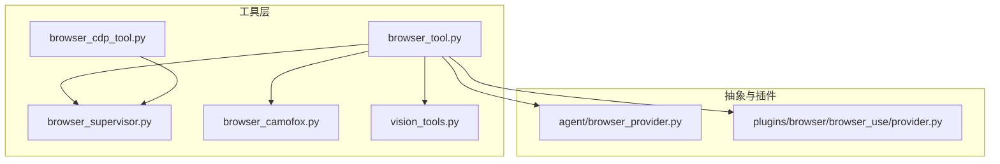
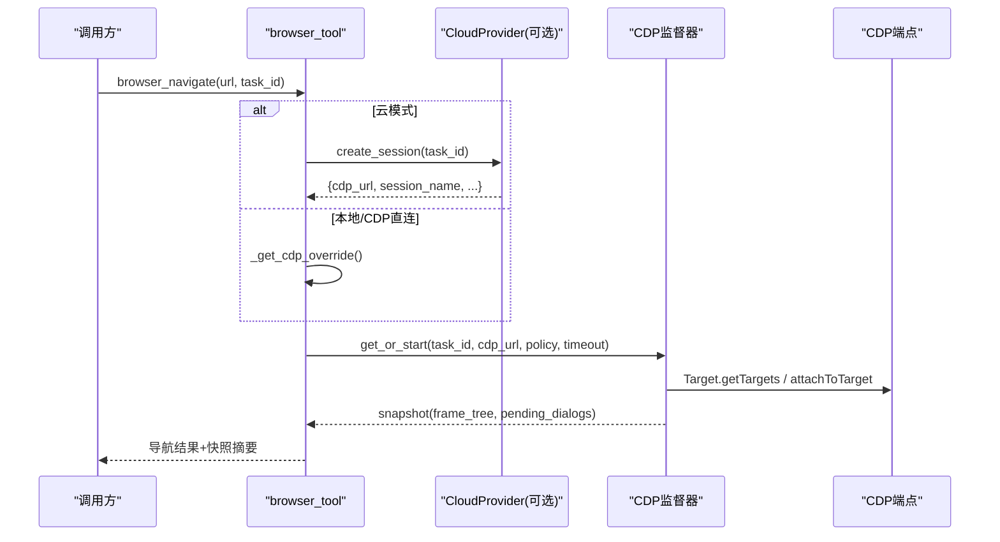
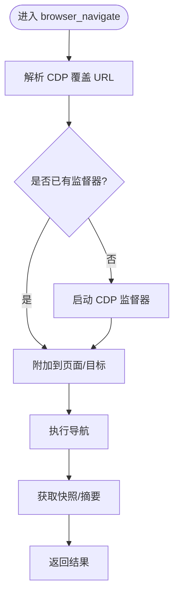
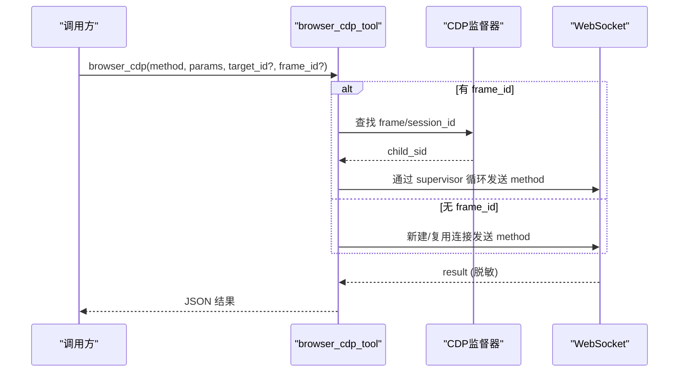
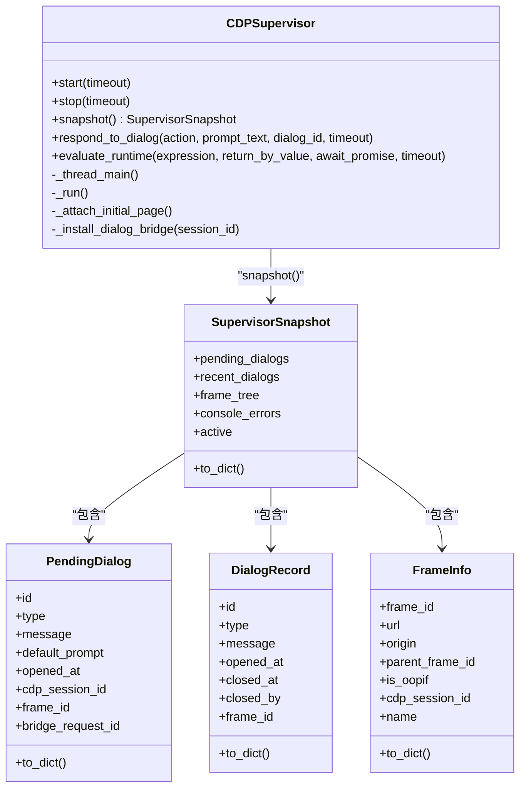
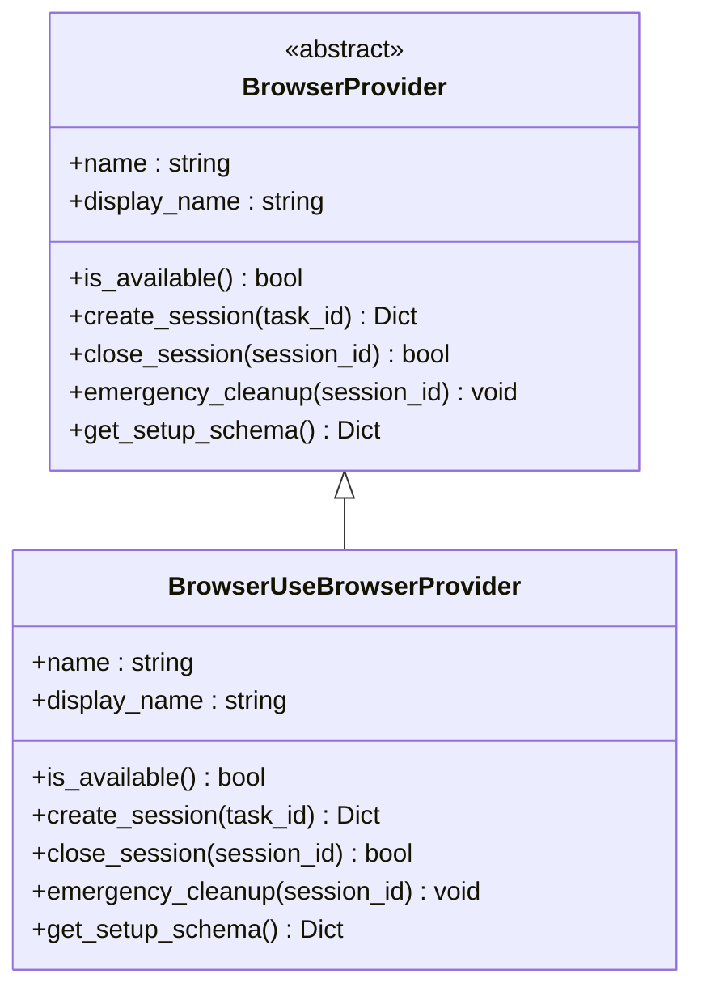
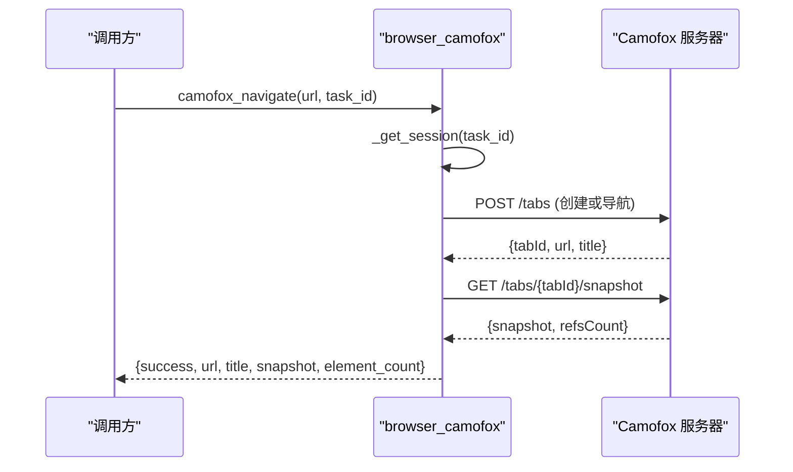
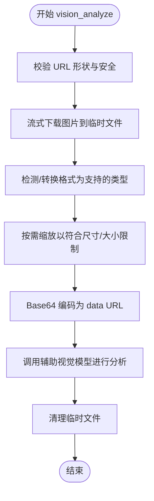
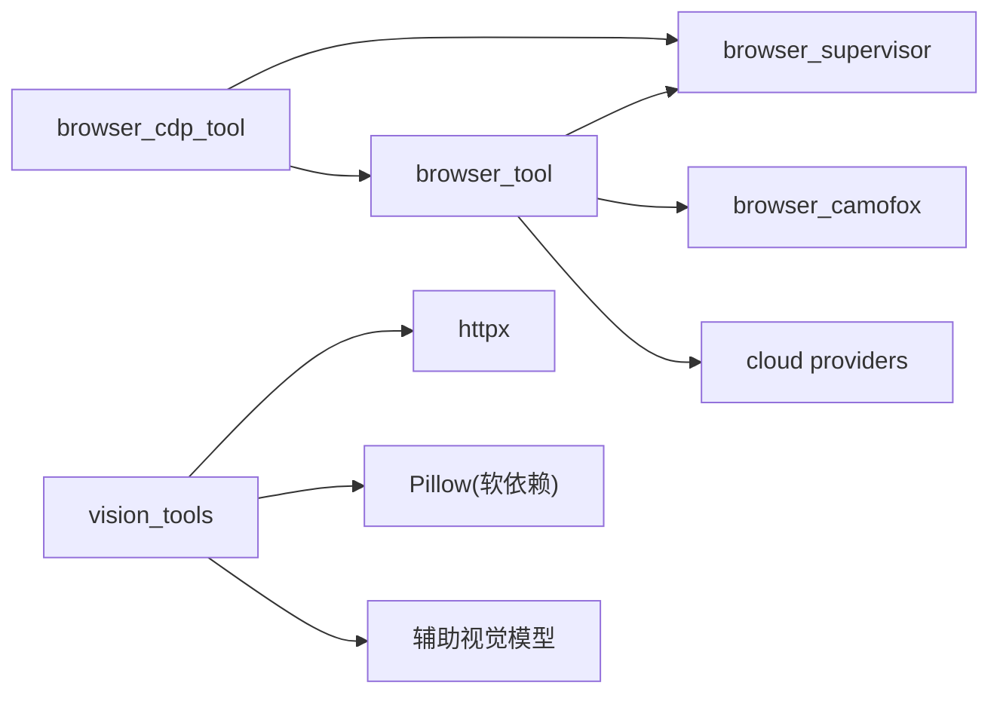

# 浏览器自动化

<cite>
**本文引用的文件**
- [tools/browser_tool.py](file://tools/browser_tool.py)
- [tools/browser_cdp_tool.py](file://tools/browser_cdp_tool.py)
- [tools/browser_supervisor.py](file://tools/browser_supervisor.py)
- [agent/browser_provider.py](file://agent/browser_provider.py)
- [plugins/browser/browser_use/provider.py](file://plugins/browser/browser_use/provider.py)
- [tools/browser_camofox.py](file://tools/browser_camofox.py)
- [tools/vision_tools.py](file://tools/vision_tools.py)
</cite>

## 目录
1. [简介](#简介)
2. [项目结构](#项目结构)
3. [核心组件](#核心组件)
4. [架构总览](#架构总览)
5. [详细组件分析](#详细组件分析)
6. [依赖关系分析](#依赖关系分析)
7. [性能考虑](#性能考虑)
8. [故障排查指南](#故障排查指南)
9. [结论](#结论)
10. [附录](#附录)

## 简介
本仓库提供一套完整的浏览器自动化能力，覆盖页面导航、元素定位与交互、表单填写、数据提取、JavaScript 执行、多标签页管理、图像识别集成、反爬检测绕过策略以及性能优化。系统支持本地无头 Chromium（通过 agent-browser）、云端浏览器（Browser Use、Browserbase、Firecrawl）以及本地反检测后端 Camofox；并通过 CDP 监督器统一处理对话框、跨域 iframe 和会话状态。

## 项目结构
围绕浏览器自动化的关键模块分布如下：
- 工具层：browser_tool（统一入口）、browser_cdp_tool（CDP 透传）、browser_supervisor（CDP 监督器）、browser_camofox（Camoufox 后端适配）、vision_tools（视觉分析）。
- 抽象与插件：browser_provider（云端提供者抽象），各云提供商实现位于 plugins/browser/<vendor>/provider.py。
- 配置与安全：URL 安全校验、网站访问策略、敏感信息脱敏、超时与命令限制等。

**图表来源**
- [tools/browser_tool.py:1-180](file://tools/browser_tool.py#L1-L180)
- [tools/browser_cdp_tool.py:1-120](file://tools/browser_cdp_tool.py#L1-L120)
- [tools/browser_supervisor.py:1-120](file://tools/browser_supervisor.py#L1-L120)
- [tools/browser_camofox.py:1-120](file://tools/browser_camofox.py#L1-L120)
- [tools/vision_tools.py:1-120](file://tools/vision_tools.py#L1-L120)
- [agent/browser_provider.py:1-120](file://agent/browser_provider.py#L1-L120)
- [plugins/browser/browser_use/provider.py:1-120](file://plugins/browser/browser_use/provider.py#L1-L120)

**章节来源**
- [tools/browser_tool.py:1-180](file://tools/browser_tool.py#L1-L180)
- [tools/browser_cdp_tool.py:1-120](file://tools/browser_cdp_tool.py#L1-L120)
- [tools/browser_supervisor.py:1-120](file://tools/browser_supervisor.py#L1-L120)
- [tools/browser_camofox.py:1-120](file://tools/browser_camofox.py#L1-L120)
- [tools/vision_tools.py:1-120](file://tools/vision_tools.py#L1-L120)
- [agent/browser_provider.py:1-120](file://agent/browser_provider.py#L1-L120)
- [plugins/browser/browser_use/provider.py:1-120](file://plugins/browser/browser_use/provider.py#L1-L120)

## 核心组件
- 统一浏览器工具（browser_tool.py）：封装导航、快照、点击、输入、滚动、截图、JS 执行、会话隔离、清理、超时控制、云/本地模式选择、CDP 监督器接入。
- CDP 透传工具（browser_cdp_tool.py）：直接发送任意 CDP 方法，支持目标/帧路由、私有页面防护、错误脱敏。
- CDP 监督器（browser_supervisor.py）：维护持久 WebSocket，订阅 Page/Runtime/Target 事件，暴露待处理对话框、frame_tree、控制台事件，并支持在 supervisor 循环内执行 Runtime.evaluate。
- 云端提供者抽象（agent/browser_provider.py）：定义 create_session/close_session/emergency_cleanup 等生命周期接口，供各云提供商实现。
- Browser Use 提供商（plugins/browser/browser_use/provider.py）：支持直连 API Key 或托管网关，创建会话返回 cdp_url，管理会话生命周期。
- Camofox 后端（tools/browser_camofox.py）：通过 REST 调用本地反检测浏览器，提供导航、快照、点击、输入、滚动、按键、关闭、图片提取等能力，支持 VNC 查看与回环地址重写。
- 视觉分析（tools/vision_tools.py）：下载图片、格式归一化、尺寸压缩、Base64 编码，调用辅助视觉模型进行图像理解。

**章节来源**
- [tools/browser_tool.py:1-200](file://tools/browser_tool.py#L1-L200)
- [tools/browser_cdp_tool.py:1-120](file://tools/browser_cdp_tool.py#L1-L120)
- [tools/browser_supervisor.py:1-120](file://tools/browser_supervisor.py#L1-L120)
- [agent/browser_provider.py:1-120](file://agent/browser_provider.py#L1-L120)
- [plugins/browser/browser_use/provider.py:1-120](file://plugins/browser/browser_use/provider.py#L1-L120)
- [tools/browser_camofox.py:1-120](file://tools/browser_camofox.py#L1-L120)
- [tools/vision_tools.py:1-120](file://tools/vision_tools.py#L1-L120)

## 架构总览
浏览器自动化由“工具层 + 抽象/插件 + 运行时”构成：
- 工具层对外暴露稳定 API（navigate/snapshot/click/type/eval 等），内部根据配置与环境选择后端（本地 agent-browser、云提供商、CDP 直连、Camoufox）。
- 抽象层定义云端提供者的生命周期契约，插件按约定实现会话创建与销毁。
- 运行时通过 CDP 监督器维持长连接，集中处理对话框、iframe、控制台日志，并为 JS 执行提供高效路径。

**图表来源**
- [tools/browser_tool.py:735-800](file://tools/browser_tool.py#L735-L800)
- [tools/browser_supervisor.py:741-769](file://tools/browser_supervisor.py#L741-L769)
- [agent/browser_provider.py:90-128](file://agent/browser_provider.py#L90-L128)
- [plugins/browser/browser_use/provider.py:189-256](file://plugins/browser/browser_use/provider.py#L189-L256)

## 详细组件分析

### 统一浏览器工具（browser_tool.py）
- 功能要点
  - 多后端选择：本地 headless Chromium（agent-browser）、云提供商（Browser Use/Browserbase/Firecrawl）、CDP 直连、Camoufox。
  - 会话隔离：基于 task_id 的会话管理与清理。
  - 文本快照：使用可访问性树（ariaSnapshot）生成结构化页面表示，便于 LLM 消费。
  - 超时控制：命令级超时、首次打开超时、最小超时保护。
  - 安全策略：URL 安全校验、SSRF 防护、敏感信息脱敏。
  - CDP 监督器集成：注入 pending_dialogs、frame_tree、控制台事件到快照。
- 关键流程
  - 解析 CDP 覆盖 URL（环境变量优先于配置文件）。
  - 启动/复用 CDP 监督器，附加到页面并启用相关域。
  - 对大快照进行截断或 LLM 摘要，控制存储大小。
  - 为子进程传递最小必要的环境变量，避免泄露密钥。

**图表来源**
- [tools/browser_tool.py:497-556](file://tools/browser_tool.py#L497-L556)
- [tools/browser_tool.py:594-649](file://tools/browser_tool.py#L594-L649)
- [tools/browser_tool.py:259-343](file://tools/browser_tool.py#L259-L343)

**章节来源**
- [tools/browser_tool.py:1-200](file://tools/browser_tool.py#L1-L200)
- [tools/browser_tool.py:259-343](file://tools/browser_tool.py#L259-L343)
- [tools/browser_tool.py:497-556](file://tools/browser_tool.py#L497-L556)
- [tools/browser_tool.py:594-649](file://tools/browser_tool.py#L594-L649)

### CDP 透传工具（browser_cdp_tool.py）
- 功能要点
  - 直接发送任意 CDP 方法，支持 target_id（页签）与 frame_id（跨域 iframe）路由。
  - 私有页面防护：在受保护的上下文中阻止危险方法（如 Runtime.evaluate、Page.navigate）访问内网地址。
  - 错误脱敏：输出中隐藏敏感信息。
  - 通过 supervisor 的已连接 WebSocket 执行跨域 iframe 内的操作，避免签名 URL 过期问题。
- 典型用法
  - 列出标签页：Target.getTargets
  - 处理原生对话框：Page.handleJavaScriptDialog
  - 获取 Cookie：Network.getAllCookies
  - 在指定标签页执行 JS：Runtime.evaluate

**图表来源**
- [tools/browser_cdp_tool.py:188-276](file://tools/browser_cdp_tool.py#L188-L276)
- [tools/browser_cdp_tool.py:284-391](file://tools/browser_cdp_tool.py#L284-L391)
- [tools/browser_cdp_tool.py:394-531](file://tools/browser_cdp_tool.py#L394-L531)

**章节来源**
- [tools/browser_cdp_tool.py:1-120](file://tools/browser_cdp_tool.py#L1-L120)
- [tools/browser_cdp_tool.py:188-276](file://tools/browser_cdp_tool.py#L188-L276)
- [tools/browser_cdp_tool.py:284-391](file://tools/browser_cdp_tool.py#L284-L391)
- [tools/browser_cdp_tool.py:394-531](file://tools/browser_cdp_tool.py#L394-L531)

### CDP 监督器（browser_supervisor.py）
- 功能要点
  - 单任务单实例：每个 task_id 对应一个 CDPSupervisor，持有唯一 WebSocket。
  - 事件订阅：订阅 Page/Runtime/Target 事件，维护 pending_dialogs、recent_dialogs、frame_tree、console_errors。
  - 对话框桥接：注入脚本拦截 alert/confirm/prompt，通过 Fetch 拦截将请求转为待处理对话框，等待代理响应。
  - 运行环境评估：evaluate_runtime 复用已连接会话执行 JS，避免每次子进程开销。
  - 重连机制：网络断开后自动重连并恢复状态。
- 数据结构
  - PendingDialog：当前打开的对话框信息。
  - DialogRecord：历史对话框记录。
  - FrameInfo：页面帧信息（含 OOPIF 标识与 CDP session_id）。
  - SupervisorSnapshot：线程安全的只读快照。

**图表来源**
- [tools/browser_supervisor.py:160-284](file://tools/browser_supervisor.py#L160-L284)
- [tools/browser_supervisor.py:289-350](file://tools/browser_supervisor.py#L289-L350)
- [tools/browser_supervisor.py:427-505](file://tools/browser_supervisor.py#L427-L505)
- [tools/browser_supervisor.py:507-609](file://tools/browser_supervisor.py#L507-L609)
- [tools/browser_supervisor.py:644-769](file://tools/browser_supervisor.py#L644-L769)

**章节来源**
- [tools/browser_supervisor.py:1-120](file://tools/browser_supervisor.py#L1-L120)
- [tools/browser_supervisor.py:160-284](file://tools/browser_supervisor.py#L160-L284)
- [tools/browser_supervisor.py:289-350](file://tools/browser_supervisor.py#L289-L350)
- [tools/browser_supervisor.py:427-505](file://tools/browser_supervisor.py#L427-L505)
- [tools/browser_supervisor.py:507-609](file://tools/browser_supervisor.py#L507-L609)
- [tools/browser_supervisor.py:644-769](file://tools/browser_supervisor.py#L644-L769)

### 云端浏览器提供者（agent/browser_provider.py 与 Browser Use 实现）
- 抽象接口
  - name/display_name：标识与显示名。
  - is_available：可用性检查（不发起网络 I/O）。
  - create_session：创建会话并返回元数据（session_name、bb_session_id、cdp_url、expires_at、features）。
  - close_session/emergency_cleanup：释放与会话相关的资源。
  - get_setup_schema：用于工具选择器的设置引导。
- Browser Use 实现
  - 双认证：直连 API Key 或托管 Nous 网关。
  - 幂等键：在托管模式下使用 idempotency key 去重重复创建请求。
  - 会话生命周期：创建/关闭/紧急清理，返回 cdp_url 供上层使用。

**图表来源**
- [agent/browser_provider.py:50-178](file://agent/browser_provider.py#L50-L178)
- [plugins/browser/browser_use/provider.py:105-325](file://plugins/browser/browser_use/provider.py#L105-L325)

**章节来源**
- [agent/browser_provider.py:1-178](file://agent/browser_provider.py#L1-L178)
- [plugins/browser/browser_use/provider.py:1-325](file://plugins/browser/browser_use/provider.py#L1-L325)

### Camofox 后端（tools/browser_camofox.py）
- 功能要点
  - 通过 REST API 与本地 Camoufox 服务器通信，提供导航、快照、点击、输入、滚动、按键、关闭、图片提取等。
  - 会话管理：按 task_id 维护用户 ID、标签页 ID，支持接管现有标签页。
  - 安全与兼容：回环地址重写（Docker 场景）、私有页面阻断、VNC 可视化。
  - 与主工具集成：复用统一的快照阈值与摘要逻辑。
- 典型流程
  - 确保存在标签页，必要时创建新标签。
  - 导航成功后自动抓取快照，若过大则截断或摘要。
  - 对当前页面进行私有地址检查，防止读取内网内容。

**图表来源**
- [tools/browser_camofox.py:359-421](file://tools/browser_camofox.py#L359-L421)
- [tools/browser_camofox.py:496-574](file://tools/browser_camofox.py#L496-L574)
- [tools/browser_camofox.py:611-650](file://tools/browser_camofox.py#L611-L650)

**章节来源**
- [tools/browser_camofox.py:1-120](file://tools/browser_camofox.py#L1-L120)
- [tools/browser_camofox.py:359-421](file://tools/browser_camofox.py#L359-L421)
- [tools/browser_camofox.py:496-574](file://tools/browser_camofox.py#L496-L574)
- [tools/browser_camofox.py:611-650](file://tools/browser_camofox.py#L611-L650)

### 视觉分析（tools/vision_tools.py）
- 功能要点
  - 下载图片：流式下载至临时文件，限制最大字节数，防止 OOM。
  - 格式归一化：将 SVG 光栅化为 PNG，其他非支持格式转 PNG，确保与主流视觉模型兼容。
  - 尺寸压缩：主动将图片缩放到目标大小，避免超过 provider 的单图限制。
  - 并发控制：CPU 密集型的 encode/resize 通过有界线程池限制并发，避免阻塞事件循环。
  - SSRF 防护：下载前与重定向时校验目标地址，禁止内网/私有地址。
- 典型流程
  - 校验 URL 形状与安全性。
  - 流式下载到临时文件，原子替换为目标路径。
  - 检测 MIME 类型，必要时转换格式。
  - Base64 编码并嵌入对话历史（带尺寸与大小上限）。

**图表来源**
- [tools/vision_tools.py:477-572](file://tools/vision_tools.py#L477-L572)
- [tools/vision_tools.py:245-379](file://tools/vision_tools.py#L245-L379)
- [tools/vision_tools.py:624-800](file://tools/vision_tools.py#L624-L800)

**章节来源**
- [tools/vision_tools.py:1-120](file://tools/vision_tools.py#L1-L120)
- [tools/vision_tools.py:245-379](file://tools/vision_tools.py#L245-L379)
- [tools/vision_tools.py:477-572](file://tools/vision_tools.py#L477-L572)
- [tools/vision_tools.py:624-800](file://tools/vision_tools.py#L624-L800)

## 依赖关系分析
- 模块耦合
  - browser_tool 依赖 browser_supervisor（CDP 监督器）、browser_camofox（可选后端）、cloud providers（插件注册表）。
  - browser_cdp_tool 依赖 websockets 与 browser_tool 的安全策略。
  - browser_supervisor 依赖 websockets 与异步事件循环，提供线程安全快照。
  - vision_tools 依赖 httpx、Pillow（软依赖）、辅助视觉模型客户端。
- 外部依赖
  - 云端提供商 API（Browser Use、Browserbase、Firecrawl）。
  - 本地 Camoufox 服务（REST API）。
  - CDP 端点（ws/wss）。
- 潜在循环依赖
  - browser_tool 与 browser_camofox 通过延迟导入避免循环；CDP 监督器与工具层通过注册表解耦。

**图表来源**
- [tools/browser_tool.py:159-185](file://tools/browser_tool.py#L159-L185)
- [tools/browser_cdp_tool.py:59-70](file://tools/browser_cdp_tool.py#L59-L70)
- [tools/browser_supervisor.py:31-37](file://tools/browser_supervisor.py#L31-L37)
- [tools/vision_tools.py:42-68](file://tools/vision_tools.py#L42-L68)

**章节来源**
- [tools/browser_tool.py:159-185](file://tools/browser_tool.py#L159-L185)
- [tools/browser_cdp_tool.py:59-70](file://tools/browser_cdp_tool.py#L59-L70)
- [tools/browser_supervisor.py:31-37](file://tools/browser_supervisor.py#L31-L37)
- [tools/vision_tools.py:42-68](file://tools/vision_tools.py#L42-L68)

## 性能考虑
- 并行操作
  - 视觉分析的 CPU 密集型部分（encode/resize）通过有界线程池限制并发，避免阻塞事件循环；LLM 调用保持全并发。
  - 多任务可通过不同 task_id 并行运行，各自拥有独立会话与监督器。
- 缓存策略
  - 命令超时、云提供商实例、浏览器引擎等结果进行进程级缓存，减少重复计算。
  - 快照截断与摘要控制存储大小，避免磁盘膨胀。
- 资源预加载
  - 首次打开使用更高超时，适应冷启动与库缺失场景。
  - 懒加载重型依赖（requests、websockets、辅助客户端）降低冷启动成本。
- 网络与 I/O
  - 流式下载图片，限制最大字节数，提前拒绝超大 Content-Length。
  - CDP 监督器重连退避，避免频繁重试导致拥塞。

[本节为通用指导，不直接分析具体文件]

## 故障排查指南
- CDP 连接失败
  - 检查 BROWSER_CDP_URL 或 config.yaml 中的 browser.cdp_url 是否正确。
  - 确认浏览器已开启调试端口且可被 ws/wss 访问。
  - 参考错误消息中的建议（如 --no-sandbox、安装依赖）。
- 对话框未响应
  - 确认 CDP 监督器已启动并处于活动状态。
  - 使用 browser_snapshot 查看 pending_dialogs 与 frame_tree。
  - 通过 browser_dialog 接受或拒绝对话框。
- 私有页面访问被阻断
  - 在非本地后端上，访问内网地址会被安全策略阻止。
  - 如需允许，请调整 allow_private_urls 配置或使用本地模式。
- 视觉分析失败
  - 检查图片 URL 是否可达且非内网地址。
  - 确认 Pillow 已安装以支持格式转换与缩放。
  - 关注 4xx/5xx 错误码与速率限制，合理重试。

**章节来源**
- [tools/browser_cdp_tool.py:637-668](file://tools/browser_cdp_tool.py#L637-L668)
- [tools/browser_supervisor.py:395-443](file://tools/browser_supervisor.py#L395-L443)
- [tools/browser_tool.py:385-421](file://tools/browser_tool.py#L385-L421)
- [tools/vision_tools.py:382-403](file://tools/vision_tools.py#L382-L403)

## 结论
本仓库提供企业级的浏览器自动化能力，具备多后端支持、强安全策略、健壮的错误处理与高性能设计。通过统一工具层与 CDP 监督器，开发者可以专注于业务逻辑，而无需关心底层浏览器细节。结合视觉分析与反检测后端，系统在复杂 Web 场景中具备高成功率与稳定性。

[本节为总结性内容，不直接分析具体文件]

## 附录
- 常见应用场景
  - 数据抓取：使用 browser_navigate 与 browser_snapshot 获取页面结构，结合 LLM 摘要提取关键信息。
  - 在线测试：通过 browser_click 与 browser_type 模拟用户操作，验证表单提交与页面跳转。
  - 流程自动化：利用 CDP 透传处理原生对话框与跨域 iframe，完成端到端流程。
- 最佳实践
  - 使用 task_id 隔离会话，避免状态污染。
  - 合理设置超时与重试策略，提升鲁棒性。
  - 启用隐私与 SSRF 防护，防止敏感信息泄露。
  - 在大规模任务中启用并行与缓存，提高吞吐。

[本节为补充说明，不直接分析具体文件]