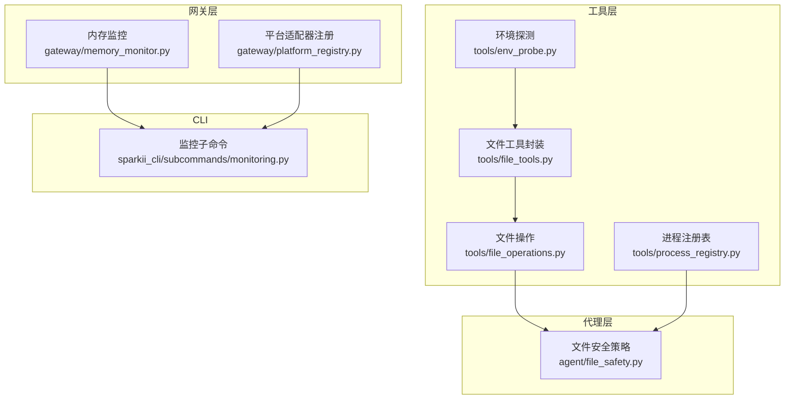
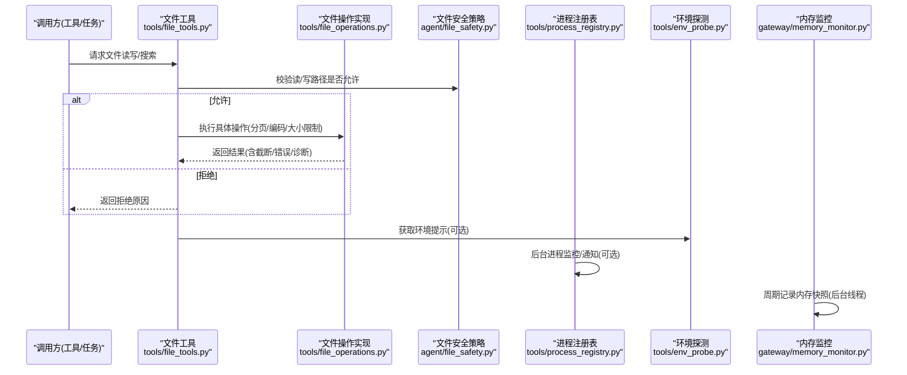
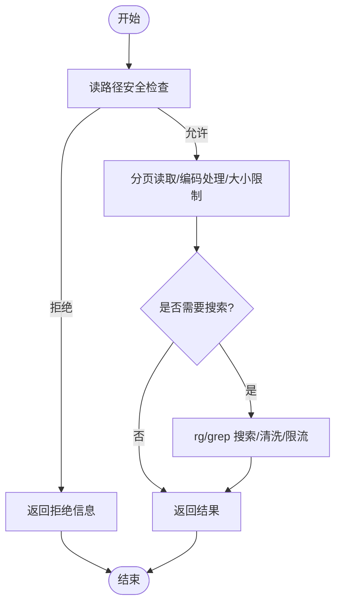
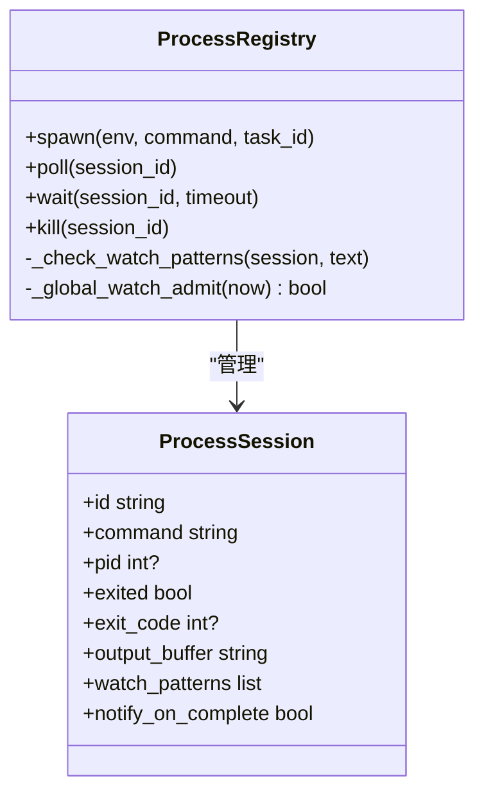
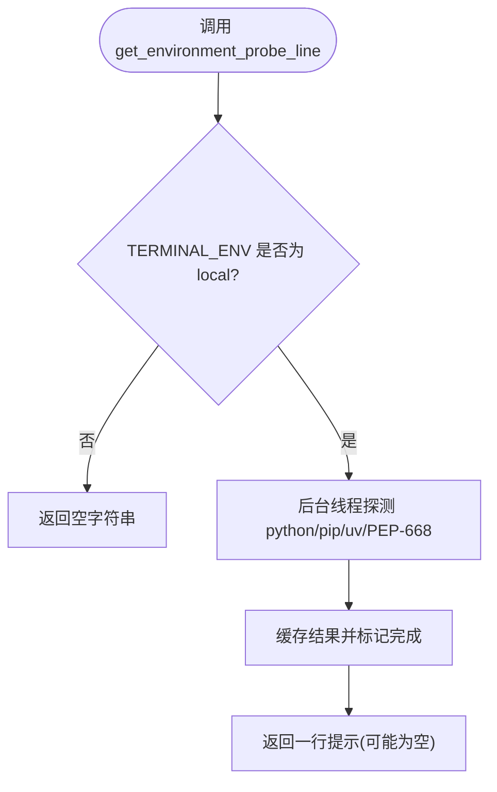
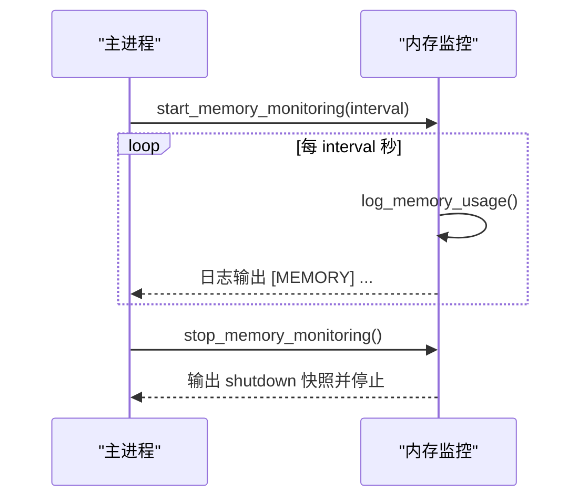
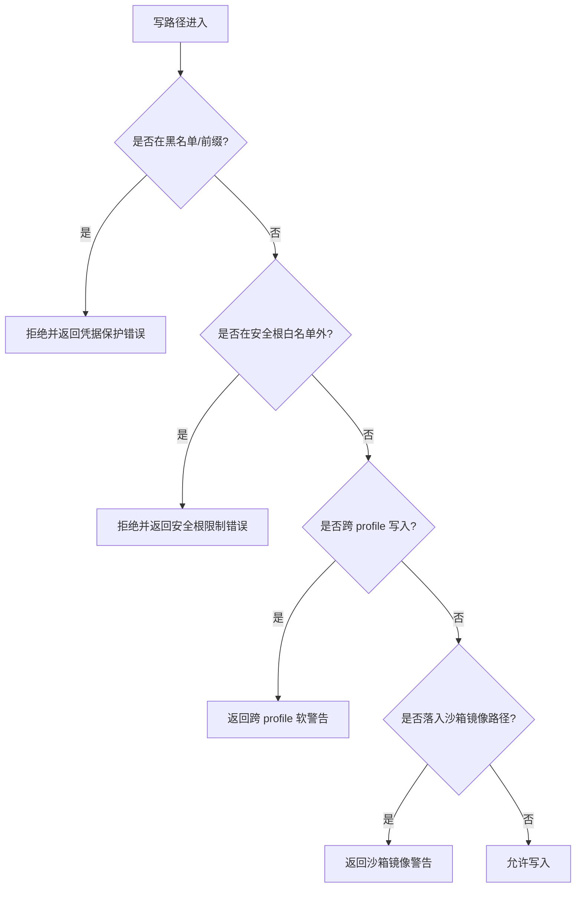
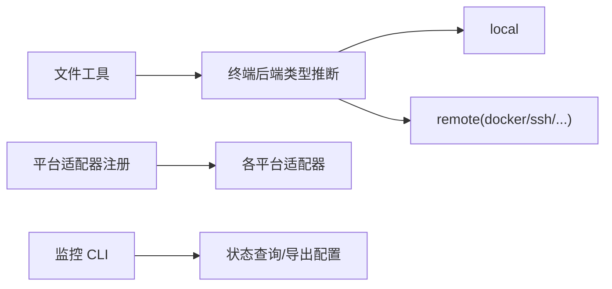
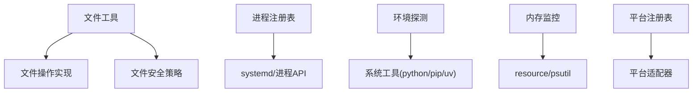

# 系统集成

<cite>
**本文引用的文件**
- [tools/file_operations.py](file://tools/file_operations.py)
- [tools/file_tools.py](file://tools/file_tools.py)
- [agent/file_safety.py](file://agent/file_safety.py)
- [tools/process_registry.py](file://tools/process_registry.py)
- [tools/env_probe.py](file://tools/env_probe.py)
- [gateway/memory_monitor.py](file://gateway/memory_monitor.py)
- [sparkii_cli/subcommands/monitoring.py](file://sparkii_cli/subcommands/monitoring.py)
- [gateway/platform_registry.py](file://gateway/platform_registry.py)
</cite>

## 目录
1. [简介](#简介)
2. [项目结构](#项目结构)
3. [核心组件](#核心组件)
4. [架构总览](#架构总览)
5. [详细组件分析](#详细组件分析)
6. [依赖关系分析](#依赖关系分析)
7. [性能考量](#性能考量)
8. [故障排查指南](#故障排查指南)
9. [结论](#结论)
10. [附录](#附录)

## 简介
本文件面向系统集成与运维，围绕以下能力提供系统化说明：
- 文件操作：读写、目录遍历、权限与安全、大文件处理
- 进程管理：启动、监控、通信、生命周期与隔离
- 环境变量探测：系统信息与运行时配置提示
- 资源监控：内存等关键指标采集与告警
- 安全沙箱：写路径白名单/黑名单、敏感文件保护、跨平台差异
- 跨平台适配：本地、Docker、SSH、Singularity、Modal、Daytona、Vercel 等后端统一抽象
- 自动化维护：日志清理、备份、性能监控（通过工具与调度）

## 项目结构
与系统集成相关的核心模块分布在 tools、agent、gateway 与 sparkii_cli 下：
- tools 层提供文件操作、进程注册表、环境探测等通用能力
- agent 层提供文件安全策略（读/写限制、敏感路径、跨配置文件写入保护）
- gateway 层提供内存监控、平台适配器注册等运行期支撑
- sparkii_cli 提供监控子命令入口

**图表来源**
- [tools/file_operations.py:1-120](file://tools/file_operations.py#L1-L120)
- [tools/file_tools.py:1-200](file://tools/file_tools.py#L1-L200)
- [agent/file_safety.py:1-180](file://agent/file_safety.py#L1-L180)
- [tools/process_registry.py:1-120](file://tools/process_registry.py#L1-L120)
- [tools/env_probe.py:1-120](file://tools/env_probe.py#L1-L120)
- [gateway/memory_monitor.py:1-120](file://gateway/memory_monitor.py#L1-L120)
- [gateway/platform_registry.py:1-120](file://gateway/platform_registry.py#L1-L120)
- [sparkii_cli/subcommands/monitoring.py:1-37](file://sparkii_cli/subcommands/monitoring.py#L1-L37)

**章节来源**
- [tools/file_operations.py:1-120](file://tools/file_operations.py#L1-L120)
- [tools/file_tools.py:1-200](file://tools/file_tools.py#L1-L200)
- [agent/file_safety.py:1-180](file://agent/file_safety.py#L1-L180)
- [tools/process_registry.py:1-120](file://tools/process_registry.py#L1-L120)
- [tools/env_probe.py:1-120](file://tools/env_probe.py#L1-L120)
- [gateway/memory_monitor.py:1-120](file://gateway/memory_monitor.py#L1-L120)
- [gateway/platform_registry.py:1-120](file://gateway/platform_registry.py#L1-L120)
- [sparkii_cli/subcommands/monitoring.py:1-37](file://sparkii_cli/subcommands/monitoring.py#L1-L37)

## 核心组件
- 文件操作抽象与实现：统一的 read/write/patch/search/delete/move 接口，支持分页读取、行尾/编码处理、二进制与图片识别、搜索输出清洗与限流、内置/外部 linter。
- 文件安全策略：写路径黑名单/前缀、受保护系统/凭据文件、安全根目录白名单、跨配置文件写入软保护、沙箱镜像路径检测与警告。
- 进程注册表：后台进程生命周期管理、输出缓冲、watch 模式匹配与速率限制、systemd cgroup 隔离与内存上限、崩溃恢复检查点。
- 环境探测：在本地终端环境下探测 Python/pip/PEP-668/uv 状态，生成一行提示，避免模型踩坑；远程后端跳过。
- 内存监控：周期性记录 RSS/GC/线程数，便于泄漏诊断；支持优雅启停。
- 平台适配注册：插件化平台适配器注册与发现，统一创建与校验流程。
- 监控 CLI：提供 monitoring 子命令查看健康与导出状态。

**章节来源**
- [tools/file_operations.py:150-800](file://tools/file_operations.py#L150-L800)
- [agent/file_safety.py:28-180](file://agent/file_safety.py#L28-L180)
- [tools/process_registry.py:1-120](file://tools/process_registry.py#L1-L120)
- [tools/env_probe.py:1-120](file://tools/env_probe.py#L1-L120)
- [gateway/memory_monitor.py:1-120](file://gateway/memory_monitor.py#L1-L120)
- [gateway/platform_registry.py:1-120](file://gateway/platform_registry.py#L1-L120)
- [sparkii_cli/subcommands/monitoring.py:1-37](file://sparkii_cli/subcommands/monitoring.py#L1-L37)

## 架构总览
下图展示了从“文件工具”到“底层实现”的调用链，以及安全策略与进程/环境/监控的协作关系。

**图表来源**
- [tools/file_tools.py:1-200](file://tools/file_tools.py#L1-L200)
- [tools/file_operations.py:450-800](file://tools/file_operations.py#L450-L800)
- [agent/file_safety.py:100-180](file://agent/file_safety.py#L100-L180)
- [tools/process_registry.py:394-468](file://tools/process_registry.py#L394-L468)
- [tools/env_probe.py:271-313](file://tools/env_probe.py#L271-L313)
- [gateway/memory_monitor.py:139-193](file://gateway/memory_monitor.py#L139-L193)

## 详细组件分析

### 文件操作与工具
- 统一抽象：定义 FileOperations 抽象类，提供 read_file/read_file_raw/write_file/patch_replace/patch_v4a/delete_file/move_file/search 等接口，屏蔽不同终端后端的差异。
- 大文件与分页：read_file 支持 offset/limit 分页，内部对行数、行长、文件大小进行限制；超大文件读取会给出提示，引导定向读取。
- 编码与行尾：自动检测并保留 CRLF/LF，处理 UTF-8 BOM，保证跨平台一致性。
- 搜索与清洗：基于 rg/grep 的输出解析，分离诊断与匹配内容，处理超时与多行正则限制，提供紧凑格式输出。
- Lint 集成：按扩展名选择 shell 或 in-process lint（Python/JSON/YAML/TOML），对不可用场景做降级与跳过。
- 安全前置：读路径走 agent/file_safety 的读阻断规则；写路径走写阻断规则与安全根白名单。

**图表来源**
- [tools/file_operations.py:450-800](file://tools/file_operations.py#L450-L800)
- [tools/file_tools.py:1-200](file://tools/file_tools.py#L1-L200)
- [agent/file_safety.py:194-337](file://agent/file_safety.py#L194-L337)

**章节来源**
- [tools/file_operations.py:150-800](file://tools/file_operations.py#L150-L800)
- [tools/file_tools.py:1-200](file://tools/file_tools.py#L1-L200)
- [agent/file_safety.py:194-337](file://agent/file_safety.py#L194-L337)

### 进程管理与生命周期
- 进程注册表：集中管理后台进程，提供 spawn/poll/wait/kill 等操作；维护输出缓冲、完成队列、watch 模式匹配与速率限制。
- 隔离与资源限制：在 systemd 可用时以 user scope 启动，设置 MemoryMax/OOMPolicy，防止工作进程 OOM 影响网关。
- 崩溃恢复：使用 JSON 检查点持久化会话，重启后可恢复 watch/notify 状态。
- 通知与节流：每会话 watch 最小间隔、连续失败触发禁用并回退为仅退出通知；全局窗口限流防止多进程同时刷屏。

**图表来源**
- [tools/process_registry.py:341-468](file://tools/process_registry.py#L341-L468)
- [tools/process_registry.py:487-700](file://tools/process_registry.py#L487-L700)

**章节来源**
- [tools/process_registry.py:1-120](file://tools/process_registry.py#L1-L120)
- [tools/process_registry.py:341-700](file://tools/process_registry.py#L341-L700)

### 环境变量探测机制
- 目标：在本地终端环境下，快速探测 python3/python/pip/uv 及 PEP-668 状态，生成一行提示，帮助模型避免常见安装与环境问题。
- 行为：仅在 TERMINAL_ENV=local 时生效；远程后端跳过；结果缓存于进程生命周期；后台单线程探测，阻塞等待有上限，避免卡死系统提示构建。
- 输出：当环境异常或不匹配时输出一行事实性提示；正常时不输出，减少 token 成本。

**图表来源**
- [tools/env_probe.py:271-313](file://tools/env_probe.py#L271-L313)
- [tools/env_probe.py:316-371](file://tools/env_probe.py#L316-L371)

**章节来源**
- [tools/env_probe.py:1-120](file://tools/env_probe.py#L1-L120)
- [tools/env_probe.py:271-371](file://tools/env_probe.py#L271-L371)

### 系统资源监控（内存）
- 功能：周期性记录进程 RSS、GC 计数、活跃线程数与运行时长，便于定位内存泄漏。
- 实现：优先使用 resource.getrusage（Linux/macOS），回退 psutil；daemon 线程运行，支持优雅停止并在关闭时输出最终快照。
- 集成：可通过 CLI monitoring 子命令查看网关监控状态与导出情况。

**图表来源**
- [gateway/memory_monitor.py:139-224](file://gateway/memory_monitor.py#L139-L224)
- [sparkii_cli/subcommands/monitoring.py:16-37](file://sparkii_cli/subcommands/monitoring.py#L16-L37)

**章节来源**
- [gateway/memory_monitor.py:1-231](file://gateway/memory_monitor.py#L1-L231)
- [sparkii_cli/subcommands/monitoring.py:1-37](file://sparkii_cli/subcommands/monitoring.py#L1-L37)

### 安全沙箱与权限管理
- 写路径保护：黑名单包含 SSH 私钥、认证文件、系统敏感文件等；前缀保护覆盖 .ssh/.aws/.kube 等目录；支持 SPARKII_WRITE_SAFE_ROOT 白名单限定可写范围。
- 读路径保护：禁止直接读取 Hermes 内部缓存、凭据存储、mcp-tokens 目录及项目级 .env 等敏感文件，作为纵深防御。
- 跨配置文件写入：检测写入目标是否属于其他 profile 的 skills/plugins/cron/memories 区域，给出软拦截提示，需显式确认。
- 沙箱镜像路径：在非本地后端中，检测到写入落在沙箱镜像路径时给出警告，避免主机与容器内状态分叉。

**图表来源**
- [agent/file_safety.py:28-180](file://agent/file_safety.py#L28-L180)
- [agent/file_safety.py:533-616](file://agent/file_safety.py#L533-L616)

**章节来源**
- [agent/file_safety.py:28-180](file://agent/file_safety.py#L28-L180)
- [agent/file_safety.py:533-616](file://agent/file_safety.py#L533-L616)

### 跨平台适配层
- 终端后端抽象：文件工具根据 task_id 推断当前终端后端类型（local/ssh/docker/singularity/modal/daytona/vercel_sandbox），用于路径解析与行为调整。
- 平台适配器注册：通过 PlatformRegistry 统一管理平台适配器（消息通道、集成等），支持插件自注册、依赖检查与配置验证。
- 监控 CLI：提供 monitoring 子命令，展示网关健康与诊断导出状态，便于运维巡检。

**图表来源**
- [tools/file_tools.py:152-200](file://tools/file_tools.py#L152-L200)
- [gateway/platform_registry.py:183-200](file://gateway/platform_registry.py#L183-L200)
- [sparkii_cli/subcommands/monitoring.py:16-37](file://sparkii_cli/subcommands/monitoring.py#L16-L37)

**章节来源**
- [tools/file_tools.py:152-200](file://tools/file_tools.py#L152-L200)
- [gateway/platform_registry.py:1-200](file://gateway/platform_registry.py#L1-L200)
- [sparkii_cli/subcommands/monitoring.py:1-37](file://sparkii_cli/subcommands/monitoring.py#L1-L37)

## 依赖关系分析
- 文件工具依赖文件操作实现与安全策略，确保所有读写均经过安全校验。
- 进程注册表依赖系统工具（systemd-run/systemctl）与进程 API，提供隔离与回收。
- 环境探测独立运行，不影响主流程，仅在本地终端生效。
- 内存监控为后台守护线程，不阻塞主流程，提供可观测性。
- 平台注册表解耦平台实现，便于扩展与维护。

**图表来源**
- [tools/file_tools.py:1-200](file://tools/file_tools.py#L1-L200)
- [tools/file_operations.py:450-800](file://tools/file_operations.py#L450-L800)
- [agent/file_safety.py:100-180](file://agent/file_safety.py#L100-L180)
- [tools/process_registry.py:108-168](file://tools/process_registry.py#L108-L168)
- [tools/env_probe.py:81-127](file://tools/env_probe.py#L81-L127)
- [gateway/memory_monitor.py:52-80](file://gateway/memory_monitor.py#L52-L80)
- [gateway/platform_registry.py:183-200](file://gateway/platform_registry.py#L183-L200)

**章节来源**
- [tools/file_tools.py:1-200](file://tools/file_tools.py#L1-L200)
- [tools/file_operations.py:450-800](file://tools/file_operations.py#L450-L800)
- [agent/file_safety.py:100-180](file://agent/file_safety.py#L100-L180)
- [tools/process_registry.py:108-168](file://tools/process_registry.py#L108-L168)
- [tools/env_probe.py:81-127](file://tools/env_probe.py#L81-L127)
- [gateway/memory_monitor.py:52-80](file://gateway/memory_monitor.py#L52-L80)
- [gateway/platform_registry.py:183-200](file://gateway/platform_registry.py#L183-L200)

## 性能考量
- 文件读取：采用分页与字符预算裁剪，避免单次返回过大内容导致上下文溢出；对超大文件给出定向读取建议。
- 搜索输出：将大量匹配结果压缩为路径分组文本，降低传输与解析成本；对多行正则进行限制与提示。
- 进程输出：滚动缓冲区限制最大字符数，避免无限增长；watch 模式匹配具备会话级与全局级限流，防止刷屏。
- 环境探测：后台单线程、带超时与缓存，避免阻塞系统提示构建；仅在本地终端生效。
- 内存监控：后台 daemon 线程，定期采样，不影响主流程；在不可用时降级并记录警告。

[本节为通用指导，无需特定文件引用]

## 故障排查指南
- 文件读取被拒绝：检查路径是否命中读阻断规则（Hermes 内部缓存、凭据存储、项目 .env 等），必要时改用专用工具访问。
- 文件写入被拒绝：确认路径不在黑名单/前缀内，且位于 SPARKII_WRITE_SAFE_ROOT 白名单范围内；跨 profile 或沙箱镜像路径需显式确认。
- 搜索无结果或多行正则报错：注意 rg/grep 的行导向模式不支持跨行匹配，需调整正则或使用合适工具。
- 进程未收到通知：检查 watch 模式是否被会话级或全局限流抑制；关注“watch disabled”与“watch overflow”事件。
- 内存监控不可用：若 resource/psutil 均不可用，将记录警告并停止周期性日志；检查运行环境与依赖。
- 监控状态查询：使用 monitoring 子命令查看健康与导出配置，确认 OTLP 端点与脱敏策略。

**章节来源**
- [agent/file_safety.py:194-337](file://agent/file_safety.py#L194-L337)
- [tools/process_registry.py:487-700](file://tools/process_registry.py#L487-L700)
- [gateway/memory_monitor.py:164-172](file://gateway/memory_monitor.py#L164-L172)
- [sparkii_cli/subcommands/monitoring.py:16-37](file://sparkii_cli/subcommands/monitoring.py#L16-L37)

## 结论
本系统集成方案通过分层抽象与严格的安全策略，实现了跨平台、可扩展的文件操作、进程管理、环境探测与资源监控能力。结合沙箱镜像与跨 profile 防护，有效降低了误操作与安全风险；配合监控与 CLI，便于日常运维与问题定位。建议在部署中启用内存监控与环境探测，并根据业务需求配置安全根白名单与进程资源限制。

[本节为总结性内容，无需特定文件引用]

## 附录
- 典型维护场景建议
  - 日志清理：结合 cron 与文件工具，定期归档/清理旧日志，注意避开受保护路径。
  - 备份任务：通过进程注册表启动备份脚本，利用 watch 模式监听进度，完成后通知。
  - 性能监控：开启内存监控，结合 OTLP 导出至监控系统，设置阈值告警。
  - 环境变更：在本地环境变更后，重新触发环境探测，确保提示准确。

[本节为通用指导，无需特定文件引用]