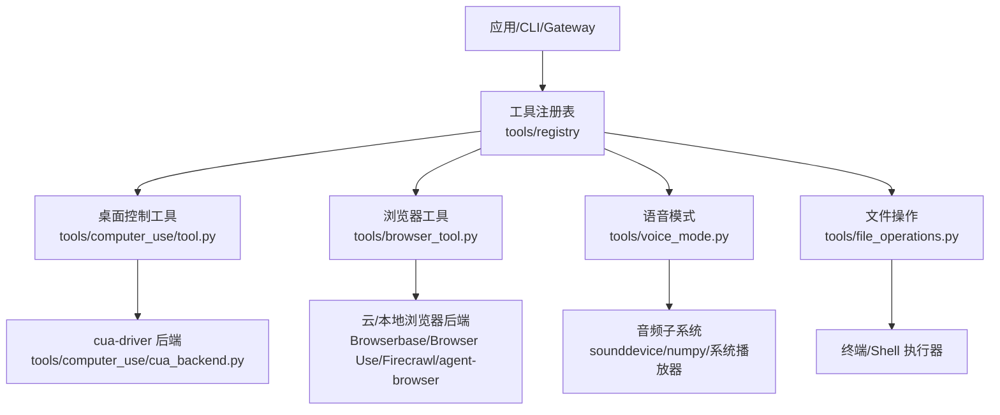
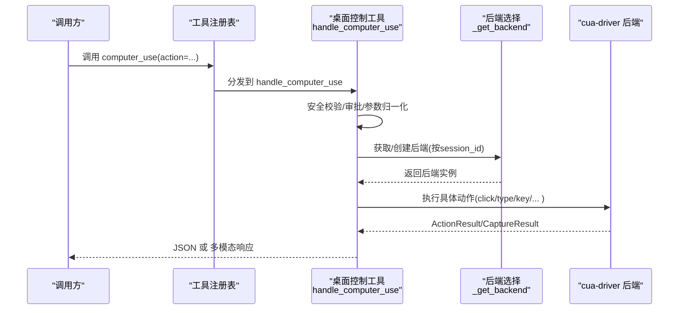
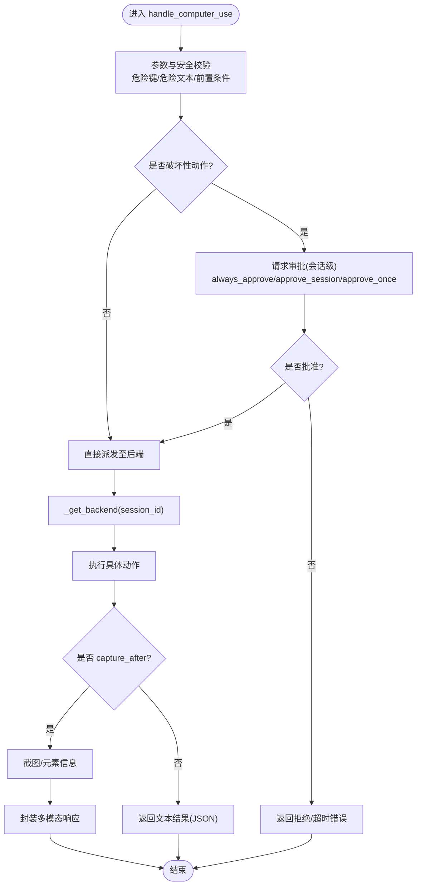
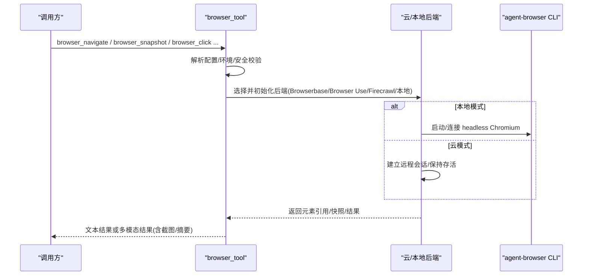
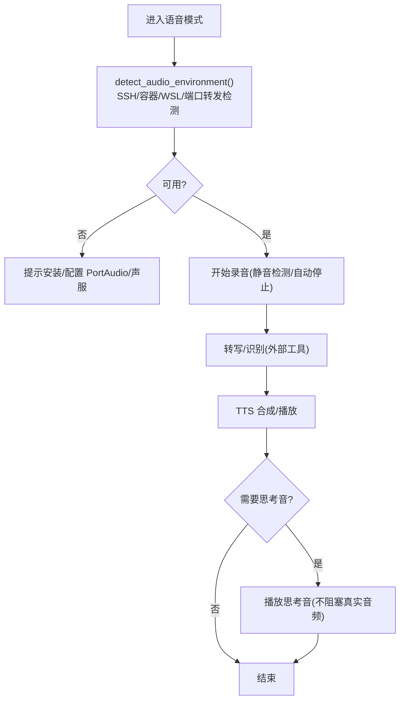
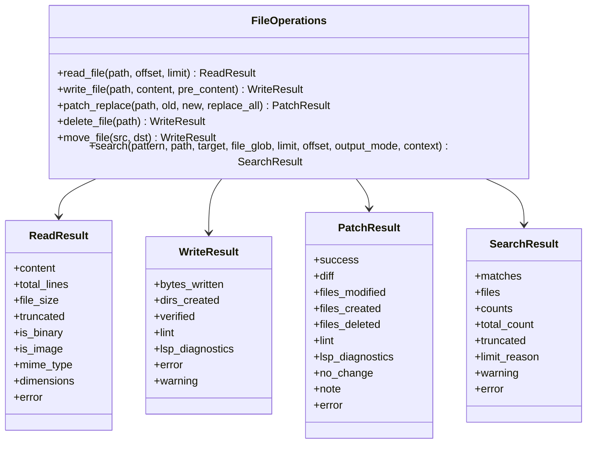
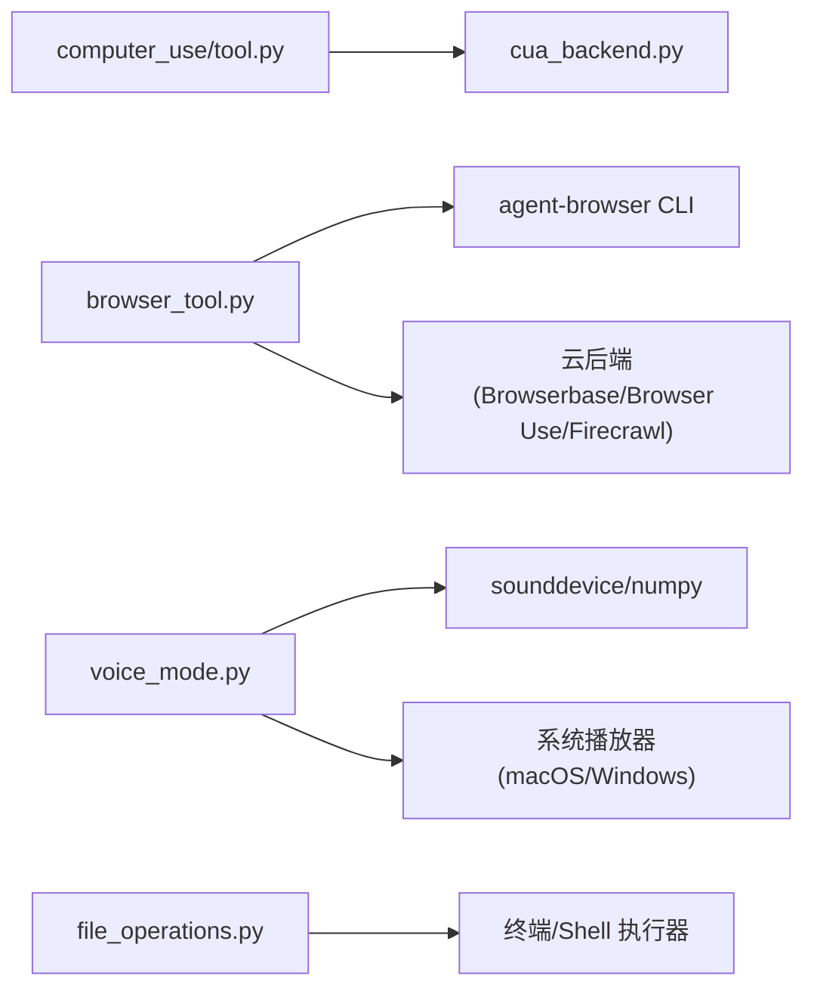

# 计算机使用能力

<cite>
**本文引用的文件**
- [tools/computer_use/tool.py](file://tools/computer_use/tool.py)
- [tools/computer_use/cua_backend.py](file://tools/computer_use/cua_backend.py)
- [tools/browser_tool.py](file://tools/browser_tool.py)
- [tools/voice_mode.py](file://tools/voice_mode.py)
- [tools/file_operations.py](file://tools/file_operations.py)
- [README.md](file://README.md)
</cite>

## 目录
1. [简介](#简介)
2. [项目结构](#项目结构)
3. [核心组件](#核心组件)
4. [架构总览](#架构总览)
5. [详细组件分析](#详细组件分析)
6. [依赖关系分析](#依赖关系分析)
7. [性能考虑](#性能考虑)
8. [故障排查指南](#故障排查指南)
9. [结论](#结论)
10. [附录](#附录)

## 简介
本文件面向“计算机使用能力”的完整说明，覆盖桌面控制、浏览器自动化、语音模式、系统集成与RPA方案，并给出跨平台兼容性与实际应用场景。系统通过统一的工具层暴露能力：桌面控制（窗口管理、屏幕捕获、用户交互）、浏览器自动化（网页导航、元素操作、数据提取）、语音模式（录音、识别、TTS播放）、文件系统与进程管理等。所有能力均支持在 Windows、macOS、Linux 上运行，并通过可插拔后端与配置实现跨平台一致性。

## 项目结构
围绕“计算机使用能力”的关键代码分布在 tools 目录下：
- 桌面控制：tools/computer_use/*（入口、后端、权限、诊断等）
- 浏览器自动化：tools/browser_tool.py（多后端统一接口）
- 语音模式：tools/voice_mode.py（录音、提示音、思考音、环境探测）
- 文件系统：tools/file_operations.py（读/写/补丁/搜索/校验）
- 顶层说明：README.md（安装、跨平台、快速开始）

图表来源
- [tools/computer_use/tool.py:1-120](file://tools/computer_use/tool.py#L1-L120)
- [tools/browser_tool.py:1-120](file://tools/browser_tool.py#L1-L120)
- [tools/voice_mode.py:1-120](file://tools/voice_mode.py#L1-L120)
- [tools/file_operations.py:1-120](file://tools/file_operations.py#L1-L120)

章节来源
- [README.md:35-120](file://README.md#L35-L120)

## 核心组件
- 桌面控制工具（computer_use）
  - 提供跨平台的点击、拖拽、滚动、输入、按键、聚焦应用、列表应用/窗口、截图与类型化浏览器操作。
  - 安全策略：危险键组合拦截、破坏性操作审批、前台/后台投递模式、会话级授权状态隔离。
  - 后端选择：默认 cua-driver（跨平台），可通过环境变量切换或测试用 noop 后端。
- 浏览器工具（browser_tool）
  - 统一封装 agent-browser CLI 与多种云后端（Browserbase、Browser Use、Firecrawl），支持本地无头 Chromium。
  - 以无障碍树快照（ariaSnapshot）作为文本页面表示，便于 LLM 驱动；支持任务级会话隔离、自动清理。
  - 安全：URL 安全检查、敏感查询参数脱敏、CDP 端点发现与日志脱敏。
- 语音模式（voice_mode）
  - 录音采集（sounddevice 或 Termux:API）、静音检测、WAV/AAC 编码、提示音与“思考音”。
  - 环境探测：SSH/Docker/WSL/容器音频转发、PortAudio/PulseAudio/PipeWire 可用性检查。
  - TTS 播放：sounddevice 或系统播放器（macOS afplay、PowerShell Media.SoundPlayer）。
- 文件操作（file_operations）
  - 读/写/补丁/删除/移动/搜索，跨终端后端统一抽象。
  - 行尾与BOM处理、二进制/图片识别、内容去重与压缩输出、结构化结果（ReadResult/WriteResult/PatchResult/SearchResult）。
  - 内置语法检查（JSON/YAML/TOML/Python）与 shell linter 回退；写入前失败关闭策略（关键格式）。

章节来源
- [tools/computer_use/tool.py:1-120](file://tools/computer_use/tool.py#L1-L120)
- [tools/browser_tool.py:1-120](file://tools/browser_tool.py#L1-L120)
- [tools/voice_mode.py:1-120](file://tools/voice_mode.py#L1-L120)
- [tools/file_operations.py:1-120](file://tools/file_operations.py#L1-L120)

## 架构总览
整体采用“工具注册 + 后端抽象”的分层架构：上层工具对外暴露稳定 API，底层通过后端适配不同平台与服务。

图表来源
- [tools/computer_use/tool.py:440-512](file://tools/computer_use/tool.py#L440-L512)
- [tools/computer_use/tool.py:201-253](file://tools/computer_use/tool.py#L201-L253)
- [tools/computer_use/cua_backend.py:1-130](file://tools/computer_use/cua_backend.py#L1-L130)

## 详细组件分析

### 桌面控制（computer_use）
- 功能要点
  - 读取类动作（capture/wait/list_apps/list_windows/cua_browser_state）始终允许。
  - 写入类动作（click/double_click/right_click/middle_click/drag/scroll/type/key/set_value/focus_app 及 cua_browser_*）需审批。
  - 危险键组合硬拦截（如锁屏、注销、强制退出等）。
  - 支持前台/后台投递模式，必要时提升为前台。
  - 会话级审批状态隔离，避免并发会话互相影响。
- 后端与生命周期
  - 默认后端 cua-driver，通过环境变量 SPARKII_COMPUTER_USE_BACKEND 切换。
  - 每个 session_id 拥有独立后端实例与调用锁，支持释放与优雅关闭。
  - atexit 钩子确保子进程不泄露。
- 响应形态
  - 文本动作返回 JSON；带 capture_after 的动作返回多模态消息（文本摘要+图像 base64）。

图表来源
- [tools/computer_use/tool.py:440-512](file://tools/computer_use/tool.py#L440-L512)
- [tools/computer_use/tool.py:514-588](file://tools/computer_use/tool.py#L514-L588)
- [tools/computer_use/tool.py:590-788](file://tools/computer_use/tool.py#L590-L788)

章节来源
- [tools/computer_use/tool.py:80-136](file://tools/computer_use/tool.py#L80-L136)
- [tools/computer_use/tool.py:149-169](file://tools/computer_use/tool.py#L149-L169)
- [tools/computer_use/tool.py:201-316](file://tools/computer_use/tool.py#L201-L316)
- [tools/computer_use/tool.py:440-788](file://tools/computer_use/tool.py#L440-L788)

### 浏览器自动化（browser_tool）
- 能力概览
  - 统一接口：导航、快照、点击、输入、对话框处理、下载、状态查询等。
  - 多后端：本地 headless Chromium（agent-browser）、Browserbase、Browser Use、Firecrawl；可选 Camofox 反检测。
  - 会话隔离：按 task_id 隔离浏览器会话，自动清理。
  - 文本优先：基于无障碍树快照（ariaSnapshot）进行元素定位与交互。
- 安全与健壮性
  - URL 安全校验、敏感查询参数名屏蔽、CDP 端点发现与日志脱敏。
  - 命令超时与首次打开超时保护，Docker/沙箱启动失败提示。
  - 插件注册与动态发现，支持第三方浏览器插件扩展。
- 配置与环境
  - 通过 config.yaml 与环境变量控制云提供商、超时、对话框策略、代理等。
  - PATH 增强以支持 Homebrew Node、Termux、systemd 服务场景。

图表来源
- [tools/browser_tool.py:1-120](file://tools/browser_tool.py#L1-L120)
- [tools/browser_tool.py:125-177](file://tools/browser_tool.py#L125-L177)
- [tools/browser_tool.py:259-343](file://tools/browser_tool.py#L259-L343)
- [tools/browser_tool.py:424-556](file://tools/browser_tool.py#L424-L556)
- [tools/browser_tool.py:669-783](file://tools/browser_tool.py#L669-L783)

章节来源
- [tools/browser_tool.py:1-120](file://tools/browser_tool.py#L1-L120)
- [tools/browser_tool.py:125-177](file://tools/browser_tool.py#L125-L177)
- [tools/browser_tool.py:259-343](file://tools/browser_tool.py#L259-L343)
- [tools/browser_tool.py:424-556](file://tools/browser_tool.py#L424-L556)
- [tools/browser_tool.py:669-783](file://tools/browser_tool.py#L669-L783)

### 语音模式（voice_mode）
- 能力概览
  - 录音：sounddevice 或 Termux:API（Android），支持静音检测与自动停止。
  - 提示音与“思考音”：合成音调与柔和气泡音，避免阻塞真实音频输出。
  - TTS 播放：sounddevice（非 macOS）或系统播放器（macOS afplay、Windows PowerShell）。
  - 环境探测：SSH/容器/WSL 音频转发、PortAudio/PulseAudio/PipeWire 可用性。
- 配置与行为
  - beep_volume/thinking_sound 等开关来自配置。
  - 输出活跃计数用于协调“思考音”与真实语音播放，避免冲突。
  - Termux 下通过 termux-microphone-record 与 Termux:API 应用协同工作。

图表来源
- [tools/voice_mode.py:277-422](file://tools/voice_mode.py#L277-L422)
- [tools/voice_mode.py:478-530](file://tools/voice_mode.py#L478-L530)
- [tools/voice_mode.py:547-670](file://tools/voice_mode.py#L547-L670)
- [tools/voice_mode.py:684-800](file://tools/voice_mode.py#L684-L800)

章节来源
- [tools/voice_mode.py:277-422](file://tools/voice_mode.py#L277-L422)
- [tools/voice_mode.py:478-530](file://tools/voice_mode.py#L478-L530)
- [tools/voice_mode.py:547-670](file://tools/voice_mode.py#L547-L670)
- [tools/voice_mode.py:684-800](file://tools/voice_mode.py#L684-L800)

### 文件系统与进程管理（file_operations）
- 能力概览
  - 读/写/补丁/删除/移动/搜索，统一抽象跨终端后端。
  - 行尾与BOM处理，保证跨平台一致性与编辑稳定性。
  - 结构化结果：ReadResult/WriteResult/PatchResult/SearchResult/LintResult/ExecuteResult。
  - 内置语法检查：JSON/YAML/TOML/Python；shell linter 回退。
  - 写入前失败关闭：对关键格式（JSON/YAML/TOML）严格校验。
- 搜索与输出优化
  - 将大量匹配结果压缩为路径分组文本块，减少模型上下文开销。
  - 区分 rg/grep 的诊断信息与真实匹配，避免误解析。

图表来源
- [tools/file_operations.py:451-515](file://tools/file_operations.py#L451-L515)
- [tools/file_operations.py:159-346](file://tools/file_operations.py#L159-L346)
- [tools/file_operations.py:245-329](file://tools/file_operations.py#L245-L329)

章节来源
- [tools/file_operations.py:1-120](file://tools/file_operations.py#L1-L120)
- [tools/file_operations.py:159-346](file://tools/file_operations.py#L159-L346)
- [tools/file_operations.py:451-515](file://tools/file_operations.py#L451-L515)

## 依赖关系分析
- 桌面控制
  - 依赖 cua-driver（跨平台原生驱动），通过 MCP stdio 通信。
  - 会话级后端缓存与线程锁，保证并发安全与资源隔离。
- 浏览器自动化
  - 依赖 agent-browser CLI 与 Node 环境；云后端通过各自 SDK/API。
  - 插件机制支持第三方浏览器提供者扩展。
- 语音模式
  - 依赖 sounddevice、numpy；macOS 使用 afplay；Windows 使用 PowerShell 媒体播放器。
  - 在 SSH/容器/WSL 中通过 PulseAudio/PipeWire 转发实现音频。
- 文件操作
  - 依赖终端/Shell 执行器；可选 LSP 语义诊断；内置轻量语法检查。

图表来源
- [tools/computer_use/tool.py:201-253](file://tools/computer_use/tool.py#L201-L253)
- [tools/computer_use/cua_backend.py:1-130](file://tools/computer_use/cua_backend.py#L1-L130)
- [tools/browser_tool.py:125-177](file://tools/browser_tool.py#L125-L177)
- [tools/voice_mode.py:277-422](file://tools/voice_mode.py#L277-L422)
- [tools/file_operations.py:451-515](file://tools/file_operations.py#L451-L515)

章节来源
- [tools/computer_use/tool.py:201-253](file://tools/computer_use/tool.py#L201-L253)
- [tools/browser_tool.py:125-177](file://tools/browser_tool.py#L125-L177)
- [tools/voice_mode.py:277-422](file://tools/voice_mode.py#L277-L422)
- [tools/file_operations.py:451-515](file://tools/file_operations.py#L451-L515)

## 性能考虑
- 浏览器工具
  - 首次打开与冷启动超时更长，避免慢主机或库缺失导致的误判。
  - 快照内容截断与 LLM 摘要，限制存储大小，降低上下文压力。
  - 插件与后端懒加载，减少启动开销。
- 桌面控制
  - 会话级后端缓存与调用锁，避免重复创建与竞态。
  - 截图与元素信息按需生成，减少不必要开销。
- 语音模式
  - “思考音”仅在无真实音频输出时播放，避免频繁子进程与设备争用。
  - 静音检测与自动停止，减少无效录音。
- 文件操作
  - 搜索结果密度化输出，减少 token 消耗。
  - 写入前失败关闭，避免无效写入与后续修复成本。

[本节为通用性能建议，无需特定文件来源]

## 故障排查指南
- 桌面控制
  - 若后端不可用，查看错误中的安装提示（cua-driver 缺失或依赖不足）。
  - 使用“doctor”能力检查显示服务器、可访问性树、Wayland/X11 可达性。
- 浏览器自动化
  - 超时错误包含常见原因与建议（Chromium 沙箱、系统库缺失、Docker 镜像）。
  - CDP 端点解析失败会记录警告，检查配置与网络连通性。
- 语音模式
  - 环境探测返回 warnings/notices，指示缺少 PortAudio、未配置声服或 Termux:API 应用。
  - macOS 输出走 afplay，避免 TCC 权限弹窗；Windows WSL 需配置 PulseAudio 桥。
- 文件操作
  - 搜索超时或正则不支持换行时会给出明确提示。
  - 写入失败时检查 deny list 与语法校验结果。

章节来源
- [tools/computer_use/tool.py:494-512](file://tools/computer_use/tool.py#L494-L512)
- [tools/browser_tool.py:385-421](file://tools/browser_tool.py#L385-L421)
- [tools/browser_tool.py:424-556](file://tools/browser_tool.py#L424-L556)
- [tools/voice_mode.py:277-422](file://tools/voice_mode.py#L277-L422)
- [tools/file_operations.py:358-420](file://tools/file_operations.py#L358-L420)

## 结论
本项目通过统一工具层与可插拔后端，实现了跨平台的桌面控制、浏览器自动化、语音模式与文件操作能力。其设计强调安全性（审批、危险拦截、URL/CDP 安全）、健壮性（超时、降级、清理）与可扩展性（插件、后端抽象）。结合 RPA 思路，可将重复性任务编排为可复用的流程，配合定时调度与消息通道，形成端到端的自动化解决方案。

[本节为总结性内容，无需特定文件来源]

## 附录
- 跨平台兼容性
  - Windows/macOS/Linux 均受支持；桌面控制通过 cua-driver 统一；浏览器支持本地与云端；语音模式适配各平台音频栈。
- RPA 方案建议
  - 将“桌面控制 + 浏览器自动化 + 文件操作 + 语音交互”组合为流程步骤，使用审批与重试机制保障可靠性。
  - 借助 cron 与网关投递，实现无人值守的周期性任务。
- 实际应用场景
  - 办公自动化：表单填写、报表生成、邮件处理。
  - 数据迁移：批量文件读写、格式转换、校验与上报。
  - 系统维护：进程监控、日志收集、配置更新与健康检查。

[本节为概念性内容，无需特定文件来源]