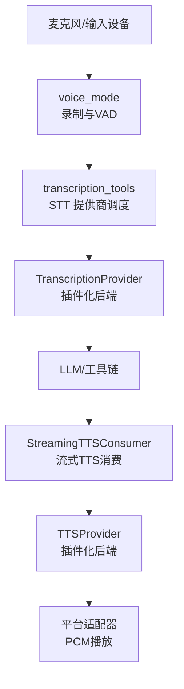
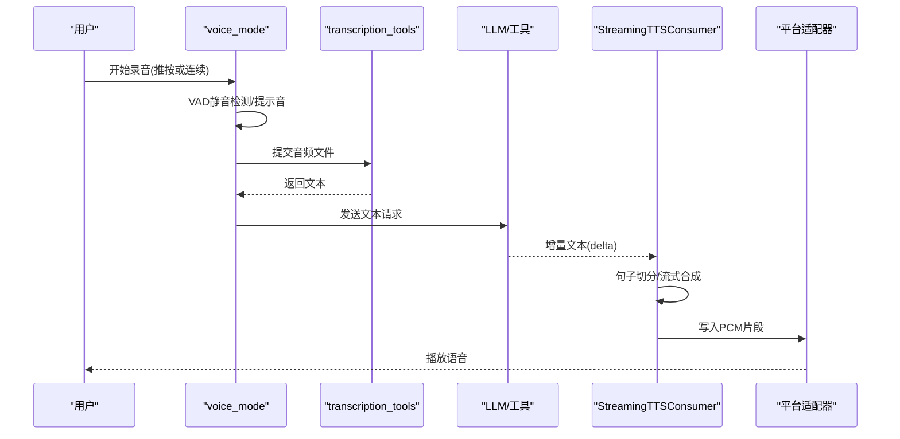
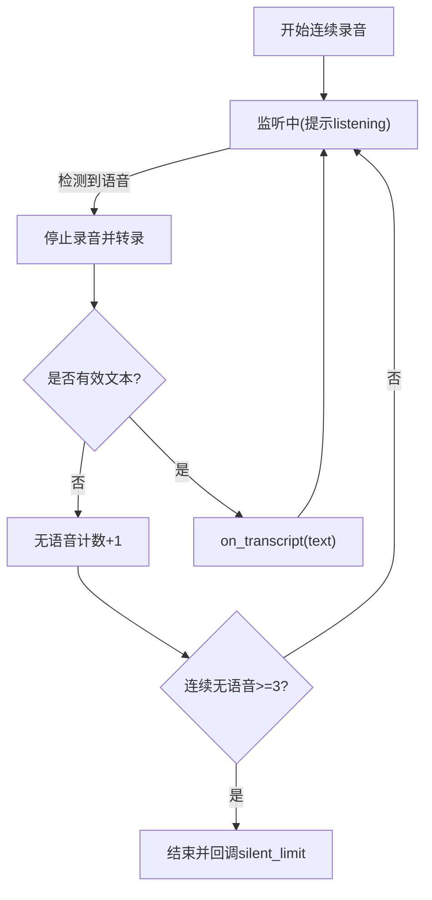
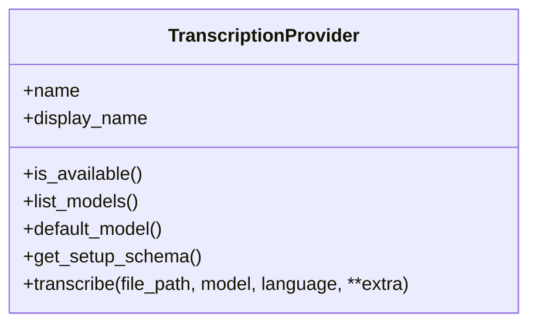
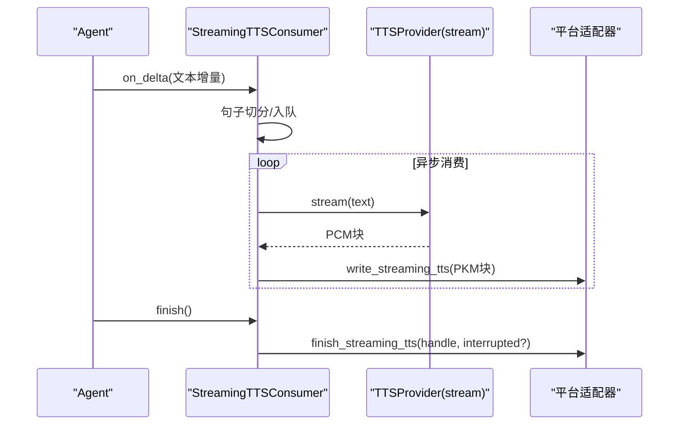
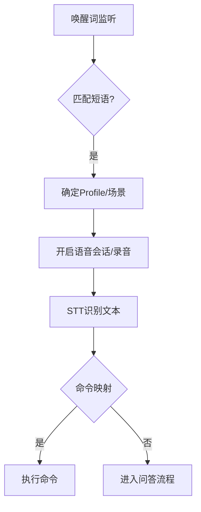
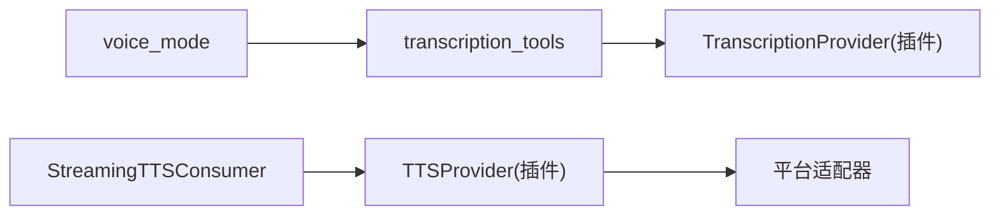

# 语音模式

<cite>
**本文引用的文件**
- [tools/voice_mode.py](file://tools/voice_mode.py)
- [sparkii_cli/voice.py](file://sparkii_cli/voice.py)
- [tools/transcription_tools.py](file://tools/transcription_tools.py)
- [agent/transcription_provider.py](file://agent/transcription_provider.py)
- [agent/tts_provider.py](file://agent/tts_provider.py)
- [gateway/streaming_tts_consumer.py](file://gateway/streaming_tts_consumer.py)
- [tools/wake_word.py](file://tools/wake_word.py)
</cite>

## 目录
1. [简介](#简介)
2. [项目结构](#项目结构)
3. [核心组件](#核心组件)
4. [架构总览](#架构总览)
5. [详细组件分析](#详细组件分析)
6. [依赖关系分析](#依赖关系分析)
7. [性能考虑](#性能考虑)
8. [故障排查指南](#故障排查指南)
9. [结论](#结论)
10. [附录](#附录)

## 简介
本文件面向“语音模式”的完整使用与配置，覆盖以下能力：
- 语音识别（STT）：音频输入源选择、语言模型选择、识别精度调优、多语言与方言支持。
- 文本转语音（TTS）：多声音引擎、语速控制、流式播放与中断处理。
- 实时对话机制：语音流处理、延迟优化、中断与静音检测。
- 语音命令系统：可识别指令集与执行映射（含唤醒词）。
- 质量增强：噪音过滤与回声消除建议。
- 应用场景：会议记录、语音备忘录、智能问答等。

## 项目结构
语音模式由“采集/录制—识别—推理—合成—播放”链路组成，关键模块分布如下：
- 采集与录制：tools/voice_mode.py（声卡/设备、VAD、提示音、思考音）、sparkii_cli/voice.py（推按说话与连续录音循环）、tools/wake_word.py（唤醒词监听）。
- 识别（STT）：tools/transcription_tools.py（内置提供商与命令型提供商）、agent/transcription_provider.py（插件化 STT 抽象）。
- 合成（TTS）：agent/tts_provider.py（插件化 TTS 抽象）、gateway/streaming_tts_consumer.py（流式消费与播放）。
- 平台适配：各平台通过适配器完成 PCM 流写入与播放。

图表来源
- [tools/voice_mode.py:427-435](file://tools/voice_mode.py#L427-L435)
- [tools/transcription_tools.py:109-128](file://tools/transcription_tools.py#L109-L128)
- [agent/transcription_provider.py:61-194](file://agent/transcription_provider.py#L61-L194)
- [gateway/streaming_tts_consumer.py:55-103](file://gateway/streaming_tts_consumer.py#L55-L103)
- [agent/tts_provider.py:64-255](file://agent/tts_provider.py#L64-L255)

章节来源
- [tools/voice_mode.py:1-120](file://tools/voice_mode.py#L1-L120)
- [tools/transcription_tools.py:1-128](file://tools/transcription_tools.py#L1-L128)
- [agent/transcription_provider.py:1-194](file://agent/transcription_provider.py#L1-L194)
- [agent/tts_provider.py:1-255](file://agent/tts_provider.py#L1-L255)
- [gateway/streaming_tts_consumer.py:1-103](file://gateway/streaming_tts_consumer.py#L1-L103)

## 核心组件
- 录音与交互
  - 推按说话：start_recording / stop_and_transcribe，适合单次捕获。
  - 连续录音（VAD）：start_continuous / stop_continuous，自动静音停止、转录、回调、自动重启；三次连续无语音自动退出。
  - 提示音与思考音：play_beep、thinking_sound，提升交互反馈。
- 语音识别（STT）
  - 内置提供商：local（faster-whisper）、groq、openai、mistral、xai、elevenlabs、deepinfra。
  - 命令型提供商：通过 stt.providers.<name>: type: command 接入任意 CLI。
  - 插件提供商：实现 TranscriptionProvider 接口。
- 文本转语音（TTS）
  - 插件提供商：实现 TTSProvider 接口，支持 synthesize 与可选 stream。
  - 流式消费：StreamingTTSConsumer 将 LLM 增量文本切句并流式合成 PCM，降低首包延迟。
- 唤醒词
  - openWakeWord、sherpa-onnx、Porcupine 三种本地引擎，支持多短语与多 Profile 路由。

章节来源
- [sparkii_cli/voice.py:361-416](file://sparkii_cli/voice.py#L361-L416)
- [sparkii_cli/voice.py:421-519](file://sparkii_cli/voice.py#L421-L519)
- [tools/voice_mode.py:478-530](file://tools/voice_mode.py#L478-L530)
- [tools/transcription_tools.py:373-414](file://tools/transcription_tools.py#L373-L414)
- [agent/transcription_provider.py:61-194](file://agent/transcription_provider.py#L61-L194)
- [agent/tts_provider.py:64-255](file://agent/tts_provider.py#L64-L255)
- [gateway/streaming_tts_consumer.py:55-103](file://gateway/streaming_tts_consumer.py#L55-L103)
- [tools/wake_word.py:1-30](file://tools/wake_word.py#L1-L30)

## 架构总览
语音模式采用“插件化 + 流式”的解耦架构：
- STT 层：统一入口 transcribe_audio，优先走内置提供商，其次命令型提供商，最后插件提供商。
- TTS 层：统一抽象 TTSProvider，支持整文件合成与流式合成；Gateway 侧通过 StreamingTTSConsumer 将 LLM 增量转为 PCM 流。
- 交互层：voice_mode 提供录制、VAD、提示音、思考音；CLI 封装 push-to-talk 与连续循环。
- 唤醒层：wake_word 在后台线程持续监听，触发新会话与语音采集。

图表来源
- [sparkii_cli/voice.py:421-519](file://sparkii_cli/voice.py#L421-L519)
- [tools/transcription_tools.py:109-128](file://tools/transcription_tools.py#L109-L128)
- [gateway/streaming_tts_consumer.py:156-193](file://gateway/streaming_tts_consumer.py#L156-L193)
- [gateway/streaming_tts_consumer.py:218-339](file://gateway/streaming_tts_consumer.py#L218-L339)

## 详细组件分析

### 录音与交互（voice_mode 与 sparkii_cli/voice）
- 推按说话
  - start_recording：创建并启动录音器。
  - stop_and_transcribe：停止录音、调用 STT、清理临时文件、过滤幻觉输出。
- 连续录音（VAD）
  - start_continuous：设置静音阈值/时长、最大录音时长、回调；启动后进入监听状态。
  - stop_continuous：可选择强制转录并在后台线程完成清理；三次连续无语音自动退出。
  - 活动保持：当 TTS 播放或代理忙时，静音周期不计入“无语音计数”，避免误关。
- 提示音与思考音
  - play_beep：生成短促提示音，macOS 下通过 afplay 避免权限弹窗。
  - thinking_sound：低音量气泡音，提示“正在思考”。

图表来源
- [sparkii_cli/voice.py:421-519](file://sparkii_cli/voice.py#L421-L519)
- [sparkii_cli/voice.py:522-673](file://sparkii_cli/voice.py#L522-L673)
- [tools/voice_mode.py:478-530](file://tools/voice_mode.py#L478-L530)

章节来源
- [sparkii_cli/voice.py:361-416](file://sparkii_cli/voice.py#L361-L416)
- [sparkii_cli/voice.py:421-673](file://sparkii_cli/voice.py#L421-L673)
- [tools/voice_mode.py:427-435](file://tools/voice_mode.py#L427-L435)
- [tools/voice_mode.py:478-530](file://tools/voice_mode.py#L478-L530)

### 语音识别（STT）
- 提供商优先级
  1) 内置提供商（local、groq、openai、mistral、xai、elevenlabs、deepinfra）
  2) 命令型提供商（stt.providers.<name>: type: command）
  3) 插件提供商（实现 TranscriptionProvider）
- 语言与模型
  - 语言解析顺序：stt.<provider>.language > stt.language > 环境变量 > 自动检测。
  - 模型归一化：对 local 提供商进行模型名归一，避免云厂商名称导致的不兼容。
- 音频预处理
  - 统一转码为 m4a（16kHz 单声道 AAC），提高云端 API 兼容性。
- 错误与超时
  - 命令型提供商具备进程树终止与超时保护，避免僵尸进程。

图表来源
- [agent/transcription_provider.py:61-194](file://agent/transcription_provider.py#L61-L194)

章节来源
- [tools/transcription_tools.py:109-128](file://tools/transcription_tools.py#L109-L128)
- [tools/transcription_tools.py:164-210](file://tools/transcription_tools.py#L164-L210)
- [tools/transcription_tools.py:235-287](file://tools/transcription_tools.py#L235-L287)
- [tools/transcription_tools.py:373-414](file://tools/transcription_tools.py#L373-L414)
- [tools/transcription_tools.py:417-484](file://tools/transcription_tools.py#L417-L484)
- [tools/transcription_tools.py:515-536](file://tools/transcription_tools.py#L515-L536)
- [tools/transcription_tools.py:590-627](file://tools/transcription_tools.py#L590-L627)
- [tools/transcription_tools.py:630-693](file://tools/transcription_tools.py#L630-L693)
- [tools/transcription_tools.py:695-800](file://tools/transcription_tools.py#L695-L800)
- [agent/transcription_provider.py:61-194](file://agent/transcription_provider.py#L61-L194)

### 文本转语音（TTS）与流式消费
- 插件化 TTS
  - 支持 synthesize（整文件）与 stream（流式字节迭代）。
  - 输出格式限制与默认值：mp3/wav/ogg/opus/flac，默认 mp3；流式默认 opus。
  - voice_compatible：标记是否适合语音气泡直传（网关会做 Opus 转换）。
- 流式消费
  - SentenceChunker：将增量文本切分为子句，降低首包延迟。
  - 队列与任务：异步任务从队列取子句，调用流式提供者合成 PCM，写入平台适配器。
  - 中断与完成：abort 安全中止；completed/suppress_whole_file 控制是否回退整文件 TTS。

图表来源
- [gateway/streaming_tts_consumer.py:55-103](file://gateway/streaming_tts_consumer.py#L55-L103)
- [gateway/streaming_tts_consumer.py:156-193](file://gateway/streaming_tts_consumer.py#L156-L193)
- [gateway/streaming_tts_consumer.py:218-339](file://gateway/streaming_tts_consumer.py#L218-L339)
- [agent/tts_provider.py:180-255](file://agent/tts_provider.py#L180-L255)

章节来源
- [agent/tts_provider.py:55-255](file://agent/tts_provider.py#L55-L255)
- [gateway/streaming_tts_consumer.py:55-103](file://gateway/streaming_tts_consumer.py#L55-L103)
- [gateway/streaming_tts_consumer.py:156-193](file://gateway/streaming_tts_consumer.py#L156-L193)
- [gateway/streaming_tts_consumer.py:218-339](file://gateway/streaming_tts_consumer.py#L218-L339)
- [gateway/streaming_tts_consumer.py:368-424](file://gateway/streaming_tts_consumer.py#L368-L424)

### 唤醒词与语音命令
- 唤醒词引擎
  - openWakeWord：免费、本地 ONNX/TFLite，支持内置与自定义模型。
  - sherpa-onnx：开放词汇关键词检测，无需训练，运行时 token 化。
  - Porcupine：付费方案，支持内置与自定义关键词。
- 多 Profile 路由
  - 读取各 Profile 的 wake_word.enabled 与 phrase，构建短语到 Profile 的映射，一个监听器即可唤醒不同 Profile。
- 语音命令
  - 通过 STT 识别到的文本，结合业务规则映射为命令执行（例如“停止”、“记录会议”等）。
  - 可在 voice_mode 中定义“停止短语”以结束语音会话。

图表来源
- [tools/wake_word.py:75-89](file://tools/wake_word.py#L75-L89)
- [tools/wake_word.py:331-374](file://tools/wake_word.py#L331-L374)
- [tools/wake_word.py:529-619](file://tools/wake_word.py#L529-L619)
- [tools/wake_word.py:659-777](file://tools/wake_word.py#L659-L777)
- [tools/wake_word.py:779-800](file://tools/wake_word.py#L779-L800)

章节来源
- [tools/wake_word.py:1-30](file://tools/wake_word.py#L1-L30)
- [tools/wake_word.py:75-89](file://tools/wake_word.py#L75-L89)
- [tools/wake_word.py:331-374](file://tools/wake_word.py#L331-L374)
- [tools/wake_word.py:529-619](file://tools/wake_word.py#L529-L619)
- [tools/wake_word.py:659-777](file://tools/wake_word.py#L659-L777)
- [tools/wake_word.py:779-800](file://tools/wake_word.py#L779-L800)

## 依赖关系分析
- 组件耦合
  - voice_mode 与 transcription_tools 强耦合于 STT 提供商；通过 TranscriptionProvider 抽象降低耦合。
  - StreamingTTSConsumer 与 TTSProvider 通过 stream/synthesize 契约解耦；平台适配器负责最终播放。
- 外部依赖
  - sounddevice/numpy 用于音频 I/O 与信号处理。
  - ffmpeg 用于音频转码（m4a/AAC）。
  - faster-whisper 用于本地 STT。
  - 各云端提供商 SDK（OpenAI、Groq、Mistral、xAI、ElevenLabs、DeepInfra）。
- 潜在循环依赖
  - 通过懒加载与模块化隔离避免导入环（如 tools.lazy_deps、延迟 import）。

图表来源
- [tools/voice_mode.py:1-120](file://tools/voice_mode.py#L1-L120)
- [tools/transcription_tools.py:109-128](file://tools/transcription_tools.py#L109-L128)
- [agent/transcription_provider.py:61-194](file://agent/transcription_provider.py#L61-L194)
- [agent/tts_provider.py:64-255](file://agent/tts_provider.py#L64-L255)
- [gateway/streaming_tts_consumer.py:55-103](file://gateway/streaming_tts_consumer.py#L55-L103)

章节来源
- [tools/voice_mode.py:1-120](file://tools/voice_mode.py#L1-L120)
- [tools/transcription_tools.py:109-128](file://tools/transcription_tools.py#L109-L128)
- [agent/transcription_provider.py:61-194](file://agent/transcription_provider.py#L61-L194)
- [agent/tts_provider.py:64-255](file://agent/tts_provider.py#L64-L255)
- [gateway/streaming_tts_consumer.py:55-103](file://gateway/streaming_tts_consumer.py#L55-L103)

## 性能考虑
- 首包延迟优化
  - 使用 StreamingTTSConsumer 的流式合成，边生成边播放，显著降低首包延迟。
- 资源占用
  - local STT 模型单例缓存与空闲卸载，减少长时间驻留的内存/显存占用。
- 音频格式
  - 统一转码为 m4a（16kHz 单声道 AAC），兼顾上传体积与兼容性。
- 并发与阻塞
  - 命令型提供商具备超时与进程树终止；队列满时丢弃非关键子句，避免阻塞。
- 平台差异
  - macOS 输出路径切换至 afplay，避免权限弹窗；Termux 环境特殊处理。

[本节为通用性能讨论，不直接分析具体文件]

## 故障排查指南
- 无法录音
  - 检查 PortAudio/sounddevice 安装与环境（SSH/Docker/WSL/PulseAudio/PipeWire 转发）。
  - Termux 需安装 termux-api 与对应 App。
- 识别失败
  - 确认 STT 提供商密钥与网络可达；检查语言与模型配置；查看转码日志。
- TTS 无声
  - 确认 TTS 提供商可用；检查输出格式与平台播放器；流式消费是否成功 begin_streaming_tts。
- 唤醒词无效
  - 检查 provider 与 phrase；macOS ARM64 上 tflite 后端更稳定；确认多 Profile 短语注册。

章节来源
- [tools/voice_mode.py:277-422](file://tools/voice_mode.py#L277-L422)
- [tools/transcription_tools.py:235-287](file://tools/transcription_tools.py#L235-L287)
- [gateway/streaming_tts_consumer.py:218-239](file://gateway/streaming_tts_consumer.py#L218-L239)
- [tools/wake_word.py:109-157](file://tools/wake_word.py#L109-L157)

## 结论
本语音模式通过插件化的 STT/TTS 抽象与流式消费机制，实现了低延迟、可扩展、跨平台的语音交互能力。配合唤醒词、VAD、提示音与思考音，形成完整的语音助手闭环。推荐在生产环境中：
- 根据场景选择合适的 STT/TTS 提供商组合（本地 vs 云端）。
- 启用流式 TTS 以降低首包延迟。
- 合理配置语言与模型，必要时进行音频转码与降噪。
- 利用唤醒词与命令映射，打造自然的人机交互体验。

[本节为总结性内容，不直接分析具体文件]

## 附录
- 配置要点（示例字段说明）
  - STT
    - stt.provider：选择提供商（local/groq/openai/mistral/xai/elevenlabs/deepinfra 或命令型/插件）。
    - stt.language：全局语言；stt.<provider>.language：提供商级语言。
    - stt.providers.<name>.command：命令型提供商的 shell 模板。
  - TTS
    - tts.provider：选择提供商（edge/openai/elevenlabs/minimax/gemini/mistral/xai/piper/kittentts/neutts 或插件）。
    - tts.output_format：mp3/wav/ogg/opus/flac。
    - tts.providers.<name>.voice_compatible：是否适合语音气泡直传。
  - 语音模式
    - voice.record_key：推按说话快捷键。
    - voice.beep_enabled / voice.beep_volume：提示音开关与音量。
    - voice.thinking_sound：思考音开关。
    - voice.max_recording_seconds：单次录音上限。
  - 唤醒词
    - wake_word.enabled / surface / provider / phrase / sensitivity / confirmation_frames。
    - wake_word.openwakeword.inference_framework：onnx/tflite（macOS ARM64 推荐 tflite）。
    - wake_word.sherpa.model_dir：sherpa KWS 模型目录。
    - wake_word.porcupine.keyword：Porcupine 关键词。

[本节为配置参考，不直接分析具体文件]