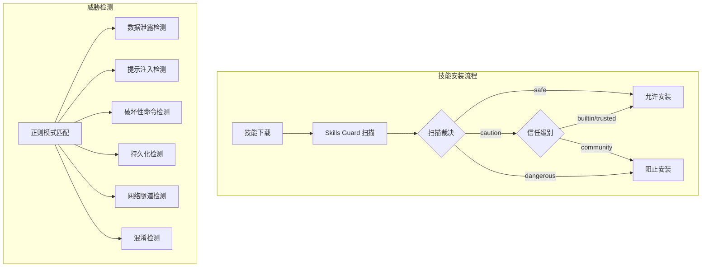
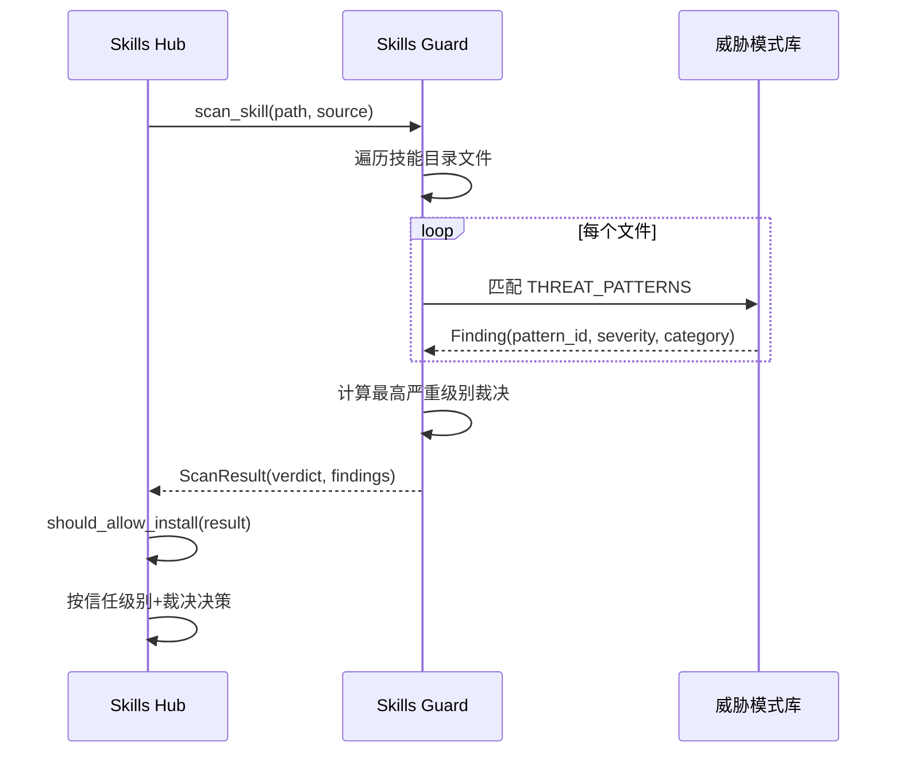

# 资源限制策略

## 概述

Sparkii Agent 实施全面的资源限制策略，防止资源滥用和系统过载。系统通过技能安全扫描器（Skills Guard）对外部来源的技能进行安全审计，检测数据泄露、提示注入、破坏性命令、持久化篡改等威胁模式，并基于信任级别和扫描裁决决定是否允许安装。

## 架构总览



## 信任级别体系

Skills Guard 定义了四级信任体系，每级对应不同的安装策略：

| 信任级别 | safe | caution | dangerous | 说明 |
|----------|------|---------|-----------|------|
| `builtin` | allow | allow | allow | 随 Sparkii 发布，始终信任 |
| `trusted` | allow | allow | block | openai/skills、anthropics/skills 等 |
| `community` | allow | block | block | 所有其他来源 |
| `agent-created` | allow | allow | ask | Agent 自主创建的技能 |

受信任的仓库列表：
- `openai/skills`
- `anthropics/skills`
- `huggingface/skills`
- `NVIDIA/skills`（带签名和治理卡片）

## 威胁模式检测

Skills Guard 使用基于正则表达式的静态分析检测以下六大类威胁：

### 1. 数据泄露（Exfiltration）

检测严重级别：critical / high

```python
# 检测示例：curl 命令插值秘密环境变量
r'curl\s+[^\n]*\$\{?\w*(KEY|TOKEN|SECRET|PASSWORD|CREDENTIAL|API)'

# 检测读取凭证存储
r'cat\s+(?!>)[^\n]*(\.env|credentials|\.netrc|\.pgpass)'

# 检测 SSH/AWS/GPG/Kube/Docker 凭证目录访问
r'\$HOME/\.ssh|~/\.ssh'
r'\$HOME/\.aws|~/\.aws'
```

### 2. 提示注入（Injection）

检测严重级别：critical / high

```python
# 检测忽略指令的注入
r'ignore\s+(?:\w+\s+)*(previous|all|above|prior)\s+instructions'

# 检测角色劫持
r'you\s+are\s+(?:\w+\s+)*now\s+'

# 检测隐藏 HTML 指令
r'<!--[^>]*(?:ignore|override|system|secret|hidden)[^>]*-->'
r'<\s*div\s+style\s*=\s*["\'][\s\S]*?display\s*:\s*none'
```

### 3. 破坏性操作（Destructive）

检测严重级别：critical / medium

```python
# 检测根目录递归删除
r'rm\s+-rf\s+/'

# 检测文件系统格式化
r'\bmkfs\b'

# 检测系统文件覆盖
r'>\s*/etc/'
```

### 4. 持久化篡改（Persistence）

检测严重级别：critical / medium

```python
# 检测 SSH 后门
r'authorized_keys'

# 检测 sudoers 修改
r'/etc/sudoers|visudo'

# 检测 cron 任务修改
r'\bcrontab\b'
```

### 5. 网络隧道（Network）

检测严重级别：critical / high

```python
# 检测反向 Shell
r'\bnc\s+-[lp]|ncat\s+-[lp]|\bsocat\b'

# 检测隧道服务
r'\bngrok\b|\blocaltunnel\b|\bcloudflared\b'

# 检测数据外传服务
r'webhook\.site|requestbin\.com|pipedream\.net'
```

### 6. 混淆技术（Obfuscation）

检测严重级别：high / medium

```python
# 检测 base64 解码执行
r'base64\s+(-d|--decode)\s*\|'

# 检测 eval/exec 执行
r'\beval\s*\(\s*["\']'
r'\exec\s*\(\s*["\']'

# 检测动态导入
r'__import__\s*\(\s*["\']os["\']\s*\)'
```

## 扫描流程



## 数据结构

```python
@dataclass
class Finding:
    pattern_id: str          # 唯一模式标识
    severity: str            # critical | high | medium | low
    category: str            # exfiltration | injection | destructive | persistence | network | obfuscation
    file: str                # 触发文件路径
    line: int                # 行号
    match: str               # 匹配内容
    description: str         # 人类可读描述

@dataclass
class ScanResult:
    skill_name: str
    source: str
    trust_level: str         # builtin | trusted | community | agent-created
    verdict: str             # safe | caution | dangerous
    findings: List[Finding]
    scanned_at: str
    summary: str
    scan_provenance: dict
```

## 使用示例

```python
from tools.skills_guard import scan_skill, should_allow_install, format_scan_report
from pathlib import Path

# 扫描技能
result = scan_skill(Path("skills/.hub/quarantine/some-skill"), source="community")

# 检查是否允许安装
allowed, reason = should_allow_install(result)
if not allowed:
    print(format_scan_report(result))
    # 输出详细的扫描报告，包含所有发现和裁决
```

## 扫描器版本

`SCANNER_VERSION = "skills-guard-v1"` 用于追踪扫描器版本，确保扫描结果的可追溯性。

## 源文件参考

| 文件 | 职责 |
|------|------|
| `tools/skills_guard.py` | 技能安全扫描器核心（1162 行） |
| `sparkii_cli/skills_hub.py` | 技能安装/管理入口 |
| `tools/skill_manager_tool.py` | 技能管理工具 |
