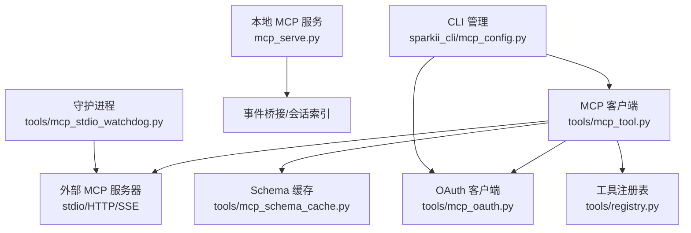
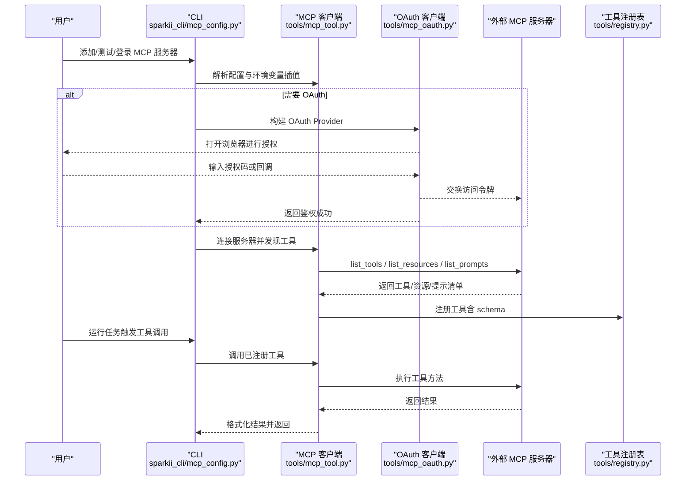
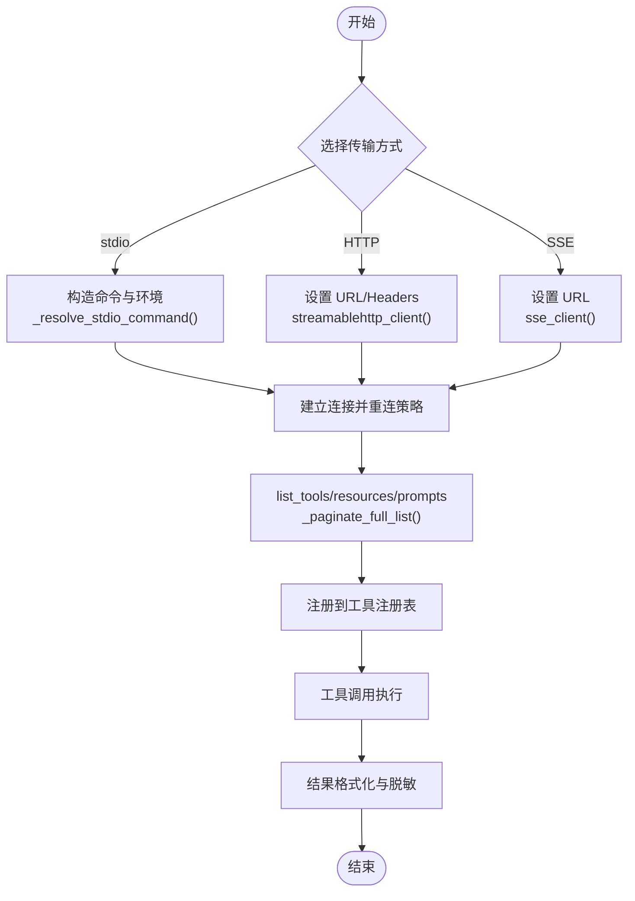
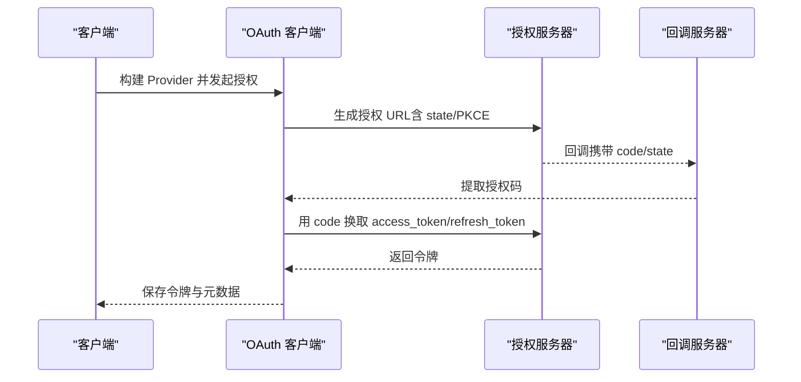
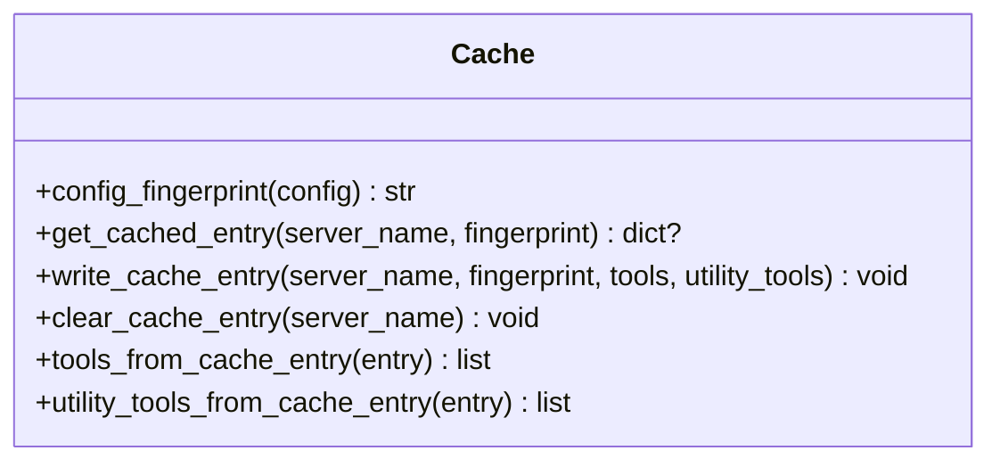
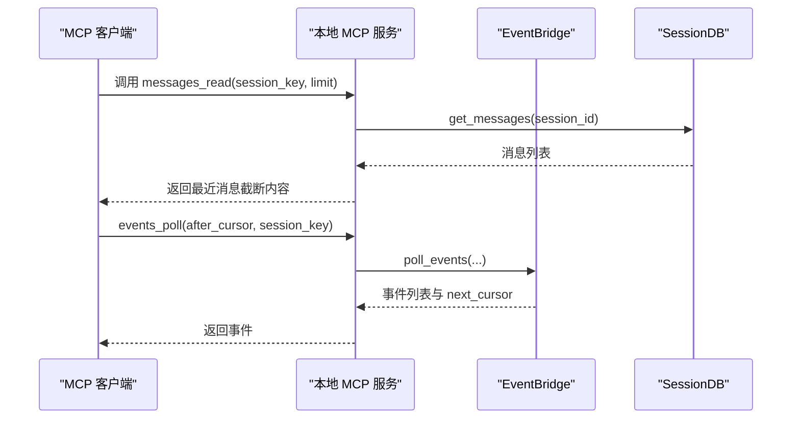
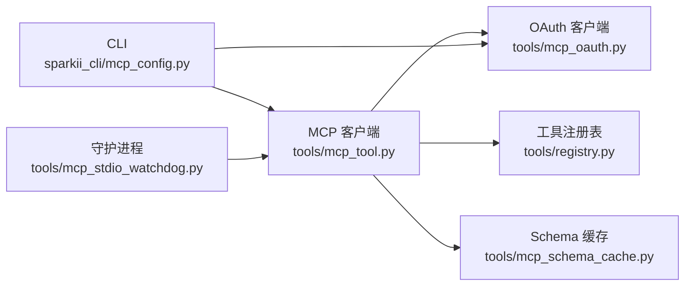

# MCP协议工具开发

<cite>
**本文引用的文件**
- [mcp_serve.py](file://mcp_serve.py)
- [tools/mcp_tool.py](file://tools/mcp_tool.py)
- [tools/mcp_oauth.py](file://tools/mcp_oauth.py)
- [tools/mcp_schema_cache.py](file://tools/mcp_schema_cache.py)
- [tools/mcp_dashboard_oauth.py](file://tools/mcp_dashboard_oauth.py)
- [tools/mcp_stdio_watchdog.py](file://tools/mcp_stdio_watchdog.py)
- [sparkii_cli/mcp_config.py](file://sparkii_cli/mcp_config.py)
- [tools/registry.py](file://tools/registry.py)
</cite>

## 目录
1. [简介](#简介)
2. [项目结构](#项目结构)
3. [核心组件](#核心组件)
4. [架构总览](#架构总览)
5. [详细组件分析](#详细组件分析)
6. [依赖关系分析](#依赖关系分析)
7. [性能考量](#性能考量)
8. [故障排查指南](#故障排查指南)
9. [结论](#结论)
10. [附录：模板与示例](#附录模板与示例)

## 简介
本指南面向希望基于 Model Context Protocol（MCP）开发工具的工程师，结合仓库中的实现，系统讲解：
- MCP 的核心概念、工具定义、参数验证与结果格式规范
- MCP 工具生命周期管理：连接建立、会话管理、资源释放
- OAuth 认证流程集成：令牌管理、权限控制与安全通信
- 性能优化技巧：连接池、缓存策略、批量操作
- 完整开发模板：基础工具、高级工具、复杂工作流
- 调试技巧与常见问题解决方案

## 项目结构
仓库中与 MCP 相关的核心代码分布在以下位置：
- mcp_serve.py：提供本地 MCP Server，暴露消息对话相关工具（如列出会话、读取消息、事件轮询等）
- tools/mcp_tool.py：MCP 客户端支持，负责连接外部 MCP 服务器（stdio/HTTP/SSE），发现并注册工具到代理工具注册表
- tools/mcp_oauth.py：OAuth 2.1 客户端支持，处理浏览器授权码流程、回调监听、令牌持久化
- tools/mcp_schema_cache.py：MCP 工具 schema 的持久化缓存，避免每次启动都拉起子进程
- tools/mcp_dashboard_oauth.py：通过 Dashboard 桥接 OAuth 回调，适配 GUI/远程场景
- tools/mcp_stdio_watchdog.py：父进程死亡守护，清理孤儿子进程
- sparkii_cli/mcp_config.py：CLI 管理 MCP 服务器配置、测试、登录、添加/删除
- tools/registry.py：统一工具注册中心，供上层调度器查询和调用

图表来源
- [tools/mcp_tool.py:1-120](file://tools/mcp_tool.py#L1-L120)
- [tools/mcp_oauth.py:1-120](file://tools/mcp_oauth.py#L1-L120)
- [tools/mcp_schema_cache.py:1-122](file://tools/mcp_schema_cache.py#L1-L122)
- [mcp_serve.py:1-120](file://mcp_serve.py#L1-L120)
- [sparkii_cli/mcp_config.py:1-120](file://sparkii_cli/mcp_config.py#L1-L120)
- [tools/mcp_stdio_watchdog.py:1-158](file://tools/mcp_stdio_watchdog.py#L1-L158)

章节来源
- [tools/mcp_tool.py:1-120](file://tools/mcp_tool.py#L1-L120)
- [tools/mcp_oauth.py:1-120](file://tools/mcp_oauth.py#L1-L120)
- [tools/mcp_schema_cache.py:1-122](file://tools/mcp_schema_cache.py#L1-L122)
- [mcp_serve.py:1-120](file://mcp_serve.py#L1-L120)
- [sparkii_cli/mcp_config.py:1-120](file://sparkii_cli/mcp_config.py#L1-L120)
- [tools/mcp_stdio_watchdog.py:1-158](file://tools/mcp_stdio_watchdog.py#L1-L158)

## 核心组件
- MCP 客户端与传输层：支持 stdio、Streamable HTTP、SSE；具备自动重连、退避、keepalive、并行工具调用开关
- OAuth 客户端：PKCE 授权码流程、回调监听、令牌持久化、元数据缓存、非交互环境提示
- Schema 缓存：按配置指纹存储工具清单，减少冷启动开销
- 本地 MCP 服务：暴露对话相关工具，维护事件队列与轮询
- CLI 管理：交互式添加/测试/登录/删除 MCP 服务器，环境变量插值与安全校验
- 守护进程：父进程死亡时清理子进程树，避免僵尸进程占用上游会话

章节来源
- [tools/mcp_tool.py:1-120](file://tools/mcp_tool.py#L1-L120)
- [tools/mcp_oauth.py:1-120](file://tools/mcp_oauth.py#L1-L120)
- [tools/mcp_schema_cache.py:1-122](file://tools/mcp_schema_cache.py#L1-L122)
- [mcp_serve.py:1-120](file://mcp_serve.py#L1-L120)
- [sparkii_cli/mcp_config.py:1-120](file://sparkii_cli/mcp_config.py#L1-L120)
- [tools/mcp_stdio_watchdog.py:1-158](file://tools/mcp_stdio_watchdog.py#L1-L158)

## 架构总览
下图展示了从 CLI 配置到工具调用的端到端流程，包括 OAuth 认证、工具发现、注册与执行。

图表来源
- [sparkii_cli/mcp_config.py:252-379](file://sparkii_cli/mcp_config.py#L252-L379)
- [tools/mcp_tool.py:661-699](file://tools/mcp_tool.py#L661-L699)
- [tools/mcp_oauth.py:697-791](file://tools/mcp_oauth.py#L697-L791)
- [tools/registry.py:108-159](file://tools/registry.py#L108-L159)

## 详细组件分析

### MCP 客户端与传输层（tools/mcp_tool.py）
- 传输类型：stdio（命令+参数）、Streamable HTTP（url + headers）、SSE（transport: sse）
- 连接与重连：指数退避、最大重试次数、空闲 keepalive 间隔、停泊自探测
- 环境变量安全过滤：仅传递白名单变量与显式配置的 env，防止泄露敏感信息
- 错误信息脱敏：正则替换常见密钥模式，避免将凭证回传给 LLM
- 分页拉取：对 tools/list、resources/list、prompts/list 使用 nextCursor 分页，限制最大页数
- 描述扫描：检测潜在提示注入模式，记录告警但不阻断
- 子进程 stderr 重定向：集中写入日志文件，避免污染 TUI 输出
- 父进程守护：在 POSIX 平台包装子进程，父进程异常退出时清理子进程树

图表来源
- [tools/mcp_tool.py:661-699](file://tools/mcp_tool.py#L661-L699)
- [tools/mcp_tool.py:702-746](file://tools/mcp_tool.py#L702-L746)
- [tools/mcp_tool.py:493-532](file://tools/mcp_tool.py#L493-L532)
- [tools/mcp_tool.py:526-586](file://tools/mcp_tool.py#L526-L586)

章节来源
- [tools/mcp_tool.py:1-120](file://tools/mcp_tool.py#L1-L120)
- [tools/mcp_tool.py:493-532](file://tools/mcp_tool.py#L493-L532)
- [tools/mcp_tool.py:526-586](file://tools/mcp_tool.py#L526-L586)
- [tools/mcp_tool.py:661-699](file://tools/mcp_tool.py#L661-L699)
- [tools/mcp_tool.py:702-746](file://tools/mcp_tool.py#L702-L746)

### OAuth 认证流程（tools/mcp_oauth.py）
- 授权码流程（PKCE）：浏览器跳转授权、回调监听、令牌交换与刷新
- 回调监听：本地端口绑定、保留 socket 防竞争、Dashboard 桥接支持
- 令牌持久化：原子写入 JSON，包含绝对过期时间，跨进程重启可用
- 元数据缓存：保存 OAuth 服务端元数据，避免冷启动重复发现
- 非交互环境：无 TTY 时给出明确指引，支持 Dashboard 发布授权链接
- 动态客户端注册：当 IdP 拒绝缓存 client_id 时，清理并重新注册

图表来源
- [tools/mcp_oauth.py:697-791](file://tools/mcp_oauth.py#L697-L791)
- [tools/mcp_oauth.py:429-555](file://tools/mcp_oauth.py#L429-L555)
- [tools/mcp_oauth.py:218-277](file://tools/mcp_oauth.py#L218-L277)

章节来源
- [tools/mcp_oauth.py:1-120](file://tools/mcp_oauth.py#L1-L120)
- [tools/mcp_oauth.py:429-555](file://tools/mcp_oauth.py#L429-L555)
- [tools/mcp_oauth.py:697-791](file://tools/mcp_oauth.py#L697-L791)

### Schema 缓存（tools/mcp_schema_cache.py）
- 按服务器名与配置指纹存储工具清单，避免每次启动都拉起子进程
- 原子写入，线程安全，支持清除条目与读取缓存工具列表
- 指纹计算包含 command/args/url/transport/tools include/exclude

图表来源
- [tools/mcp_schema_cache.py:30-42](file://tools/mcp_schema_cache.py#L30-L42)
- [tools/mcp_schema_cache.py:66-122](file://tools/mcp_schema_cache.py#L66-L122)

章节来源
- [tools/mcp_schema_cache.py:1-122](file://tools/mcp_schema_cache.py#L1-L122)

### 本地 MCP 服务（mcp_serve.py）
- 暴露工具：conversations_list、conversation_get、messages_read、attachments_fetch、events_poll、events_wait、permissions_list_open、permissions_respond、channels_list
- 事件桥接：后台线程轮询 SessionDB，维护内存事件队列与等待机制
- 会话索引：优先从 state.db 加载路由索引，回退到 sessions.json
- 参数校验：整数参数强制转换与范围钳制，确保外部客户端输入安全

图表来源
- [mcp_serve.py:590-754](file://mcp_serve.py#L590-L754)
- [mcp_serve.py:316-412](file://mcp_serve.py#L316-L412)
- [mcp_serve.py:143-192](file://mcp_serve.py#L143-L192)

章节来源
- [mcp_serve.py:1-120](file://mcp_serve.py#L1-L120)
- [mcp_serve.py:590-754](file://mcp_serve.py#L590-L754)
- [mcp_serve.py:316-412](file://mcp_serve.py#L316-L412)
- [mcp_serve.py:143-192](file://mcp_serve.py#L143-L192)

### CLI 管理（sparkii_cli/mcp_config.py）
- 添加/删除/列表/测试/登录 MCP 服务器
- 环境变量插值：${VAR} 与 ${env:VAR} 支持，安全校验可疑配置
- 预置模板：codex 等预设快速配置
- 能力探测：根据服务器能力决定是否探测 prompts/resources
- 认证引导：Bearer 头模板与 OAuth 流程集成

章节来源
- [sparkii_cli/mcp_config.py:1-120](file://sparkii_cli/mcp_config.py#L1-L120)
- [sparkii_cli/mcp_config.py:252-379](file://sparkii_cli/mcp_config.py#L252-L379)
- [sparkii_cli/mcp_config.py:415-617](file://sparkii_cli/mcp_config.py#L415-L617)
- [sparkii_cli/mcp_config.py:721-782](file://sparkii_cli/mcp_config.py#L721-L782)

### 工具注册表（tools/registry.py）
- 统一入口：所有工具模块通过 registry.register() 声明 schema、处理器、可用性检查
- 发现缓存：AST 扫描标记是否注册工具，结果缓存于磁盘，加速导入
- 错误体限制：对工具返回的错误文本进行截断，防止上下文膨胀

章节来源
- [tools/registry.py:1-200](file://tools/registry.py#L1-L200)

## 依赖关系分析
- 组件耦合：
  - mcp_tool.py 依赖 mcp_sdk（可选），并通过 mcp_oauth.py 完成鉴权
  - mcp_serve.py 依赖 sparkii_state.SessionDB 与 sparkii_constants
  - CLI 依赖 mcp_tool.py 的连接与发现能力，以及 mcp_oauth.py 的鉴权能力
  - 守护进程独立于主流程，仅负责子进程生命周期
- 外部依赖：
  - MCP SDK（mcp）：提供客户端与服务端能力
  - httpx：用于 HTTP 请求与 OAuth 流
  - anyio：异步事件循环与任务组
- 潜在循环依赖：
  - 工具注册表与工具模块之间通过 AST 扫描解耦，避免直接 import 循环

图表来源
- [sparkii_cli/mcp_config.py:252-379](file://sparkii_cli/mcp_config.py#L252-L379)
- [tools/mcp_tool.py:1-120](file://tools/mcp_tool.py#L1-L120)
- [tools/mcp_oauth.py:1-120](file://tools/mcp_oauth.py#L1-L120)
- [tools/mcp_schema_cache.py:1-122](file://tools/mcp_schema_cache.py#L1-L122)
- [tools/mcp_stdio_watchdog.py:1-158](file://tools/mcp_stdio_watchdog.py#L1-L158)

章节来源
- [sparkii_cli/mcp_config.py:252-379](file://sparkii_cli/mcp_config.py#L252-L379)
- [tools/mcp_tool.py:1-120](file://tools/mcp_tool.py#L1-L120)
- [tools/mcp_oauth.py:1-120](file://tools/mcp_oauth.py#L1-L120)
- [tools/mcp_schema_cache.py:1-122](file://tools/mcp_schema_cache.py#L1-L122)
- [tools/mcp_stdio_watchdog.py:1-158](file://tools/mcp_stdio_watchdog.py#L1-L158)

## 性能考量
- 连接池与会话复用：
  - 每个 MCP 服务器作为长生命周期 Task 运行，保持传输上下文存活
  - keepalive 间隔可配置，避免空闲会话被后端回收
- 缓存策略：
  - Schema 缓存避免每次启动都拉起子进程
  - 工具发现缓存减少 AST 扫描成本
- 批量操作：
  - 分页拉取 tools/resources/prompts，限制最大页数，避免无限循环
- 并发控制：
  - 每服务器可配置 supports_parallel_tool_calls，允许并发执行同一服务器的工具
- 资源释放：
  - 守护进程确保父进程异常退出时清理子进程树
  - 优雅关闭：Task 取消作用域内完成清理

[本节为通用指导，不直接分析具体文件]

## 故障排查指南
- 连接失败：
  - 检查传输配置（command/args/url/transport）与环境变量插值是否正确
  - 查看连接超时与重连策略，必要时调整 connect_timeout
- OAuth 问题：
  - 非交互环境需启用 Dashboard 桥接或手动粘贴回调 URL
  - 若 IdP 拒绝缓存 client_id，清理 client.json 与 meta.json 后重试
- 工具不可见：
  - 确认服务器是否支持 tools/list 且未启用工具过滤
  - 检查 Schema 缓存是否过期，必要时清除缓存条目
- 子进程泄漏：
  - 确认守护进程是否正常运行，父进程异常退出后是否清理了子进程树
- 错误信息泄露：
  - 检查错误脱敏逻辑是否生效，避免将密钥回传给 LLM

章节来源
- [tools/mcp_tool.py:526-586](file://tools/mcp_tool.py#L526-L586)
- [tools/mcp_oauth.py:429-555](file://tools/mcp_oauth.py#L429-L555)
- [tools/mcp_stdio_watchdog.py:57-100](file://tools/mcp_stdio_watchdog.py#L57-L100)

## 结论
本指南基于仓库实现，系统阐述了 MCP 工具开发的关键环节：工具定义与注册、参数验证与结果格式化、生命周期管理、OAuth 集成、性能优化与故障排查。通过 CLI 管理、客户端抽象、OAuth 支持与缓存机制，开发者可以高效地接入外部 MCP 服务器，并在生产环境中稳定运行。

[本节为总结性内容，不直接分析具体文件]

## 附录：模板与示例
- 基础工具模板：
  - 参考本地 MCP 服务的工具定义，了解参数校验与结果格式化
  - 路径参考：[mcp_serve.py:590-754](file://mcp_serve.py#L590-L754)
- 高级工具模板：
  - 参考 MCP 客户端的分页拉取与错误脱敏逻辑
  - 路径参考：[tools/mcp_tool.py:661-699](file://tools/mcp_tool.py#L661-L699), [tools/mcp_tool.py:526-586](file://tools/mcp_tool.py#L526-L586)
- 复杂工作流模板：
  - 参考 CLI 的添加/测试/登录流程，组合 OAuth 与工具发现
  - 路径参考：[sparkii_cli/mcp_config.py:415-617](file://sparkii_cli/mcp_config.py#L415-L617), [sparkii_cli/mcp_config.py:721-782](file://sparkii_cli/mcp_config.py#L721-L782)
- 性能优化模板：
  - 参考 Schema 缓存与工具发现缓存的使用
  - 路径参考：[tools/mcp_schema_cache.py:66-122](file://tools/mcp_schema_cache.py#L66-L122), [tools/registry.py:108-159](file://tools/registry.py#L108-L159)

[本节为模板指引，不直接分析具体文件]