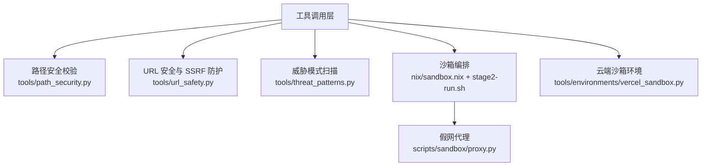
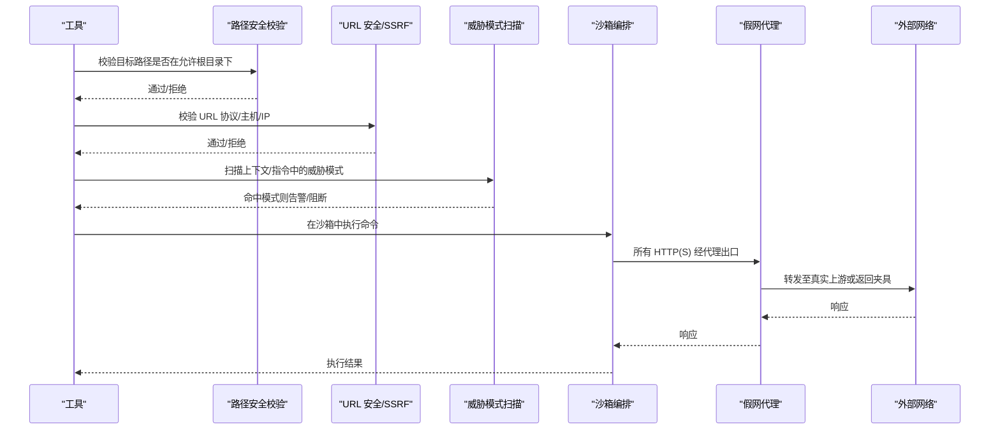
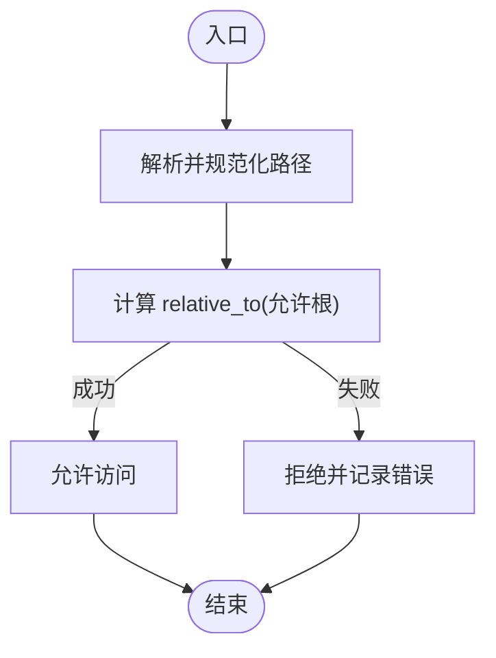
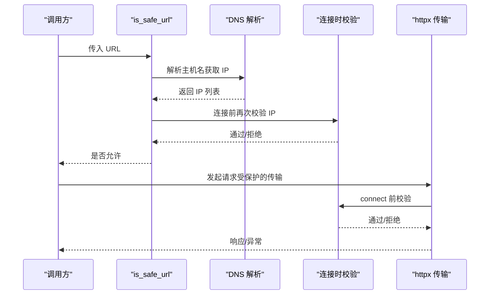
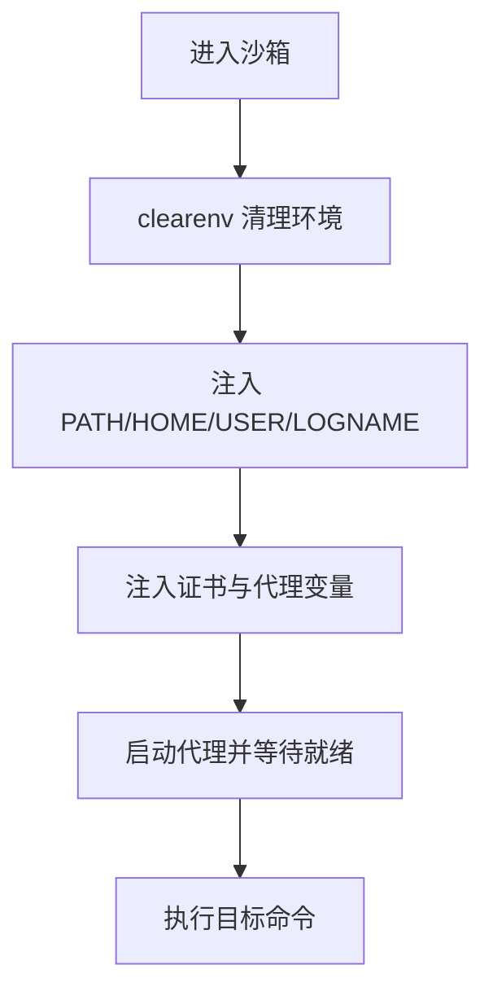
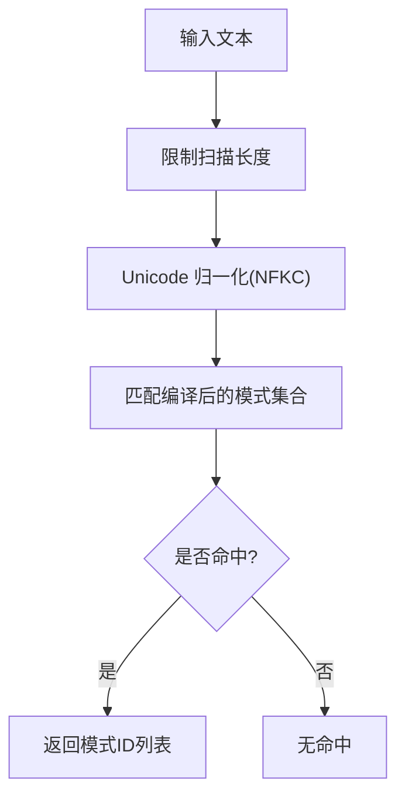
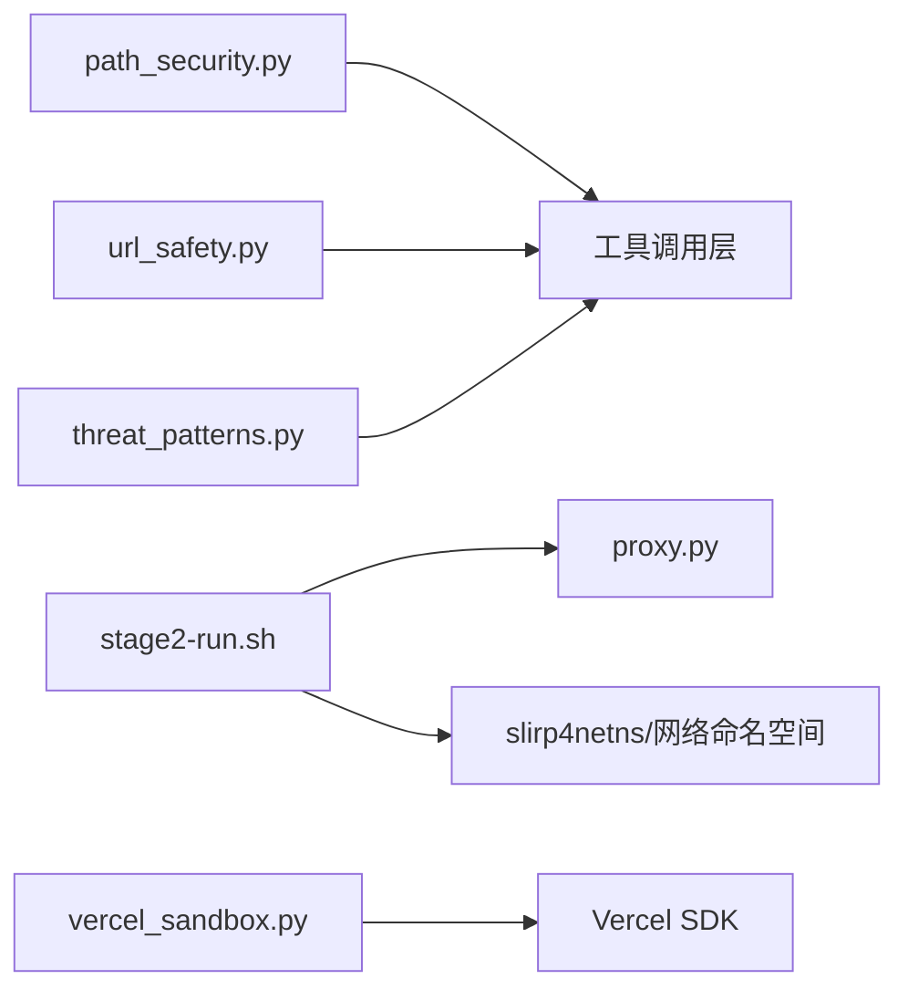

# 安全沙箱机制

<cite>
**本文引用的文件**
- [tools/path_security.py](file://tools/path_security.py)
- [tools/url_safety.py](file://tools/url_safety.py)
- [tools/threat_patterns.py](file://tools/threat_patterns.py)
- [nix/sandbox.nix](file://nix/sandbox.nix)
- [scripts/sandbox/stage2-run.sh](file://scripts/sandbox/stage2-run.sh)
- [scripts/sandbox/proxy.py](file://scripts/sandbox/proxy.py)
- [tools/environments/vercel_sandbox.py](file://tools/environments/vercel_sandbox.py)
</cite>

## 目录
1. [简介](#简介)
2. [项目结构](#项目结构)
3. [核心组件](#核心组件)
4. [架构总览](#架构总览)
5. [详细组件分析](#详细组件分析)
6. [依赖关系分析](#依赖关系分析)
7. [性能考量](#性能考量)
8. [故障排查指南](#故障排查指南)
9. [结论](#结论)
10. [附录](#附录)

## 简介
本指南面向需要在工具执行环境中提供强隔离与可控访问能力的工程团队，系统性说明本项目中“安全沙箱”的设计与实现。内容覆盖：
- 文件系统访问控制：路径验证、权限检查、目录隔离
- 网络请求限制：URL 白名单、协议过滤、代理配置与 SSRF 防护
- 环境变量隔离：确保工具执行环境的纯净性与可审计性
- 威胁检测模式：恶意行为识别、异常模式匹配与安全告警
- 沙箱配置选项：不同安全级别与自定义规则
- 安全最佳实践：输入校验、输出清理、资源限制
- 示例与常见问题解决方案

## 项目结构
围绕安全沙箱的关键代码分布在以下位置：
- 路径安全校验：tools/path_security.py
- URL 安全与 SSRF 防护：tools/url_safety.py
- 威胁模式扫描：tools/threat_patterns.py
- 开发环境沙箱编排（Nix + bubblewrap）：nix/sandbox.nix, scripts/sandbox/stage2-run.sh
- 开发环境假网代理：scripts/sandbox/proxy.py
- 云端沙箱执行环境（Vercel）：tools/environments/vercel_sandbox.py

**图示来源**
- [tools/path_security.py:15-44](file://tools/path_security.py#L15-L44)
- [tools/url_safety.py:415-528](file://tools/url_safety.py#L415-L528)
- [tools/threat_patterns.py:207-255](file://tools/threat_patterns.py#L207-L255)
- [nix/sandbox.nix:89-123](file://nix/sandbox.nix#L89-L123)
- [scripts/sandbox/stage2-run.sh:199-252](file://scripts/sandbox/stage2-run.sh#L199-L252)
- [scripts/sandbox/proxy.py:226-238](file://scripts/sandbox/proxy.py#L226-L238)
- [tools/environments/vercel_sandbox.py:243-342](file://tools/environments/vercel_sandbox.py#L243-L342)

**章节来源**
- [tools/path_security.py:1-44](file://tools/path_security.py#L1-L44)
- [tools/url_safety.py:1-800](file://tools/url_safety.py#L1-L800)
- [tools/threat_patterns.py:1-285](file://tools/threat_patterns.py#L1-L285)
- [nix/sandbox.nix:1-125](file://nix/sandbox.nix#L1-L125)
- [scripts/sandbox/stage2-run.sh:1-252](file://scripts/sandbox/stage2-run.sh#L1-L252)
- [scripts/sandbox/proxy.py:1-238](file://scripts/sandbox/proxy.py#L1-L238)
- [tools/environments/vercel_sandbox.py:1-663](file://tools/environments/vercel_sandbox.py#L1-L663)

## 核心组件
- 路径安全校验：提供 within-dir 校验与遍历组件检测，防止越权访问宿主或父目录。
- URL 安全与 SSRF 防护：对 URL 进行解析、协议白名单、主机名黑名单、IP 范围拦截、DNS 重绑定缓解、连接时二次校验，并提供 httpx 传输层保护。
- 威胁模式扫描：集中化的正则模式库，按作用域（all/context/strict）在上下文装配、记忆写入、技能安装等关键路径进行扫描与告警/阻断。
- 沙箱编排：基于 Nix 构建最小运行集，使用 bubblewrap 创建挂载、PID、网络命名空间；通过 slirp4netns 提供受限网络；通过本地代理统一出口并支持夹具响应。
- 云端沙箱环境：封装 Vercel Sandbox SDK，提供进程级隔离、工作区同步、快照持久化与超时/重试策略。

**章节来源**
- [tools/path_security.py:15-44](file://tools/path_security.py#L15-L44)
- [tools/url_safety.py:415-528](file://tools/url_safety.py#L415-L528)
- [tools/threat_patterns.py:207-255](file://tools/threat_patterns.py#L207-L255)
- [nix/sandbox.nix:89-123](file://nix/sandbox.nix#L89-L123)
- [scripts/sandbox/stage2-run.sh:199-252](file://scripts/sandbox/stage2-run.sh#L199-L252)
- [tools/environments/vercel_sandbox.py:243-342](file://tools/environments/vercel_sandbox.py#L243-L342)

## 架构总览
下图展示了从工具调用到沙箱执行的完整链路，包括路径校验、URL 安全检查、威胁模式扫描以及沙箱内网络出口控制。

**图示来源**
- [tools/path_security.py:15-44](file://tools/path_security.py#L15-L44)
- [tools/url_safety.py:415-528](file://tools/url_safety.py#L415-L528)
- [tools/threat_patterns.py:207-255](file://tools/threat_patterns.py#L207-L255)
- [scripts/sandbox/stage2-run.sh:219-252](file://scripts/sandbox/stage2-run.sh#L219-L252)
- [scripts/sandbox/proxy.py:200-217](file://scripts/sandbox/proxy.py#L200-L217)

## 详细组件分析

### 文件系统访问控制
- 路径验证：通过解析绝对路径并校验其相对关系，阻止穿越父目录的越权访问；同时提供快速遍历组件检测以提前拦截明显攻击。
- 权限检查：结合沙箱挂载策略，仅暴露必要目录；在 shell 层通过 bubblewrap 将宿主目录以只读方式映射或完全隐藏。
- 目录隔离：每个沙箱拥有独立的工作目录与 HOME，避免跨任务数据泄露；云端沙箱通过工作区根与远程 HOME 分离实现类似隔离。

**图示来源**
- [tools/path_security.py:15-44](file://tools/path_security.py#L15-L44)
- [scripts/sandbox/stage2-run.sh:199-228](file://scripts/sandbox/stage2-run.sh#L199-L228)

**章节来源**
- [tools/path_security.py:15-44](file://tools/path_security.py#L15-L44)
- [scripts/sandbox/stage2-run.sh:199-228](file://scripts/sandbox/stage2-run.sh#L199-L228)

### 网络请求限制与 SSRF 防护
- 协议过滤：仅允许 http/https；其他协议直接拒绝。
- URL 白名单与黑名单：内置云元数据主机名与 IP 段强制拦截；支持可信私有 IP 主机名白名单（如特定媒体域名）。
- DNS 与连接时双重校验：预检阶段解析并校验 IP；连接阶段再次校验，缓解 DNS 重绑定。
- 代理配置：当检测到代理环境变量且 DNS 解析失败时，允许交由代理侧解析；开发沙箱强制设置 HTTP_PROXY/HTTPS_PROXY/ALL_PROXY 指向本地代理。
- httpx 传输层保护：提供同步/异步传输包装，注入网络后端并在 connect 前校验 IP，禁止 Unix Socket 直连。

**图示来源**
- [tools/url_safety.py:415-528](file://tools/url_safety.py#L415-L528)
- [tools/url_safety.py:539-595](file://tools/url_safety.py#L539-L595)
- [tools/url_safety.py:707-752](file://tools/url_safety.py#L707-L752)

**章节来源**
- [tools/url_safety.py:1-800](file://tools/url_safety.py#L1-L800)

### 环境变量隔离
- 启动时清屏：沙箱启动时清除继承的环境变量，仅注入必要的 PATH、HOME、USER、LOGNAME、证书与代理相关变量。
- 证书与代理：注入 CA 证书路径与 SSL 相关变量，强制通过代理出口；禁用 Electron 沙箱以避免冲突。
- 云端环境：通过 FileSyncManager 同步 .hermes 目录，保持工具链与环境一致；默认关闭遥测以减少外发。

**图示来源**
- [scripts/sandbox/stage2-run.sh:211-228](file://scripts/sandbox/stage2-run.sh#L211-L228)
- [scripts/sandbox/stage2-run.sh:229-252](file://scripts/sandbox/stage2-run.sh#L229-L252)
- [tools/environments/vercel_sandbox.py:47-64](file://tools/environments/vercel_sandbox.py#L47-L64)

**章节来源**
- [scripts/sandbox/stage2-run.sh:211-252](file://scripts/sandbox/stage2-run.sh#L211-L252)
- [tools/environments/vercel_sandbox.py:47-64](file://tools/environments/vercel_sandbox.py#L47-L64)

### 威胁检测模式
- 模式组织：按攻击类别组织正则模式，并通过 scope 控制应用范围（all/context/strict），平衡误报与漏报。
- 不可见字符检测：识别零宽字符与方向控制符，防止利用 Unicode 特性绕过关键字检测。
- 扫描流程：先截取最大扫描长度，再进行 Unicode 归一化后匹配；命中即返回模式 ID，供上层决定告警或阻断。

**图示来源**
- [tools/threat_patterns.py:207-255](file://tools/threat_patterns.py#L207-L255)

**章节来源**
- [tools/threat_patterns.py:1-285](file://tools/threat_patterns.py#L1-L285)

### 沙箱配置选项
- 安全级别
  - 严格模式：启用 always-blocked 云元数据拦截、禁止私有 IP、严格 URL 协议与主机名校验。
  - 宽松模式：可通过配置或环境变量允许私有 IP 解析（仍保留云元数据强制拦截）。
- 自定义规则
  - 可信私有 IP 主机名白名单：用于特定 CDN/媒体服务在代理或基准环境下的合法解析。
  - 代理配置：通过环境变量强制走代理，便于夹具与流量管控。
- 云端沙箱参数
  - CPU/内存/磁盘：通过 Resources 配置；磁盘大小固定为共享默认值。
  - 超时与重试：最小运行时间、停止超时、临时状态码重试策略。
  - 快照持久化：任务级快照存储与恢复，提升重复任务效率。

**章节来源**
- [tools/url_safety.py:220-287](file://tools/url_safety.py#L220-L287)
- [tools/url_safety.py:197-210](file://tools/url_safety.py#L197-L210)
- [scripts/sandbox/stage2-run.sh:219-228](file://scripts/sandbox/stage2-run.sh#L219-L228)
- [tools/environments/vercel_sandbox.py:236-342](file://tools/environments/vercel_sandbox.py#L236-L342)

### 安全最佳实践
- 输入验证
  - 对所有用户提供的路径进行 within-dir 校验与遍历组件检测。
  - 对所有 URL 进行协议白名单、主机名黑名单与 IP 范围校验。
- 输出清理
  - 对可能包含敏感信息的查询参数进行识别与脱敏处理。
  - 对工具输出进行威胁模式扫描，防止注入或外泄。
- 资源限制
  - 沙箱内限制可用二进制与系统调用面；通过 bubblewrap 最小化挂载。
  - 云端沙箱设置 CPU/内存上限与最小运行时间，避免资源滥用。

**章节来源**
- [tools/path_security.py:15-44](file://tools/path_security.py#L15-L44)
- [tools/url_safety.py:106-161](file://tools/url_safety.py#L106-L161)
- [tools/threat_patterns.py:207-255](file://tools/threat_patterns.py#L207-L255)
- [nix/sandbox.nix:89-123](file://nix/sandbox.nix#L89-L123)

## 依赖关系分析
- 模块耦合
  - 路径安全与 URL 安全被工具层广泛复用，低耦合高内聚。
  - 威胁模式扫描作为通用库，被上下文装配与工具结果处理调用。
  - 沙箱编排依赖 bubblewrap、slirp4netns、openssl 等系统工具。
- 外部依赖
  - httpx/httpcore：用于网络请求与传输层保护。
  - Vercel SDK：用于云端沙箱生命周期管理。
  - Nix/bubblewrap：用于容器化与命名空间隔离。

**图示来源**
- [tools/path_security.py:15-44](file://tools/path_security.py#L15-L44)
- [tools/url_safety.py:415-528](file://tools/url_safety.py#L415-L528)
- [tools/threat_patterns.py:207-255](file://tools/threat_patterns.py#L207-L255)
- [scripts/sandbox/stage2-run.sh:199-252](file://scripts/sandbox/stage2-run.sh#L199-L252)
- [scripts/sandbox/proxy.py:200-217](file://scripts/sandbox/proxy.py#L200-L217)
- [tools/environments/vercel_sandbox.py:243-342](file://tools/environments/vercel_sandbox.py#L243-L342)

**章节来源**
- [tools/path_security.py:15-44](file://tools/path_security.py#L15-L44)
- [tools/url_safety.py:415-528](file://tools/url_safety.py#L415-L528)
- [tools/threat_patterns.py:207-255](file://tools/threat_patterns.py#L207-L255)
- [scripts/sandbox/stage2-run.sh:199-252](file://scripts/sandbox/stage2-run.sh#L199-L252)
- [scripts/sandbox/proxy.py:200-217](file://scripts/sandbox/proxy.py#L200-L217)
- [tools/environments/vercel_sandbox.py:243-342](file://tools/environments/vercel_sandbox.py#L243-L342)

## 性能考量
- DNS 解析开销：is_safe_url 与连接时校验均涉及 DNS，异步路径使用事件循环线程池降低阻塞影响。
- 正则扫描成本：限制最大扫描长度并预编译模式集合，减少回溯与重复计算。
- 代理转发延迟：开发沙箱通过本地代理增加一跳，但换来夹具与流量可控；生产环境应评估代理性能与缓存策略。
- 云端沙箱启动：快照恢复可减少冷启动时间；重试与退避策略提高鲁棒性。

[本节为通用指导，不直接分析具体文件]

## 故障排查指南
- 无法解析域名
  - 现象：DNS 解析失败导致请求被阻断。
  - 排查：确认是否配置了代理；若存在代理，允许交由代理侧解析；否则检查 DNS 服务与防火墙。
- 被判定为 SSRF
  - 现象：URL 命中云元数据或私有 IP 段被拒绝。
  - 排查：确认目标是否为合法公网地址；如需访问内部服务，请通过代理或白名单主机名配置。
- 沙箱网络不通
  - 现象：代理未就绪或 slirp4netns 初始化失败。
  - 排查：查看日志与 ready 标志；确认端口占用与证书路径正确。
- 云端沙箱启动失败
  - 现象：进入终止状态或超时。
  - 排查：检查状态码与错误信息；必要时删除快照重建；调整超时与资源限制。

**章节来源**
- [tools/url_safety.py:447-474](file://tools/url_safety.py#L447-L474)
- [scripts/sandbox/stage2-run.sh:26-38](file://scripts/sandbox/stage2-run.sh#L26-L38)
- [tools/environments/vercel_sandbox.py:398-421](file://tools/environments/vercel_sandbox.py#L398-L421)

## 结论
本项目通过多层防御与最小权限原则构建了健壮的安全沙箱体系：路径与 URL 的双重校验、威胁模式的集中化扫描、沙箱环境与网络的强隔离、以及云端执行的可控资源与快照能力。建议在生产环境中坚持默认严格策略，按需放宽私有 IP 解析，并结合代理与白名单满足业务需求。

[本节为总结性内容，不直接分析具体文件]

## 附录
- 常用配置项参考
  - 允许私有 URL：通过环境变量或配置文件开关，注意云元数据始终拦截。
  - 代理出口：设置 HTTP_PROXY/HTTPS_PROXY/ALL_PROXY，并确保代理可达。
  - 云端沙箱：合理设置 CPU/内存与超时，启用快照以提升重复任务效率。
- 常见安全问题与解决
  - SSRF 绕过：使用连接时校验与 httpx 传输保护，避免仅依赖预检。
  - 路径穿越：始终使用 within-dir 校验与遍历组件检测。
  - 注入与外泄：在上下文装配与工具结果写入前进行威胁模式扫描。

**章节来源**
- [tools/url_safety.py:220-287](file://tools/url_safety.py#L220-L287)
- [scripts/sandbox/stage2-run.sh:219-228](file://scripts/sandbox/stage2-run.sh#L219-L228)
- [tools/environments/vercel_sandbox.py:236-342](file://tools/environments/vercel_sandbox.py#L236-L342)