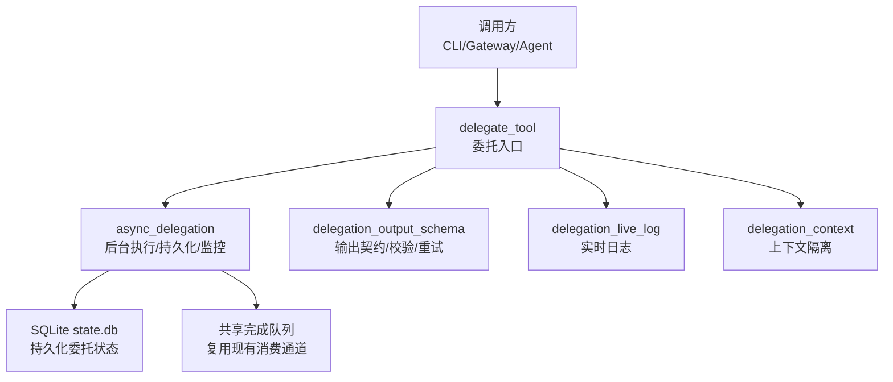
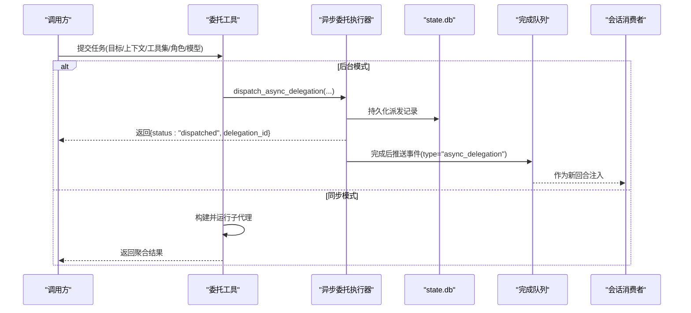
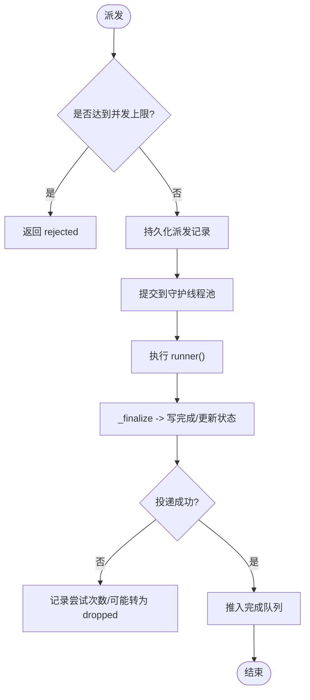
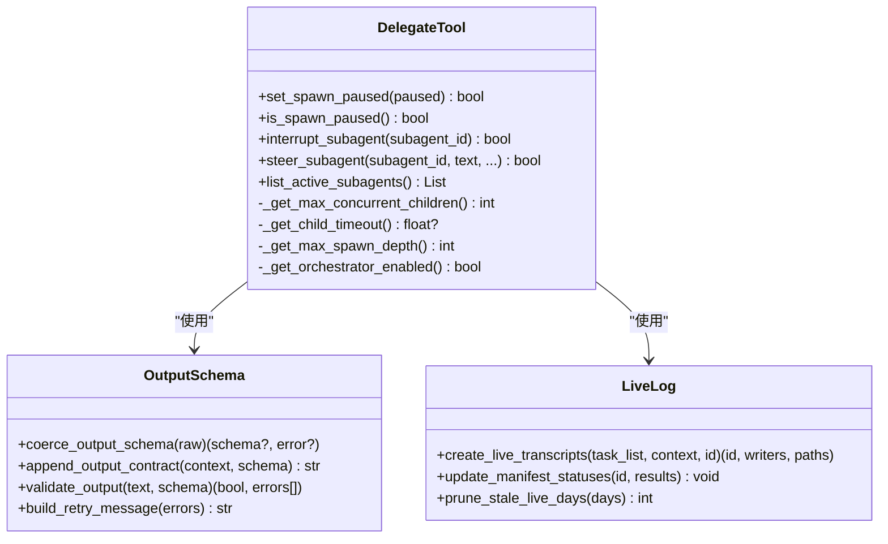
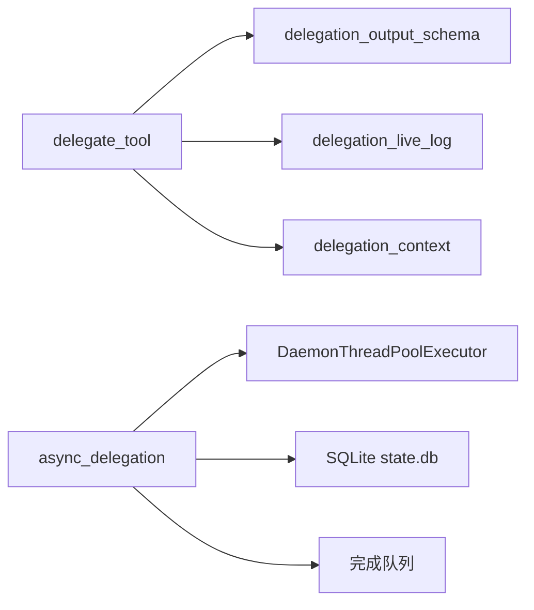

# 工具委托机制

<cite>
**本文引用的文件**
- [tools/async_delegation.py](file://tools/async_delegation.py)
- [tools/delegate_tool.py](file://tools/delegate_tool.py)
- [tools/delegation_output_schema.py](file://tools/delegation_output_schema.py)
- [tools/delegation_live_log.py](file://tools/delegation_live_log.py)
- [agent/delegation_context.py](file://agent/delegation_context.py)
</cite>

## 目录
1. [简介](#简介)
2. [项目结构](#项目结构)
3. [核心组件](#核心组件)
4. [架构总览](#架构总览)
5. [详细组件分析](#详细组件分析)
6. [依赖关系分析](#依赖关系分析)
7. [性能与并发](#性能与并发)
8. [故障排查指南](#故障排查指南)
9. [结论](#结论)
10. [附录：配置项与开发示例](#附录：配置项与开发示例)

## 简介
本文件系统性说明“工具委托机制”的实现原理与使用方式，覆盖跨进程/子代理任务分发、结果聚合、负载均衡、调度模型（优先级、超时、重试）、异步执行流程（提交、监控、回调）、输出标准化（数据结构、错误处理、日志）以及可观测性与配置。该机制通过父代理派发子代理（或后台任务），在保持主会话上下文不变的前提下完成复杂分布式任务，并以统一的事件通道将结果回灌到对话流中。

## 项目结构
围绕委托机制的核心代码分布在以下模块：
- tools/async_delegation.py：后台异步委托的注册、持久化、执行池、陈旧检测、投递与恢复。
- tools/delegate_tool.py：委托工具实现，负责子代理构建、工具集裁剪、并发与深度控制、超时与中断、结果汇总。
- tools/delegation_output_schema.py：结构化输出契约与校验、单次重试消息构造。
- tools/delegation_live_log.py：子代理运行期实时日志（追加式、脱敏、保留策略）。
- agent/delegation_context.py：子代理上下文隔离（避免继承调度器身份与环境变量污染）。

图表来源
- [tools/async_delegation.py:677-800](file://tools/async_delegation.py#L677-L800)
- [tools/delegate_tool.py:1-120](file://tools/delegate_tool.py#L1-L120)
- [tools/delegation_output_schema.py:29-152](file://tools/delegation_output_schema.py#L29-L152)
- [tools/delegation_live_log.py:1-120](file://tools/delegation_live_log.py#L1-L120)
- [agent/delegation_context.py:48-162](file://agent/delegation_context.py#L48-L162)

章节来源
- [tools/async_delegation.py:1-120](file://tools/async_delegation.py#L1-L120)
- [tools/delegate_tool.py:1-120](file://tools/delegate_tool.py#L1-L120)
- [tools/delegation_output_schema.py:1-152](file://tools/delegation_output_schema.py#L1-L152)
- [tools/delegation_live_log.py:1-120](file://tools/delegation_live_log.py#L1-L120)
- [agent/delegation_context.py:1-162](file://agent/delegation_context.py#L1-L162)

## 核心组件
- 异步委托执行器（tools/async_delegation.py）
  - 维护模块级守护线程池，支持并发上限、容量拒绝、持久化记录、投递重试与恢复。
  - 提供陈旧检测（基于进度标记），对长时间无进展的子代理进行中断与最终化。
  - 通过共享完成队列将结果以新回合形式注入，复用既有去重与崩溃恢复能力。
- 委托工具（tools/delegate_tool.py）
  - 构建子代理：隔离会话、继承并裁剪工具集、注入系统提示。
  - 并发与深度控制：max_concurrent_children、max_spawn_depth、orchestrator_enabled。
  - 超时与中断：child_timeout_seconds、硬中断传播、暂停/继续开关。
  - 结果聚合：提取尾部工具调用预览、错误识别、摘要生成。
- 输出契约（tools/delegation_output_schema.py）
  - 解析/校验 JSON Schema，附加“输出契约”块至子代理上下文。
  - 最多一次重试，携带精确校验错误，不重复粘贴完整 Schema。
- 实时日志（tools/delegation_live_log.py）
  - 为每个子任务创建追加式日志，事件类型映射（工具开始/完成、思考、子代理生命周期）。
  - 严格脱敏、单行截断、保留期清理；失败降级不影响主循环。
- 上下文隔离（agent/delegation_context.py）
  - 通过 ContextVar 标记子代理上下文，避免继承调度器身份与 Kanban 环境变量。
  - 提供子进程环境清洗函数，确保跨 fork 边界的安全传递。

章节来源
- [tools/async_delegation.py:61-113](file://tools/async_delegation.py#L61-L113)
- [tools/delegate_tool.py:48-128](file://tools/delegate_tool.py#L48-L128)
- [tools/delegation_output_schema.py:29-152](file://tools/delegation_output_schema.py#L29-L152)
- [tools/delegation_live_log.py:112-308](file://tools/delegation_live_log.py#L112-L308)
- [agent/delegation_context.py:20-162](file://agent/delegation_context.py#L20-L162)

## 架构总览
委托机制由“入口工具 + 后台执行 + 持久化 + 结果回灌 + 可观测性”构成。父代理调用委托工具后，若为后台模式则进入异步委托执行器；否则同步执行子代理。无论哪种路径，均通过统一的输出结构与日志通道对外暴露。

图表来源
- [tools/delegate_tool.py:1-120](file://tools/delegate_tool.py#L1-L120)
- [tools/async_delegation.py:677-800](file://tools/async_delegation.py#L677-L800)
- [tools/async_delegation.py:200-227](file://tools/async_delegation.py#L200-L227)
- [tools/async_delegation.py:344-368](file://tools/async_delegation.py#L344-L368)

## 详细组件分析

### 异步委托执行器（后台任务）
- 并发与容量
  - 模块级守护线程池，懒初始化且只增不减；通过 active_count 限制同时运行的“单元数”（单个子代理或一批批发的整体）。
  - 达到容量时直接拒绝，防止模型失控堆积后台任务。
- 持久化与恢复
  - 派发、完成、投递尝试次数等写入 SQLite；进程重启后可恢复未投递的完成事件，并标记 restored。
  - 回收“孤儿”委托（拥有进程消失）为 unknown 状态，保证可查询。
- 陈旧检测与中断
  - 基于 progress_fn 提供的 token/in_tool 快照，超过空闲/工具内阈值判定停滞，触发中断与宽限期，最终强制收尾。
- 结果回灌
  - 复用共享完成队列，将完成事件作为新回合注入，避免破坏消息角色交替与提示缓存。

图表来源
- [tools/async_delegation.py:677-800](file://tools/async_delegation.py#L677-L800)
- [tools/async_delegation.py:200-227](file://tools/async_delegation.py#L200-L227)
- [tools/async_delegation.py:273-290](file://tools/async_delegation.py#L273-L290)
- [tools/async_delegation.py:344-368](file://tools/async_delegation.py#L344-L368)
- [tools/async_delegation.py:414-447](file://tools/async_delegation.py#L414-L447)

章节来源
- [tools/async_delegation.py:61-113](file://tools/async_delegation.py#L61-L113)
- [tools/async_delegation.py:200-227](file://tools/async_delegation.py#L200-L227)
- [tools/async_delegation.py:273-290](file://tools/async_delegation.py#L273-L290)
- [tools/async_delegation.py:344-368](file://tools/async_delegation.py#L344-L368)
- [tools/async_delegation.py:414-447](file://tools/async_delegation.py#L414-L447)
- [tools/async_delegation.py:516-585](file://tools/async_delegation.py#L516-L585)
- [tools/async_delegation.py:677-800](file://tools/async_delegation.py#L677-L800)

### 委托工具（子代理编排）
- 子代理构建
  - 隔离会话、继承并裁剪工具集（禁止递归委派、记忆写入、跨平台副作用等）。
  - 根据 role（leaf/orchestrator）与 max_spawn_depth 控制嵌套层级。
- 并发与深度
  - max_concurrent_children：统一限制同步批量并行度与后台委托单元数。
  - max_spawn_depth：默认 1（扁平），可通过配置提升以启用嵌套编排。
- 超时与中断
  - child_timeout_seconds：可选硬超时（最小 30s），默认关闭以避免误杀长任务。
  - 支持全局暂停/继续、子代理中断、steer（定向输入）等运行时控制。
- 结果聚合
  - 提取最近 N 条工具调用预览，识别错误输出，生成摘要供父会话消费。

图表来源
- [tools/delegate_tool.py:146-324](file://tools/delegate_tool.py#L146-L324)
- [tools/delegate_tool.py:587-759](file://tools/delegate_tool.py#L587-L759)
- [tools/delegation_output_schema.py:29-152](file://tools/delegation_output_schema.py#L29-L152)
- [tools/delegation_live_log.py:312-401](file://tools/delegation_live_log.py#L312-L401)

章节来源
- [tools/delegate_tool.py:48-128](file://tools/delegate_tool.py#L48-L128)
- [tools/delegate_tool.py:146-324](file://tools/delegate_tool.py#L146-L324)
- [tools/delegate_tool.py:587-759](file://tools/delegate_tool.py#L587-L759)
- [tools/delegation_output_schema.py:29-152](file://tools/delegation_output_schema.py#L29-L152)
- [tools/delegation_live_log.py:312-401](file://tools/delegation_live_log.py#L312-L401)

### 输出契约与标准化
- 契约注入：将 JSON Schema 以“输出契约”块追加到子代理上下文，约束最终响应格式。
- 校验与重试：解析候选 JSON，按 Schema 校验；失败时仅发送一次包含具体错误的重试消息，不重复粘贴 Schema。
- 错误处理：空响应、非 JSON、非法 Schema 均有明确错误路径。

章节来源
- [tools/delegation_output_schema.py:29-152](file://tools/delegation_output_schema.py#L29-L152)

### 实时日志与可观测性
- 事件映射：工具开始/完成、思考、子代理启动/完成等事件写入追加式日志。
- 安全与体积：每行脱敏、长度截断；失败降级不影响主循环。
- 保留策略：定期清理过期目录，降低磁盘占用。

章节来源
- [tools/delegation_live_log.py:112-308](file://tools/delegation_live_log.py#L112-L308)
- [tools/delegation_live_log.py:404-425](file://tools/delegation_live_log.py#L404-L425)

### 上下文隔离与安全
- 通过 ContextVar 标记子代理上下文，避免继承调度器身份与 Kanban 环境变量。
- 提供子进程环境清洗函数，确保跨 fork 边界的安全传递。

章节来源
- [agent/delegation_context.py:20-162](file://agent/delegation_context.py#L20-L162)

## 依赖关系分析
- 委托工具依赖：
  - 输出契约模块（JSON Schema 校验与重试消息）。
  - 实时日志模块（事件落盘与清理）。
  - 上下文隔离模块（子代理环境与身份隔离）。
- 异步委托执行器依赖：
  - 守护线程池（DaemonThreadPoolExecutor）。
  - SQLite（state.db）用于持久化派发、完成、投递状态。
  - 共享完成队列（复用 CLI/Gateway 的既有消费通道）。

图表来源
- [tools/delegate_tool.py:1-120](file://tools/delegate_tool.py#L1-L120)
- [tools/delegation_output_schema.py:29-152](file://tools/delegation_output_schema.py#L29-L152)
- [tools/delegation_live_log.py:312-401](file://tools/delegation_live_log.py#L312-L401)
- [agent/delegation_context.py:48-162](file://agent/delegation_context.py#L48-L162)
- [tools/async_delegation.py:49-58](file://tools/async_delegation.py#L49-L58)
- [tools/async_delegation.py:119-140](file://tools/async_delegation.py#L119-L140)
- [tools/async_delegation.py:344-368](file://tools/async_delegation.py#L344-L368)

章节来源
- [tools/delegate_tool.py:1-120](file://tools/delegate_tool.py#L1-L120)
- [tools/async_delegation.py:49-58](file://tools/async_delegation.py#L49-L58)
- [tools/async_delegation.py:119-140](file://tools/async_delegation.py#L119-L140)
- [tools/async_delegation.py:344-368](file://tools/async_delegation.py#L344-L368)

## 性能与并发
- 并发上限
  - 通过 max_concurrent_children 统一限制同步批量并行度与后台委托单元数；达到上限直接拒绝，避免无限堆积。
- 陈旧检测
  - 基于进度 token 与 in_tool 标志，空闲/工具内分别设置不同阈值，兼顾快速捕获卡死与允许长耗时任务。
- 资源保护
  - 守护线程池避免阻塞进程退出；日志写入失败降级；SQLite 连接短生命周期，避免句柄泄漏。
- 建议
  - 合理设置并发上限与超时；对重型任务优先使用后台模式；结合实时日志观察瓶颈。

[本节为通用指导，不直接分析具体文件]

## 故障排查指南
- 常见问题定位
  - 后台任务被拒绝：检查并发上限与当前活跃数量。
  - 结果未回灌：检查完成队列消费、投递尝试次数与 claim/release 状态。
  - 子代理停滞：查看陈旧检测阈值与 progress_fn 是否有效上报。
  - 输出不符合契约：查看校验错误列表，确认重试消息是否送达。
  - 日志缺失：确认 live log 初始化是否成功，关注降级日志。
- 诊断要点
  - 使用 list_active_subagents 与 active_count/active_task_count 观察运行态。
  - 通过 get_durable_delegation 查询持久化状态与投递情况。
  - 检查 state.db 中 delivery_state 与 delivery_attempts。

章节来源
- [tools/async_delegation.py:535-585](file://tools/async_delegation.py#L535-L585)
- [tools/async_delegation.py:497-513](file://tools/async_delegation.py#L497-L513)
- [tools/delegate_tool.py:302-324](file://tools/delegate_tool.py#L302-L324)
- [tools/delegation_live_log.py:112-308](file://tools/delegation_live_log.py#L112-L308)

## 结论
工具委托机制通过“入口工具 + 后台执行 + 持久化 + 结果回灌 + 可观测性”形成闭环，既保证了父会话的稳定性和一致性，又提供了强大的分布式任务处理能力。其并发控制、陈旧检测、输出契约与实时日志共同构成了高可用、可观测、可扩展的委托体系。

[本节为总结性内容，不直接分析具体文件]

## 附录：配置项与开发示例

### 配置选项
- 并发与深度
  - delegation.max_concurrent_children：统一限制同步批量并行度与后台委托单元数（默认 3，最小 1）。
  - delegation.max_spawn_depth：最大嵌套层级（默认 1，扁平；≥2 解锁嵌套编排）。
  - delegation.orchestrator_enabled：是否启用 orchestrator 角色（默认启用）。
- 超时与行为
  - delegation.child_timeout_seconds：子代理硬超时（默认关闭；若设置需 ≥30s）。
  - delegation.subagent_auto_approve：子代理危险命令自动批准/拒绝（默认拒绝）。
- 其他
  - inherit_mcp_toolsets：是否在缩小后的子工具集中保留父 MCP 工具集（默认保留）。

章节来源
- [tools/delegate_tool.py:587-759](file://tools/delegate_tool.py#L587-L759)

### 异步委托执行流程（步骤）
- 提交：调用 delegate_tool 提交任务（后台或同步）。
- 派发：后台模式下由 async_delegation 持久化派发记录并提交到守护线程池。
- 执行：子代理运行，实时日志记录事件；输出契约约束最终响应。
- 监控：陈旧检测基于进度 token 判断停滞并中断；超时控制保障资源。
- 回灌：完成后持久化结果并通过完成队列注入为新回合。
- 恢复：进程重启后恢复未投递完成事件，保证可靠性。

章节来源
- [tools/async_delegation.py:677-800](file://tools/async_delegation.py#L677-L800)
- [tools/delegation_output_schema.py:29-152](file://tools/delegation_output_schema.py#L29-L152)
- [tools/delegation_live_log.py:312-401](file://tools/delegation_live_log.py#L312-L401)
- [tools/async_delegation.py:344-368](file://tools/async_delegation.py#L344-L368)

### 开发示例（概念性步骤）
- 定义输出契约：构造 JSON Schema，调用 append_output_contract 注入子代理上下文。
- 提交后台任务：调用 dispatch_async_delegation 传入 goal/context/toolsets/role/model 等参数。
- 监控与回调：通过 active_count/active_task_count 观察负载；利用 completion 事件处理结果。
- 调试与观测：使用 create_live_transcripts 获取实时日志路径；结合 get_durable_delegation 查询状态。
- 异常处理：根据 validate_output 的错误列表调整输出；必要时触发重试。

章节来源
- [tools/delegation_output_schema.py:29-152](file://tools/delegation_output_schema.py#L29-L152)
- [tools/async_delegation.py:677-800](file://tools/async_delegation.py#L677-L800)
- [tools/delegation_live_log.py:312-401](file://tools/delegation_live_log.py#L312-L401)
- [tools/async_delegation.py:497-513](file://tools/async_delegation.py#L497-L513)