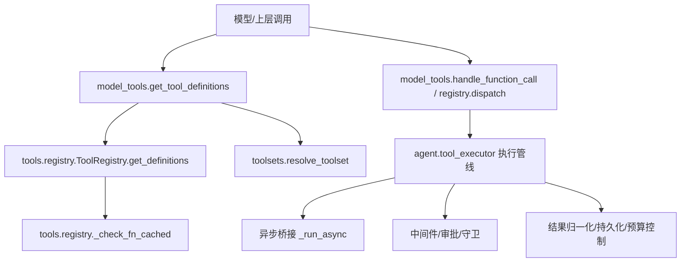
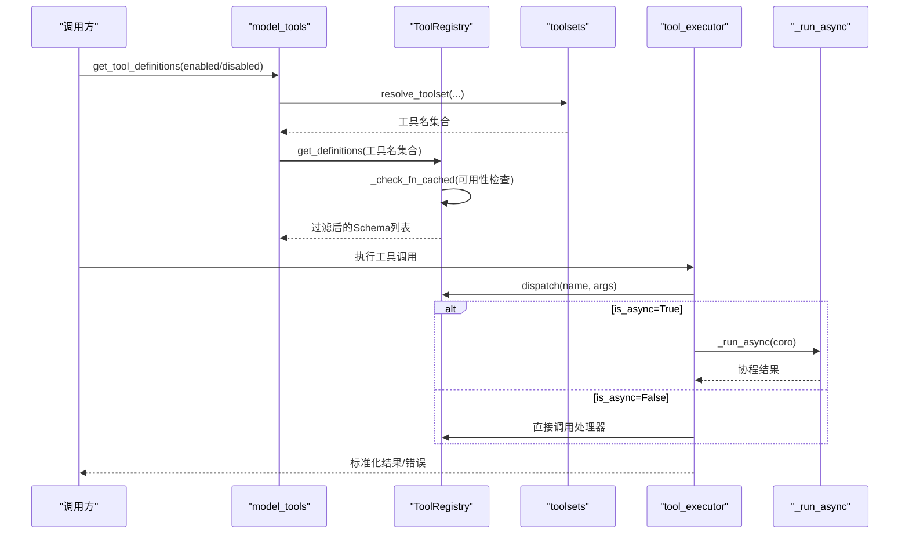
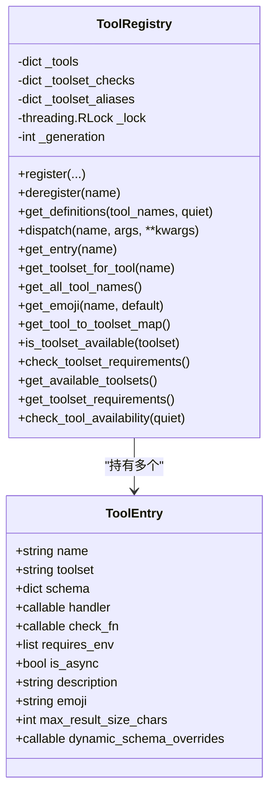
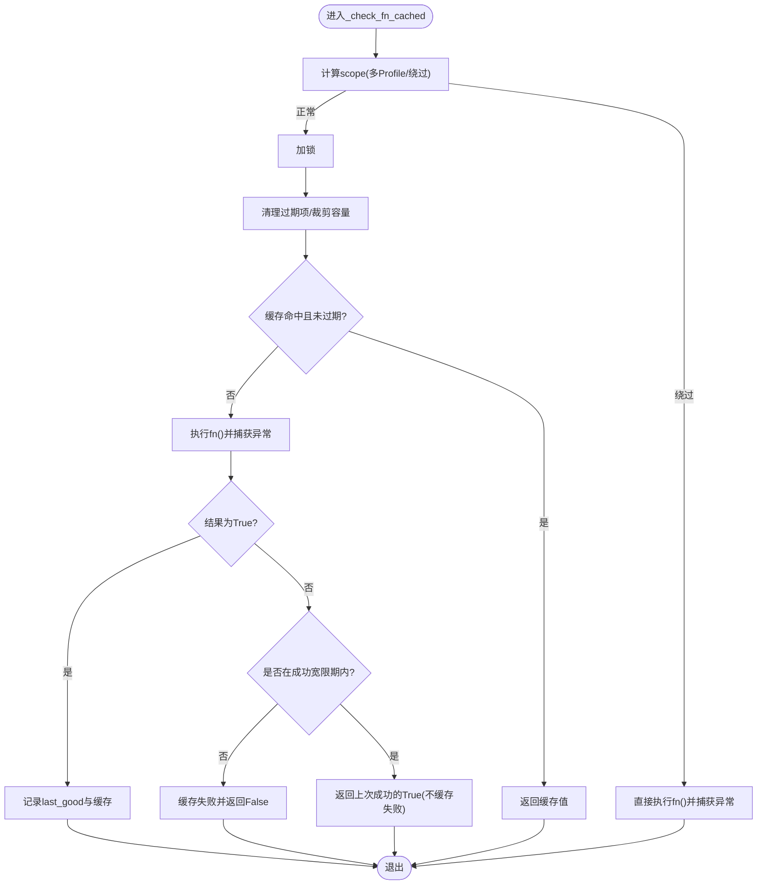
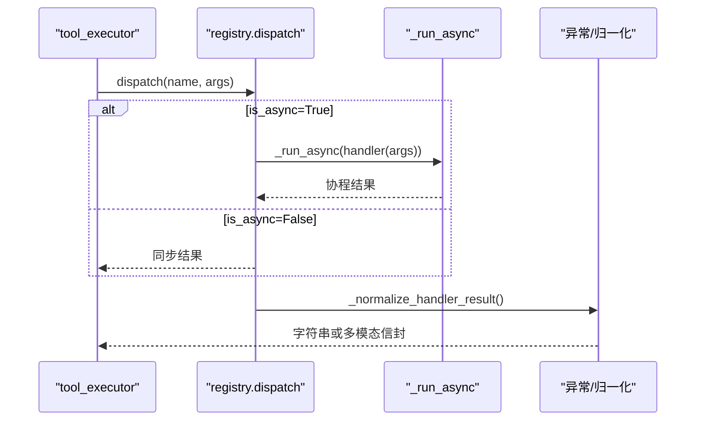
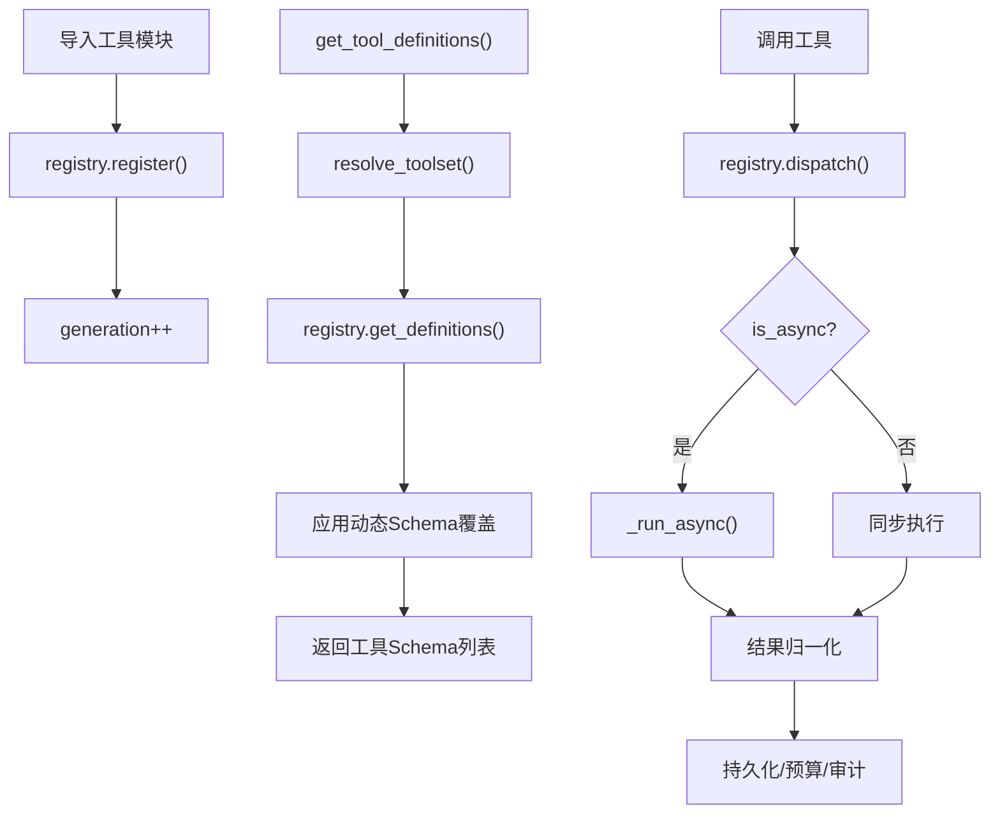
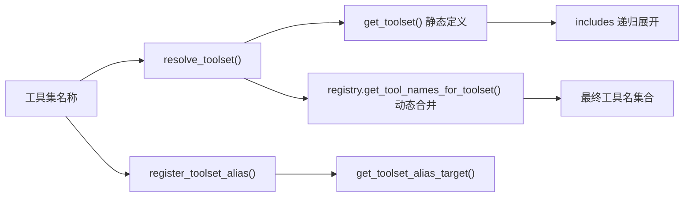
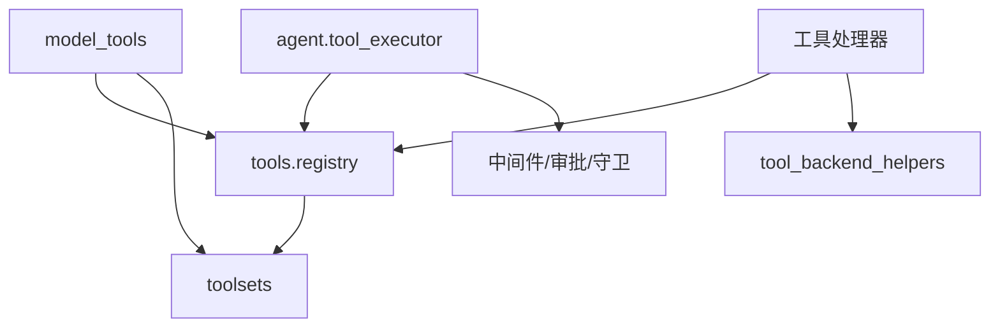

# 工具架构设计

<cite>
**本文引用的文件**
- [tools/registry.py](file://tools/registry.py)
- [model_tools.py](file://model_tools.py)
- [toolsets.py](file://toolsets.py)
- [agent/tool_executor.py](file://agent/tool_executor.py)
- [tools/tool_backend_helpers.py](file://tools/tool_backend_helpers.py)
</cite>

## 目录
1. [简介](#简介)
2. [项目结构](#项目结构)
3. [核心组件](#核心组件)
4. [架构总览](#架构总览)
5. [详细组件分析](#详细组件分析)
6. [依赖关系分析](#依赖关系分析)
7. [性能考量](#性能考量)
8. [故障排查指南](#故障排查指南)
9. [结论](#结论)
10. [附录：最佳实践与示例路径](#附录最佳实践与示例路径)

## 简介
本文件系统性梳理工具系统的架构设计与实现要点，覆盖工具注册机制、发现缓存、线程安全、异步执行框架、生命周期管理、工具集（toolset）分组与别名、check_fn检查函数的TTL与临时失败恢复策略，以及错误处理、资源管理与性能优化等最佳实践。目标是帮助开发者理解并正确扩展自定义工具，确保在高并发、长驻进程和复杂环境下的稳定性与可维护性。

## 项目结构
工具系统由以下关键模块构成：
- 工具注册中心：集中管理工具的元数据、处理器、可用性与动态Schema。
- 工具发现与加载：扫描内置工具模块并触发其自注册。
- 工具集定义与解析：按场景组合工具，支持别名与平台特定工具集。
- 执行调度：串行/并发执行工具调用，集成审批、中间件、预算与结果持久化。
- 异步桥接：统一将同步上下文中的协程运行到合适的事件循环中。

图示来源
- [model_tools.py:305-388](file://model_tools.py#L305-L388)
- [tools/registry.py:717-764](file://tools/registry.py#L717-L764)
- [tools/registry.py:312-379](file://tools/registry.py#L312-L379)
- [toolsets.py:746-800](file://toolsets.py#L746-L800)
- [agent/tool_executor.py:482-662](file://agent/tool_executor.py#L482-L662)
- [model_tools.py:114-207](file://model_tools.py#L114-L207)

章节来源
- [model_tools.py:305-388](file://model_tools.py#L305-L388)
- [tools/registry.py:717-764](file://tools/registry.py#L717-L764)
- [toolsets.py:746-800](file://toolsets.py#L746-L800)
- [agent/tool_executor.py:482-662](file://agent/tool_executor.py#L482-L662)
- [model_tools.py:114-207](file://model_tools.py#L114-L207)

## 核心组件
- ToolEntry：单条工具的元数据载体，包含名称、工具集、Schema、处理器、可用性检查函数、环境变量要求、是否异步、描述、表情、结果大小限制与动态Schema覆盖。
- ToolRegistry：全局注册表，负责工具注册、去重与覆盖策略、工具集别名、查询与分发、并发安全的快照与版本计数。
- check_fn TTL缓存：对外部状态探测进行短期缓存与临时失败抑制，避免抖动导致工具不可用。
- 工具发现缓存：基于文件mtime+size的磁盘缓存，加速内置工具模块是否包含顶层注册的判断。
- 工具集（toolset）：按场景组合工具，支持静态定义与运行时注册合并，支持别名与平台特定集合。
- 执行管线：中间件、审批、守卫、预算、结果持久化、并发控制与超时保护。
- 异步桥接：在CLI主线程、网关事件循环、工作线程三种场景下选择合适的事件循环运行协程。

章节来源
- [tools/registry.py:201-231](file://tools/registry.py#L201-L231)
- [tools/registry.py:414-445](file://tools/registry.py#L414-L445)
- [tools/registry.py:257-379](file://tools/registry.py#L257-L379)
- [tools/registry.py:108-159](file://tools/registry.py#L108-L159)
- [toolsets.py:101-641](file://toolsets.py#L101-L641)
- [agent/tool_executor.py:482-662](file://agent/tool_executor.py#L482-L662)
- [model_tools.py:114-207](file://model_tools.py#L114-L207)

## 架构总览
工具系统采用“声明式注册 + 集中式分发”的模式：
- 每个工具模块在导入时通过registry.register()声明自身。
- 启动阶段discover_builtin_tools()扫描并导入工具模块，触发注册。
- 上层通过model_tools.get_tool_definitions()获取当前会话可用的工具Schema列表。
- 调用时通过registry.dispatch()或执行管线执行具体处理器，自动处理异步、异常与结果归一化。
- toolsets提供工具分组与别名，便于在不同平台/场景下启用不同工具子集。

图示来源
- [model_tools.py:305-388](file://model_tools.py#L305-L388)
- [toolsets.py:746-800](file://toolsets.py#L746-L800)
- [tools/registry.py:717-764](file://tools/registry.py#L717-L764)
- [tools/registry.py:312-379](file://tools/registry.py#L312-L379)
- [tools/registry.py:801-834](file://tools/registry.py#L801-L834)
- [model_tools.py:114-207](file://model_tools.py#L114-L207)

## 详细组件分析

### 工具注册机制与ToolEntry设计
- ToolEntry承载工具元数据，包括name、toolset、schema、handler、check_fn、requires_env、is_async、description、emoji、max_result_size_chars与dynamic_schema_overrides。
- ToolRegistry使用RLock保证并发安全，维护_tools字典、工具集检查映射、别名映射与generation计数器，用于外部缓存失效。
- register()支持override策略，防止插件意外覆盖内置工具；deregister()对非mcp工具集同样受权限策略约束。
- get_definitions()根据工具名集合返回OpenAI格式的工具Schema，仅包含check_fn通过的条目，并应用动态Schema覆盖。

图示来源
- [tools/registry.py:201-231](file://tools/registry.py#L201-L231)
- [tools/registry.py:414-445](file://tools/registry.py#L414-L445)
- [tools/registry.py:562-644](file://tools/registry.py#L562-L644)
- [tools/registry.py:646-711](file://tools/registry.py#L646-L711)
- [tools/registry.py:717-764](file://tools/registry.py#L717-L764)
- [tools/registry.py:801-834](file://tools/registry.py#L801-L834)

章节来源
- [tools/registry.py:201-231](file://tools/registry.py#L201-L231)
- [tools/registry.py:414-445](file://tools/registry.py#L414-L445)
- [tools/registry.py:562-644](file://tools/registry.py#L562-L644)
- [tools/registry.py:717-764](file://tools/registry.py#L717-L764)
- [tools/registry.py:801-834](file://tools/registry.py#L801-L834)

### 工具发现缓存系统与线程安全
- 内置工具发现：discover_builtin_tools()遍历tools/*.py，跳过特殊文件，使用AST快速检测是否包含顶层registry.register()调用，结果以(mtime_ns, size)为键写入磁盘缓存，提升冷/热启动性能。
- check_fn TTL缓存：_check_fn_cached()对check_fn结果进行~30秒TTL缓存，并在最近一次成功后的短时间内容忍临时失败（如Docker daemon忙），避免工具突然消失。
- 多Profile隔离：check_fn_cache_scope()在多路复用网关中按profile作用域隔离缓存，未解析时回退到绕过缓存以保证安全。
- 线程安全：所有共享状态变更均通过_lock序列化；TTL清理与容量裁剪也在锁内完成。

图示来源
- [tools/registry.py:257-379](file://tools/registry.py#L257-L379)
- [tools/registry.py:108-159](file://tools/registry.py#L108-L159)

章节来源
- [tools/registry.py:108-159](file://tools/registry.py#L108-L159)
- [tools/registry.py:257-379](file://tools/registry.py#L257-L379)

### 异步执行框架与并发控制
- 异步桥接：_run_async()统一处理三种场景：
  - 已在运行事件循环（网关/RL环境）：在新线程创建独立事件循环运行协程，支持超时取消与任务清理。
  - 工作线程（并行工具执行）：使用线程本地持久事件循环，避免“Event loop is closed”。
  - CLI主线程：使用进程级持久事件循环，保持httpx/AsyncOpenAI等客户端绑定到活循环。
- 并发执行：tool_executor支持批量工具调用的并发执行，使用线程池与最大工作线程数限制；针对图像生成等慢操作有单独并行度上限。
- 授权与顺序门控：_ConcurrentToolAuthorizationGate序列化审批提示，排除人类等待时间从批次截止时间；start-order gate保障有序推进。
- 中间件与守卫：请求中间件、执行中间件、前置阻断（插件/守卫）与审计钩子贯穿执行链路。

图示来源
- [tools/registry.py:801-834](file://tools/registry.py#L801-L834)
- [model_tools.py:114-207](file://model_tools.py#L114-L207)
- [agent/tool_executor.py:482-662](file://agent/tool_executor.py#L482-L662)

章节来源
- [model_tools.py:114-207](file://model_tools.py#L114-L207)
- [agent/tool_executor.py:482-662](file://agent/tool_executor.py#L482-L662)
- [tools/registry.py:801-834](file://tools/registry.py#L801-L834)

### 工具生命周期管理（从导入到执行）
- 模块导入：discover_builtin_tools()扫描并导入工具模块，触发模块级registry.register()。
- 注册阶段：ToolRegistry登记工具元数据、工具集、check_fn与动态Schema覆盖；更新generation以便外部缓存失效。
- Schema构建：get_tool_definitions()根据enabled/disabled toolsets解析工具名集合，调用registry.get_definitions()过滤check_fn失败的条目，并应用动态Schema修正。
- 执行阶段：registry.dispatch()或执行管线调用处理器，自动处理异步、异常、结果归一化与持久化。
- 动态刷新：MCP工具集可通过deregister/register实现动态替换；注册表generation递增驱动上游缓存失效。

图示来源
- [tools/registry.py:108-159](file://tools/registry.py#L108-L159)
- [tools/registry.py:562-644](file://tools/registry.py#L562-L644)
- [model_tools.py:305-388](file://model_tools.py#L305-L388)
- [tools/registry.py:717-764](file://tools/registry.py#L717-L764)
- [tools/registry.py:801-834](file://tools/registry.py#L801-L834)

章节来源
- [tools/registry.py:108-159](file://tools/registry.py#L108-L159)
- [tools/registry.py:562-644](file://tools/registry.py#L562-L644)
- [model_tools.py:305-388](file://model_tools.py#L305-L388)
- [tools/registry.py:717-764](file://tools/registry.py#L717-L764)
- [tools/registry.py:801-834](file://tools/registry.py#L801-L834)

### 工具集（toolset）概念与分组策略、别名机制
- 工具集定义：toolsets.py集中定义各场景工具集，支持工具列表与includes组合，支持posture标记（如coding）。
- 解析与合并：resolve_toolset()递归展开includes，支持all/*别名；get_toolset()可合并注册表中的动态工具（插件/MCP）。
- 平台工具集：sparkii-*系列工具集聚合核心工具与平台特有工具；bundle_non_core_tools()用于禁用平台包时保留核心工具。
- 别名：register_toolset_alias()允许为工具集注册别名；get_toolset_alias_target()解析目标；注册表维护alias映射并在删除最后一个工具时清理。

图示来源
- [toolsets.py:101-641](file://toolsets.py#L101-L641)
- [toolsets.py:746-800](file://toolsets.py#L746-L800)
- [tools/registry.py:487-507](file://tools/registry.py#L487-L507)

章节来源
- [toolsets.py:101-641](file://toolsets.py#L101-L641)
- [toolsets.py:746-800](file://toolsets.py#L746-L800)
- [tools/registry.py:487-507](file://tools/registry.py#L487-L507)

### check_fn检查函数的TTL缓存与临时失败恢复
- TTL：默认30秒，避免频繁探测外部状态（Docker、Modal、Playwright等）。
- 临时失败抑制：若最近一次成功在宽限期内（默认60秒），后续失败被视为抖动，返回上次成功的True且不缓存失败，确保工具不会因瞬时问题被移除。
- 多Profile隔离：在多路复用网关中按profile作用域隔离缓存，未解析时绕过缓存以避免误判。
- 清理与容量：定期清理过期项并限制缓存大小，防止长期运行进程内存增长。

章节来源
- [tools/registry.py:257-379](file://tools/registry.py#L257-L379)

## 依赖关系分析
- model_tools依赖tools.registry与toolsets，负责Schema组装与缓存。
- agent.tool_executor依赖registry与中间件/审批/守卫，负责执行流程与并发控制。
- tools.tool_backend_helpers提供后端选择与凭据解析，供工具处理器使用。
- 注册表与工具集之间通过名称解耦，支持插件/MCP动态注入。

图示来源
- [model_tools.py:305-388](file://model_tools.py#L305-L388)
- [tools/registry.py:717-764](file://tools/registry.py#L717-L764)
- [toolsets.py:746-800](file://toolsets.py#L746-L800)
- [agent/tool_executor.py:482-662](file://agent/tool_executor.py#L482-L662)
- [tools/tool_backend_helpers.py:158-252](file://tools/tool_backend_helpers.py#L158-L252)

章节来源
- [model_tools.py:305-388](file://model_tools.py#L305-L388)
- [tools/registry.py:717-764](file://tools/registry.py#L717-L764)
- [toolsets.py:746-800](file://toolsets.py#L746-L800)
- [agent/tool_executor.py:482-662](file://agent/tool_executor.py#L482-L662)
- [tools/tool_backend_helpers.py:158-252](file://tools/tool_backend_helpers.py#L158-L252)

## 性能考量
- 工具发现缓存：基于文件mtime+size的磁盘缓存，减少AST扫描开销。
- Schema缓存：get_tool_definitions()在quiet_mode下按配置指纹与注册表generation缓存，避免重复计算。
- check_fn TTL：30秒TTL与临时失败抑制，降低外部探测频率与抖动影响。
- 并发控制：最大工作线程数与图像生成并行度限制，避免后端过载。
- 结果尺寸限制：per-tool最大结果字符数与全局默认，防止大响应阻塞上下文。
- 事件循环复用：持久事件循环避免“Event loop is closed”与客户端GC问题。

章节来源
- [tools/registry.py:108-159](file://tools/registry.py#L108-L159)
- [model_tools.py:276-388](file://model_tools.py#L276-L388)
- [tools/registry.py:257-379](file://tools/registry.py#L257-L379)
- [agent/tool_executor.py:93-111](file://agent/tool_executor.py#L93-L111)
- [model_tools.py:114-207](file://model_tools.py#L114-L207)

## 故障排查指南
- 工具不可用：检查check_fn是否失败或被TTL缓存；查看日志中的临时失败抑制信息；必要时调用invalidate_check_fn_cache()刷新。
- 工具被覆盖：确认register()是否传入override=True；插件覆盖需operator opt-in；deregister()受相同策略约束。
- 异步错误：确认_is_async标志与_run_async路径；检查事件循环是否已关闭；注意工作线程的本地循环。
- 并发超时：调整SPARKII_CONCURRENT_TOOL_TIMEOUT_S；检查授权门控与审批等待是否过长。
- 结果过大：设置per-tool max_result_size_chars或全局默认；检查_normalize_handler_result与错误截断。

章节来源
- [tools/registry.py:257-379](file://tools/registry.py#L257-L379)
- [tools/registry.py:562-644](file://tools/registry.py#L562-L644)
- [tools/registry.py:801-834](file://tools/registry.py#L801-L834)
- [model_tools.py:114-207](file://model_tools.py#L114-L207)
- [agent/tool_executor.py:160-175](file://agent/tool_executor.py#L160-L175)

## 结论
该工具架构通过集中注册、分层缓存、严格的并发与异步控制、灵活的工具集分组与别名机制，实现了高可用、高性能与可扩展的工具系统。check_fn的TTL与临时失败抑制显著提升了鲁棒性；注册表的generation与Schema缓存保障了高效更新；执行管线的中间件与守卫提供了强大的可观测性与安全性。遵循本文的最佳实践，可稳定地扩展自定义工具并融入现有生态。

## 附录：最佳实践与示例路径
- 自定义工具注册模式
  - 在工具模块顶部调用registry.register()声明Schema、处理器、工具集、check_fn与is_async。
  - 参考路径：[tools/registry.py:562-644](file://tools/registry.py#L562-L644)
- 异步工具实现
  - 设置is_async=True，处理器返回协程；通过_run_async自动桥接到合适事件循环。
  - 参考路径：[model_tools.py:114-207](file://model_tools.py#L114-L207)
- 可用性检查函数
  - 实现check_fn探测外部依赖；利用TTL与临时失败抑制获得稳定行为。
  - 参考路径：[tools/registry.py:257-379](file://tools/registry.py#L257-L379)
- 工具集分组与别名
  - 在toolsets.py定义工具集与includes；使用register_toolset_alias()注册别名。
  - 参考路径：[toolsets.py:101-641](file://toolsets.py#L101-L641)、[tools/registry.py:487-507](file://tools/registry.py#L487-L507)
- 错误处理与结果归一化
  - 使用tool_error()/tool_result()返回标准JSON；异常会被捕获并清洗。
  - 参考路径：[tools/registry.py:974-1001](file://tools/registry.py#L974-L1001)、[tools/registry.py:801-834](file://tools/registry.py#L801-L834)
- 资源管理与性能优化
  - 设置per-tool结果大小限制；合理使用并发与超时；复用事件循环。
  - 参考路径：[tools/registry.py:840-848](file://tools/registry.py#L840-L848)、[agent/tool_executor.py:93-111](file://agent/tool_executor.py#L93-L111)、[model_tools.py:114-207](file://model_tools.py#L114-L207)
- 后端选择与凭据解析
  - 使用tool_backend_helpers统一解析凭据与后端模式。
  - 参考路径：[tools/tool_backend_helpers.py:158-252](file://tools/tool_backend_helpers.py#L158-L252)