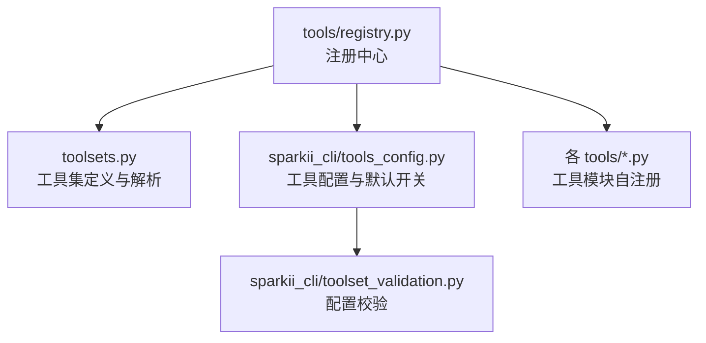
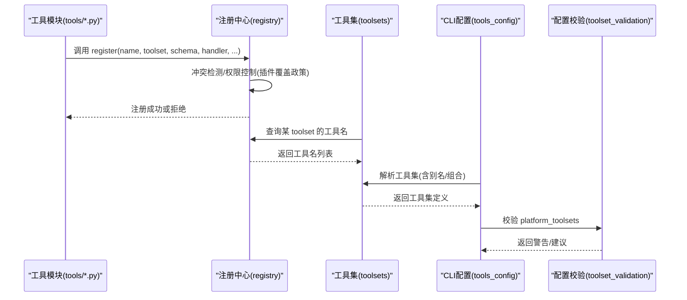
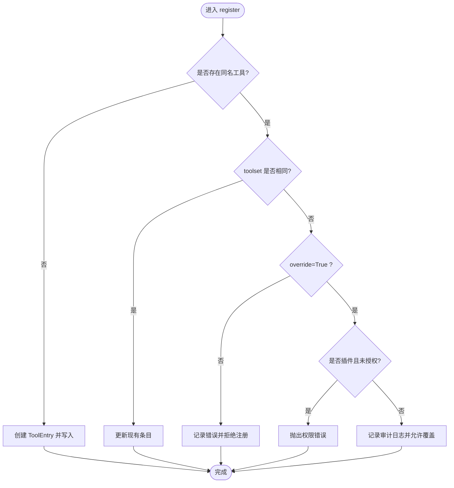
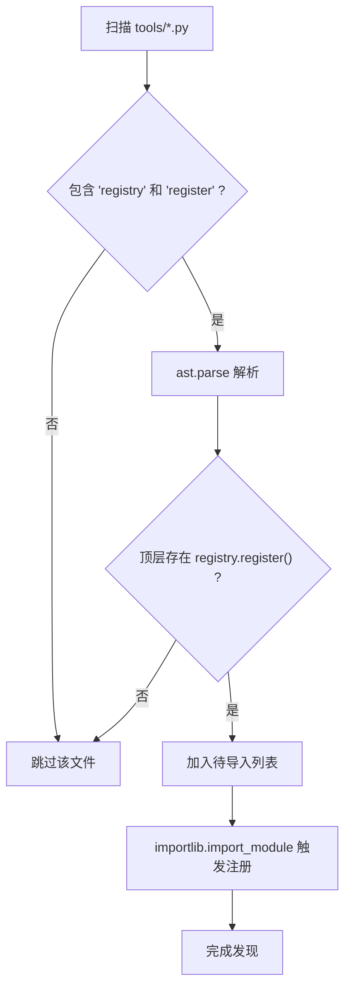
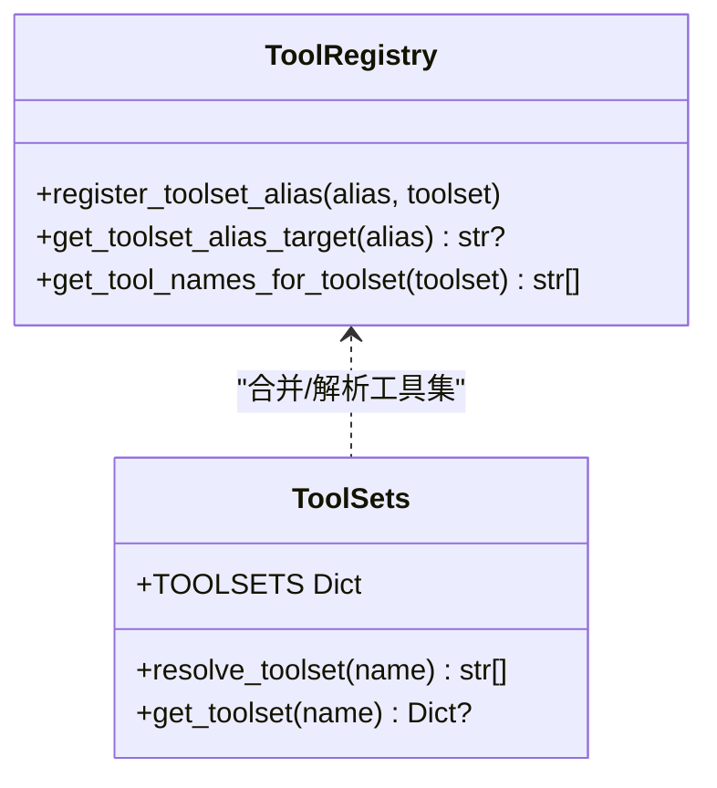
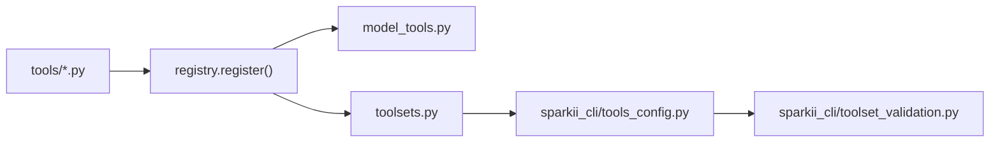

# 工具注册机制

<cite>
**本文引用的文件**
- [tools/registry.py](file://tools/registry.py)
- [toolsets.py](file://toolsets.py)
- [sparkii_cli/tools_config.py](file://sparkii_cli/tools_config.py)
- [sparkii_cli/toolset_validation.py](file://sparkii_cli/toolset_validation.py)
</cite>

## 目录
1. [简介](#简介)
2. [项目结构](#项目结构)
3. [核心组件](#核心组件)
4. [架构总览](#架构总览)
5. [详细组件分析](#详细组件分析)
6. [依赖关系分析](#依赖关系分析)
7. [性能考量](#性能考量)
8. [故障排查指南](#故障排查指南)
9. [结论](#结论)
10. [附录：自定义工具注册示例](#附录自定义工具注册示例)

## 简介
本文件系统性阐述 Sparkii Agent 的“工具注册机制”，聚焦以下目标：
- ToolEntry 的设计原理：属性定义、内存优化与类型安全。
- register() 方法实现逻辑：参数校验、冲突检测与权限控制（插件覆盖政策）。
- 工具发现系统：AST 扫描、模块导入与缓存机制。
- 工具集（toolset）概念与分组策略，以及工具别名机制。
- 插件覆盖政策的实现：权限检查与安全边界。
- 提供具体代码示例路径，展示如何正确注册自定义工具（schema、handler、check_fn）。

## 项目结构
围绕工具注册的核心由以下模块构成：
- tools/registry.py：工具注册中心，包含 ToolEntry、ToolRegistry、工具发现、check_fn 缓存、注册/注销、分发等。
- toolsets.py：工具集定义与解析，支持组合、别名与平台化扩展。
- sparkii_cli/tools_config.py：工具配置 UI 与默认开关、平台限制、类别配置。
- sparkii_cli/toolset_validation.py：对 platform_toolsets 配置的合法性校验与提示。

图表来源
- [tools/registry.py:108-159](file://tools/registry.py#L108-L159)
- [toolsets.py:103-641](file://toolsets.py#L103-L641)
- [sparkii_cli/tools_config.py:96-156](file://sparkii_cli/tools_config.py#L96-L156)
- [sparkii_cli/toolset_validation.py:18-74](file://sparkii_cli/toolset_validation.py#L18-L74)

章节来源
- [tools/registry.py:1-159](file://tools/registry.py#L1-L159)
- [toolsets.py:1-100](file://toolsets.py#L1-L100)
- [sparkii_cli/tools_config.py:1-166](file://sparkii_cli/tools_config.py#L1-L166)
- [sparkii_cli/toolset_validation.py:1-74](file://sparkii_cli/toolset_validation.py#L1-L74)

## 核心组件
- ToolEntry：单条工具的元数据载体，使用 __slots__ 降低内存占用，字段包括 name、toolset、schema、handler、check_fn、requires_env、is_async、description、emoji、max_result_size_chars、dynamic_schema_overrides。
- ToolRegistry：全局单例，维护工具映射、工具集别名、工具集 check_fn 映射、插件覆盖策略、并发锁与生成号；提供注册、注销、查询、分发、可用性判断等方法。
- 工具发现：discover_builtin_tools() 通过 AST 扫描 tools/*.py，识别顶层 registry.register() 调用，结合磁盘缓存加速导入。
- 工具集系统：toolsets.py 定义静态工具集及组合关系，并可与 registry 动态合并；支持别名与平台化扩展。
- CLI 配置与校验：tools_config.py 管理可配置工具集、默认关闭项、平台限制；toolset_validation.py 校验 platform_toolsets 配置，避免“零工具”静默失败。

章节来源
- [tools/registry.py:201-230](file://tools/registry.py#L201-L230)
- [tools/registry.py:414-436](file://tools/registry.py#L414-L436)
- [tools/registry.py:108-159](file://tools/registry.py#L108-L159)
- [toolsets.py:103-641](file://toolsets.py#L103-L641)
- [sparkii_cli/tools_config.py:96-156](file://sparkii_cli/tools_config.py#L96-L156)
- [sparkii_cli/toolset_validation.py:18-74](file://sparkii_cli/toolset_validation.py#L18-L74)

## 架构总览
下图展示了从工具模块自注册到工具集解析、再到运行时可用性与分发的整体流程。

图表来源
- [tools/registry.py:562-644](file://tools/registry.py#L562-L644)
- [toolsets.py:645-715](file://toolsets.py#L645-L715)
- [sparkii_cli/tools_config.py:245-303](file://sparkii_cli/tools_config.py#L245-L303)
- [sparkii_cli/toolset_validation.py:18-74](file://sparkii_cli/toolset_validation.py#L18-L74)

## 详细组件分析

### ToolEntry 设计原理
- 属性定义：name、toolset、schema、handler、check_fn、requires_env、is_async、description、emoji、max_result_size_chars、dynamic_schema_overrides。
- 内存优化：使用 __slots__ 减少实例字典开销，适合大量工具条目场景。
- 类型安全：字段在构造时明确赋值，配合注册时的强约束（如 requires_env 默认空列表、description/schema 回退），避免 None 传播导致的下游异常。
- 动态 schema 覆盖：dynamic_schema_overrides 为无参可调用，在 get_definitions() 时合并到基础 schema，用于根据运行时配置调整描述或限制（例如委托任务并发数）。

章节来源
- [tools/registry.py:201-230](file://tools/registry.py#L201-L230)
- [tools/registry.py:717-764](file://tools/registry.py#L717-L764)

### ToolRegistry 与 register() 实现逻辑
- 参数验证：
  - name、toolset、schema、handler 必填；requires_env 默认空列表；is_async 默认 False；description 可从 schema 回退；emoji 可选；max_result_size_chars 可选；dynamic_schema_overrides 可选。
- 冲突检测：
  - 若同名工具已存在且 toolset 不同，则视为跨 toolset 覆盖，需显式 override=True 才允许替换；否则记录错误并拒绝注册。
- 权限控制（插件覆盖政策）：
  - 通过 _plugin_owner_of(handler) 判定 handler 是否来自插件命名空间；若为插件且未配置 allow_tool_override，则抛出 PermissionError 并记录错误日志。
  - deregister() 同样受相同策略保护，防止插件删除非自有工具绕过覆盖策略。
- 并发与一致性：
  - 所有写操作加 RLock；snapshot 读取保证一致视图；_generation 递增供外部缓存失效。

图表来源
- [tools/registry.py:562-644](file://tools/registry.py#L562-L644)
- [tools/registry.py:646-711](file://tools/registry.py#L646-L711)

章节来源
- [tools/registry.py:562-644](file://tools/registry.py#L562-L644)
- [tools/registry.py:646-711](file://tools/registry.py#L646-L711)

### 工具发现系统：AST 扫描、模块导入与缓存
- AST 扫描：
  - _module_registers_tools() 仅检查模块顶层语句中是否存在 registry.register(...) 调用，避免函数体内调用被误判。
  - 先做文本预过滤（包含 "registry" 和 "register"），再 ast.parse，提升性能。
- 模块导入：
  - discover_builtin_tools() 遍历 tools/*.py，跳过特殊文件，收集需要导入的模块名，然后 importlib.import_module 触发自注册。
- 缓存机制：
  - 基于 (mtime_ns, size) 的磁盘缓存，命中则跳过 AST 扫描；写入采用原子 JSON 写入，并发安全。
  - 缓存路径位于 sparkii_home/cache/tool_discovery_cache.json。

图表来源
- [tools/registry.py:71-105](file://tools/registry.py#L71-L105)
- [tools/registry.py:108-159](file://tools/registry.py#L108-L159)
- [tools/registry.py:162-199](file://tools/registry.py#L162-L199)

章节来源
- [tools/registry.py:71-159](file://tools/registry.py#L71-L159)
- [tools/registry.py:162-199](file://tools/registry.py#L162-L199)

### 工具集（toolset）与分组策略、工具别名
- 工具集定义：
  - TOOLSETS 集中声明各工具集名称、描述、包含工具与 includes 组合。
  - 内置工具集涵盖 web、browser、terminal、file、vision、video_gen、bfl、computer_use、skills、todo、memory、session_search、clarify、delegation、homeassistant、kanban、discord、spotify、yuanbao、feishu_doc、feishu_drive 等。
  - 平台化工具集（sparkii-*）复用核心工具集合，并可叠加平台专属工具。
- 组合与解析：
  - resolve_toolset() 递归展开 includes，支持 all/* 别名，循环检测防环。
  - get_toolset() 支持 include_registry=True，将 registry 中注册的额外工具合并进静态定义。
- 工具别名：
  - ToolRegistry 支持 register_toolset_alias() 与 get_toolset_alias_target()，用于 MCP 服务器名或插件工具集的别名映射。
  - toolsets.get_toolset() 会尝试解析别名并生成描述。

图表来源
- [tools/registry.py:487-507](file://tools/registry.py#L487-L507)
- [toolsets.py:645-715](file://toolsets.py#L645-L715)
- [toolsets.py:746-800](file://toolsets.py#L746-L800)

章节来源
- [toolsets.py:103-641](file://toolsets.py#L103-L641)
- [toolsets.py:645-715](file://toolsets.py#L645-L715)
- [toolsets.py:746-800](file://toolsets.py#L746-L800)
- [tools/registry.py:487-507](file://tools/registry.py#L487-L507)

### 插件覆盖政策：权限检查与安全边界
- 覆盖策略绑定：
  - register_plugin_override_policy(module_namespace, allowed) 在插件加载时记录是否允许覆盖内置工具。
  - _plugin_owner_of(handler) 通过 handler.__globals__["__name__"] 定位定义模块，拦截插件命名空间下的覆盖行为。
- 安全边界：
  - 插件若无 allow_tool_override，则无法覆盖内置工具或注销非自有工具；违反时抛出 PermissionError 并记录错误日志。
  - MCP 工具集（mcp-*）豁免此策略，以支持动态刷新时的 nuke-and-repave 行为。

章节来源
- [tools/registry.py:513-544](file://tools/registry.py#L513-L544)
- [tools/registry.py:562-644](file://tools/registry.py#L562-L644)
- [tools/registry.py:646-711](file://tools/registry.py#L646-L711)

### check_fn 缓存与可用性
- 目的：避免每次 get_definitions() 都执行昂贵的外部状态探测（如 Docker、Playwright、浏览器二进制）。
- 机制：
  - TTL 约 30 秒；最近一次 True 结果后 60 秒内的短暂失败会被视为抖动，继续返回 True，避免误删工具。
  - 多进程/多 profile 隔离：check_fn_cache_scope() 在多路复用网关下按 profile 隔离缓存键。
- 暴露接口：invalidate_check_fn_cache() 清空缓存；get_cached_check_fn_result() 只读读取当前缓存结果。

章节来源
- [tools/registry.py:233-388](file://tools/registry.py#L233-L388)
- [tools/registry.py:717-764](file://tools/registry.py#L717-L764)

### 工具分发与结果规范化
- dispatch(name, args, **kwargs)：
  - 异步处理器自动桥接；统一捕获异常并以结构化 error 返回；结果经 _normalize_handler_result() 标准化为字符串或多模态信封。
- 结果大小限制：
  - 对 JSON 结果中的 error 字段进行截断，防止上下文膨胀。

章节来源
- [tools/registry.py:770-834](file://tools/registry.py#L770-L834)
- [tools/registry.py:974-1001](file://tools/registry.py#L974-L1001)

## 依赖关系分析
- 工具模块（tools/*.py）在模块级调用 registry.register() 完成自注册。
- model_tools.py 通过 registry 获取工具定义与分发，不再维护并行数据结构。
- toolsets.py 与 registry 协作，将静态工具集与动态注册工具合并。
- CLI 层（tools_config.py、toolset_validation.py）负责用户配置与校验，影响最终启用的工具集。

图表来源
- [tools/registry.py:1-15](file://tools/registry.py#L1-L15)
- [toolsets.py:645-715](file://toolsets.py#L645-L715)
- [sparkii_cli/tools_config.py:245-303](file://sparkii_cli/tools_config.py#L245-L303)
- [sparkii_cli/toolset_validation.py:18-74](file://sparkii_cli/toolset_validation.py#L18-L74)

章节来源
- [tools/registry.py:1-15](file://tools/registry.py#L1-L15)
- [toolsets.py:645-715](file://toolsets.py#L645-L715)
- [sparkii_cli/tools_config.py:245-303](file://sparkii_cli/tools_config.py#L245-L303)
- [sparkii_cli/toolset_validation.py:18-74](file://sparkii_cli/toolset_validation.py#L18-L74)

## 性能考量
- 工具发现缓存：基于 mtime+size 的文件级缓存，显著降低 AST 扫描成本。
- check_fn 缓存：TTL 与失败宽限窗口平衡了实时性与稳定性，避免频繁探测导致抖动。
- 并发安全：注册中心使用 RLock 与快照读取，避免并发读写竞争。
- 结果截断：对错误消息与 JSON 结果中的 error 字段进行长度限制，防止上下文爆炸。

[本节为通用性能讨论，不直接分析具体文件]

## 故障排查指南
- 工具不可用：
  - 检查对应工具的 check_fn 是否失败；可通过 invalidate_check_fn_cache() 清理缓存后重试。
  - 查看日志中关于 check_fn 失败的告警与“最近成功时间”信息。
- 工具被拒绝注册：
  - 若出现跨 toolset 覆盖，需设置 override=True；插件覆盖需配置 allow_tool_override。
  - 关注日志中的“Tool registration REJECTED”与权限错误。
- 工具集为空：
  - 使用 toolset_validation.validate_platform_toolsets() 检查 platform_toolsets 配置是否正确；若有无效工具集名，按提示修正。
- 工具分发异常：
  - 检查 handler 返回值类型是否符合规范；异常将被捕获并转为结构化 error。

章节来源
- [tools/registry.py:233-388](file://tools/registry.py#L233-L388)
- [tools/registry.py:562-644](file://tools/registry.py#L562-L644)
- [sparkii_cli/toolset_validation.py:18-74](file://sparkii_cli/toolset_validation.py#L18-L74)
- [tools/registry.py:801-834](file://tools/registry.py#L801-L834)

## 结论
本机制通过 ToolEntry 与 ToolRegistry 实现了高内聚、低耦合的工具注册体系：
- 以 AST 扫描与缓存驱动的高效工具发现。
- 严格的冲突检测与插件覆盖政策保障安全性。
- 灵活的 toolset 组合与别名机制适配多平台与插件生态。
- 健壮的 check_fn 缓存与结果规范化确保运行期稳定与可观测性。
- CLI 配置与校验帮助运维快速定位问题并恢复服务。

[本节为总结性内容，不直接分析具体文件]

## 附录：自定义工具注册示例
以下为正确注册自定义工具的步骤与参考路径（不包含具体代码内容）：
- 在 tools/ 目录下新增工具模块，并在模块顶层调用 registry.register()。
- 定义 schema：
  - 参考路径：[tools/registry.py:562-644](file://tools/registry.py#L562-L644)
- 实现 handler：
  - 同步或异步均可；异步将通过 _run_async 桥接。
  - 参考路径：[tools/registry.py:801-834](file://tools/registry.py#L801-L834)
- 配置 check_fn：
  - 用于环境就绪检查（如 Docker、Playwright、浏览器二进制等）。
  - 参考路径：[tools/registry.py:233-388](file://tools/registry.py#L233-L388)
- 指定 toolset：
  - 选择已有 toolset 或注册新 toolset；必要时使用别名。
  - 参考路径：[toolsets.py:103-641](file://toolsets.py#L103-L641)
  - 参考路径：[tools/registry.py:487-507](file://tools/registry.py#L487-L507)
- 如需覆盖内置工具：
  - 设置 override=True，并确保插件覆盖政策允许。
  - 参考路径：[tools/registry.py:562-644](file://tools/registry.py#L562-L644)

章节来源
- [tools/registry.py:562-644](file://tools/registry.py#L562-L644)
- [tools/registry.py:801-834](file://tools/registry.py#L801-L834)
- [tools/registry.py:233-388](file://tools/registry.py#L233-L388)
- [toolsets.py:103-641](file://toolsets.py#L103-L641)
- [tools/registry.py:487-507](file://tools/registry.py#L487-L507)