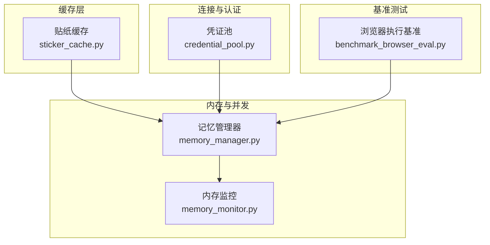
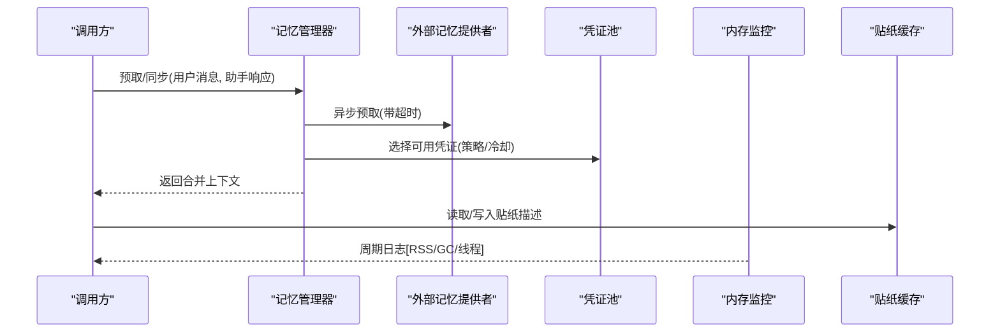
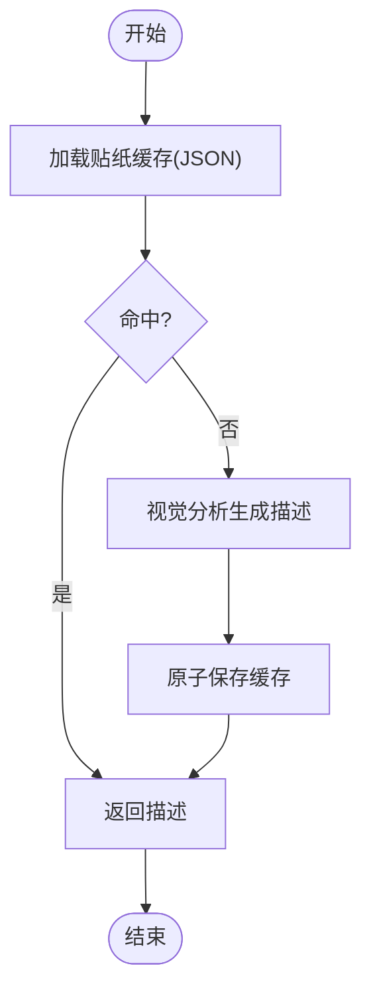
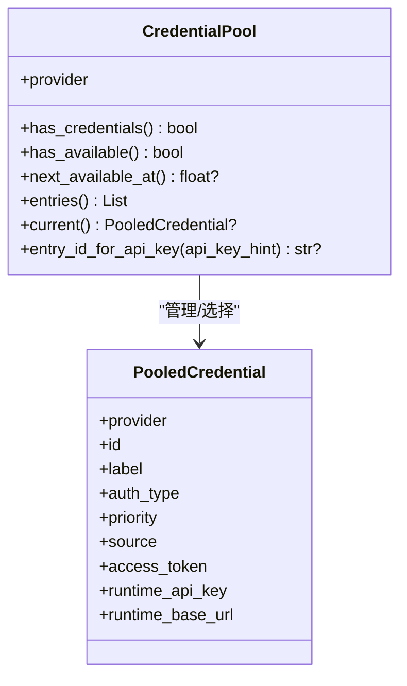
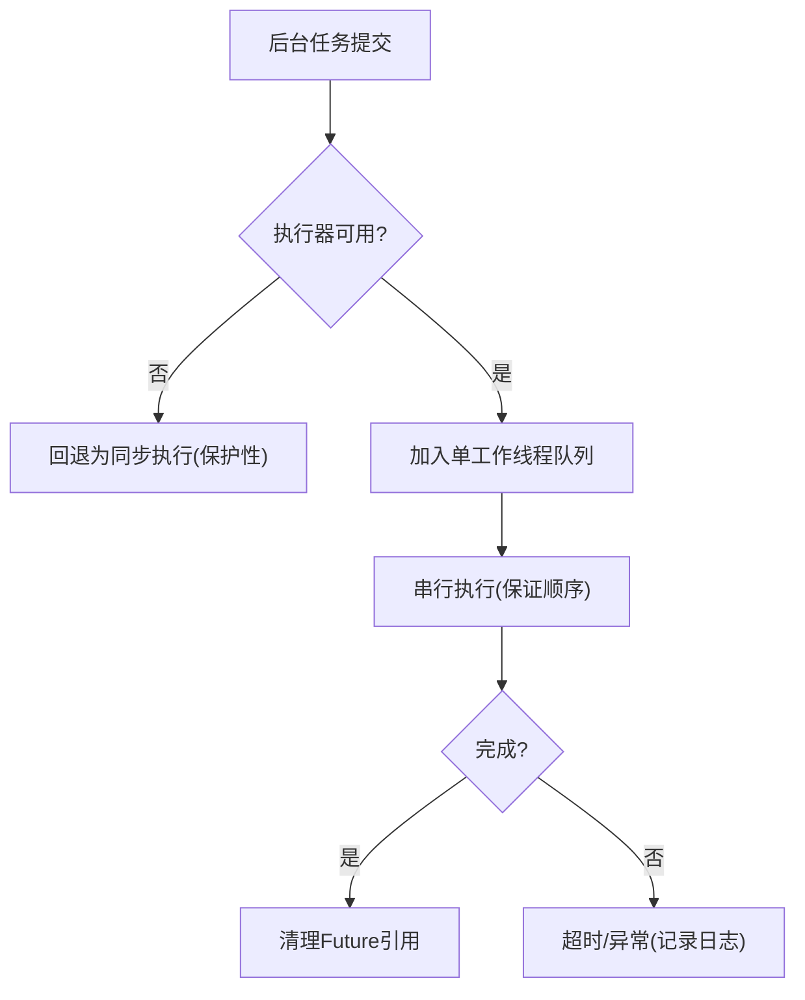
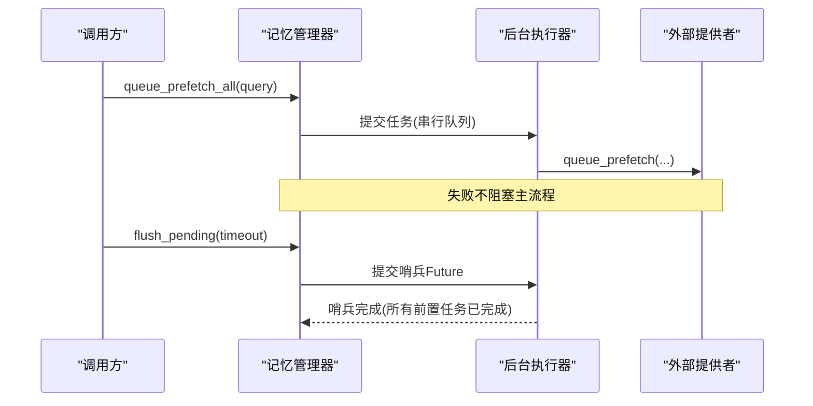
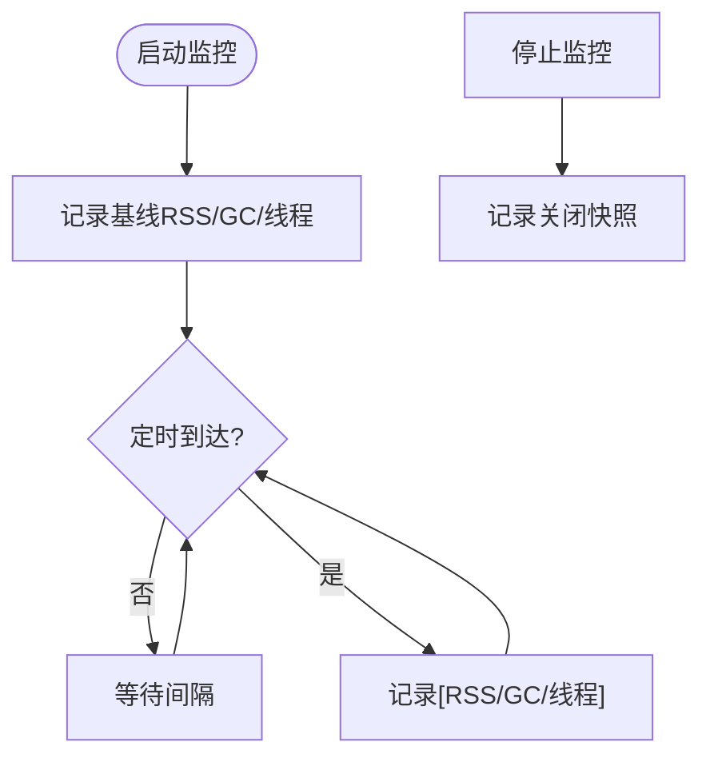
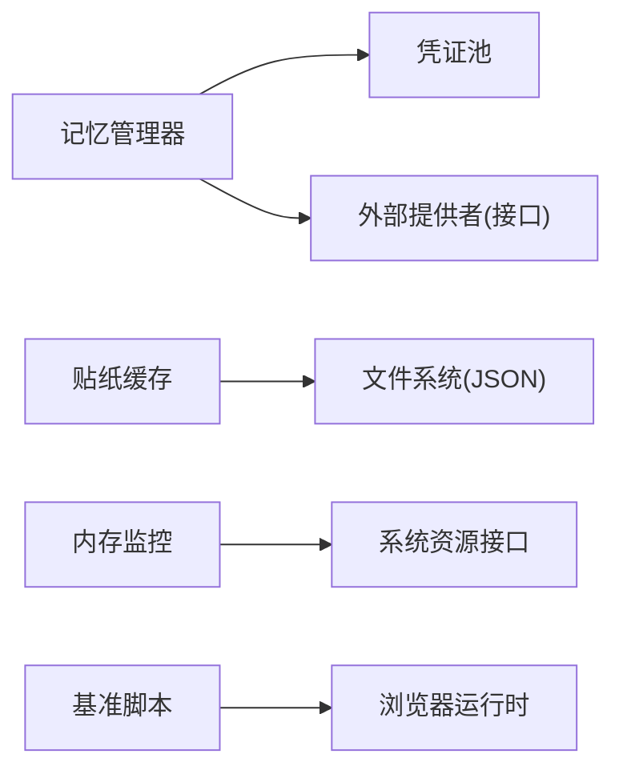

# 性能优化策略

<cite>
**本文引用的文件**
- [agent/memory_manager.py](file://agent/memory_manager.py)
- [gateway/memory_monitor.py](file://gateway/memory_monitor.py)
- [agent/credential_pool.py](file://agent/credential_pool.py)
- [gateway/sticker_cache.py](file://gateway/sticker_cache.py)
- [scripts/benchmark_browser_eval.py](file://scripts/benchmark_browser_eval.py)
</cite>

## 目录
1. [简介](#简介)
2. [项目结构](#项目结构)
3. [核心组件](#核心组件)
4. [架构总览](#架构总览)
5. [详细组件分析](#详细组件分析)
6. [依赖关系分析](#依赖关系分析)
7. [性能考量](#性能考量)
8. [故障排查指南](#故障排查指南)
9. [结论](#结论)
10. [附录](#附录)

## 简介
本指南面向工具与服务的性能优化，聚焦以下主题：多级缓存设计与失效、连接池管理、内存使用优化（对象池化、GC调优、大对象处理）、并行执行优化（任务分解、资源竞争避免、同步机制）、性能监控与分析（瓶颈识别、基准测试、效果评估），以及可落地的优化案例与持续优化建议。内容基于仓库中已实现的缓存、内存监控、凭证池与基准脚本等模块进行提炼与扩展。

## 项目结构
围绕性能优化的关键代码分布在如下位置：
- 缓存：贴纸描述缓存（持久化到本地JSON）
- 内存监控：周期性记录进程RSS、GC计数、线程数
- 并发与后台任务：记忆管理器中的后台同步/预取、超时控制、单工作线程串行化
- 连接与认证池：多凭证池、失败冷却、选择策略、持久化
- 基准测试：浏览器执行路径对比的基准脚本

图表来源
- [gateway/sticker_cache.py:1-125](file://gateway/sticker_cache.py#L1-L125)
- [agent/memory_manager.py:364-758](file://agent/memory_manager.py#L364-L758)
- [gateway/memory_monitor.py:1-231](file://gateway/memory_monitor.py#L1-L231)
- [agent/credential_pool.py:633-800](file://agent/credential_pool.py#L633-L800)
- [scripts/benchmark_browser_eval.py:58-139](file://scripts/benchmark_browser_eval.py#L58-L139)

章节来源
- [gateway/sticker_cache.py:1-125](file://gateway/sticker_cache.py#L1-L125)
- [agent/memory_manager.py:364-758](file://agent/memory_manager.py#L364-L758)
- [gateway/memory_monitor.py:1-231](file://gateway/memory_monitor.py#L1-L231)
- [agent/credential_pool.py:633-800](file://agent/credential_pool.py#L633-L800)
- [scripts/benchmark_browser_eval.py:58-139](file://scripts/benchmark_browser_eval.py#L58-L139)

## 核心组件
- 多级缓存设计
  - 本地磁盘缓存：贴纸描述按唯一ID持久化，读写原子化，避免重复视觉分析。
  - 进程内缓存：会话上下文、工具定义、MCP连接等由网关侧维护，配合内存监控观察增长趋势。
- 缓存失效与一致性
  - 贴纸缓存通过键（file_unique_id）实现精确失效；可扩展TTL或版本前缀以支持更新。
  - 凭证池通过状态机（ok/exhausted/dead）和冷却时间实现“软失效”，结合外部刷新与写回。
- 连接池管理
  - 凭证池提供多密钥轮换、失败冷却、策略选择（填充优先、轮询、随机、最少使用）。
  - 对OAuth与API Key统一抽象，支持自定义端点池键映射。
- 内存管理与GC
  - 周期性记录RSS、GC计数、线程数，便于发现慢泄漏与线程泄漏。
  - 后台任务采用单工作线程串行化，避免写顺序错乱与锁风暴。
- 并行执行优化
  - 外部记忆提供者预取使用独立线程+超时，避免阻塞主流程。
  - 同步写入通过后台队列与屏障等待，保障有序与可控退出。
- 性能监控与基准
  - 内存监控日志格式友好，便于grep定位问题。
  - 浏览器执行路径基准脚本对比WS与子进程两种方案，输出均值/中位数/极值并计算加速比。

章节来源
- [gateway/sticker_cache.py:29-92](file://gateway/sticker_cache.py#L29-L92)
- [agent/credential_pool.py:633-800](file://agent/credential_pool.py#L633-L800)
- [agent/memory_manager.py:364-758](file://agent/memory_manager.py#L364-L758)
- [gateway/memory_monitor.py:83-193](file://gateway/memory_monitor.py#L83-L193)
- [scripts/benchmark_browser_eval.py:58-139](file://scripts/benchmark_browser_eval.py#L58-L139)

## 架构总览
下图展示了缓存、并发、连接池与监控在运行时的交互关系。

图表来源
- [agent/memory_manager.py:525-623](file://agent/memory_manager.py#L525-L623)
- [agent/credential_pool.py:633-800](file://agent/credential_pool.py#L633-L800)
- [gateway/sticker_cache.py:59-92](file://gateway/sticker_cache.py#L59-L92)
- [gateway/memory_monitor.py:83-193](file://gateway/memory_monitor.py#L83-L193)

## 详细组件分析

### 多级缓存与失效机制
- 贴纸描述缓存
  - 键：Telegram贴纸唯一ID
  - 存储：本地JSON，原子写入（临时文件+fsync+替换）
  - 失效：按键覆盖；可扩展TTL或版本号
- 进程内缓存
  - 会话转录、工具定义、MCP连接等由网关维护
  - 配合内存监控观察增长，必要时引入LRU/TTL或分片
- 凭证池失效
  - 状态：ok / exhausted / dead
  - 冷却：根据错误码与是否“唯一凭证”动态调整
  - 写回：旋转后的OAuth state写回全局根配置，避免跨配置冲突

图表来源
- [gateway/sticker_cache.py:29-92](file://gateway/sticker_cache.py#L29-L92)

章节来源
- [gateway/sticker_cache.py:29-92](file://gateway/sticker_cache.py#L29-L92)
- [agent/credential_pool.py:633-800](file://agent/credential_pool.py#L633-L800)

### 连接池管理最佳实践
- 多凭证池
  - 选择策略：填充优先、轮询、随机、最少使用
  - 冷却模型：401短冷却、429/默认长冷却；唯一凭证时缩短冷却窗口
  - 终端失败：标记dead，需显式重认证清理
  - 写回：旋转后的state写回全局auth.json，避免跨配置污染
- 外部服务连接
  - 凭证池为HTTP/MCP等外部调用提供稳定身份
  - 结合重试与退避，减少雪崩风险

图表来源
- [agent/credential_pool.py:185-290](file://agent/credential_pool.py#L185-L290)
- [agent/credential_pool.py:633-800](file://agent/credential_pool.py#L633-L800)

章节来源
- [agent/credential_pool.py:185-290](file://agent/credential_pool.py#L185-L290)
- [agent/credential_pool.py:633-800](file://agent/credential_pool.py#L633-L800)

### 内存使用优化技巧
- 对象池化
  - 凭证池复用PooledCredential实例，减少分配与序列化开销
  - 记忆管理器单工作线程串行化写操作，降低锁竞争
- GC调优
  - 内存监控记录GC计数，辅助判断对象创建速率
  - 合理设置后台任务超时，避免长时间持有对象
- 大对象处理
  - 贴纸描述保持简短，减少传输与解析成本
  - 会话上下文压缩与流式清洗，避免大文本累积

图表来源
- [agent/memory_manager.py:698-758](file://agent/memory_manager.py#L698-L758)

章节来源
- [agent/memory_manager.py:698-758](file://agent/memory_manager.py#L698-L758)
- [gateway/memory_monitor.py:83-193](file://gateway/memory_monitor.py#L83-L193)

### 并行执行优化
- 任务分解
  - 外部记忆提供者预取使用独立线程+超时，避免阻塞主循环
  - 同步写入走后台队列，确保turn N先于turn N+1落地
- 资源竞争避免
  - 单工作线程串行化写，避免并发写导致的竞态
  - 凭证池内部RLock保护，防止旋转与选择之间的数据撕裂
- 同步机制优化
  - flush_pending使用哨兵Future保证有序完成
  - 外部预取线程可被跳过/丢弃，避免堆积

图表来源
- [agent/memory_manager.py:597-623](file://agent/memory_manager.py#L597-L623)
- [agent/memory_manager.py:759-780](file://agent/memory_manager.py#L759-L780)

章节来源
- [agent/memory_manager.py:597-623](file://agent/memory_manager.py#L597-L623)
- [agent/memory_manager.py:759-780](file://agent/memory_manager.py#L759-L780)

### 性能监控与分析工具
- 内存监控
  - 周期性记录RSS、GC计数、线程数，便于发现慢泄漏
  - 启动基线、关闭快照，便于前后对比
- 基准测试
  - 浏览器执行路径对比：WS vs 子进程，统计均值/中位数/极值，计算加速比
  - 可用于回归检测与PR质量门禁

图表来源
- [gateway/memory_monitor.py:139-193](file://gateway/memory_monitor.py#L139-L193)
- [gateway/memory_monitor.py:196-231](file://gateway/memory_monitor.py#L196-L231)

章节来源
- [gateway/memory_monitor.py:139-193](file://gateway/memory_monitor.py#L139-L193)
- [scripts/benchmark_browser_eval.py:58-139](file://scripts/benchmark_browser_eval.py#L58-L139)

## 依赖关系分析
- 组件耦合
  - 记忆管理器依赖外部提供者接口，并通过凭证池获取访问身份
  - 贴纸缓存与上层业务解耦，仅通过键存取
  - 内存监控独立于业务逻辑，仅读取系统信息
- 外部依赖
  - 凭证池依赖认证与持久化模块
  - 基准脚本依赖浏览器运行时与WS通信

图表来源
- [agent/memory_manager.py:364-758](file://agent/memory_manager.py#L364-L758)
- [agent/credential_pool.py:633-800](file://agent/credential_pool.py#L633-L800)
- [gateway/sticker_cache.py:29-92](file://gateway/sticker_cache.py#L29-L92)
- [gateway/memory_monitor.py:52-80](file://gateway/memory_monitor.py#L52-L80)
- [scripts/benchmark_browser_eval.py:22-56](file://scripts/benchmark_browser_eval.py#L22-L56)

章节来源
- [agent/memory_manager.py:364-758](file://agent/memory_manager.py#L364-L758)
- [agent/credential_pool.py:633-800](file://agent/credential_pool.py#L633-L800)
- [gateway/sticker_cache.py:29-92](file://gateway/sticker_cache.py#L29-L92)
- [gateway/memory_monitor.py:52-80](file://gateway/memory_monitor.py#L52-L80)
- [scripts/benchmark_browser_eval.py:22-56](file://scripts/benchmark_browser_eval.py#L22-L56)

## 性能考量
- 缓存命中率与过期策略
  - 贴纸缓存应评估命中率与大小增长，必要时引入TTL或容量上限
  - 进程内缓存建议结合LRU与TTL，避免无限增长
- 连接池参数
  - 根据QPS与超时调整凭证池策略与冷却时间，避免过度切换或长时间不可用
- 内存与GC
  - 关注RSS曲线与GC计数变化，定位对象生命周期过长或泄漏
  - 大对象尽量流式处理，避免一次性加载
- 并行与同步
  - 外部调用务必加超时与降级，避免阻塞主循环
  - 写路径串行化，读路径无锁或细粒度锁，降低争用
- 基准与回归
  - 将关键路径纳入基准套件，定期跑测，跟踪回归

[本节为通用指导，无需特定文件来源]

## 故障排查指南
- 内存缓慢增长
  - 查看内存监控日志，定位RSS上升阶段与GC行为
  - 检查是否有未释放的连接或缓存键未清理
- 凭证池频繁切换
  - 检查冷却时间与错误分类，确认是否存在误判或上游限流
  - 核对自定义端点映射是否正确
- 外部提供者阻塞
  - 检查预取超时与后台任务队列，确认是否堆积
  - 增加熔断与降级，避免影响主流程
- 基准结果异常
  - 确认浏览器环境就绪、端口占用与调试通道正常
  - 多次迭代取稳健统计，排除冷启动影响

章节来源
- [gateway/memory_monitor.py:83-193](file://gateway/memory_monitor.py#L83-L193)
- [agent/credential_pool.py:633-800](file://agent/credential_pool.py#L633-L800)
- [agent/memory_manager.py:525-623](file://agent/memory_manager.py#L525-L623)
- [scripts/benchmark_browser_eval.py:58-139](file://scripts/benchmark_browser_eval.py#L58-L139)

## 结论
通过多级缓存、连接池管理、内存监控与并行优化，可在高并发与长驻进程中显著提升稳定性与吞吐。建议将上述实践固化为标准配置与测试用例，持续追踪指标并迭代优化。

[本节为总结，无需特定文件来源]

## 附录
- 快速上手
  - 启用内存监控：在网关启动时开启周期性日志
  - 接入贴纸缓存：按唯一ID读写，保持描述简洁
  - 配置凭证池：选择合适的策略与冷却时间，监控可用性
  - 运行基准：比较不同执行路径的性能差异，作为回归依据

[本节为补充说明，无需特定文件来源]