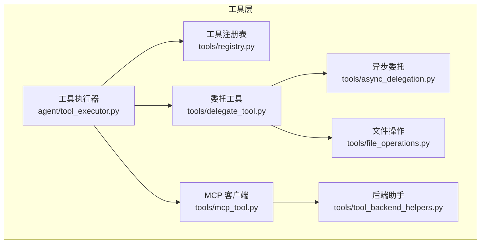
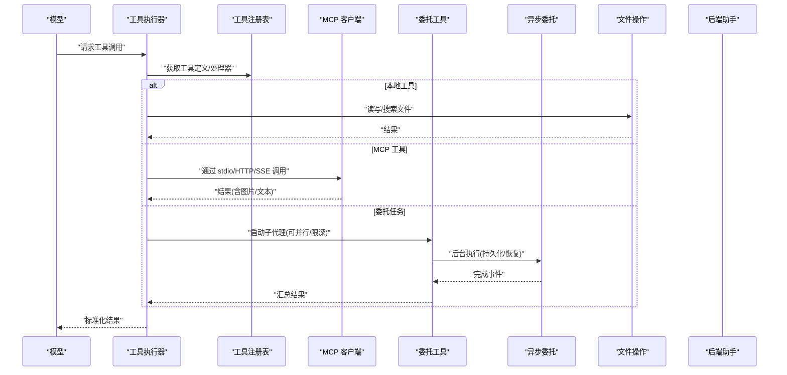
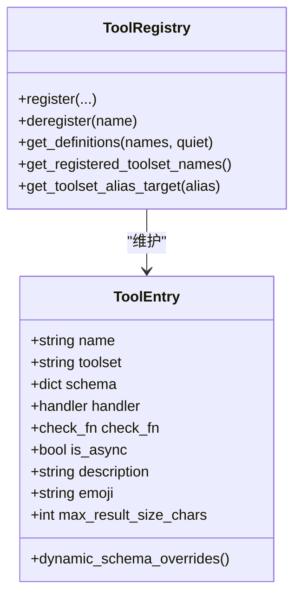
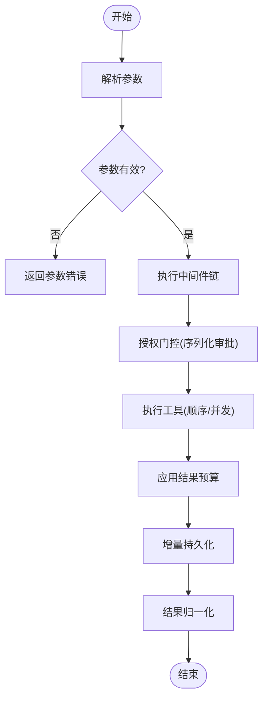
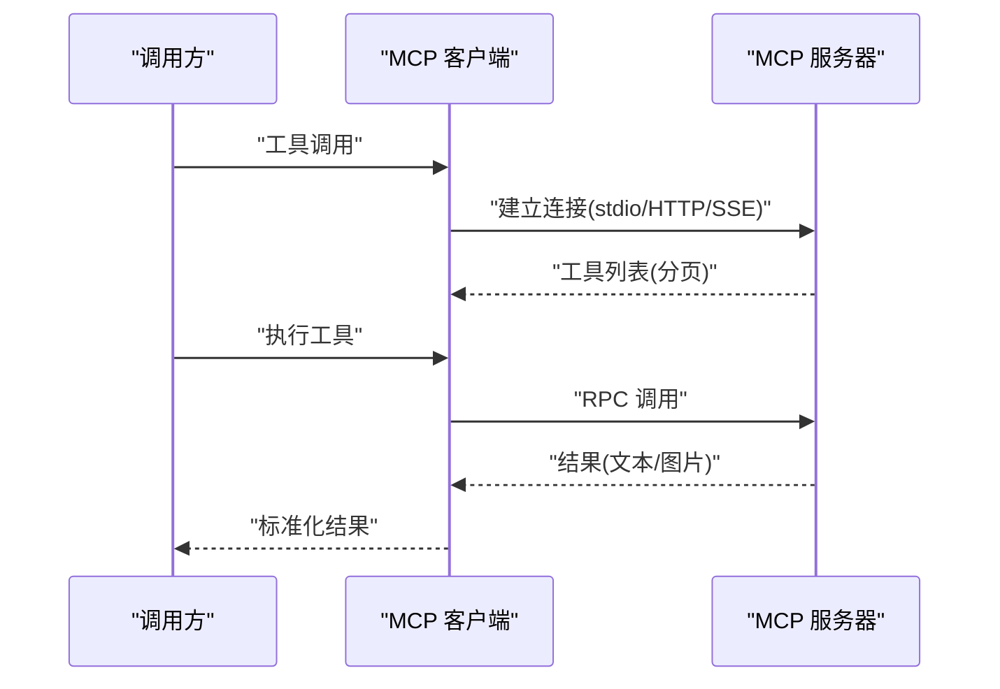
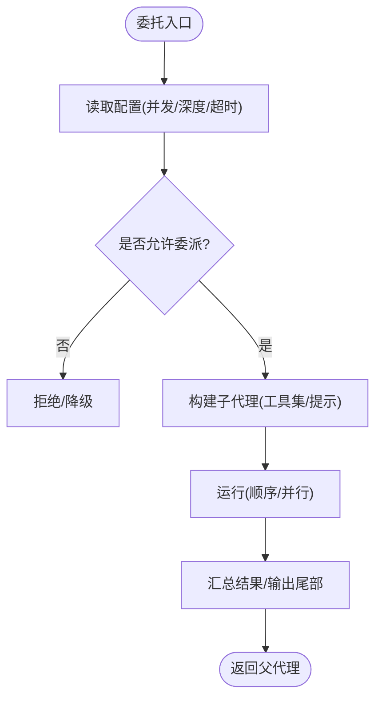
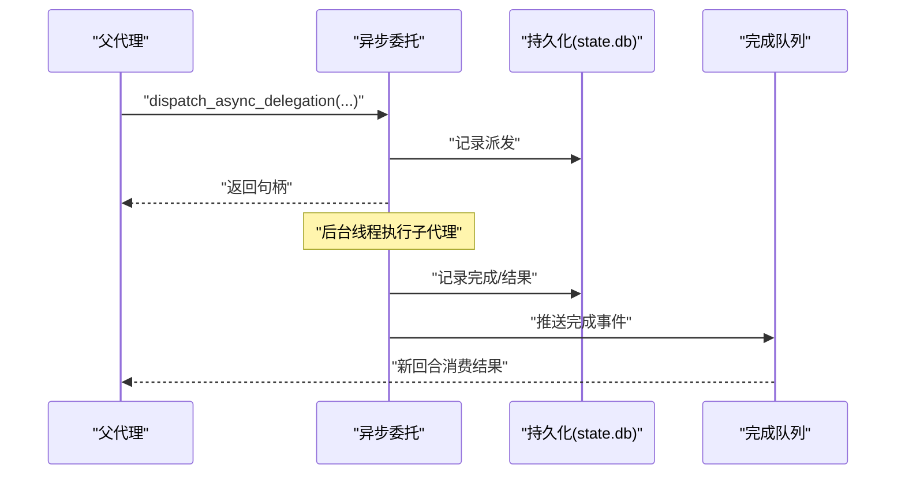
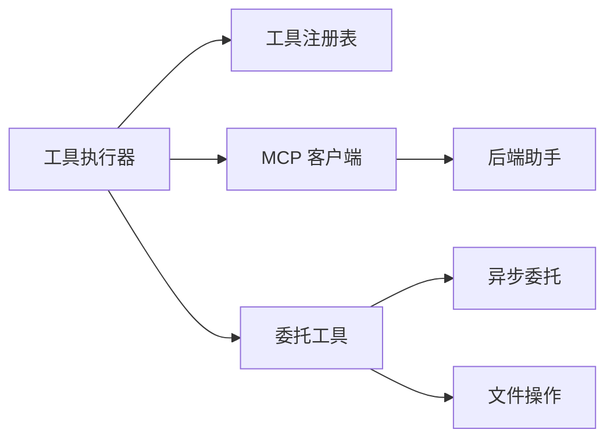

# 高级工具开发

<cite>
**本文引用的文件**
- [tools/mcp_tool.py](file://tools/mcp_tool.py)
- [tools/registry.py](file://tools/registry.py)
- [agent/tool_executor.py](file://agent/tool_executor.py)
- [tools/delegate_tool.py](file://tools/delegate_tool.py)
- [tools/async_delegation.py](file://tools/async_delegation.py)
- [tools/file_operations.py](file://tools/file_operations.py)
- [tools/tool_backend_helpers.py](file://tools/tool_backend_helpers.py)
</cite>

## 目录
1. [简介](#简介)
2. [项目结构](#项目结构)
3. [核心组件](#核心组件)
4. [架构总览](#架构总览)
5. [详细组件分析](#详细组件分析)
6. [依赖关系分析](#依赖关系分析)
7. [性能考量](#性能考量)
8. [故障排查指南](#故障排查指南)
9. [结论](#结论)
10. [附录](#附录)

## 简介
本指南面向高级工具开发者，围绕异步执行、资源管理、错误恢复、复杂工作流（多步骤、并行任务、状态持久化）、安全沙箱（文件系统访问控制、网络限制、环境变量隔离）、MCP 协议工具开发（定义、参数校验、结果格式化）以及工具委托机制（跨进程调用与负载均衡），并结合缓存策略、连接池管理与内存优化等实践，提供系统化的设计与实现参考。

## 项目结构
仓库采用分层与按功能域组织的方式：
- 工具注册与调度：tools/registry.py 集中管理工具元数据、可用性检查与分发；agent/tool_executor.py 负责顺序/并发执行、中间件、授权门控与结果归一化。
- MCP 集成：tools/mcp_tool.py 提供 stdio/HTTP/SSE 传输、动态工具发现、重连与采样能力。
- 委托与异步：tools/delegate_tool.py 实现子代理编排、并发与深度控制；tools/async_delegation.py 提供后台执行、持久化与恢复。
- 文件与安全：tools/file_operations.py 提供跨终端后端的统一文件操作；tools/tool_backend_helpers.py 提供后端选择与凭据解析。

**图表来源**
- [tools/registry.py:108-159](file://tools/registry.py#L108-L159)
- [agent/tool_executor.py:758-800](file://agent/tool_executor.py#L758-L800)
- [tools/mcp_tool.py:1-95](file://tools/mcp_tool.py#L1-L95)
- [tools/delegate_tool.py:1-18](file://tools/delegate_tool.py#L1-L18)
- [tools/async_delegation.py:1-35](file://tools/async_delegation.py#L1-L35)
- [tools/file_operations.py:1-26](file://tools/file_operations.py#L1-L26)
- [tools/tool_backend_helpers.py:20-44](file://tools/tool_backend_helpers.py#L20-L44)

**章节来源**
- [tools/registry.py:108-159](file://tools/registry.py#L108-L159)
- [agent/tool_executor.py:758-800](file://agent/tool_executor.py#L758-L800)
- [tools/mcp_tool.py:1-95](file://tools/mcp_tool.py#L1-L95)
- [tools/delegate_tool.py:1-18](file://tools/delegate_tool.py#L1-L18)
- [tools/async_delegation.py:1-35](file://tools/async_delegation.py#L1-L35)
- [tools/file_operations.py:1-26](file://tools/file_operations.py#L1-L26)
- [tools/tool_backend_helpers.py:20-44](file://tools/tool_backend_helpers.py#L20-L44)

## 核心组件
- 工具注册表：维护工具元数据、schema、handler、check_fn、工具集别名与覆盖策略，支持动态刷新与生成号缓存。
- 工具执行器：顺序/并发执行、中间件链、授权门控、预算与结果归一化、进度与持久化。
- MCP 客户端：多传输适配、自动重连、环境过滤、错误脱敏、描述注入扫描、分页发现。
- 委托工具：子代理生命周期、并发与深度控制、阻断工具集、遥测与干预。
- 异步委托：后台线程池、持久化、恢复、去重与投递保障。
- 文件操作：跨终端统一 API、写入白/黑名单、行尾/BOM 处理、二进制检测。
- 后端助手：托管/直连模式选择、凭据解析、配置归一化。

**章节来源**
- [tools/registry.py:201-230](file://tools/registry.py#L201-L230)
- [tools/registry.py:414-445](file://tools/registry.py#L414-L445)
- [agent/tool_executor.py:78-104](file://agent/tool_executor.py#L78-L104)
- [tools/mcp_tool.py:338-374](file://tools/mcp_tool.py#L338-L374)
- [tools/delegate_tool.py:48-57](file://tools/delegate_tool.py#L48-L57)
- [tools/async_delegation.py:61-86](file://tools/async_delegation.py#L61-L86)
- [tools/file_operations.py:48-57](file://tools/file_operations.py#L48-L57)
- [tools/tool_backend_helpers.py:74-141](file://tools/tool_backend_helpers.py#L74-L141)

## 架构总览
下图展示了从模型到工具的完整调用路径，包括注册表查询、执行器中间件、MCP/本地工具、委托与异步委托、以及文件操作与后端选择。

**图表来源**
- [agent/tool_executor.py:758-800](file://agent/tool_executor.py#L758-L800)
- [tools/registry.py:717-764](file://tools/registry.py#L717-L764)
- [tools/mcp_tool.py:338-374](file://tools/mcp_tool.py#L338-L374)
- [tools/delegate_tool.py:121-135](file://tools/delegate_tool.py#L121-L135)
- [tools/async_delegation.py:677-734](file://tools/async_delegation.py#L677-L734)
- [tools/file_operations.py:150-176](file://tools/file_operations.py#L150-L176)
- [tools/tool_backend_helpers.py:105-141](file://tools/tool_backend_helpers.py#L105-L141)

## 详细组件分析

### 工具注册表（Registry）
- 设计要点
  - 单例注册表，维护 ToolEntry（名称、工具集、schema、handler、check_fn、异步标记、描述、emoji、结果大小上限、动态 schema 覆盖）。
  - 工具发现：AST 扫描模块级 register 调用，带磁盘缓存加速。
  - check_fn 缓存：TTL + 失败宽限期，避免外部依赖抖动导致工具不可用。
  - 覆盖策略：插件覆盖内置工具需显式 opt-in，防止误覆盖。
  - 动态刷新：MCP 动态工具发现可注销/重新注册，保持线程安全快照。
- 复杂度与性能
  - 注册 O(1)，查询 O(n) 按工具名集合过滤；check_fn 缓存显著降低外部探测开销。
- 错误处理
  - 导入失败记录警告；动态 schema 覆盖异常降级为静态 schema。

**图表来源**
- [tools/registry.py:201-230](file://tools/registry.py#L201-L230)
- [tools/registry.py:414-445](file://tools/registry.py#L414-L445)
- [tools/registry.py:562-644](file://tools/registry.py#L562-L644)
- [tools/registry.py:717-764](file://tools/registry.py#L717-L764)

**章节来源**
- [tools/registry.py:108-159](file://tools/registry.py#L108-L159)
- [tools/registry.py:201-230](file://tools/registry.py#L201-L230)
- [tools/registry.py:233-380](file://tools/registry.py#L233-L380)
- [tools/registry.py:414-445](file://tools/registry.py#L414-L445)
- [tools/registry.py:562-644](file://tools/registry.py#L562-L644)
- [tools/registry.py:717-764](file://tools/registry.py#L717-L764)

### 工具执行器（Tool Executor）
- 设计要点
  - 顺序/并发执行：使用线程池，批量提交并维持原始顺序；对图像生成等慢操作限制并发度。
  - 中间件链：请求前改写、执行前后钩子、预工具拦截、守卫策略。
  - 授权门控：序列化审批提示，排除人类等待时间计入批处理截止时间，避免死锁与饥饿。
  - 结果归一化：仅允许字符串或多模态信封，其他类型转为错误，防止下游无法处理的值污染。
  - 预算与持久化：按上下文窗口缩放结果预算，关键节点增量持久化会话消息。
- 复杂度与性能
  - 并发度受限于 _MAX_TOOL_WORKERS 与图像生成专用限制；批内超时与授权门控超时保护整体时延。
- 错误处理
  - 取消/中断返回结构化错误；持久化失败记录原因并降级。

**图表来源**
- [agent/tool_executor.py:141-157](file://agent/tool_executor.py#L141-L157)
- [agent/tool_executor.py:391-468](file://agent/tool_executor.py#L391-L468)
- [agent/tool_executor.py:482-662](file://agent/tool_executor.py#L482-L662)
- [agent/tool_executor.py:758-800](file://agent/tool_executor.py#L758-L800)

**章节来源**
- [agent/tool_executor.py:78-104](file://agent/tool_executor.py#L78-L104)
- [agent/tool_executor.py:141-157](file://agent/tool_executor.py#L141-L157)
- [agent/tool_executor.py:391-468](file://agent/tool_executor.py#L391-L468)
- [agent/tool_executor.py:482-662](file://agent/tool_executor.py#L482-L662)
- [agent/tool_executor.py:758-800](file://agent/tool_executor.py#L758-L800)

### MCP 客户端（MCP Tool）
- 设计要点
  - 多传输：stdio、Streamable HTTP、SSE；自动探测与回退。
  - 重连与保活：指数退避+抖动，keepalive 间隔可调，支持短 TTL 服务端。
  - 安全：环境变量白名单过滤、错误信息脱敏、描述注入扫描。
  - 动态发现：分页拉取 tools/resources/prompts，支持 list_changed 通知刷新。
  - 采样：支持服务器发起的 LLM 请求（文本/工具使用）。
- 复杂度与性能
  - 重连与分页在极端情况下有上限保护；stderr 重定向至共享日志避免 TUI 损坏。
- 错误处理
  - 方法未找到(-32601)识别与回退；连接/读取超时与重试；凭证脱敏。

**图表来源**
- [tools/mcp_tool.py:338-374](file://tools/mcp_tool.py#L338-L374)
- [tools/mcp_tool.py:661-699](file://tools/mcp_tool.py#L661-L699)
- [tools/mcp_tool.py:493-532](file://tools/mcp_tool.py#L493-L532)
- [tools/mcp_tool.py:557-586](file://tools/mcp_tool.py#L557-L586)

**章节来源**
- [tools/mcp_tool.py:1-95](file://tools/mcp_tool.py#L1-L95)
- [tools/mcp_tool.py:338-374](file://tools/mcp_tool.py#L338-L374)
- [tools/mcp_tool.py:493-532](file://tools/mcp_tool.py#L493-L532)
- [tools/mcp_tool.py:557-586](file://tools/mcp_tool.py#L557-L586)
- [tools/mcp_tool.py:661-699](file://tools/mcp_tool.py#L661-L699)

### 委托工具（Delegate Tool）
- 设计要点
  - 子代理隔离：独立会话、工具集裁剪、系统提示构建。
  - 并发与深度：max_concurrent_children、max_spawn_depth、orchestrator 开关。
  - 阻断工具：禁止递归委托、用户交互、写共享记忆等。
  - 遥测与干预：活跃子代理注册、中断/引导、输出尾部摘要。
- 复杂度与性能
  - 高并发会线性放大 API 成本，提供告警；默认扁平深度降低风险。
- 错误处理
  - 角色/深度/并发限制失败时降级或拒绝；危险命令自动拒绝/批准策略。

**图表来源**
- [tools/delegate_tool.py:48-57](file://tools/delegate_tool.py#L48-L57)
- [tools/delegate_tool.py:121-135](file://tools/delegate_tool.py#L121-L135)
- [tools/delegate_tool.py:587-625](file://tools/delegate_tool.py#L587-L625)
- [tools/delegate_tool.py:658-697](file://tools/delegate_tool.py#L658-L697)
- [tools/delegate_tool.py:700-736](file://tools/delegate_tool.py#L700-L736)

**章节来源**
- [tools/delegate_tool.py:1-18](file://tools/delegate_tool.py#L1-L18)
- [tools/delegate_tool.py:48-57](file://tools/delegate_tool.py#L48-L57)
- [tools/delegate_tool.py:121-135](file://tools/delegate_tool.py#L121-L135)
- [tools/delegate_tool.py:587-625](file://tools/delegate_tool.py#L587-L625)
- [tools/delegate_tool.py:658-697](file://tools/delegate_tool.py#L658-L697)
- [tools/delegate_tool.py:700-736](file://tools/delegate_tool.py#L700-L736)

### 异步委托（Async Delegation）
- 设计要点
  - 后台执行：模块级守护线程池，立即返回句柄，完成后推入共享队列。
  - 持久化：SQLite 记录派发/完成/投递状态，支持重启恢复与去重。
  - 停滞检测：基于进度 token 监控，长时间无进展则中断并优雅收尾。
  - 投递保障：claim/release/drop 机制，超限收敛为 dropped，避免无限重试。
- 复杂度与性能
  - 持久化事务封装，连接及时关闭；完成记录保留上限与清理策略。
- 错误处理
  - 崩溃捕获、未知状态恢复、投递失败计数与终止。

**图表来源**
- [tools/async_delegation.py:61-86](file://tools/async_delegation.py#L61-L86)
- [tools/async_delegation.py:119-179](file://tools/async_delegation.py#L119-L179)
- [tools/async_delegation.py:200-283](file://tools/async_delegation.py#L200-L283)
- [tools/async_delegation.py:293-368](file://tools/async_delegation.py#L293-L368)
- [tools/async_delegation.py:677-734](file://tools/async_delegation.py#L677-L734)

**章节来源**
- [tools/async_delegation.py:1-35](file://tools/async_delegation.py#L1-L35)
- [tools/async_delegation.py:61-86](file://tools/async_delegation.py#L61-L86)
- [tools/async_delegation.py:119-179](file://tools/async_delegation.py#L119-L179)
- [tools/async_delegation.py:200-283](file://tools/async_delegation.py#L200-L283)
- [tools/async_delegation.py:293-368](file://tools/async_delegation.py#L293-L368)
- [tools/async_delegation.py:677-734](file://tools/async_delegation.py#L677-L734)

### 文件操作（File Operations）
- 设计要点
  - 跨终端统一 API：基于 shell 命令封装，适配多种后端。
  - 安全：写入拒绝路径/前缀、BOM 与行尾处理、二进制检测。
  - 结果：读/写/补丁/搜索的统一数据结构与提示。
- 复杂度与性能
  - 大文件截断、相似文件提示、行尾/BOM 快速判定。
- 错误处理
  - 写入拒绝返回明确错误；二进制/图片特殊处理。

**章节来源**
- [tools/file_operations.py:1-26](file://tools/file_operations.py#L1-L26)
- [tools/file_operations.py:48-57](file://tools/file_operations.py#L48-L57)
- [tools/file_operations.py:80-117](file://tools/file_operations.py#L80-L117)
- [tools/file_operations.py:150-176](file://tools/file_operations.py#L150-L176)

### 后端助手（Backend Helpers）
- 设计要点
  - 托管/直连模式选择：根据账户权限与环境决定后端。
  - 凭据解析：按优先级从配置、作用域环境、凭据池解析密钥。
  - 配置归一化：浏览器提供者、Modal 模式等。
- 复杂度与性能
  - 快速失败与兜底，避免启动阻塞。
- 错误处理
  - 权限不足返回友好提示；缺失凭据返回空串。

**章节来源**
- [tools/tool_backend_helpers.py:20-44](file://tools/tool_backend_helpers.py#L20-L44)
- [tools/tool_backend_helpers.py:74-141](file://tools/tool_backend_helpers.py#L74-L141)
- [tools/tool_backend_helpers.py:144-200](file://tools/tool_backend_helpers.py#L144-L200)

## 依赖关系分析
- 松耦合：执行器通过注册表解耦具体工具实现；MCP 作为可选依赖，缺失时降级。
- 内聚性：各模块职责清晰，委托与异步委托分离关注点；文件操作与后端助手提供通用能力。
- 循环依赖规避：注册表不反向依赖 model_tools；工具模块通过 AST 扫描发现而非直接 import。
- 外部依赖：mcp SDK、sqlite3、线程池、网络库；均做可选导入与容错。

**图表来源**
- [agent/tool_executor.py:758-800](file://agent/tool_executor.py#L758-L800)
- [tools/registry.py:108-159](file://tools/registry.py#L108-L159)
- [tools/mcp_tool.py:1-95](file://tools/mcp_tool.py#L1-L95)
- [tools/delegate_tool.py:1-18](file://tools/delegate_tool.py#L1-L18)
- [tools/async_delegation.py:1-35](file://tools/async_delegation.py#L1-L35)
- [tools/file_operations.py:1-26](file://tools/file_operations.py#L1-L26)
- [tools/tool_backend_helpers.py:20-44](file://tools/tool_backend_helpers.py#L20-L44)

**章节来源**
- [agent/tool_executor.py:758-800](file://agent/tool_executor.py#L758-L800)
- [tools/registry.py:108-159](file://tools/registry.py#L108-L159)
- [tools/mcp_tool.py:1-95](file://tools/mcp_tool.py#L1-L95)
- [tools/delegate_tool.py:1-18](file://tools/delegate_tool.py#L1-L18)
- [tools/async_delegation.py:1-35](file://tools/async_delegation.py#L1-L35)
- [tools/file_operations.py:1-26](file://tools/file_operations.py#L1-L26)
- [tools/tool_backend_helpers.py:20-44](file://tools/tool_backend_helpers.py#L20-L44)

## 性能考量
- 缓存策略
  - 工具发现缓存：基于 mtime+size 的磁盘缓存，减少 AST 扫描开销。
  - check_fn 缓存：TTL 与失败宽限期，避免外部依赖抖动影响工具可见性。
  - 结果预算：按上下文窗口缩放，防止单次工具结果过大导致请求超限。
- 连接池与并发
  - 工具执行器使用线程池，限制最大并发；图像生成单独限速。
  - MCP 重连指数退避+抖动，避免雪崩；keepalive 保活适配不同 TTL。
- 内存与 I/O
  - 异步委托持久化记录保留上限，定期清理；数据库事务及时关闭连接。
  - 文件操作对大文件进行截断与提示，避免内存膨胀。
- 建议
  - 合理设置并发与超时；启用 MCP keepalive 以匹配服务端 TTL；对高频 check_fn 使用缓存；对大结果启用预算与压缩。

[本节为通用指导，无需特定文件来源]

## 故障排查指南
- MCP 连接问题
  - 现象：工具不可用或频繁重连。
  - 排查：检查传输配置、超时、keepalive；查看 stderr 日志；确认方法未找到(-32601)的回退逻辑。
- 工具不可见
  - 现象：某些工具未出现在可用列表。
  - 排查：检查 check_fn 缓存与失败宽限期；确认工具注册未被覆盖；查看工具集别名。
- 委托任务卡住
  - 现象：子代理长时间无进展。
  - 排查：查看异步委托停滞检测阈值；确认进度回调是否正常；检查中断与恢复流程。
- 文件写入失败
  - 现象：写入被拒绝或结果异常。
  - 排查：检查写入拒绝路径/前缀；确认行尾/BOM 处理；验证二进制/图片分支。
- 后端不可用
  - 现象：托管/直连模式不可用。
  - 排查：检查账户权限与凭据；确认配置归一化与模式选择逻辑。

**章节来源**
- [tools/mcp_tool.py:557-586](file://tools/mcp_tool.py#L557-L586)
- [tools/registry.py:233-380](file://tools/registry.py#L233-L380)
- [tools/async_delegation.py:293-368](file://tools/async_delegation.py#L293-L368)
- [tools/file_operations.py:150-176](file://tools/file_operations.py#L150-L176)
- [tools/tool_backend_helpers.py:20-44](file://tools/tool_backend_helpers.py#L20-L44)

## 结论
本指南系统化梳理了高级工具开发的架构与实现要点：通过注册表与执行器解耦工具定义与调度，借助 MCP 客户端扩展外部能力，利用委托与异步委托实现复杂工作流与状态持久化，并以文件操作与后端助手提供通用能力。结合缓存、并发控制与错误恢复，可在保证安全与稳定性的同时提升性能与可维护性。

[本节为总结性内容，无需特定文件来源]

## 附录
- MCP 协议工具开发示例（概念性）
  - 工具定义：声明名称、描述、参数 schema（必填/选填、类型、约束）。
  - 参数验证：在服务端校验输入，返回结构化错误；对敏感字段脱敏。
  - 结果格式化：优先返回文本块，必要时附带图片/媒体标签；遵循平台渲染约定。
  - 安全沙箱：限制文件系统访问（仅工作区）、网络请求（白名单域名）、环境变量（最小集）。
  - 状态持久化：长任务使用异步委托记录派发/完成，支持恢复与去重。
  - 负载均衡：多实例部署时，客户端重连与 keepalive 配合网关路由。
- 最佳实践案例
  - 将耗时 IO 放入异步委托，主流程保持响应。
  - 对高频 check_fn 启用缓存，避免抖动影响工具可见性。
  - 对大结果启用预算与截断，防止上下文溢出。
  - 对 MCP 服务配置合理的超时与 keepalive，匹配服务端 TTL。
  - 对文件操作使用拒绝列表与 BOM/行尾处理，确保跨平台一致性。

[本节为概念性内容，无需特定文件来源]