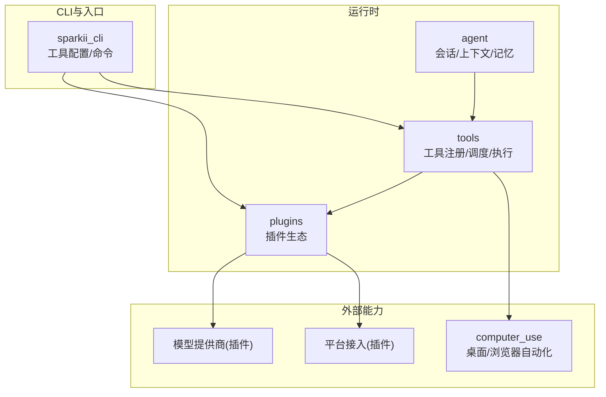
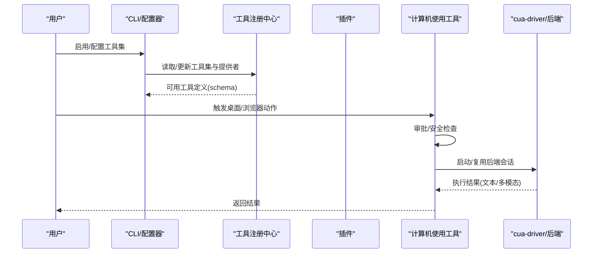
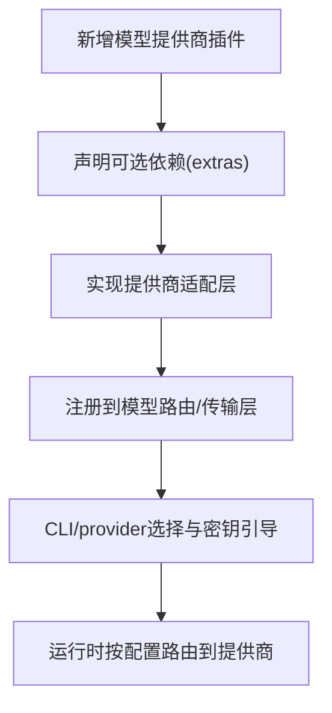
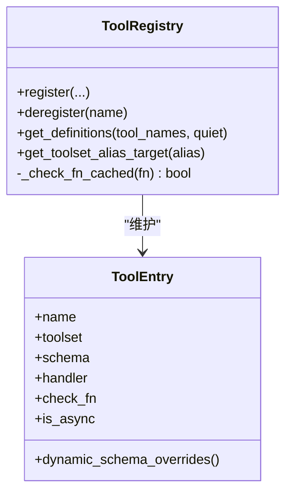
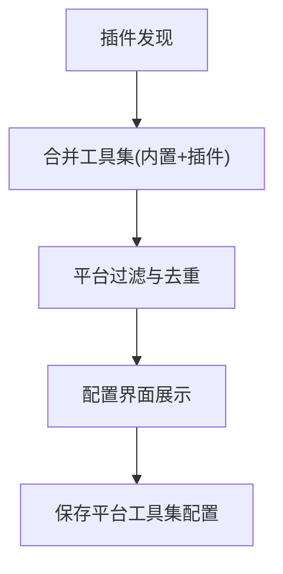
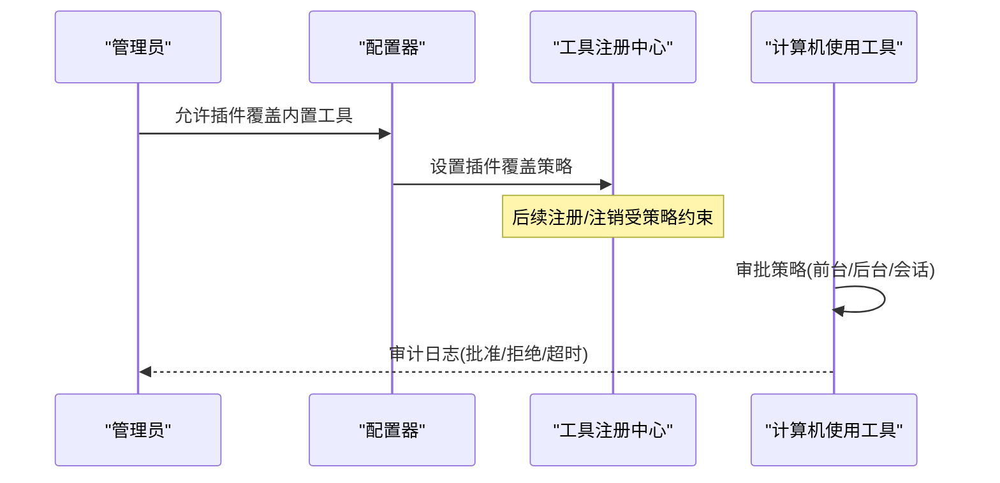
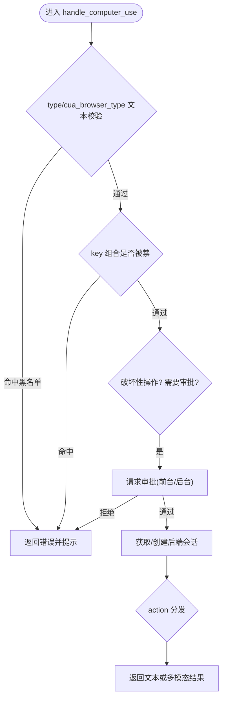
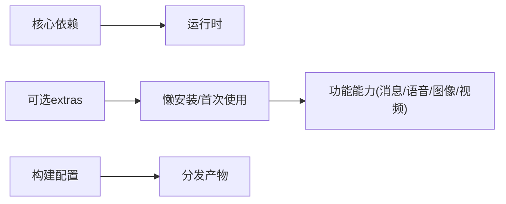

# 高级特性

<cite>
**本文引用的文件**
- [README.md](file://README.md)
- [pyproject.toml](file://pyproject.toml)
- [plugins/plugin_utils.py](file://plugins/plugin_utils.py)
- [tools/registry.py](file://tools/registry.py)
- [sparkii_cli/tools_config.py](file://sparkii_cli/tools_config.py)
- [tools/computer_use/tool.py](file://tools/computer_use/tool.py)
</cite>

## 目录
1. [简介](#简介)
2. [项目结构](#项目结构)
3. [核心组件](#核心组件)
4. [架构总览](#架构总览)
5. [详细组件分析](#详细组件分析)
6. [依赖关系分析](#依赖关系分析)
7. [性能考量](#性能考量)
8. [故障排查指南](#故障排查指南)
9. [结论](#结论)
10. [附录](#附录)

## 简介
本章节面向企业级与高级用户，系统阐述以下能力：自定义模型集成、高级工具开发、插件生态扩展（技能市场、工具集管理、分发机制）、企业级功能（多租户、权限控制、审计）、计算机使用能力（桌面控制、浏览器自动化、系统集成），以及高级配置与调优参数。文档同时给出实际企业应用场景与解决方案案例，帮助快速落地。

## 项目结构
仓库采用分层与模块化组织：
- agent：智能体运行时、传输适配、会话与上下文、记忆与学习等核心逻辑
- tools：工具注册、调度、执行与安全策略；包含 computer_use、browser、cronjob、memory 等工具族
- plugins：插件体系，涵盖模型提供商、平台接入、图像/视频生成、可观测性、安全指引等
- sparkii_cli：命令行入口、工具配置向导、平台与工具集管理
- gateway/tui_gateway/web：网关、TUI、Web 控制台
- optional-skills/skills：技能包与可选技能集合
- cron：定时任务与调度
- acp_adapter：Agent Client Protocol 适配器

图表来源
- [pyproject.toml:358-401](file://pyproject.toml#L358-L401)
- [tools/registry.py:108-159](file://tools/registry.py#L108-L159)

章节来源
- [pyproject.toml:358-401](file://pyproject.toml#L358-L401)
- [README.md:105-183](file://README.md#L105-L183)

## 核心组件
- 工具注册中心：集中管理所有工具的元数据、可用性检查、动态 schema 覆盖、并发安全的快照与版本计数，支持插件覆盖内置工具的安全策略。
- 工具配置器：提供交互式工具集开关、提供者选择、密钥引导与平台限制，统一保存至配置文件。
- 插件工具库：为插件作者提供线程安全的懒加载单例与槽位，避免进程级共享导致的竞态与资源泄漏。
- 计算机使用工具：跨平台桌面控制与浏览器自动化，具备审批流、危险操作拦截、后台驱动生命周期管理与多模态结果封装。

章节来源
- [tools/registry.py:201-764](file://tools/registry.py#L201-L764)
- [sparkii_cli/tools_config.py:91-165](file://sparkii_cli/tools_config.py#L91-L165)
- [plugins/plugin_utils.py:1-136](file://plugins/plugin_utils.py#L1-L136)
- [tools/computer_use/tool.py:1-169](file://tools/computer_use/tool.py#L1-L169)

## 架构总览
下图展示从 CLI 到工具注册、插件与后端驱动的调用链，以及计算机使用的审批与后端切换流程。

图表来源
- [tools/registry.py:717-764](file://tools/registry.py#L717-L764)
- [tools/computer_use/tool.py:440-511](file://tools/computer_use/tool.py#L440-L511)
- [sparkii_cli/tools_config.py:686-709](file://sparkii_cli/tools_config.py#L686-L709)

## 详细组件分析

### 自定义模型集成与新模型适配器
- 通过插件目录下的 model-providers 实现新模型接入，每个提供商以独立插件形式存在，遵循统一的接口约定。
- 在 pyproject 中声明可选依赖与 extras，按需懒安装，降低默认安装体积与供应链风险。
- 通过 CLI 的 provider 选择与密钥引导完成配置，运行时由传输层路由到具体提供商。

图表来源
- [pyproject.toml:157-352](file://pyproject.toml#L157-L352)
- [README.md:124-139](file://README.md#L124-L139)

章节来源
- [pyproject.toml:157-352](file://pyproject.toml#L157-L352)
- [README.md:124-139](file://README.md#L124-L139)

### 高级工具开发与复杂工具模式
- 工具注册：每个工具模块在导入时调用注册函数声明 schema、处理器、可用性检查、异步标志、描述与 emoji 等元数据。
- 动态 schema 覆盖：支持运行时根据配置动态调整 schema 字段（如委托任务限制）。
- 可用性探测缓存：对外部环境探测（Docker/Modal/Playwright）进行 TTL 缓存与短暂失败宽容，避免误判导致工具不可用。
- 插件覆盖内置工具：需显式授权，防止意外覆盖；支持注销与重新注册，MCP 动态刷新豁免。

图表来源
- [tools/registry.py:201-764](file://tools/registry.py#L201-L764)

章节来源
- [tools/registry.py:108-159](file://tools/registry.py#L108-L159)
- [tools/registry.py:233-387](file://tools/registry.py#L233-L387)
- [tools/registry.py:414-764](file://tools/registry.py#L414-L764)

### 插件生态系统扩展（技能市场、工具集管理、分发机制）
- 插件发现与加载：CLI 在工具配置界面中合并内置与插件提供的工具集，去重后呈现给用户。
- 工具集管理：按平台限制显示可配置项，支持“仅配置”的能力（如 STT）不暴露为模型工具集。
- 分发机制：通过 extras 与懒安装策略，将重型依赖延后至首次使用；可选技能与插件可按需启用。

图表来源
- [sparkii_cli/tools_config.py:245-303](file://sparkii_cli/tools_config.py#L245-L303)
- [pyproject.toml:320-352](file://pyproject.toml#L320-L352)

章节来源
- [sparkii_cli/tools_config.py:91-165](file://sparkii_cli/tools_config.py#L91-L165)
- [sparkii_cli/tools_config.py:245-303](file://sparkii_cli/tools_config.py#L245-L303)
- [pyproject.toml:320-352](file://pyproject.toml#L320-L352)

### 企业级功能：多租户、权限控制与审计
- 多租户/多会话隔离：工具可用性探测缓存支持按 profile 作用域隔离，避免不同租户间状态串扰。
- 权限控制：
  - 工具覆盖需 operator 显式授权，禁止插件随意替换内置工具。
  - 计算机使用工具对破坏性操作实施审批流，支持一次性、会话级或全局自动批准，并区分前台/后台交付模式。
- 审计：工具覆盖与注销会记录日志；可用性探测失败与恢复均有告警与提示，便于排障与合规审计。

图表来源
- [tools/registry.py:513-711](file://tools/registry.py#L513-L711)
- [tools/computer_use/tool.py:171-199](file://tools/computer_use/tool.py#L171-L199)
- [tools/computer_use/tool.py:514-561](file://tools/computer_use/tool.py#L514-L561)

章节来源
- [tools/registry.py:513-711](file://tools/registry.py#L513-L711)
- [tools/computer_use/tool.py:171-199](file://tools/computer_use/tool.py#L171-L199)
- [tools/computer_use/tool.py:514-561](file://tools/computer_use/tool.py#L514-L561)

### 计算机使用能力：桌面控制、浏览器自动化与系统集成
- 跨平台后端：基于 cua-driver 的背景式桌面控制，支持 macOS、Windows、Linux（X11/Wayland），健康报告定位阻塞点。
- 审批与安全：
  - 危险键组合硬拦截（锁屏、注销等）。
  - 输入内容正则黑名单（管道执行 shell、删除根目录等）。
  - 破坏性操作需审批，支持前台/后台差异化授权。
- 浏览器自动化：在 computer_use 工具内命名空间化 typed browser 能力，避免与原生浏览器/MCP 工具冲突，保持会话级状态隔离。
- 生命周期：每会话后端缓存与释放，atexit 清理子进程，避免孤儿进程占用资源。

图表来源
- [tools/computer_use/tool.py:440-511](file://tools/computer_use/tool.py#L440-L511)
- [tools/computer_use/tool.py:514-561](file://tools/computer_use/tool.py#L514-L561)
- [tools/computer_use/tool.py:590-788](file://tools/computer_use/tool.py#L590-L788)

章节来源
- [tools/computer_use/tool.py:1-169](file://tools/computer_use/tool.py#L1-L169)
- [tools/computer_use/tool.py:440-511](file://tools/computer_use/tool.py#L440-L511)
- [tools/computer_use/tool.py:590-788](file://tools/computer_use/tool.py#L590-L788)

### 高级配置选项与调优参数
- 工具可用性探测缓存：
  - TTL 约 30 秒，失败宽限窗口约 60 秒，避免瞬时抖动导致工具不可见。
  - 支持按 profile 作用域隔离，多租户场景下互不影响。
- 动态 schema 覆盖：在 get_definitions 时应用零参回调返回的覆盖字典，确保模型看到的限制与当前配置一致。
- 插件工具集与平台限制：仅在特定平台显示的配置项，避免无关干扰。
- 计算机使用：
  - 审批模式映射：根据会话 YOLO 与当前 session_key 决定标准/无限制模式。
  - 前端/后台交付模式影响审批范围与可见性。
  - 环境变量 SPARKII_COMPUTER_USE_BACKEND 可切换后端（测试/生产）。

章节来源
- [tools/registry.py:233-387](file://tools/registry.py#L233-L387)
- [tools/registry.py:717-764](file://tools/registry.py#L717-L764)
- [sparkii_cli/tools_config.py:216-242](file://sparkii_cli/tools_config.py#L216-L242)
- [tools/computer_use/tool.py:171-199](file://tools/computer_use/tool.py#L171-L199)

### 实际企业应用场景与解决方案案例
- 场景一：企业知识检索与自动化报告
  - 启用 Web 搜索与提取工具集，选择 Firecrawl 或自托管实例；结合 Cron 定时任务生成日报/周报，并通过平台投递。
  - 参考：工具类别与提供者配置、Cron 能力。
- 场景二：跨系统桌面自动化
  - 启用 computer_use，通过 cua-driver 后台控制桌面与浏览器，审批关键操作；用于表单录入、报表导出、系统巡检。
  - 参考：computer_use 工具审批与安全策略。
- 场景三：多租户隔离与权限管控
  - 利用 profile 作用域的可用性探测缓存与工具覆盖策略，确保不同租户的工具可见性与行为隔离；审计日志满足合规要求。
  - 参考：工具注册中心的 profile 作用域与覆盖策略。

[本节为概念性说明，不直接分析具体文件]

## 依赖关系分析
- 可选依赖与懒安装：通过 extras 与 LAZY_DEPS 策略，将非核心依赖延后至首次使用，减少默认安装面与供应链风险。
- 构建与打包：pyproject 中声明脚本入口、包发现规则与 package-data，保证最小化镜像与可移植性。
- 运行时依赖：FastAPI/Uvicorn、HTTP 客户端、加密库、Pillow 等为核心路径所需；其他能力（消息平台、语音、图像/视频生成）按需启用。

图表来源
- [pyproject.toml:19-155](file://pyproject.toml#L19-L155)
- [pyproject.toml:157-352](file://pyproject.toml#L157-L352)
- [pyproject.toml:358-401](file://pyproject.toml#L358-L401)

章节来源
- [pyproject.toml:19-155](file://pyproject.toml#L19-L155)
- [pyproject.toml:157-352](file://pyproject.toml#L157-L352)
- [pyproject.toml:358-401](file://pyproject.toml#L358-L401)

## 性能考量
- 工具可用性探测缓存：显著降低重复探测开销，避免频繁外部调用；失败宽限窗口提升鲁棒性。
- 动态 schema 覆盖：仅在 get_definitions 时计算，配合配置变更失效策略，平衡准确性与性能。
- 插件单例与懒加载：避免进程级共享导致的竞态与资源泄漏，提高并发安全性与启动速度。
- 计算机使用后端生命周期：按会话缓存与释放，atexit 清理子进程，减少资源占用与僵尸进程风险。

[本节提供通用指导，不直接分析具体文件]

## 故障排查指南
- 工具不可用：检查 check_fn 缓存与最近成功时间；若处于失败宽限窗口，视为瞬态失败并继续提供服务。
- 插件覆盖被拒：确认是否已开启 allow_tool_override；查看日志中的覆盖拒绝信息。
- 计算机使用失败：
  - 后端不可用：确认 cua-driver 二进制与依赖已安装；查看错误提示中的安装建议。
  - 审批超时或被拒：检查审批回调与前台/后台模式；必要时调整审批策略。
  - 危险操作被拦截：核对键组合与输入文本是否命中黑名单。

章节来源
- [tools/registry.py:233-387](file://tools/registry.py#L233-L387)
- [tools/registry.py:513-711](file://tools/registry.py#L513-L711)
- [tools/computer_use/tool.py:440-511](file://tools/computer_use/tool.py#L440-L511)
- [tools/computer_use/tool.py:514-561](file://tools/computer_use/tool.py#L514-L561)

## 结论
本仓库提供了完善的企业级扩展能力：通过插件化的模型与工具生态、严格的权限与审计、跨平台的计算机使用能力，以及灵活的配置与调优机制，能够支撑大规模、多租户、高可用的 AI 自动化场景。建议在部署前明确工具集与提供商策略，启用必要的审批与审计，并结合业务需求定制插件与技能。

[本节为总结性内容，不直接分析具体文件]

## 附录
- 快速开始与常用命令：参见 README 中的 CLI 与网关使用说明。
- 更多文档：官方文档站点提供配置、安全、工具与技能、MCP 集成、Cron 调度、上下文文件与架构等专题。

章节来源
- [README.md:105-183](file://README.md#L105-L183)