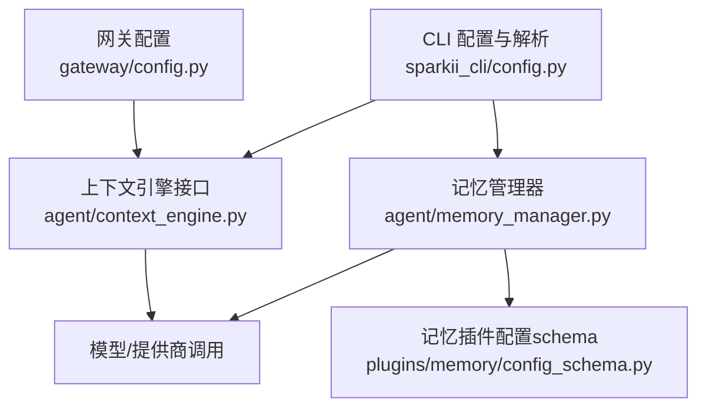
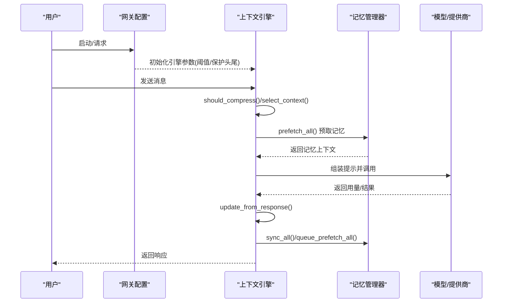
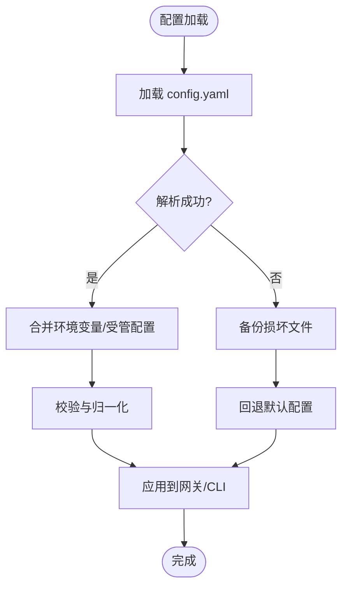
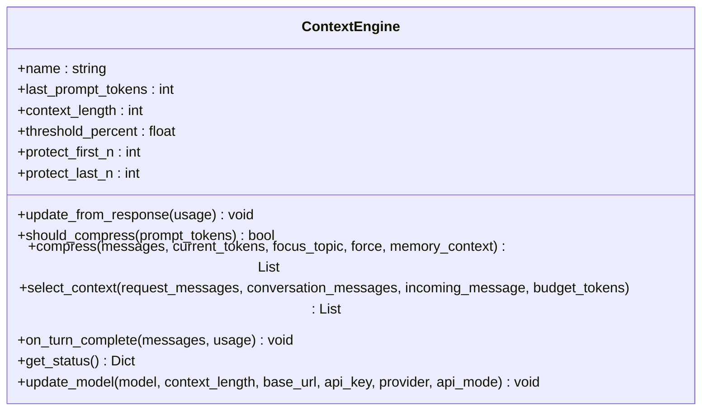
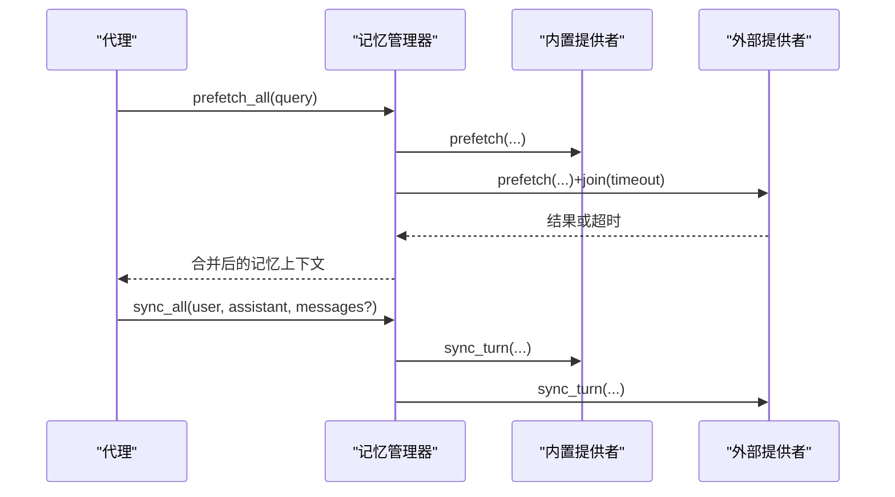
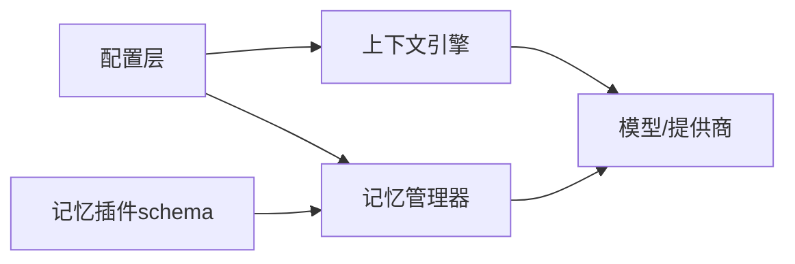

# 高级配置与调优

<cite>
**本文引用的文件**
- [gateway/config.py](file://gateway/config.py)
- [sparkii_cli/config.py](file://sparkii_cli/config.py)
- [agent/context_engine.py](file://agent/context_engine.py)
- [agent/memory_manager.py](file://agent/memory_manager.py)
- [plugins/memory/config_schema.py](file://plugins/memory/config_schema.py)
</cite>

## 目录
1. [简介](#简介)
2. [项目结构](#项目结构)
3. [核心组件](#核心组件)
4. [架构总览](#架构总览)
5. [详细组件分析](#详细组件分析)
6. [依赖关系分析](#依赖关系分析)
7. [性能考量](#性能考量)
8. [故障排查指南](#故障排查指南)
9. [结论](#结论)
10. [附录](#附录)

## 简介
本指南面向生产环境的高级配置与性能调优，覆盖系统级配置（内存、并发、资源限制）、上下文引擎（压缩策略、检索与相似度阈值）、记忆系统（向量维度、索引策略、缓存）、监控与分析工具、分布式部署（服务发现、负载均衡、数据同步），以及生产最佳实践（配置模板、环境变量管理、配置校验）和不同场景的调优方案与基准思路。内容基于仓库中的网关配置、CLI 配置、上下文引擎与记忆管理器实现进行提炼与可视化说明。

## 项目结构
围绕“配置—上下文—记忆—监控”的主线，关键路径如下：
- 系统级配置入口：网关配置模块负责平台接入、会话重置策略、流式输出等；CLI 配置模块负责用户配置加载、解析、备份与权限控制。
- 上下文引擎：抽象接口定义压缩触发、压缩执行、每轮上下文选择与生命周期钩子。
- 记忆系统：统一编排内置与外部记忆提供者，提供预取、同步、工具注入与后台任务调度。
- 插件化配置：记忆插件通过声明式 schema 暴露可配置字段，由通用渲染器驱动 UI 与 API。

图表来源
- [gateway/config.py:1-800](file://gateway/config.py#L1-L800)
- [sparkii_cli/config.py:1-800](file://sparkii_cli/config.py#L1-L800)
- [agent/context_engine.py:1-490](file://agent/context_engine.py#L1-L490)
- [agent/memory_manager.py:1-800](file://agent/memory_manager.py#L1-L800)
- [plugins/memory/config_schema.py:1-145](file://plugins/memory/config_schema.py#L1-L145)

章节来源
- [gateway/config.py:1-800](file://gateway/config.py#L1-L800)
- [sparkii_cli/config.py:1-800](file://sparkii_cli/config.py#L1-L800)

## 核心组件
- 系统级配置
  - 网关配置：平台接入、会话重置策略、流式编辑间隔与缓冲阈值、端口绑定平台判定、环境变量覆盖等。
  - CLI 配置：配置文件位置、解析失败回退与备份、安装方式检测、容器模式、安全写入白名单/黑名单等。
- 上下文引擎
  - 抽象基类：压缩触发、压缩执行、每轮上下文选择、生命周期钩子、状态统计与模型切换适配。
- 记忆系统
  - 管理器：注册唯一外部提供者、预取与同步、工具注入、后台串行执行器、超时与优雅关闭。
  - 插件配置：声明式字段类型、存储后端、作用域、文档链接等。

章节来源
- [gateway/config.py:1-800](file://gateway/config.py#L1-L800)
- [sparkii_cli/config.py:1-800](file://sparkii_cli/config.py#L1-L800)
- [agent/context_engine.py:1-490](file://agent/context_engine.py#L1-L490)
- [agent/memory_manager.py:1-800](file://agent/memory_manager.py#L1-L800)
- [plugins/memory/config_schema.py:1-145](file://plugins/memory/config_schema.py#L1-L145)

## 架构总览
下图展示从配置到运行时调度的关键交互：CLI 与网关读取配置，上下文引擎在每轮对话中决定是否需要压缩或替换上下文，记忆管理器在前后端异步补充持久化上下文，最终交由模型/提供商执行。

图表来源
- [gateway/config.py:1-800](file://gateway/config.py#L1-L800)
- [agent/context_engine.py:1-490](file://agent/context_engine.py#L1-L490)
- [agent/memory_manager.py:1-800](file://agent/memory_manager.py#L1-L800)

## 详细组件分析

### 系统级配置（网关与 CLI）
- 网关配置要点
  - 平台与通道：支持多平台接入，按平台设置默认频道、回复线程模式、重启通知、打字指示器等。
  - 会话重置策略：支持每日/空闲/两者/永不自动重置，含后台进程最大年龄以避免长任务阻塞会话重置。
  - 流式输出：传输模式（auto/draft/edit/off）、编辑间隔、缓冲阈值、最终消息替换策略等。
  - 端口绑定：识别会绑定 TCP 端口的平台，避免多实例冲突。
  - 环境变量覆盖：支持通过环境变量对部分开关进行覆盖，具备健壮的类型归一化与容错。
- CLI 配置要点
  - 配置文件与 .env：主配置与密钥分离，解析失败时自动备份损坏文件并回退默认值。
  - 安装方式与容器：检测 docker/nix/git/unknown，支持 NixOS 托管模式与容器模式元数据。
  - 安全写入：严格的环境变量写入黑名单，防止危险变量被面板写入影响进程执行。
  - 权限与归属：Docker 部署下按 UID/GID 调整目录权限，保证多用户/多进程访问一致。

图表来源
- [sparkii_cli/config.py:1-800](file://sparkii_cli/config.py#L1-L800)
- [gateway/config.py:1-800](file://gateway/config.py#L1-L800)

章节来源
- [gateway/config.py:1-800](file://gateway/config.py#L1-L800)
- [sparkii_cli/config.py:1-800](file://sparkii_cli/config.py#L1-L800)

### 上下文引擎（压缩策略、检索与阈值）
- 压缩触发与执行
  - 使用 last_prompt_tokens/context_length/threshold_percent 计算阈值，结合 protect_first_n/protect_last_n 保护头部与尾部消息。
  - 支持 per-turn 的 select_context 以做“选择而非压缩”，如主题路由、分支切换等。
  - 支持 prune_tool_results_only 低成本裁剪历史工具结果，减少重复发送开销。
- 生命周期与状态
  - on_session_start/on_session_end/on_session_reset 管理会话级状态。
  - get_status 暴露用量百分比、压缩次数等指标供界面/日志展示。
- 模型切换适配
  - update_model 根据模型上下文长度与阈值策略重新计算阈值 tokens。

图表来源
- [agent/context_engine.py:1-490](file://agent/context_engine.py#L1-L490)

章节来源
- [agent/context_engine.py:1-490](file://agent/context_engine.py#L1-L490)

### 记忆系统（预取、同步、索引与缓存）
- 提供者编排
  - 仅允许一个外部提供者，避免工具集膨胀与冲突。
  - 内置提供者始终优先，外部提供者失败不阻塞整体流程。
- 预取与同步
  - prefetch_all 并行/超时控制获取记忆上下文，外部提供者有独立线程与超时保护。
  - sync_all 将对话结果异步序列化写入，避免阻塞主循环。
- 工具注入
  - 将记忆提供者暴露的工具注入到代理工具集中，并进行名称冲突与核心工具保护。
- 插件配置
  - 通过 ProviderConfigSchema 声明字段类型、存储后端、作用域与文档链接，UI/API 通用渲染。

图表来源
- [agent/memory_manager.py:1-800](file://agent/memory_manager.py#L1-L800)
- [plugins/memory/config_schema.py:1-145](file://plugins/memory/config_schema.py#L1-L145)

章节来源
- [agent/memory_manager.py:1-800](file://agent/memory_manager.py#L1-L800)
- [plugins/memory/config_schema.py:1-145](file://plugins/memory/config_schema.py#L1-L145)

## 依赖关系分析
- 耦合与内聚
  - 上下文引擎与记忆管理器松耦合：引擎关注压缩与选择，记忆管理器专注持久化与工具注入。
  - 配置层为上层提供稳定参数源，屏蔽平台差异与环境变量细节。
- 外部依赖
  - 模型/提供商：通过上下文引擎与记忆管理器间接调用，需关注用量与超时。
  - 插件系统：记忆插件通过声明式 schema 接入，降低集成成本。
- 潜在循环
  - 当前模块间无直接循环导入；引擎与记忆管理器通过明确接口交互。

图表来源
- [gateway/config.py:1-800](file://gateway/config.py#L1-L800)
- [sparkii_cli/config.py:1-800](file://sparkii_cli/config.py#L1-L800)
- [agent/context_engine.py:1-490](file://agent/context_engine.py#L1-L490)
- [agent/memory_manager.py:1-800](file://agent/memory_manager.py#L1-L800)
- [plugins/memory/config_schema.py:1-145](file://plugins/memory/config_schema.py#L1-L145)

章节来源
- [gateway/config.py:1-800](file://gateway/config.py#L1-L800)
- [sparkii_cli/config.py:1-800](file://sparkii_cli/config.py#L1-L800)
- [agent/context_engine.py:1-490](file://agent/context_engine.py#L1-L490)
- [agent/memory_manager.py:1-800](file://agent/memory_manager.py#L1-L800)
- [plugins/memory/config_schema.py:1-145](file://plugins/memory/config_schema.py#L1-L145)

## 性能考量
- 内存与上下文
  - 合理设置 threshold_percent 与 protect_first_n/protect_last_n，避免频繁压缩导致信息丢失。
  - 利用 select_context 做“按需上下文”，减少无关历史进入提示。
  - 启用 prune_tool_results_only 定期裁剪大工具结果，降低重复传输成本。
- 并发与超时
  - 外部记忆提供者预取设置合理超时，避免慢查询拖垮主循环。
  - 记忆同步走单工作线程串行写入，确保顺序且可控。
- 流式输出
  - 调整 edit_interval 与 buffer_threshold，平衡即时性与平台限流。
- 资源限制
  - 会话重置策略避免长会话无限增长；后台进程最大年龄避免僵尸任务阻塞。
  - 容器/托管模式下注意目录权限与 UID/GID 映射，减少 I/O 错误。

[本节为通用指导，无需特定文件引用]

## 故障排查指南
- 配置解析失败
  - 现象：应用回退默认配置，用户覆盖失效。
  - 处理：检查备份的损坏配置文件，修正 YAML 后重启。
- 外部记忆提供者超时/挂起
  - 现象：预取等待过久或卡住。
  - 处理：增大 external_prefetch_timeout 或禁用问题提供者；观察日志定位网络/守护进程问题。
- 工具名冲突
  - 现象：记忆提供者工具名与核心工具冲突或被忽略。
  - 处理：重命名提供者工具，避免与保留名冲突。
- 流式输出异常
  - 现象：平台显示卡顿或频繁编辑。
  - 处理：调整 transport、edit_interval、buffer_threshold，必要时关闭流式。

章节来源
- [sparkii_cli/config.py:1-800](file://sparkii_cli/config.py#L1-L800)
- [agent/memory_manager.py:1-800](file://agent/memory_manager.py#L1-L800)
- [gateway/config.py:1-800](file://gateway/config.py#L1-L800)

## 结论
通过网关与 CLI 的稳健配置、上下文引擎的灵活压缩与选择、记忆系统的可靠编排与插件化扩展，系统可在不同规模与场景下保持高可用与高性能。建议在生产环境中结合监控指标持续优化阈值与超时，遵循最小权限与安全写入原则，逐步迭代配置以达到最佳性价比。

[本节为总结性内容，无需特定文件引用]

## 附录
- 生产最佳实践清单
  - 配置模板：基于网关与 CLI 能力，建立最小可用模板，逐步叠加功能。
  - 环境变量管理：使用 .env 与受管配置分离敏感信息，避免面板写入危险变量。
  - 配置验证：上线前运行配置校验，确保平台令牌、端口绑定与会话策略正确。
  - 监控与告警：关注压缩频率、预取超时、工具调用失败率与流式编辑延迟。
- 场景化调优建议
  - 低延迟对话：提高流式 enabled、缩短 edit_interval，适度放宽 buffer_threshold。
  - 长上下文工程：提高 threshold_percent 保护头尾，启用 prune_tool_results_only，谨慎选择 select_context 策略。
  - 高并发多租户：限制外部记忆提供者数量与超时，串行写入保障一致性，合理设置会话重置策略。
- 基准测试思路
  - 指标：首字延迟、端到端延迟、压缩耗时、预取耗时、工具调用失败率、内存峰值。
  - 方法：在不同模型/提供商、不同上下文长度与工具负载下对比阈值与超时组合，记录回归点。

[本节为通用指导，无需特定文件引用]